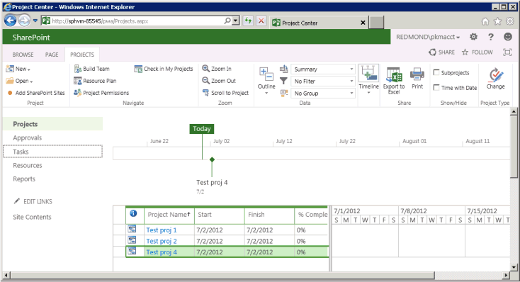

# Getting started with the Project Server CSOM and .NET

You can use the Project Server 2013 client-side object model (CSOM) to develop Project Online and on-premises solutions with the .NET Framework 4. This article describes how to create a console application that uses the CSOM to create and publish projects. After publishing a project, the application waits for the Project Server Queue Service to finish with the publish action, and then lists the published projects.
  
For a general introduction to the Project Server CSOM, see [Updates for developers in Project 2013](updates-for-developers-in-project-2013.md). For reference topics in the CSOM namespace, see [Microsoft.ProjectServer.Client](https://msdn.microsoft.com/library/Microsoft.ProjectServer.Client.aspx) . 
  
## Creating a CSOM project in Visual Studio
<a name="pj15_GettingStartedCSOM_CreatingVSProject"> </a>

You can use Visual Studio 2010 or Visual Studio 2012 to develop solutions that use the Project Server CSOM. The Project Server CSOM includes three assemblies for development of client applications, Microsoft Silverlight applications, and Windows Phone 8 applications by using the .NET Framework 4. The CSOM also includes a JavaScript file for development of web applications, as described in [Microsoft.ProjectServer.Client](https://msdn.microsoft.com/library/Microsoft.ProjectServer.Client.aspx) . 
  
You can copy the CSOM assembly that you need from the Project Server computer or from the Project 2013 SDK download to a remote development computer. The **QueueCreateProject** console application that is described in this topic is not a Silverlight application or a Windows Phone 8 application, so you need the Microsoft.ProjectServer.Client.dll assembly. Because the CSOM is independent of the WCF-based or ASMX-based Project Server Interface (PSI), you do not have to set service references for the PSI or use the **Microsoft.Office.Project.Server.Library** namespace. 
  
The **QueueCreateProject** application uses command-line arguments for the name of the project to create and for the queue timeout limit. In Procedure 1, you create the basic console application, add a routine to parse the command line, and add a usage message if there are errors in the command line. 
  
### Procedure 1. To create a CSOM project in Visual Studio

1. Copy the Microsoft.ProjectServer.Client.dll assembly from the  `%ProgramFiles%\Common Files\Microsoft Shared\Web Server Extensions\15\ISAPI\` folder to your development computer. Copy the assembly to a convenient folder for other Project Server and SharePoint reference assemblies that you will use, such as  `C:\Project\Assemblies`.
    
2. Copy the Microsoft.SharePoint.Client.dll assembly and the Microsoft.SharePoint.Client.Runtime.dll assembly from the same source folder to your development computer. The Microsoft.ProjectServer.Client.dll assembly has dependencies on the related SharePoint assemblies.
    
3. In Visual Studio, create a Windows console application, and set the target framework to .NET Framework 4. For example, name the application QueueCreateProject.
    
    > [!NOTE]
    > If you forget to set the correct target, after Visual Studio creates the project, open **QueueCreateProject Properties** in the **Project** menu. On the **Application** tab, in the **Target framework** drop-down list, choose **.NET Framework 4**. Do not use the **.NET Framework 4 Client Profile**. 
  
4. In Solution Explorer, set references to the following assemblies:
    
  - Microsoft.ProjectServer.Client.dll
    
  - Microsoft.SharePoint.Client.dll
    
  - Microsoft.SharePoint.Client.Runtime.dll
    
5. In the Program.cs file, edit the  `using` statements, as follows. 
    
  ```cs
  using System;
  using System.Collections.Generic;
  using System.Linq;
  using System.Text;
  using Microsoft.ProjectServer.Client;
  ```

6. Add methods to parse the command-line arguments for the project name and the number of seconds for queue timeout, show usage information, and exit the application. Replace the main body of code in the Program.cs file with the following code.
    
  ```cs
  namespace QueueCreateProject
  {
      class Program
      {
          static void Main(string[] args)
          {
              if (!ParseCommandLine(args))
              {
                  Usage();
                  ExitApp();
              }
              /* Add calls to methods here to get the project context and create a project. */
              ExitApp();
          }
          // Parse the command line. Return true if there are no errors.
          private static bool ParseCommandLine(string[] args)
          {
              bool error = false;
              int argsLen = args.Length;
              try
              {
                  for (int i = 0; i < argsLen; i++)
                  {
                      if (error) break;
                      if (args[i].StartsWith("-") || args[i].StartsWith("/"))
                          args[i] = "*" + args[i].Substring(1).ToLower();
                      switch (args[i])
                      {
                          case "*projname":
                          case "*n":
                              if (++i >= argsLen) return false;
                              projName = args[i];
                              break;
                          case "*timeout":
                          case "*t":
                              if (++i >= argsLen) return false;
                              timeoutSeconds = Convert.ToInt32(args[i]);
                              break;
                          case "*?":
                          default:
                              error = true;
                              break;
                      }
                  }
              }
              catch (FormatException)
              {
                  error = true;
              }
              if (string.IsNullOrEmpty(projName)) error = true;
              return !error;
          }
          private static void Usage()
          {
              string example = "Usage: QueueCreateProject -projName | -n \"New project name\" [-timeout | -t sec]";
              example += "\nExample: QueueCreateProject -n \"My new project\"";
              example += "\nDefault timeout seconds = " + timeoutSeconds.ToString();
              Console.WriteLine(example);
          }
          private static void ExitApp()
          {
              Console.Write("\nPress any key to exit... ");
              Console.ReadKey(true);
              Environment.Exit(0);
          }
      }
  }
  ```

## Getting the project context
<a name="pj15_GettingStartedCSOM_GettingContext"> </a>

CSOM development requires the **ProjectContext** object to be initialized with the Project Web App URL. The code in Procedure 2 uses the **pwaPath** constant. If you plan to use the application for multiple instances of Project Web App, you could make **pwaPath** a variable and add another command-line argument. 
  
### Procedure 2. To get the project context

1. Add **Program** class constants and variables that the **QueueCreateProject** application will use. In addition to the Project Web App URL, the application uses the name of the default enterprise project type (EPT), the name of the project to create, and a maximum queue timeout in seconds. In this case, the **timeoutSeconds** variable enables you to test how various values for the timeout affect the application. The **ProjectContext** object is the primary object for access to the CSOM. 
    
  ```cs
  private const string pwaPath = "http://ServerName /pwa/"; // Change the path to your Project Web App instance.
  private static string basicEpt = "Enterprise Project";   // Basic enterprise project type.
  private static string projName = string.Empty;
  private static int timeoutSeconds = 10;  // The maximum wait time for a queue job, in seconds.
  private static ProjectContext projContext;
  ```

2. Replace the  `/* Add calls to methods here to get the project context and create a project. */` comment with the following code. The **Microsoft.ProjectServer.Client.ProjectContext** object is initialized with the Project Web App URL. The **CreateTestProject** method and the **ListPublishedProjects** method are shown in Procedure 4 and Procedure 5. 
    
  ```cs
  projContext = new ProjectContext(pwaPath);
  if (CreateTestProject())
      ListPublishedProjects();
  else
      Console.WriteLine("\nProject creation failed: {0}", projName);
  ```

## Getting an enterprise project type
<a name="pj15_GettingStartedCSOM_GettingEPT"> </a>

The **QueueCreateProject** sample application explicitly selects the Enterprise Project EPT, to show how an application can select the EPT for a project. If the project creation information does not specify the EPT GUID, an application would use the default EPT. The **GetEptUid** method is used by the **CreateTestProject** method that is described in Procedure 4. 
  
The **GetEptUid** method queries the **ProjectContext** object for the collection of **EnterpriseProjectTypes** where the EPT name equals the specified name. After executing the query, the **eptUid** variable is set to the GUID of the first **EnterpriseProjectType** object in the **eptList** collection. Because EPT names are unique, there is only one **EnterpriseProjectType** object that has the specified name. 
  
### Procedure 3. To get the GUID of an EPT for a new project

- Add the **GetEptUid** method to the **Program** class. 
    
  ```cs
  // Get the GUID of the specified enterprise project type.
  private static Guid GetEptUid(string eptName)
  {
      Guid eptUid = Guid.Empty;
      try
      {
          // Get the list of EPTs that have the specified name. 
          // If the EPT name exists, the list will contain only one EPT.
          var eptList = projContext.LoadQuery(
              projContext.EnterpriseProjectTypes.Where(
                  ept => ept.Name == eptName));
          projContext.ExecuteQuery();
          eptUid = eptList.First().Id;
      }
      catch (Exception ex)
      {
          string msg = string.Format("GetEptUid: eptName = \"{0}\"\n\n{1}",
              eptName, ex.GetBaseException().ToString());
          throw new ArgumentException(msg);
      }
      return eptUid;
  }
  ```

There are several ways to find the EPT GUID. The query shown in the **GetEptUid** method is efficient because it downloads only the one **EnterpriseProjectType** object that matches the EPT name. The following alternate routine is less efficient, because it downloads the complete list of EPTs to the client application and iterates through the list. 
```cs
foreach (EnterpriseProjectType ept in projSvr.EnterpriseProjectTypes)
{
    if (ept.Name == eptName)
    {
        eptUid = ept.Id;
        break;
    }
}
```

The following routine uses a LINQ query and lambda expression to select the EPT object, but still downloads all of the **EnterpriseProjectType** objects. 

```cs
var eptList = projContext.LoadQuery(projContext.EnterpriseProjectTypes);
projContext.ExecuteQuery();
eptUid = eptList.First(ept => ept.Name == eptName).Id;
```

## Setting the creation information and publishing the project
<a name="pj15_GettingStartedCSOM_ProjectCreation"> </a>

The **CreateTestProject** method creates a **ProjectCreationInformation** object and specifies the information that is required to create a project. The project GUID and name are required; the start date, project description, and EPT GUID are optional. 
  
After setting the new project properties, the **Projects.Add** method adds the project to the **Projects** collection. To save and publish the project, you must call the **Projects.Update** method to send a message to the Project Server queue and create the project. 
  
### Procedure 4. To set the new project properties, create the project, and publish the project

1. Add the **CreateTestProject** method to the **Program** class. The following code creates and publishes a project, but does not wait for the queue job to complete. 
    
  ```cs
  // Create a project.
  private static bool CreateTestProject()
  {
      bool projCreated = false;
      try
      {
          Console.Write("\nCreating project: {0} ...", projName);
          ProjectCreationInformation newProj = new ProjectCreationInformation();
          newProj.Id = Guid.NewGuid();
          newProj.Name = projName;
          newProj.Description = "Test creating a project with CSOM";
          newProj.Start = DateTime.Today.Date;
          // Setting the EPT GUID is optional. If no EPT is specified, Project Server  
          // uses the default EPT. 
          newProj.EnterpriseProjectTypeId = GetEptUid(basicEpt);
          PublishedProject newPublishedProj = projContext.Projects.Add(newProj);
          QueueJob qJob = projContext.Projects.Update();
          /* Add code here to wait for the queue. */
      }
      catch(Exception ex)
      {
          Console.ForegroundColor = ConsoleColor.Red;
          Console.WriteLine("\nError: {0}", ex.Message);
          Console.ResetColor();
      }
      return projCreated;
  }
  ```

2. Replace the  `/* Add code here to wait for the queue. */` comment with the following code to wait for the queue job. The routine waits a maximum of the specified **timeoutSeconds** number of seconds, or proceeds if the queue job completes before the timeout. For possible queue job states, see [Microsoft.ProjectServer.Client.JobState](https://msdn.microsoft.com/library/Microsoft.ProjectServer.Client.JobState.aspx) . 
    
    Calling the **Load** method and the **ExecuteQuery** method for the **QueueJob** object is optional. If the **QueueJob** object is not initialized when you call the **WaitForQueue** method, Project Server initializes it. 
    
  ```cs
  // Calling Load and ExecuteQuery for the queue job is optional.
  // projContext.Load(qJob);
  // projContext.ExecuteQuery();
  JobState jobState = projContext.WaitForQueue(qJob, timeoutSeconds);
  if (jobState == JobState.Success)
  {
      projCreated = true;
  }
  else
  {
      Console.ForegroundColor = ConsoleColor.Yellow;
      Console.WriteLine("\nThere is a problem in the queue. Timeout is {0} seconds.", 
          timeoutSeconds);
      Console.WriteLine("\tQueue JobState: {0}", jobState.ToString());
      Console.ResetColor();
  }
  Console.WriteLine();
  ```

## Listing the published projects
<a name="pj15_GettingStartedCSOM_ListingPublished"> </a>

The **ListPublishedProjects** method gets the collection of all projects that are published in Project Web App. If the queue job that creates a project in Procedure 4 does not complete successfully or times out, the new project is not included in the **Projects** collection. 
  
### Procedure 5. To list the published projects

1. Add the **ListPublishedProjects** method to the **Program** class. 
    
  ```cs
  // List the published projects.
  private static void ListPublishedProjects()
  {
      // Get the list of projects on the server.
      projContext.Load(projContext.Projects);
      projContext.ExecuteQuery();
      Console.WriteLine("\nProject ID : Project name : Created date");
      foreach (PublishedProject pubProj in projContext.Projects)
      {
          Console.WriteLine("\n\t{0} :\n\t{1} : {2}", pubProj.Id.ToString(), pubProj.Name,
              pubProj.CreatedDate.ToString());
      }
  }
  ```

2. Set the correct value for your Project Web App URL, compile the **QueueCreateProject** application, and then test the application as in Procedure 6. 
    
## Testing the QueueCreateProject application
<a name="pj15_GettingStartedCSOM_Testing"> </a>

When you first run the **QueueCreateProject** application on a test instance of Project Web App, especially if Project Server is installed on a virtual machine, the application may require more time to run than the default queue timeout of ten seconds. 
  
### Procedure 6. To test the QueueCreateProject application

1. Open the **QueueCreateProject Properties** window, select the **Debug** tab, and then add the following command-line arguments in the **Start Options** section:  `-n "Test proj 1" -t 20`
    
    Run the application (for example, press **F5**). If the timeout value is long enough, the application shows the following output (if other published projects exist in your Project Web App instance, they will also be shown):
    
  ```
  Creating project: Test proj 1 ...
  Project ID : Project name : Created date
          b34d7009-753f-4abb-9191-f4b15a82aac3 :
          Test proj 1 : 9/22/2011 11:27:57 AM
  Press any key to exit...
  ```

2. Run another test with the following command-line arguments, to use the default 10-second queue timeout:  `-n "Test proj 1"`
    
    Because Test proj 1 already exists, the application shows the following output.
    
  ```
  Creating project: Test proj 1 ...
  Error: PJClientCallableException: ProjectNameAlreadyExists
  ProjectNameAlreadyExists
  projName = Test proj 1
  Project creation failed: Test proj 1
  Press any key to exit...
  ```

3. Run another test with the following command-line arguments, to use the default 10-second queue timeout:  `-n "Test proj 2"`
    
    The **QueueCreateProject** application creates and publishes the project named Test proj 2. 
    
4. Run another test with the following command-line arguments, and set the timeout to be too short for the queue job to finish:  `-n "Test proj 3" -t 1`
    
    Because the queue timeout is too short, the project is not created. The application shows the following output.
    
  ```
  Creating project: Test proj 3 ...
  There is a problem in the queue. Timeout is 1 seconds.
          Queue JobState: Unknown
  Project creation failed: Test proj 3
  Press any key to exit...
  ```

5. Modify the code so that the application does not wait for the queue job. For example, comment out the code that waits for the queue, except for the  `projCreated = true` line, as follows. 
    
  ```cs
  //JobState jobState = projContext.WaitForQueue(qJob, timeoutSeconds);
  //if (jobState == JobState.Success)
  //{
  projCreated = true;
  //}
  //else
  //{
  //    Console.ForegroundColor = ConsoleColor.Yellow;
  //    Console.WriteLine("\nThere is a problem in the queue. Timeout is {0} seconds.",
  //        timeoutSeconds);
  //    Console.WriteLine("\tQueue JobState: {0}", jobState.ToString());
  //    Console.ResetColor();
  //}
  
  ```

6. Recompile the application and run another test with the following command-line arguments:  `-n "Test proj 4"`
    
    Because the **WaitForQueue** routine is commented out, the application does not use the default timeout value. Even though the application does not wait for the queue, it may show Test proj 4, if the publish action in Project Server is fast enough. 
    
  ```
  Creating project: Test proj 4 ...
  Project ID : Project name : Created date
          cdd54103-082f-425c-b075-9ff52ac7d4e6 :
          Test proj 2 : 9/25/2011 4:28:55 PM
          b34d7009-753f-4abb-9191-f4b15a82aac3 :
          Test proj 1 : 9/22/2011 11:27:57 AM
          5c0c73f2-f5dd-499b-8bd8-ebb74bf8c122 :
          Test proj 4 : 9/25/2011 4:39:21 PM
  Press any key to exit...
  ```

Refresh the Project Center page in Project Web App ( `http://ServerName/ProjectServerName/Projects.aspx`), to show the published projects. Figure 1 shows that the test projects are published.
**Figure 1. Checking the published projects in Project Web App**


  
The **QueueCreateProject** sample application shows a typical example of how to create a project entity with the CSOM by using the **ProjectCreationInformation** class, how to add the project to the published collection, how to wait for a queue job by using the **WaitForQueue** method, and how to enumerate the collection of published projects. 
  
## Complete code example
<a name="pj15_GettingStartedCSOM_CompleteCode"> </a>

The following is the complete code for the **QueueCreateProject** sample application. The [Microsoft.ProjectServer.Client.ProjectCreationInformation](https://msdn.microsoft.com/library/Microsoft.ProjectServer.Client.ProjectCreationInformation.aspx) class reference also includes the code in this topic. 
  
```cs
using System;
using System.Collections.Generic;
using System.Linq;
using System.Text;
using Microsoft.ProjectServer.Client;
namespace QueueCreateProject
{
    class Program
    {
        private const string pwaPath = "http://ServerName /pwa/"; // Change the path to your Project Web App instance.
        private static string basicEpt = "Enterprise Project";   // Basic enterprise project type.
        private static string projName = string.Empty;
        private static int timeoutSeconds = 10;  // The maximum wait time for a queue job, in seconds.
        private static ProjectContext projContext;
        static void Main(string[] args)
        {
            if (!ParseCommandLine(args))
            {
                Usage();
                ExitApp();
            }
            projContext = new ProjectContext(pwaPath);
            if (CreateTestProject())
                ListPublishedProjects();
            else
                Console.WriteLine("\nProject creation failed: {0}", projName);
            ExitApp();
        }
        // Create a project.
        private static bool CreateTestProject()
        {
            bool projCreated = false;
            try
            {
                Console.Write("\nCreating project: {0} ...", projName);
                ProjectCreationInformation newProj = new ProjectCreationInformation();
                newProj.Id = Guid.NewGuid();
                newProj.Name = projName;
                newProj.Description = "Test creating a project with CSOM";
                newProj.Start = DateTime.Today.Date;
                // Setting the EPT GUID is optional. If no EPT is specified, Project Server uses 
                // the default EPT. 
                newProj.EnterpriseProjectTypeId = GetEptUid(basicEpt);
                PublishedProject newPublishedProj = projContext.Projects.Add(newProj);
                QueueJob qJob = projContext.Projects.Update();
                // Calling Load and ExecuteQuery for the queue job is optional. If qJob is 
                // not initialized when you call WaitForQueue, Project Server initializes it.
                // projContext.Load(qJob);
                // projContext.ExecuteQuery();
                JobState jobState = projContext.WaitForQueue(qJob, timeoutSeconds);
                if (jobState == JobState.Success)
                {
                    projCreated = true;
                }
                else
                {
                    Console.ForegroundColor = ConsoleColor.Yellow;
                    Console.WriteLine("\nThere is a problem in the queue. Timeout is {0} seconds.", 
                        timeoutSeconds);
                    Console.WriteLine("\tQueue JobState: {0}", jobState.ToString());
                    Console.ResetColor();
                }
                Console.WriteLine();
            }
            catch(Exception ex)
            {
                Console.ForegroundColor = ConsoleColor.Red;
                Console.WriteLine("\nError: {0}", ex.Message);
                Console.ResetColor();
            }
            return projCreated;
        }
        // Get the GUID of the specified enterprise project type.
        private static Guid GetEptUid(string eptName)
        {
            Guid eptUid = Guid.Empty;
            try
            {
                // Get the list of EPTs that have the specified name. 
                // If the EPT name exists, the list will contain only one EPT.
                var eptList = projContext.LoadQuery(
                    projContext.EnterpriseProjectTypes.Where(
                        ept => ept.Name == eptName));
                projContext.ExecuteQuery();
                eptUid = eptList.First().Id;
                // Alternate routines to find the EPT GUID. Both (a) and (b) download the entire list of EPTs.
                // (a) Using a foreach block:
                //foreach (EnterpriseProjectType ept in projSvr.EnterpriseProjectTypes)
                //{
                //    if (ept.Name == eptName)
                //    {
                //        eptUid = ept.Id;
                //        break;
                //    }
                //}
                // (b) Querying for the EPT list, and then using a lambda expression to select the EPT:
                //var eptList = projContext.LoadQuery(projContext.EnterpriseProjectTypes);
                //projContext.ExecuteQuery();
                //eptUid = eptList.First(ept => ept.Name == eptName).Id;
            }
            catch (Exception ex)
            {
                string msg = string.Format("GetEptUid: eptName = \"{0}\"\n\n{1}",
                    eptName, ex.GetBaseException().ToString());
                throw new ArgumentException(msg);
            }
            return eptUid;
        }
        // List the published projects.
        private static void ListPublishedProjects()
        {
            // Get the list of projects on the server.
            projContext.Load(projContext.Projects);
            projContext.ExecuteQuery();
            Console.WriteLine("\nProject ID : Project name : Created date");
            foreach (PublishedProject pubProj in projContext.Projects)
            {
                Console.WriteLine("\n\t{0} :\n\t{1} : {2}", pubProj.Id.ToString(), pubProj.Name,
                    pubProj.CreatedDate.ToString());
            }
        }
        // Parse the command line. Return true if there are no errors.
        private static bool ParseCommandLine(string[] args)
        {
            bool error = false;
            int argsLen = args.Length;
            try
            {
                for (int i = 0; i < argsLen; i++)
                {
                    if (error) break;
                    if (args[i].StartsWith("-") || args[i].StartsWith("/"))
                        args[i] = "*" + args[i].Substring(1).ToLower();
                    switch (args[i])
                    {
                        case "*projname":
                        case "*n":
                            if (++i >= argsLen) return false;
                            projName = args[i];
                            break;
                        case "*timeout":
                        case "*t":
                            if (++i >= argsLen) return false;
                            timeoutSeconds = Convert.ToInt32(args[i]);
                            break;
                        case "*?":
                        default:
                            error = true;
                            break;
                    }
                }
            }
            catch (FormatException)
            {
                error = true;
            }
            if (string.IsNullOrEmpty(projName)) error = true;
            return !error;
        }
        private static void Usage()
        {
            string example = "Usage: QueueCreateProject -projName | -n \"New project name\" [-timeout | -t sec]";
            example += "\nExample: QueueCreateProject -n \"My new project\"";
            example += "\nDefault timeout seconds = " + timeoutSeconds.ToString();
            Console.WriteLine(example);
        }
        private static void ExitApp()
        {
            Console.Write("\nPress any key to exit... ");
            Console.ReadKey(true);
            Environment.Exit(0);
        }
    }
}
```

## See also
<a name="pj15_GettingStartedCSOM_AR"> </a>

- [Updates for developers in Project 2013](updates-for-developers-in-project-2013.md)
    
- [Client-side object model (CSOM) for Project 2013](client-side-object-model-csom-for-project-2013.md)
    

