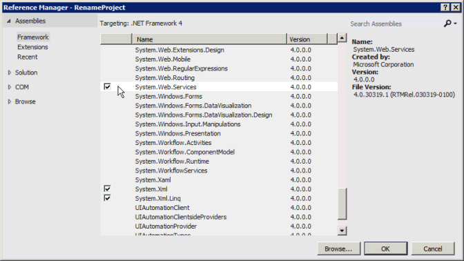
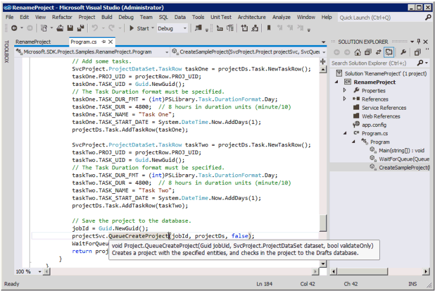
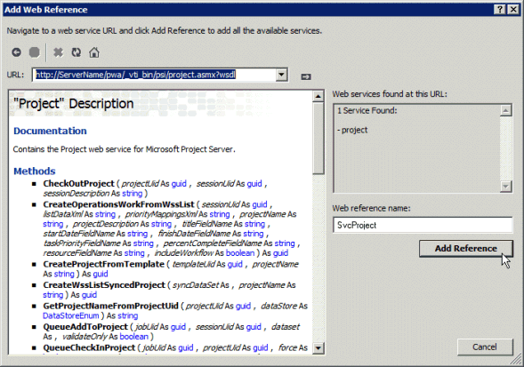

# Prerequisites for ASMX-based code samples in Project

Learn information to help you create projects in Visual Studio by using the ASMX-based code samples that are included in the Project Server Interface (PSI) reference topics.
  
Many of the code samples included in the [Project Server 2013 class library and web service reference](http://msdn.microsoft.com/library/ef1830e0-3c9a-4f98-aa0a-5556c298e7d1%28Office.15%29.aspx) were originally created for the Office Project 2007 SDK, and use a standard format for ASMX web services. The samples still work in Project Server 2013 and are designed to be copied into a console application and run as a complete unit. Exceptions are noted in the sample. 
  
New PSI samples in the Project 2013 SDK conform to a format that uses Windows Communication Foundation (WCF) services. The ASMX-based samples can also be adapted to use WCF services. This article shows how to use the samples with ASMX web services. For information about using the samples with WCF services, see [Prerequisites for WCF-based code samples in Project](prerequisites-for-wcf-based-code-samples-in-project.md).
  
> [!NOTE]
> The ASMX web service interface of the PSI is deprecated in Project Server 2013, but is still supported. 
> If the client-side object model (CSOM) includes the methods that your application requires, new applications should be developed with the CSOM. The CSOM enables applications to work with Project Online or an on-premises installation of Project Server 2013. Otherwise, if your application uses the PSI, it should use the WCF interface, which is the technology that we recommend for network communications. Applications that use the ASMX interface or the WCF interface can work only for on-premises installations of Project Server 2013. 
> For more information about the CSOM, see [Project Server 2013 architecture](project-server-2013-architecture.md) and [Client-side object model (CSOM) for Project 2013](client-side-object-model-csom-for-project-2013.md). 
  
Before running the code samples, you must set up the development environment, configure the application, and change generic constant values to match your environment.
  
## Setting up the development environment
<a name="pj15_PrerequisitesASMX_Setup"> </a>

1. **Set up a test Project Server system**.
    
   Use a test Project Server system whenever you are developing or testing. Even when your code works perfectly, interproject dependencies, reporting, or other environmental factors can cause unintended consequences. 
    
   > [!NOTE]
   > Ensure that you are a valid user on the server, and check that you have sufficient permissions for the PSI calls that your application uses. The reference topic for each PSI method includes a Project Server Permissions table. For example, the [Project.QueueCreateProject](https://msdn.microsoft.com/library/WebSvcProject.Project.QueueCreateProject.aspx) method requires the global **NewProject** permission and the **SaveProjectTemplate** permission. 
  
   In some cases, you may have to do remote debugging on the server. You may also have to set up an event handler by installing an event handler assembly on each Project Server computer in the SharePoint farm, and then configuring the event handler for the Project Web App instance by using the Project Server Settings page in the General Application Settings of SharePoint Central Administration.
    
2. **Set up a development computer.**
    
   You usually access the PSI through a network. The code samples are designed to be run on a client that is separate from the server, except where noted.
    
   1. **Install the correct version of Visual Studio.** Except where noted, the code samples are written in Visual C#. They can be used with Visual Studio 2010 or Visual Studio 2012. Ensure that you have the most recent service pack installed. 
        
   2. **Copy Project Server DLLs to the development computer.** Copy the following assemblies from  `[Program Files]\Microsoft Office Servers\15.0\Bin` on the Project Server computer to the development computer: 
        
      - Microsoft.Office.Project.Server.Events.Receivers.dll
      - Microsoft.Office.Project.Server.Library.dll
        
   3. For information about how to compile and use the ProjectServerServices.dll proxy assembly for the ASMX web services in the PSI, see [Using a PSI proxy assembly and IntelliSense descriptions](#pj15_PrerequisitesASMX_BuildingProxy).
    
3. **Install the IntelliSense files.**
    
    To use IntelliSense descriptions for classes and members in Project Server assemblies, copy the updated IntelliSense XML files from the Project 2013 SDK download to the same directory where the Project Server assemblies are located. For example, copy the Microsoft.Office.Project.Server.Library.xml file to the directory where your application will set a reference to the Microsoft.Office.Project.Server.Library.dll assembly.
    
    IntelliSense descriptions for the PSI web services require that you create a PSI proxy assembly by using the CompileASMXProxyAssembly.cmd script in the  `Documentation\IntelliSense\WSDL` subdirectory in the Project 2013 SDK download. The script creates the ASMX-based ProjectServerServices.dll proxy assembly. For more information, see the [ReadMe_IntelliSense] file in the SDK download. 
    
## Creating the application and adding a web service reference
<a name="pj15_PrerequisitesASMX_Configure"> </a>

1. **Create a console application**.
    
   When you create a console application, in the drop-down list of the **New Project** dialog box, select **.NET Framework 4**. You can copy the PSI example code into the new application.
    
2. **Add the reference required for ASMX.**
    
   In Solution Explorer, add a reference to **System.Web.Services** (see Figure 1). 
    
   **Figure 1. Adding a reference in Visual Studio**

   
  
3. **Copy the code**.
    
   Copy the complete code example into the Program.cs file of the console application.
    
4. **Set the namespace for the sample application**.
    
   You can either change the namespace listed at the top of the sample to the application default namespace, or change the default application namespace to match the sample. You can change the default application namespace by changing the application properties.
    
   For example, the code sample for [QueueRenameProject](https://msdn.microsoft.com/library/WebSvcProject.Project.QueueRenameProject.aspx) has the namespace **Microsoft.SDK.Project.Samples.RenameProject**. If the name of the Visual Studio project is **RenameProject**, copy the namespace from the Program.cs file, and then open the project **Properties** pane (on the **Project** menu, choose **RenameProject Properties**). On the **Application** tab, copy the namespace into the **Default namespace** text box. 
    
5. **Set the web references**.
    
   Most examples require a reference to one or more of the PSI web services. These are listed in the sample itself or in comments that precede the sample. To get the correct namespace of the web references, ensure that you first set the default application namespace.
    
   There are three ways to add an ASMX web service reference for the PSI:
    
   - Build a PSI proxy assembly named ProjectServerServices.dll, and then set a reference to the assembly. To get IntelliSense, this is the recommended way to add a PSI reference. See [Using a PSI proxy assembly and IntelliSense descriptions](#pj15_PrerequisitesASMX_BuildingProxy).
    
   - Add a proxy file from the wsdl.exe output to the Visual Studio solution. See [Adding a PSI proxy file](#pj15_PrerequisitesASMX_AddingProxyFile).
    
   - Add a web service reference by using Visual Studio. See [Adding a web service reference](#pj15_PrerequisitesASMX_AddingServiceReference).

<a name="pj15_PrerequisitesASMX_BuildingProxy"> </a>

### Using a PSI proxy assembly and IntelliSense descriptions

You can build and use the ProjectServerServices.dll proxy assembly for all ASMX-based web services in the PSI, by using the CompileASMXProxyAssembly.cmd script in the  `Documentation\IntelliSense\WSDL` folder of the Project 2013 SDK download. For a link to the download, see [Project 2013 developer documentation](project-2013-developer-documentation.md).
  
> [!NOTE]
> When you extract the proxy source files from the Source.zip file, the files in the  `Documentation\IntelliSense\WSDL\Source` folder are current as of the publication date of the Project 2013 SDK download. To generate updated PSI proxy source files, run the GenASMXProxyAssembly.cmd script on the Project Server computer. 
> The scripts in the  `Documentation\IntelliSense\WCF` folder do not work for ASMX-based applications. The GenWCFProxyAssembly.cmd script calls SvcUtil.exe, which generates source code files for the WCF services. The WCF proxy files include different attributes, the channel interface, and a client class for each PSI service. For example, the WCF-based Resource service includes the **ResourceChannel** interface, the **Resource** interface, and the **ResourceClient** class. The ASMX-based Resource web includes the **Resource** class with some different properties. 
  
Following is the GenASMXProxyAssembly.cmd script that generates WSDL output files for the PSI web services, and then compiles the assembly.
  
```MS-DOS
@echo off
@ECHO ---------------------------------------------------
@ECHO Creating C# files for the ASMX-based proxy assembly
@ECHO ---------------------------------------------------
REM Replace ServerName with the name of the server and 
REM the instance name of Project Web App. Do not use localhost.
(set VDIR=http://ServerName/pwa/_vti_bin/psi)
(set OUTDIR=.\Source)
REM ** Wsdl.exe is the same version in the v6.0A and v7.0A subdirectories. 
(set WSDL="C:\Program Files (x86)\Microsoft SDKs\Windows\v7.0A\Bin\x64\wsdl.exe")
if not exist %OUTDIR% (
md %OUTDIR%
)
for /F %%i in (Classlist_asmx.txt) do %WSDL% /nologo /l:CS /namespace:Svc%%i /out:%OUTDIR%\wsdl.%%i.cs %VDIR%/%%i.asmx?wsdl 
@ECHO ----------------------------
@ECHO Compiling the proxy assembly
@ECHO ----------------------------
(set SOURCE=%OUTDIR%\wsdl)
(set CSC=%WINDIR%\Microsoft.NET\Framework64\v4.0.30319\csc.exe)
(set ASSEMBLY_NAME=ProjectServerServices.dll)
%CSC% /t:library /out:%ASSEMBLY_NAME% %SOURCE%*.cs
```

The script uses the ClassList_asmx.txt file, which contains the list of web services that are available for third-party developers.
  
```text
Admin
Archive
Calendar
CubeAdmin
CustomFields
Driver
Events
LoginForms
LoginWindows
LookupTable
Notifications
ObjectLinkProvider
PortfolioAnalyses
Project
QueueSystem
ResourcePlan
Resource
Security
Statusing
TimeSheet
Workflow
WssInterop
```

The scripts create an assembly named ProjectServerServices.dll. Avoid confusing it with ProjectServerServices.dll for the WCF-based assembly. The assembly names are the same, to enable using either assembly with the ProjectServerServices.xml IntelliSense file.
  
The arbitrary namespace created by the scripts for both the ASMX web services and the WCF services is the same, so that the ProjectServerServices.xml IntelliSense file works with either assembly. For example, the namespace of the Resource service in the WCF-based proxy assembly and in the ASMX-based proxy assembly is **SvcResource**. You can, of course, change the namespace names—if you ensure that they match in the proxy assembly and in the ProjectServerServices.xml IntelliSense file.
  
If a code sample uses a different name for a PSI web service namespace, for example **ProjectWebSvc**, for IntelliSense to work you must change the sample to use **SvcProject** so that the namespace matches the proxy assembly. 
  
An advantage to using the ASMX-based proxy assembly is that it includes all PSI web service namespaces; you do not have to create multiple web references. Another advantage is that, if you add the ProjectServerServices.xml file to the same directory where you set a reference to the ProjectServerServices.dll proxy assembly, you can get IntelliSense descriptions for the PSI classes and members. Figure 2 shows the IntelliSense text for the **Project.QueueCreateProject** method. For more information, see the [ReadMe_IntelliSense] file in the IntelliSense folder of the Project 2013 SDK download. 
  
**Figure 2. Using IntelliSense for a method in the Project web service**


  
Disadvantages to using the proxy assembly are that the solution is larger and you must distribute and install the proxy assembly with the solution. You must also use the same namespaces that are in the proxy assembly and IntelliSense files, unless you change the script and ProjectServerServices.xml IntelliSense file to use different namespaces.
  
### Adding a PSI proxy file
<a name="pj15_PrerequisitesASMX_AddingProxyFile"> </a>

The Project 2013 SDK download includes the source files generated by the Wsdl.exe command for the proxy assembly. The source files are in Source.zip in the  `Documentation\IntelliSense\ASMX` subdirectory. Instead of setting a reference to the proxy assembly, you can add one or more of the source files to a Visual Studio solution. For example, after running the GenASMXProxyAssembly.cmd script, add the wsdl.Project.cs file to the solution. Instead of running the script, you can run the following commands to generate a single source file, for example: 
  
```MS-DOS
set VDIR=http://ServerName/ProjectServerName/_vti_bin/psi
set WSDL="C:\Program Files (x86)\Microsoft SDKs\Windows\v7.0A\Bin\x64\wsdl.exe"
%WSDL% /nologo /l:cs /namespace:SvcProject /out:wsdl.Project.cs %VDIR%/Project.asmx?wsdl
```

To define a **Project** object as a class variable named **project**, use the following code. The **AddContextInfo** method adds the context information to the **project** object for Windows authentication and Forms-based authentication. 
  
```cs
private static SvcProject.Project project;
private static SvcLoginForms.LoginForms loginForms =
            new SvcLoginForms.LoginForms();
. . .
public void AddContextInfo()
{
    // Add the Url property.
    project.Url = "http://ServerName /ProjectServerName /_vti_bin/psi/project.asmx";
    // Add Windows credentials.
    project.Credentials = CredentialCache.DefaultCredentials;
    // If Forms authentication is used, add the Project Server cookie.
    project.CookieContainer = loginForms.CookieContainer;
}
```

> [!NOTE]
> Whether you use a PSI proxy assembly or add a proxy file for a Project service reference named **SvcProject**, you would use the same code to create a **project** object. 
  
### Adding a web service reference
<a name="pj15_PrerequisitesASMX_AddingServiceReference"> </a>

If you do not use the ASMX-based proxy assembly or add a WSDL output file, you can set one or more individual web references. The following steps show how to set a web reference by using Visual Studio 2012.
  
1. In **Solution Explorer**, right-click the **References** folder, and then choose **Add Service Reference**. 
    
2. In the **Add Service Reference** dialog box, choose **Advanced**.
    
3. In the **Service Reference Settings** dialog box, choose **Add Web Reference**.
    
4. In the **URL** text box, type `http:// _ServerName_/ _ProjectServerName_/_vti_bin/psi/ _ServiceName_.asmx?wsdl`, and then press **Enter** or choose the **Go** icon. If you have Secure Sockets Layer (SSL) installed, you should use the HTTPS protocol instead of the HTTP protocol. 

   For example, use the following URL for the Project service on the  `http://MyServer/pwa` site for Project Web App: `http://MyServer/pwa/_vti_bin/psi/project.asmx?wsdl`
    
   Or, open your web browser, and navigate to `http://ServerName/ProjectServerName/_vti_bin/psi/ServiceName.asmx?wsdl`. Save the file to a local directory, such as `C:\Project\WebServices\ServiceName.wsdl`. In the **Add Web Reference** dialog box, for **URL**, type the file protocol and the path to the file. For example, type `file://C:\Project\WebServices\Project.wsdl`. 
    
5. After the reference resolves, type the reference name in the **Web reference name** text box. Code examples in the Project 2013 developer documentation use the arbitrary standard reference name **Svc _ServiceName_**. For example, the Project web service is named **SvcProject** (see Figure 3). 
    
   **Figure 3. Adding an ASMX web service reference**

   
  
For application components that must run on the Project Server computer, use impersonation, or have elevated permissions, use a WCF service reference instead of an ASMX web reference. For more information, see [Prerequisites for WCF-based code samples in Project](prerequisites-for-wcf-based-code-samples-in-project.md).
  
## Setting other references
<a name="pj15_PrerequisitesASMX_OtherReferences"> </a>

Project Server applications often use other services, such as SharePoint Server 2013 web services. If other services are required, they are noted in the example.
  
Local references for the code sample are listed in **using** statements at the top of the sample: 
  
1. In **Solution Explorer**, right-click the **References** folder, and then choose **Add Reference**.
    
2. Choose **Browse**, and then browse to the location where you stored the Project Server DLLs that you copied previously. Choose the DLLs you need, and then choose **OK**.
    
> [!NOTE]
> Ensure that the assembly versions on your development computer exactly match those on the target Project Server computer. 
  
## Using multiple authentication
<a name="pj15_PrerequisitesASMX_ClaimsMultiAuth"> </a>

Authentication of on-premises Project Server users, whether by Windows authentication or Forms authentication, is done through claims processing in SharePoint Server 2013. Multiple authentication means that the web application on which Project Web App is provisioned supports both Windows authentication and Forms-based authentication. If that is the case, a call to an ASMX web service that uses Windows authentication will fail with the following error, because the claims process cannot determine which type of user to authenticate:
  
`The server was unable to process the request due to an internal error. . . .`

To fix the problem for ASMX, all calls to PSI methods should be to a derived class that is defined for each PSI web service. The derived class must also use the **SvcLoginWindows.LoginWindows** class to get a cookie for the derived PSI service class. In the following example, the **ProjectDerived** class derives from the **SvcProject.Project** class. The derived class adds the **EnforceWindowsAuth** property and overrides the web request header for every call to a method in the **Project** class. If the **EnforceWindowsAuth** property is **true**, the **GetWebRequest** method adds a header that disables Forms authentication. If **EnforceWindowsAuth** is **false**, Forms authentication can proceed.
  
To use the following **ASMXLogon_MultiAuth** sample, create a console application, follow the steps in [Creating the application and adding a web service reference](#pj15_PrerequisitesASMX_Configure), and then add the wsdl.LoginWindows.cs proxy file and the wsdl.Project.cs proxy file. The **Main** method creates the **project** instance of the **ProjectDerived** class. The sample must use the derived **LoginWindowsDerived** class to get a **CookieContainer** object for the **project.CookieContainer** property, which distinguishes Forms authentication from Windows authentication. The **project** object can then be used to make calls to any method in the **SvcProject.Project** class. 
  
> [!NOTE]
> The **LoginWindows** service is required only for ASMX applications in a multiple authentication environment. In the **ASMXLogon_MultiAuth** sample, the **GetLogonCookie** method gets a cookie for the **loginWindows** object. The **project.CookieContainer** property is set to the **loginWindows.CookieContainer** value. 
  
```cs
using System;
using System.Net;
using PSLibrary = Microsoft.Office.Project.Server.Library;
namespace ASMXLogon_MultiAuth
{
    class Program
    {
        private const string PROJECT_SERVER_URL = 
            "http://ServerName/ProjectServerName/_vti_bin/psi/";
        static void Main(string[] args)
        {
            bool isWindowsUser = true;
            // Create an instance of the project object.
            ProjectDerived project = new ProjectDerived();
            project.Url = PROJECT_SERVER_URL + "Project.asmx";
            project.Credentials = CredentialCache.DefaultCredentials;
            try
            {
                // The program works on a Windows-auth-only computer if you comment-out the
                // following line. The line is required for multiple authentication.
                project.CookieContainer = GetLogonCookie();
                project.EnforceWindowsAuth = isWindowsUser;
                // Get a list of all published projects. 
                // Use ReadProjectStatus instead of ReadProjectList,
                // because the permission requirements are lower.
                SvcProject.ProjectDataSet projectDs =
                    project.ReadProjectStatus(Guid.Empty,
                        SvcProject.DataStoreEnum.PublishedStore,
                        string.Empty,
                        (int)PSLibrary.Project.ProjectType.Project);
                Console.WriteLine(string.Format(
                    "There are {0} published projects.", 
                    projectDs.Project.Rows.Count));
            }
            catch (UnauthorizedAccessException ex)
            {
                Console.WriteLine(ex.Message);
            }
            catch (WebException ex)
            {
                Console.WriteLine(ex.Message);
            }
            finally
            {
                Console.Write("Press any key to continue...");
                Console.ReadKey(false);
            }
        }
        private static CookieContainer GetLogonCookie()
        {
            // Create an instance of the loginWindows object.
            LoginWindowsDerived loginWindows = new LoginWindowsDerived();
            loginWindows.EnforceWindowsAuth = true;
            loginWindows.Url = PROJECT_SERVER_URL + "LoginWindows.asmx";
            loginWindows.Credentials = CredentialCache.DefaultCredentials;
            loginWindows.CookieContainer = new CookieContainer();
            if (!loginWindows.Login())
            {
                // Login failed; throw an exception.
                throw new UnauthorizedAccessException("Login failed.");
            }
            return loginWindows.CookieContainer;
        }
    }
    // Derive from LoginWindows class; include additional property and 
    // override the web request header.
    class LoginWindowsDerived : SvcLoginWindows.LoginWindows
    {
        public bool EnforceWindowsAuth { get; set; }
        protected override WebRequest GetWebRequest(Uri uri)
        {
            WebRequest request = base.GetWebRequest(uri);
            if (this.EnforceWindowsAuth)
            {
                request.Headers.Add("X-FORMS_BASED_AUTH_ACCEPTED", "f");
            }
            return request;
        }
    }
    // Derive from Project class; include additional property and 
    // override the web request header.
    class ProjectDerived : SvcProject.Project
    {
        public bool EnforceWindowsAuth { get; set; }
        protected override WebRequest GetWebRequest(Uri uri)
        {
            WebRequest request = base.GetWebRequest(uri);
            if (this.EnforceWindowsAuth)
            {
                request.Headers.Add("X-FORMS_BASED_AUTH_ACCEPTED", "f");
            }
            return request;
        }
    }
}
```

Using the derived **LoginWindows** class, and making PSI calls with a web request header that disables Forms authentication, is required for applications that run in a multiple authentication environment. If Project Server uses only claims authentication, it is not necessary to derive a class that adds a web request header. The previous example runs in both environments. 
  
The fix for a WCF-based application is different. For more information, see the  *Using multiple authentication*  section in [Prerequisites for WCF-based code samples in Project](prerequisites-for-wcf-based-code-samples-in-project.md).
  
## Changing the values of generic constants
<a name="pj15_PrerequisitesASMX_ChangeValues"> </a>

Most samples have one or more variables that you must update for the sample to work properly in your environment. In the following example, if you have SSL installed, use the HTTPS protocol instead of the HTTP protocol. Replace  _ServerName_ with the name of the server that you are using. Replace  _ProjectServerName_ with the virtual directory name of your Project Server site, such as PWA. 
  
```cs
const string PROJECT_SERVER_URI = "http://ServerName/ProjectServerName/";
```

Any other variables that you must change or other prerequisites are noted at the top of the code example.
  
## Verifying the results
<a name="pj15_PrerequisitesASMX_Verify"> </a>

Getting and interpreting results from a code sample is not always straightforward. For example, if you create a project, you must publish the project before it can appear on the Project Center page in Project Web App.
  
You can verify code sample results in several ways, for example:
  
- Use the Project Professional 2013 client to open the project from the Project Server computer, and view the items that you want.
    
- View published projects on the Project Center page of Project Web App ( `http://ServerName/ProjectServerName/projects.aspx`).
    
- View the Queue log in Project Web App. Open the Server Settings page (choose the **Settings** icon in the top-right corner), and then choose **My Queued Jobs** under the **Personal Settings** section (  `http://ServerName/ProjectServerName/MyJobs.aspx`). In the **View** drop-down list, you can sort by the job status. The default status is **In Progress and Failed Jobs in the Past Week**. 
    
- Use the Server Settings page in Project Web App ( `http://ServerName/ProjectServerName/_layouts/15/pwa/admin/admin.aspx`) to manage all queue jobs and delete or force check-in enterprise objects. You must have administrative permissions to access those links on the Server Settings page.
    
- Use **Microsoft SQL Server Management Studio** to run a query on a table in the Project database. For example, use the following query to select the top 200 rows of the pub.MSP_WORKFLOW_STAGE_PDPS table to show information about the project detail pages (PDPs) in workflow stages. 
    
   ```sql
    SELECT TOP 200 [STAGE_UID]
            ,[PDP_UID]
            ,[PDP_NAME]
            ,[PDP_POSITION]
            ,[PDP_ID]
            ,[PDP_STAGE_DESCRIPTION]
            ,[PDP_REQUIRES_ATTENTION]
        FROM [ProjectService].[pub].[MSP_WORKFLOW_STAGE_PDPS]
   ```

## Cleaning up
<a name="pj15_PrerequisitesASMX_Cleanup"> </a>

After you test some code samples, there are enterprise objects and settings that should be deleted or reset. You can use the Server Settings page in Project Web App to manage enterprise data ( `http://ServerName/ProjectServerName/_layouts/15/pwa/admin/admin.aspx`). Links on the Server Settings page enable you to delete old items, force check-in projects, manage the job queue for all users, and perform other administrative tasks.
  
Following are some of the links on the Server Settings page that you can use for typical cleanup activities after running code samples:
  
- **Enterprise Custom Fields and Lookup Tables**
    
- **Manage Queue Jobs**
    
- **Delete Enterprise Objects**
    
- **Force Check-in Enterprise Objects**
    
- **Enterprise Project Types**
    
- **Workflow Phases**
    
- **Workflow Stages**
    
- **Project Detail Pages**
    
- **Time Reporting Periods**
    
- **Timesheet Settings and Defaults**
    
- **Line Classifications**
    
Additional settings are managed by SharePoint Server 2013 for each Project Web App instance, rather than by a specific Project Web App Server Settings page. In the SharePoint Central Administration application, choose **General Application Settings**, choose **Manage** under **Project Server Settings**, and then choose the Project Web App instance in the drop-down list on the Server Settings page. For example, choose **Server Side Event Handlers** to add or delete event handlers for the selected Project Web App instance. 
  
## See also
<a name="pj15_PrerequisitesASMX_AR"> </a>

- [Prerequisites for WCF-based code samples in Project](prerequisites-for-wcf-based-code-samples-in-project.md)
- [Use Impersonation with WCF](http://msdn.microsoft.com/library/e3597901-2f02-44a2-8076-d32aae540b38%28Office.15%29.aspx)
- [Project PSI reference overview](project-psi-reference-overview.md)
- [SharePoint Developer Center](http://msdn.microsoft.com/en-us/sharepoint/default.aspx)
    

