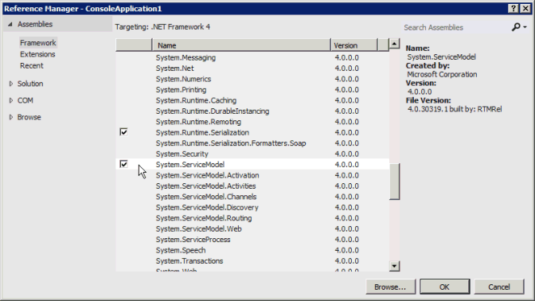
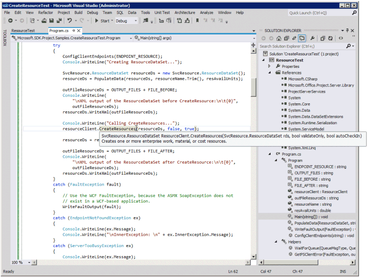
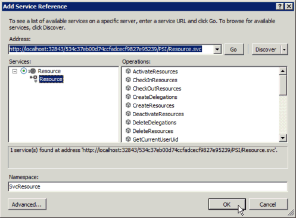
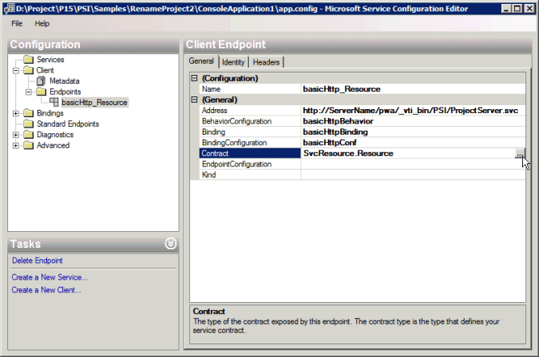
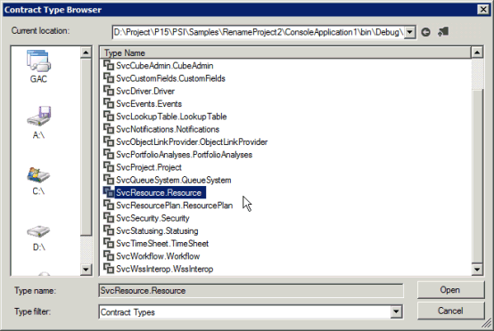

# Prerequisites for WCF-based code samples in Project

Learn information to help you create projects in Visual Studio by using the WCF-based code samples that are included in the Project Server Interface (PSI) reference topics.

Many of the WCF-based code samples included in the [Project Server 2013 class library and web service reference](https://msdn.microsoft.com/library/ef1830e0-3c9a-4f98-aa0a-5556c298e7d1%28Office.15%29.aspx) were originally created for the Project 2010 developer documentation, and use a standard format for WCF web services. The samples still work in Project Server 2013 and are designed to be copied into a console application and run as a complete unit. Exceptions are noted in the sample.
  
Code samples in the Project 2013 developer documentation that are unchanged from the samples developed for Office Project Server 2007 use ASMX Web services. The ASMX-based samples can also be adapted to use WCF services. This article shows how to use the samples with WCF services. For information about how to use the samples with ASMX web services, see [Prerequisites for ASMX-based code samples in Project](prerequisites-for-asmx-based-code-samples-in-project.md).
  
> [!NOTE]
> If the client-side object model (CSOM) includes the methods that your application requires, new applications should be developed with the CSOM. The CSOM enables applications to work with Project Online or an on-premises installation of Project Server 2013. Otherwise, if your application uses the PSI, it should use the WCF interface, which is the technology that we recommend for network communications. Applications that use the ASMX interface or the WCF interface can work only for on-premises installations of Project Server 2013.
>
> For more information about the CSOM, see [Project Server 2013 architecture](project-server-2013-architecture.md) and [Client-side object model (CSOM) for Project 2013](client-side-object-model-csom-for-project-2013.md).
  
Before running the code samples, you must set up the development environment, configure the application, add a service configuration file (or configure the WCF services programmatically), and change generic constant values to match your environment.
  
## Setting up the development environment

<a name="pj15_PrerequisitesWCF_Setup"> </a>

1. **Set up a test Project Server system.**

    Use a test Project Server system whenever you are developing or testing. Even when your code works perfectly, interproject dependencies, reporting, or other environmental factors can cause unintended consequences.

    > [!NOTE]
    > Ensure that you are a valid user on the server, and check that you have sufficient permissions for the PSI calls that your application uses. The developer documentation topic for each PSI method includes a Project Server Permissions table. For example, the [Project.QueueCreateProject](https://msdn.microsoft.com/library/WebSvcProject.Project.QueueCreateProject.aspx) method requires the global **NewProject** permission and the **SaveProjectTemplate** permission.
  
    In some cases, you may have to do remote debugging on the server. You may also have to set up an event handler by installing an event handler assembly on each Project Server computer in the SharePoint farm, and then configuring the event handler for the Project Web App instance by using the Project Server Settings page in the General Application Settings of SharePoint Central Administration.

2. **Set up a development computer.**

    You usually access the PSI through a network. The code samples are designed to be run on a client that is separate from the server, except where noted.

    1. **Install the correct version of Visual Studio.** Except where noted, the code samples are written in Visual C#. They can be used with Visual Studio 2010 or Visual Studio 2012. Ensure that you have the most recent service pack installed.

    2. **Copy Project Server DLLs to the development computer.** Copy the following assemblies from `[Program Files]\Microsoft Office Servers\15.0\Bin` on the Project Server computer to the development computer:

       - Microsoft.Office.Project.Server.Events.Receivers.dll

       - Microsoft.Office.Project.Server.Library.dll

    3. For information about how to compile and use the ProjectServerServices.dll proxy assembly for the WCF services in the PSI, see [Using a PSI proxy assembly and IntelliSense descriptions](#pj15_PrerequisitesWCF_BuildingProxy).

3. **Install the IntelliSense files.**

    To use IntelliSense descriptions for classes and members in Project Server assemblies, copy the updated IntelliSense XML files from the Project 2013 SDK download to the same directory where the Project Server assemblies are located. For example, copy the Microsoft.Office.Project.Server.Library.xml file to the directory where your application will set a reference to the Microsoft.Office.Project.Server.Library.dll assembly.

    IntelliSense descriptions for the PSI services require that you create a PSI proxy assembly by using the CompileWCFProxyAssembly.cmd script in the `Documentation\IntelliSense\WCF` subdirectory in the Project 2013 SDK download. The script creates the WCF-based ProjectServerServices.dll proxy assembly. For more information, see the [ReadMe_IntelliSense].mht file in the SDK download.

## Creating the application and adding a service reference

<a name="pj15_PrerequisitesWCF_Configure"> </a>

1. **Create a console application.**

    When you create a console application, in the drop-down list of the **New Project** dialog box, select **.NET Framework 4**. You can copy the PSI example code into the new application.

2. **Add references required for WCF.**

    In Solution Explorer, add a reference to **System.ServiceModel** (see Figure 1). A web application would use **System.ServiceModel.Web**.

    Also add a reference to **System.Runtime.Serialization**.

    **Figure 1. Adding the references in Visual Studio for a WCF-based application**

    
  
3. **Copy the code**.

    Copy the complete code example into the Program.cs file of the console application.

4. **Set the namespace for the sample application.**

    You can either change the namespace listed at the top of the sample to the application default namespace, or change the default application namespace to match the sample. You can change the default application namespace by changing the application properties.

    For example, the code sample for [ReadResource](https://msdn.microsoft.com/library/WebSvcResource.Resource.ReadResource.aspx) has the namespace **Microsoft.SDK.Project.Samples.CreateResourceTest**. If the name of the Visual Studio project is **ResourceTest**, copy the namespace from the Program.cs file, and then open the project **Properties** pane (on the **Project** menu, choose **ResourceTest Properties**). On the **Application** tab, copy the namespace into the **Default namespace** text box.

5. **Set the service references.**

    Many examples require a reference to one or more of the PSI services. These are listed in the sample itself or in comments that precede the sample. To get the correct namespace of the service references, ensure that you first set the default application namespace.

    There are three ways to add a WCF service reference:

    - Build a PSI proxy assembly named ProjectServerServices.dll, and then set a reference to the assembly. See [Using a PSI proxy assembly and IntelliSense descriptions](#pj15_PrerequisitesWCF_BuildingProxy).

    - Add a proxy file from the svcutil.exe output to the Visual Studio solution. See [Adding a PSI proxy file](#pj15_PrerequisitesWCF_AddingProxyFile).

    - Add a service reference by using Visual Studio. See [Adding a service reference](#pj15_PrerequisitesWCF_AddingServiceReference).

### Using a PSI proxy assembly and IntelliSense descriptions

<a name="pj15_PrerequisitesWCF_BuildingProxy"> </a>

You can use a proxy assembly for all public WCF services in the PSI. Compile the ProjectServerServices.dll proxy assembly by using the `Documentation\IntelliSense\WCF\CompileWCFProxyAssembly.cmd` script in the Project 2013 SDK download, and then copy the proxy assembly to your development computer. Copy the ProjectServerServices.xml file for IntelliSense to the same location. In Visual Studio, set a reference to the ProjectServerServices.dll proxy assembly.
  
For Project Server service packs and updates, you can update the proxy source files and create a new proxy assembly by using the GenWCFProxyAssembly.cmd script in the same SDK download folder. For a link to the SDK download, see [Project 2013 developer documentation](project-2013-developer-documentation.md). For more information, see the [Adding a service reference](#pj15_PrerequisitesWCF_AddingServiceReference) section.
  
> [!NOTE]
> When you extract the proxy source files from the Source.zip file, the files in the `Documentation\IntelliSense\WCF\Source` folder are current as of the publication date of the Project 2013 SDK download. To generate updated PSI proxy source files, run the GenASMXProxyAssembly.cmd script on the Project Server computer. For more information, see [Adding a service reference](#pj15_PrerequisitesWCF_AddingServiceReference).
>
> The scripts in the `Documentation\IntelliSense\ASMX` folder do not work for WCF-based applications. The GenASMXProxyAssembly.cmd script calls Wsdl.exe, which generates source code files for the ASMX services. The ASMX proxy files include different classes and properties. For example, the ASMX-based Resource web service includes the **Resource** class, whereas the WCF-based Resource service includes the **Resource** interface, the **ResourceChannel** interface, and the **ResourceClient** class.
  
The arbitrary namespaces created for both the ASMX web services and the WCF services are the same, so that the ProjectServerServices.xml file for IntelliSense works with either assembly. For example, the namespace of the Resource service in the WCF-based proxy assembly and in the ASMX-based proxy assembly is **SvcResource**. You can, of course, change the namespace names— if you ensure that they match in the proxy assembly and in the ProjectServerServices.xml IntelliSense file.
  
If a code sample uses a different name for a PSI service namespace, for example **ProjectWebSvc**, for IntelliSense to work you must change the sample to use **SvcProject** so that the namespace matches the proxy assembly.
  
Advantages to using the WCF-based proxy assembly include the following:
  
- You can develop most solutions with the proxy assembly on a different computer than the Project Server computer. Setting an individual service reference requires development on the Project Server computer.

- The proxy assembly includes all PSI service namespaces, so you do not have to add multiple proxy files.

- If you add the ProjectServerServices.xml file to the same directory where you set a reference to the ProjectServerServices.dll proxy assembly, you can get IntelliSense descriptions for the PSI classes and members. For more information, see the [ReadMe_IntelliSense] file in the `Documentation\IntelliSense` folder of the Project 2013 SDK download.

**Figure 2. Using IntelliSense for a method in the Resource service**


  
Disadvantages to using the proxy assembly are that the solution is larger and you must distribute and install the proxy assembly with the solution. You must also use the same namespaces that are in the proxy assembly and IntelliSense files, unless you change the script to build a proxy assembly and change the ProjectServerServices.xml IntelliSense file to use different namespaces.
  
### Adding a PSI proxy file

<a name="pj15_PrerequisitesWCF_AddingProxyFile"> </a>

The Project 2013 SDK download includes the source files that are generated by the SvcUtil.exe command for the proxy assembly. The source files are in the Source.zip file in the `Documentation\IntelliSense\WCF` subdirectory. Instead of setting a reference to the proxy assembly, you can add one or more of the source files to a Visual Studio solution. For example, to use the Project service and the Resource service, add the wcf.Project.cs and wcf.Resource.cs files to the solution.
  
In WCF, the primary class in each PSI service is defined by an interface and implemented in a client class for access to the members. For example, the **SvcProject.Resource** interface is implemented in the **SvcProject.ResourceClient** class. To define a **ResourceClient** object as a class variable named **resourceClient**, for example, use the following code. In the example, the **SetClientEndpoints** method creates a **resourceClient** object that uses the **basicHttp_Project** endpoint, which is defined in the app.config file. For more information about the app.config file, see the [Adding a service configuration file](#pj15_PrerequisitesWCF_AddConfig) section.
  
```cs
private static SvcResource.ResourceClient resourceClient;
. . .
private static void SetClientEndpoints()
{
  resourceClient = new SvcResource.ResourceClient("basicHttp_Resource");
  . . .
}
public void DisposeClients()
{
  resourceClient.Close();
  . . .
}
```

> [!NOTE]
> Whether you use a PSI proxy assembly or add a proxy file for a Project service reference named **SvcResource**, you would use the same code to create and dispose a **resourceClient** object.
  
### Adding a service reference

<a name="pj15_PrerequisitesWCF_AddingServiceReference"> </a>

If you do not use the WCF-based proxy assembly or add a proxy file for a PSI service, you can set one or more individual service references directly in Visual Studio. You can also use step 1 of the following procedure to create updated proxy files, to prepare for the `Documentation\IntelliSense\WCF\GenWCFProxyAssembly.cmd` script that is included in the Project 2013 SDK download.
  
> [!NOTE]
> To set a service reference, you must use Visual Studio on the Project Server computer. We recommend that you use the ProjectServerServices.dll proxy assembly or add proxy source files, instead of directly adding service references in Visual Studio.
  
The following steps show how to set a service reference by using Visual Studio 2012 on a computer running a test installation of Project Server:
  
1. To get access to the back-end WCF services, run Visual Studio on the Project Server computer.

2. In **Solution Explorer**, right-click the **References** folder, and then choose **Add Service Reference**.

3. In the **Add Service Reference** dialog box, in the **Address** text box, type <`https://localhost:32843/`> _GUID_/psi/ _ServiceName_.svc, and then press **Enter**. Replace _GUID_ with the virtual directory name of the Project Server service application, such as 534c37eb00d74ccfadcecf9827e95239. Replace _ServiceName_ with the name of the service, such as Resource (see Figure 3).

   You can get the name of the Project Server Service virtual directory in one of the following ways:

   - Open the SharePoint 2013 Central Administration application in your browser. Choose **Manage service applications**, and then choose the Project Server PSI Service application that you want. For example, choose **ProjectServerService**. The URL of the Manage Project Web App Sites page contains the virtual directory name. For example, in `https://ServerName:8080/_admin/pwa/managepwa.aspx?appid=534c37eb-00d7-4ccf-adce-cf9827e95239`, the virtual directory name is `534c37eb00d74ccfadcecf9827e95239` (the directory name contains no dashes).

   - Open the **Internet Information Services (IIS) Manager** dialog box on the Project Server computer. Expand the **SharePoint Web Services** node in the **Connections** pane, and then expand the service virtual directories below that, until you find the directory that includes a PSI folder. Select the directory, choose **Advanced Settings** in the **Actions** pane, and then copy the directory name in the **Virtual Path** field.

      > [!NOTE]
      > There can be more than one Project Server Service virtual directory. Ensure that you choose the virtual directory that contains the Project Web App instance that you want.
  
   - Use the **get-SPServiceApplication** cmdlet in Windows PowerShell that is installed with SharePoint 2013. On the taskbar **Start** menu, choose **All Programs**, choose **Microsoft SharePoint 2013 Products**, and then choose **SharePoint 2013 Management Shell**. Following is the command and the results in the **SharePoint 2013get- Management Shell** window for the defined service applications (your GUIDs will be different). Copy the GUID for the Project Server service application.

        ```powershell
            PS > get-SPServiceApplication
            DisplayName          TypeName             Id
            -----------          --------             --
            State Service        State Service        04041cfa-4ab3-4473-8bc8-3967b02eff39
            ProjectServerSer...  Project Server PS... 534c37eb-00d7-4ccf-adce-cf9827e95239
            Security Token Se... Security Token Se... 7243732e-edea-405d-8cc8-1716b99faef5
            Application Disco... Application Disco... 3bfbdeb0-bc20-4a21-801c-cc6f1ce6c643
            SharePoint Server... SharePoint Server... 09912f49-3b72-462f-a44c-6533b578286a  
        ```

      If you know the full name of the Project Server Service application, you can use it to get the GUID value, for example:

        ```powershell
        PS > $projectService = "ProjectServerService"
        PS > (get-SPServiceApplication -Name $projectService).Id
        Guid
        ----
        534c37eb-00d7-4ccf-adce-cf9827e95239
       ```

      > [!NOTE]
      > Remove the dashes in the GUID to get the virtual directory name.
  
   URLs such as `https://localhost:32843/534c37eb00d74ccfadcecf9827e95239/PSI/Resource.svc` are standard for Project Server services.

4. After the service reference resolves, type the reference name in the **Namespace** text box. Code examples in the Project 2013 developer documentation use the arbitrary namespace name **Svc _ServiceName_**. For example, the Resource service in the code examples is named **SvcResource**.

    **Figure 3. Adding the WCF-based Resource service reference**

    
  
5. Replace the temporary web.config file in the Project Service directory with the original (renamed to web.config), and then rerun `iisreset`.

## Setting other references

<a name="pj15_PrerequisitesWCF_OtherReferences"> </a>

Project Server applications often use other services, such as SharePoint 2013 web services. If other services or references are required, they are noted in the code example.
  
Local references for the code sample are listed in **using** statements at the top of the sample.
  
1. In **Solution Explorer**, right-click the **References** folder, and then choose **Add Reference**.

2. Choose **Browse**, and then browse to the location where you stored the Project Server DLLs that you copied previously. Choose the DLLs that you want, and then choose **OK**.

> [!NOTE]
> Ensure that the assembly versions on your development computer exactly match those on the target Project Server computer.
  
## Adding a service configuration file

<a name="pj15_PrerequisitesWCF_AddConfig"> </a>

If an application programmatically configures the WCF services, it does not use a service configuration file. Otherwise, a Windows application or console application uses the **system.serviceModel** element in an app.config file; a web application includes **system.serviceModel** in web.config. For more information about using an app.config file or programmatically configuring the WCF services, see [Walkthrough: Developing PSI applications using WCF](https://msdn.microsoft.com/library/65707234-c3da-44e4-8364-32a6be28f645%28Office.15%29.aspx).
  
When it generates a service proxy source file, the SvcUtil.exe command also creates an output.config file that is the basis for the default **system.serviceModel** element in an app.config file or web.config file. The Project 2013 SDK download includes a sample output.config file in `Documentation\IntelliSense\WCF\Source.zip`. For example, the default output.config file that SvcUtil.exe creates for the Resource service includes two bindings, named **BasicHttpBinding_Resource** and **BasicHttpBinding_Resource1**. The **client** element includes two default endpoints. One endpoint is for the secure access to the HTTP address on port 32843 and the other is for normal access on port 32843, as follows:
  
```XML
<client>
    <endpoint address="https://ServerName.domain:32843/GUID/PSI/Resource.svc/secure"
        binding="basicHttpBinding" bindingConfiguration="BasicHttpBinding_Resource"
        contract="SvcResource.Resource" name="BasicHttpBinding_Resource" />
address="https://ServerName.domain:32843/GUID/PSI/Resource.svc"
        binding="basicHttpBinding" bindingConfiguration="BasicHttpBinding_Resource1"
        contract="SvcResource.Resource" name="BasicHttpBinding_Resource1" />
</client>
```

PSI service configuration does not use the default bindings and endpoints. Project Server requires that applications access PSI services through the front-end ProjectServer.svc, which acts as a router for calls to the back-end services. To create the app.config file, do the following steps:
  
1. If you set a reference to the ProjectServerServices.dll proxy assembly, or add the proxy source file for a service, the application does not contain an app.config file. Add a new item to the Visual Studio project. In the **Add New Item** dialog box, choose the **Application Configuration File** template, name it app.config, and then choose **Add**.

2. Delete all text in the app.config file, and then copy the following code into the file. You can use the same binding, for example `basicHttpConf`, for each service endpoint. If you want to use more than one binding, for example, to bind both HTTP and HTTPS protocols, you must create a binding for each protocol.

    ```XML
        <?xml version="1.0" encoding="utf-8" ?>
        <configuration>
            <system.serviceModel>
                <behaviors>
                    <endpointBehaviors>
                        <behavior name="basicHttpBehavior">
                            <clientCredentials>
                                <windows allowedImpersonationLevel="Impersonation" />
                            </clientCredentials>
                        </behavior>
                    </endpointBehaviors>
                </behaviors>
                <bindings>
                    <basicHttpBinding>
                        <binding name="basicHttpConf" sendTimeout="01:00:00" 
                            maxBufferSize="500000000" maxReceivedMessageSize="500000000">
                            <readerQuotas maxDepth="32" maxStringContentLength="8192" 
                                maxArrayLength="16384" maxBytesPerRead="4096" 
                                maxNameTableCharCount="500000000" />
                            <security mode="TransportCredentialOnly">
                                <transport clientCredentialType="Ntlm" realm="https://SecurityDomain" />
                            </security>
                        </binding>
                    </basicHttpBinding>
                </bindings>
                <client>
                    <endpoint address="https://ServerName/ProjectServerName/_vti_bin/PSI/ProjectServer.svc"
                        behaviorConfiguration="basicHttpBehavior" binding="basicHttpBinding"
                        bindingConfiguration="basicHttpConf" 
                        contract="SvcServiceName.ServiceName"
                        name="basicHttp_ServiceName" />
                </client>
            </system.serviceModel>
        </configuration>
    ```

3. Replace `ServerName/ProjectServerName` in the client endpoint address with the name of your server and Project Web App instance.

4. Replace `ServiceName` with the name of the PSI service, such as Resource. Ensure that you replace all three instances of the service name, for example:

    ```XML
        <endpoint address="https://myserver/pwa/_vti_bin/PSI/ProjectServer.svc"
            behaviorConfiguration="basicHttpBehavior" binding="basicHttpBinding"
            bindingConfiguration="basicHttpConf" 
            contract="SvcResource.Resource"
            name="basicHttp_Resource" />
    ```

5. To use more than one PSI service, create one **endpoint** element for each service, and for each **binding** element that service uses. For example, the following endpoints configure the client to use the basic HTTP binding for the Project service and the QueueSystem service.

    > [!NOTE]
    > If you run an application and get an error that the server is too busy, or that the HTTP request is unauthorized, ensure that the endpoint addresses are correct in the app.config file.
  
    ```XML
        <client>
        <endpoint address="https://ServerName/pwa/_vti_bin/PSI/ProjectServer.svc"
            behaviorConfiguration="basicHttpBehavior" binding="basicHttpBinding"
            bindingConfiguration="basicHttpConf" 
            contract="SvcProject.Project"
            name="basicHttp_Project" />
        <endpoint address="https://ServerName/pwa/_vti_bin/PSI/ProjectServer.svc"
            behaviorConfiguration="basicHttpBehavior" binding="basicHttpBinding"
            bindingConfiguration="basicHttpConf" 
            contract="SvcQueueSystem.QueueSystem"
            name="basicHttp_QueueSystem" />
        </client>
    ```

You can edit an app.config file by using the **WCF Service Configuration Editor** in Visual Studio (on the **Tools** menu). Figure 4 shows how to set the **contract** element in the **Microsoft Service Configuration Editor** dialog box. If the solution is using the PSI proxy assembly, open ProjectServerServices.dll in the `bin\debug` directory of the Visual Studio solution. The **Contract Type Browser** dialog box shows all of the WCF service contracts (see Figure 5).
  
**Figure 4. Using the WCF Service Configuration Editor**


  
If the solution is using a service proxy file, such as wcfResource.cs, compile the application and then open the executable file in the `bin\debug` directory. For more information about editing the app.config file, see [Walkthrough: Developing PSI applications using WCF](https://msdn.microsoft.com/library/65707234-c3da-44e4-8364-32a6be28f645%28Office.15%29.aspx).
  
**Figure 5. Using the Contract Type Browser in the WCF Service Configuration Editor**


  
## Using multiple authentication

<a name="pj15_PrerequisitesWCF_ClaimsMultiAuth"> </a>

Authentication of on-premises Project Server users, whether by Windows authentication or Forms authentication, is done through claims processing in SharePoint. Multiple authentication means that the web application on which Project Web App is provisioned supports both Windows authentication and Forms-based authentication. If that is the case, any call to a WCF service that uses Windows authentication will fail with the following error, because the claims process cannot determine which type of user to authenticate:
  
`The server was unable to process the request due to an internal error. For more information about the error, either turn on Include ExceptionDetailInFaults (either from ServiceBehaviorAttribute or from the <serviceDebug> configuration behavior) on the server in order to send the exception information back to the client, or turn on tracing as per the Microsoft .NET Framework 3.0 SDK documentation and inspect the server trace logs.`

To fix the problem for WCF, all calls to PSI methods should be within an **OperationContextScope** that is defined for each PSI service. Do not nest scopes for multiple services; for example, when using calls to the Resource and Project services, each set of calls should be within its own scope.
  
In the following example, the **DisableFormsAuth** method can be called from every **OperationContextScope** section in an application. The method removes any header value that previously disabled Forms authentication, so that Forms authentication can proceed if the _isWindowsAuth_ parameter is **false**. If _isWindowsAuth_ is **true**, the **DisableFormsAuth** method disables Forms authentication.
  
In the **WcfSample** method, the **projectClient** object is an instance of the PSI **SvcProject.ProjectClient** class.
  
```cs
// Class variable that determines whether to disable Forms authentication.
private bool isWindowsUser = true;
public void DisableFormsAuth(bool isWindowsAuth)
{
    WebOperationContext.Current.OutgoingRequest.Headers.Remove(
        "X-FORMS_BASED_AUTH_ACCEPTED");
    if (isWindowsAuth)
    {
        // Disable Forms authentication, to enable Windows authentication.
        WebOperationContext.Current.OutgoingRequest.Headers.Add(
            "X-FORMS_BASED_AUTH_ACCEPTED", "f");
    }
}
private void WcfSample()
{
    // Limit the scope of WCF calls to the client channel. 
    using (OperationContextScope scope = new OperationContextScope(projectClient.InnerChannel))
    {
        // Add a web request header to enable Windows authentication in 
        // multiple authentication installations.
        DisableFormsAuth(isWindowsUser);
        // Add calls to the projectClient methods here:
        // . . .
    }
}
```

> [!NOTE]
> Making PSI calls within an **OperationContextScope** is required only for applications that run in a multiple authentication environment. If Project Server uses only Windows authentication, it is not necessary to set a scope and add a web request header that disables Forms authentication.
>
> The fix for an ASMX-based application is different. For more information, see the _Using multiple-authentication_ section in [Prerequisites for ASMX-based code samples in Project](prerequisites-for-asmx-based-code-samples-in-project.md).
  
## Changing values of generic constants

<a name="pj15_PrerequisitesWCF_ChangeValues"> </a>

Most samples have one or more variables that you must update for the sample to work properly in your environment. In the following example, if you have SSL installed, use the HTTPS protocol instead of the HTTP protocol. Replace _ServerName_ with the name of the server that you are using. Replace _ProjectServerName_ with the virtual directory name of your project server site, such as PWA.
  
```cs
const string PROJECT_SERVER_URI = "https://ServerName/ProjectServerName/";
```

Any other variables that you must change are noted at the top of the code example.
  
## Verifying the results

<a name="pj15_PrerequisitesWCF_Verify"> </a>

Getting and interpreting results from a code sample is not always straightforward. For example, if you create a project, you must publish the project before it can appear on the Project Center page in Project Web App.
  
You can verify code sample results in several ways, for example:
  
- Use the Project Professional 2013 client to open the project from the Project Server computer, and view the items that you want.

- View published projects on the Project Center page of Project Web App ( `https://ServerName/ProjectServerName/projects.aspx`).

- View the Queue log in Project Web App. Open the Server Settings page (choose the **Settings** icon in the top-right corner), and then choose **My Queued Jobs** under the **Personal Settings** section ( `https://ServerName/ProjectServerName/MyJobs.aspx`). In the **View** drop-down list, you can sort by the job status. The default status is **In Progress and Failed Jobs in the Past Week**.

- Use the Server Settings page in Project Web App ( `https://ServerName/ProjectServerName/_layouts/15/pwa/admin/admin.aspx`) to manage all queue jobs and delete or force check-in enterprise objects. You must have administrative permissions to access those links on the Server Settings page.

- Use **Microsoft SQL Server Management Studio** to run a query on a table of a Project Server database. For example, use the following query to select the top 200 rows of the MSP_WORKFLOW_STAGE_PDPS table to show information about the project detail pages (PDPs) in workflow stages.

```sql
        SELECT TOP 200 [STAGE_UID]
                ,[PDP_UID]
                ,[PDP_NAME]
                ,[PDP_POSITION]
                ,[PDP_ID]
                ,[PDP_STAGE_DESCRIPTION]
                ,[PDP_REQUIRES_ATTENTION]
        FROM [ProjectService].[pub].[MSP_WORKFLOW_STAGE_PDPS]
```

## Cleaning up

<a name="pj15_PrerequisitesWCF_Cleanup"> </a>

After you test some code samples, there are enterprise objects and settings that should be deleted or reset. You can use the Server Settings page in Project Web App to manage enterprise data ( `https://ServerName/ProjectServerName/_layouts/15/pwa/admin/admin.aspx`). Links on the Server Settings page enable you to delete old items, force check-in projects, manage the job queue for all users, and perform other administrative tasks.
  
Following are some of the links on the Server Settings page to use for typical cleanup activities after running code samples:
  
- **Enterprise Custom Fields and Lookup Tables**

- **Manage Queue Jobs**

- **Delete Enterprise Objects**

- **Force Check-in Enterprise Objects**

- **Enterprise Project Types**

- **Workflow Phases**

- **Workflow Stages**

- **Project Detail Pages**

- **Time Reporting Periods**

- **Timesheet Settings and Defaults**

- **Line Classifications**

Additional settings are managed by SharePoint Server 2013 for each Project Web App instance, rather than by a specific Project Web App Server Settings page. In the SharePoint Central Administration application, choose **General Application Settings**, choose **Manage** under **Project Server Settings**, and then choose the Project Web App instance in the drop-down list on the Server Settings page. For example, choose **Server Side Event Handlers** to add or delete event handlers for the selected Project Web App instance.
  
## See also

- [Prerequisites for ASMX-based code samples in Project](prerequisites-for-asmx-based-code-samples-in-project.md)
- [Walkthrough: Developing PSI applications using WCF](https://msdn.microsoft.com/library/65707234-c3da-44e4-8364-32a6be28f645%28Office.15%29.aspx)
- [Use Impersonation with WCF](https://msdn.microsoft.com/library/e3597901-2f02-44a2-8076-d32aae540b38%28Office.15%29.aspx)  
- [Project PSI reference overview](project-psi-reference-overview.md)
- [SharePoint Developer Center](https://msdn.microsoft.com/sharepoint/default.aspx)
