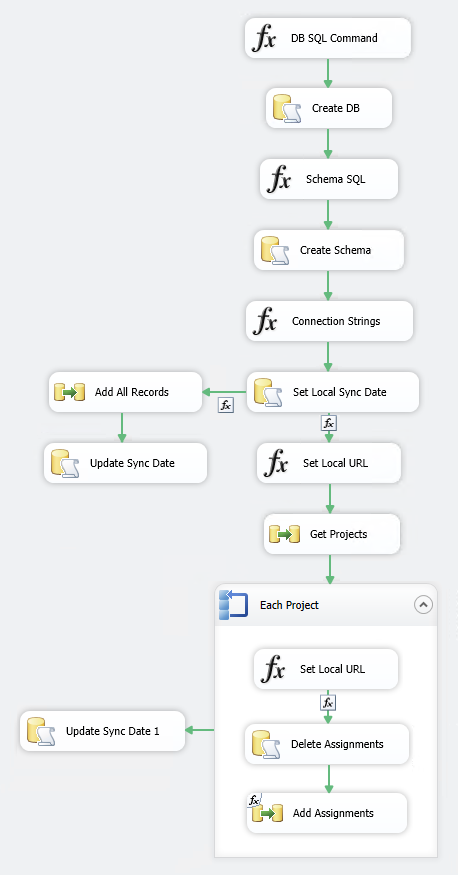
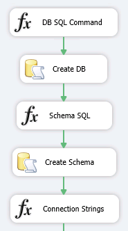
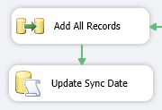
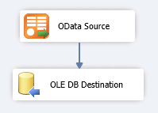
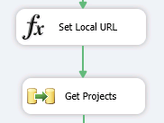
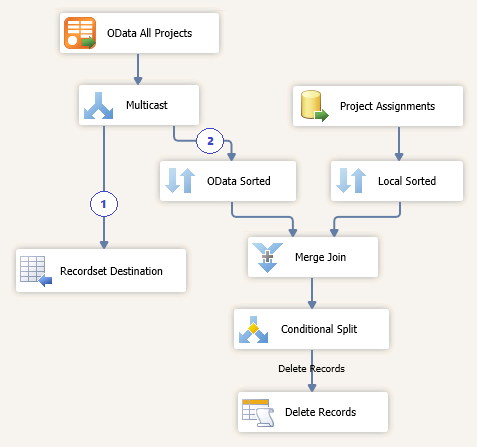
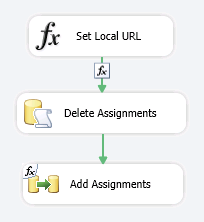
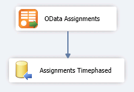

# Project Online: SSIS package for OData delta sync

For best performance when replicating PWA data to a SQL Server database for Project Online reporting, we recommend that you schedule regular synchronizations and update only changed data. The [Project Online: SSIS package for OData delta sync](http://www.microsoft.com/en-us/download/details.aspx?id=43736) sample package demonstrates how to configure a delta sync that compares the last sync date to the modified date on the Project entity to retrieve data only for projects that have changed since the last sync. 
  
> [!IMPORTANT]
> This sample package is intended for demonstration only and should not be deployed to a production environment. Microsoft will not maintain or support this package. Use the package and the information in this article as guidance for building an SSIS package that fits your reporting needs. 
  
## How the sample package works

The **ProjectData** OData service provides assignment timephased data in the **AssignmentTimephasedDataSet** entity set. **AssignmentTimephasedDataSet** contains a fixed set of columns, but it often contains many records for each assignment day. For long-running tasks, this can add up to hundreds of records per assignment and result in slow sync times. The sample SSIS package shows how to improve performance by updating only changed data. 
  
The package uses two separate flows to do this. Both flows write assignment timephased data to the assignments table as needed, and log the sync date if the sync is successful.
  
- A full sync that gets all assignment timephased data for all projects. The package completes a full sync the first time that it runs. The time required to complete a full sync depends on the number of the records returned by the OData feed, but the flow is simple because it gets all data. 
    
- A delta sync that gets assignment timephased data only for projects that have changed since the last sync. 
    
The package creates a **Synced** table to store sync dates, and sets the initial date to  *1900-01-01*  . This triggers the package to do a full sync the first time that it runs. Subsequent syncs run as delta syncs and use the last sync date to determine whether to get assignment timephased data for each project. Delta syncs use the following high-level flow: 
  
1. Get basic information about all projects.
    
2. Delete records for projects that no longer exist on PWA.
    
3. Loop through the set of projects.
    
4. For each project, compare the project's modified date with the last sync date. If the project was modified before the last sync, skip to the next project. Otherwise:
    
   - Delete the assignment records for the project.
    
   - Get assignment timephased data for the project from the OData feed.
    
   - Insert records for the timephased data into the assignments table.
    
   - Record the sync date.
    
   This flow minimizes the time that is required for the sync because the package processes data only for entities that have been updated since the last sync.
    
Each record in the assignments table is uniquely identified by a composite key that includes the **ProjectId**, **AssignmentId**, and **TimeByDay** fields. 
  
## Prerequisites

To run the sample, you'll need the following:
  
- [Project Online: SSIS package for OData delta sync](http://www.microsoft.com/en-us/download/details.aspx?id=43736) sample package 
    
- SQL Server 2012 SP1 with SQL Server Integration Services (SSIS)
    
- [Microsoft OData Source for Microsoft SQL Server 2012](http://www.microsoft.com/en-us/download/details.aspx?id=42280). See [Replicate Project Online Reporting Data to a SQL Server database using the OData protocol](http://msdn.microsoft.com/en-us/library/office/dn720853%28v=office.15%29.aspx) for instructions about how to configure the add-on to use the **ProjectData** service. 
    
- [Microsoft SQL Server Data Tools - Business Intelligence for Visual Studio 2012](http://www.microsoft.com/en-us/download/details.aspx?id=36843)
    
   The SQL Server Data Tools installation includes the Visual Studio shell, which is sufficient for creating SQL business intelligence projects that contain embedded scripts. To create a separate EXE project that interacts with the SSIS API, you'll need a C# editor.
    
- [SharePoint Server 2013 Client Components SDK](http://www.microsoft.com/en-us/download/details.aspx?id=35585)
    
- The credentials of a Project Online user who has sufficient permissions to access the **ProjectData** OData service. See [ProjectData - Project 2013 OData service reference](http://msdn.microsoft.com/en-us/library/office/jj163015%28v=office.15%29.aspx) for more information about permissions. 
    
To create your own package, you'll also need:
  
- Visual Studio 2010 or Visual Studio 2012
    
## Configure and run the sample package

### To configure and run the package in SQL Server Data Tools

1. Download the sample package to a location on your computer.
    
2. In SQL Server Data Tools, choose **New Project**, and then create an **Integration Services Project**.
    
3. In Solution Explorer, open the shortcut menu for the **SSIS Packages** folder, and then choose **Add Existing Package**.
    
4. In the **Add Copy of Existing Package** dialog box, choose **File system** for the package location. For the package path, locate the downloaded package (OData.AssignmentsTimephased.dtsx), and then choose **OK**.
    
   This process creates a copy of the sample package file in the new project's folder.
    
5. Open the shortcut menu for the **OData.AssignmentsTimephased** package and choose **View Designer**.
    
   On the **Parameters** tab, enter input parameters as described in the following table. These parameters are used to connect to the **ProjectData** OData feed and configure storage for assignment data in SQL Server. 
    
   |Name|Description|
   |:-----|:-----|
   |AssignmentsStorage_InitialCatalog    |The name of the local database to store assignments data retrieved from the OData feed. The default value is **ODATA**.    |
   |AssignmentsStorage_InitialTable    |The name of the local table to store assignments data retrieved from the OData feed. The default value is **AssignmentsTimephased**.    |
   |OData_Password    |The password for the account to use to access the OData feed.    |
   |OData_Username    |The user name of the account to use to access the OData feed. For example:  `mboyer@contoso.onmicrosoft.com`   |
   |OData_Url    |The endpoint URI of the **ProjectData** OData feed. For example:  `https://contoso.sharepoint.com/sites/pwa/_api/projectdata`   |
   
6. Test the sample. In Solution Explorer, in the **SSIS Packages** folder, open the shortcut menu for the **OData.AssignmentsTimephased** package, and then choose **Execute Package**.
    
## Walkthrough of the flow and components in the sample package

The complete control flow for the sample package is shown in Figure 1, and the following sections describe different parts of the flow and their components in detail.
  
**Figure 1. The complete control flow**

  
The **OData Source**, **OLE DB Source**, and **OLE DB Destination** components in the flow are set up dynamically. They use connection managers to build connection strings and credentials from local variables and input parameters. 
  
> [!NOTE]
> **OData Source** uses the  `$format=json` query option to reduce the size of the response data. 
  
### Create and configure storage, initialize the connection, and determine which sync flow to run

The following flow runs during each sync. It creates and configures storage for assignment timephased data, initializes the connection string, and determines whether to continue with a full sync or delta sync based on the last sync date.
  
|||
|:-----|:-----|
||**DB SQL Command** initializes the SQL command to create the SQL Server database to store assignments timephased data.    |
|**Create DB** executes **DB SQL Command** and creates the database (if it doesn't exist) based on the input parameters.    |
|**Schema SQL** initializes the SQL command that defines the storage schema for assignments timephased data.    |
|**Create Schema** executes **Schema SQL** and creates the table (if it doesn't exist) based on the input parameters.    |
|**Connection Strings** initializes the storage connection string, which is used by subsequent components.    |
   
|||
|:-----|:-----|
||**Set Local Sync Date** gets the last sync date from storage:     `SELECT TOP 1 [SyncedDate] FROM [Synced]`   Then it runs the appropriate sync type based on the last sync date. The condition is:     `@[User::SyncedDate] != (DT_DATE)("1900-01-01")`   If the date equals  `"1900-01-01"`, then the package runs a full sync. Otherwise, it runs a delta sync.    |
   
### Full sync flow: Get assignment timephased data for all projects

The following flow runs during a full sync.
  
- [Record assignment timephased data for all projects](project-online-ssis-package-for-odata-delta-sync.md#FullRecordAllData)
    
#### Record assignment timephased data for all projects

|||
|:-----|:-----|
||**Add All Records** performs a full sync. The **Add All Records** data flow contains the **OData Source** and **OLE DB Destination** components (shown below).    |
|**Update Sync Date** executes the following SQL command to set current sync date:     `UPDATE [Synced] SET [SyncedDate] = GETDATE()`   |
   
#### Add All Records data flow

The following components make up the **Add All Records** data flow. 
  
|||
|:-----|:-----|
||**OData Source** reads all the records from the AssignmentsTimephasedDataSet entity set.    |
|**OLE DB Destination** appends the records to the assignments table.    |
   
### Delta sync flow: Get assignment timephased data for changed projects only

The following flows run during a delta sync.
  
- [Prepare the projects loop and delete obsolete records](project-online-ssis-package-for-odata-delta-sync.md#DeltaPrepLoop)
    
- [Foreach loop: Skip the current project, or delete obsolete records and add updated records](project-online-ssis-package-for-odata-delta-sync.md#DeltaForEach)
    
#### Prepare the projects loop and delete obsolete records

****

|||
|:-----|:-----|
||**Set Local URL** gets all project UIDs from the assignments table and saves the result in a local variable. Later in the flow, the IDs are matched to the projects in the OData feed to determine whether a project is obsolete and its assignment records can be deleted.    |
|**Get Projects** saves project information and deletes assignment records. **Get Projects** has two branches (shown below).    |
   
#### The Get Projects data flow with its two branches

One branch of the **Get Projects** data flow saves the projects into a recordset to use in the loop. The other branch deletes obsolete assignment records from storage. 

|||
|:-----|:-----|
||The **OData All Projects** component gets the **ProjectId** and **ProjectModifiedDate** properties for all projects from the OData feed. It multicasts the data to the recordset and to the **Merge Join** component for a **LEFT OUTER JOIN** operation.    |
|**Project Assignments** gets projects by using the project IDs variable and transfers the data to the **Merge Join** component.    |
|**Merge Join** filters projects that exist in the assignments table but not in the PWA instance.    |
|**Conditional Split** performs the check:     `!ISNULL(ProjectUID) &amp;&amp; ISNULL(ProjectId)`   |
|**Delete Records** deletes obsolete records:     `exec DeleteProjectAssignments ?`   |
   
> [!NOTE]
> The **TaskModifiedDate** on the Task entity can't be used for the sync because all tasks are updated when a project is published. 
  
#### For each loop: Skip the current project, or delete obsolete records and add updated records

|||
|:-----|:-----|
||**Set Local URL** determines whether to update the project's assignments data.     `@[User::SyncedDate] < @[User::EachProject_CurrentProjectModifiedDate]`   If the last sync date is older than the project's modified date, execute the **Delete Assignments** and **Add Assignments** components. Otherwise, skip the project.    |
|**Delete Assignments** deletes the assignment records for the project from storage.     `exec DeleteProjectAssignments ?`   |
|**Add Assignments** adds records from the OData feed. The **Add Assignments** data flow contains the **OData Assignments** and **Assignments Timephased** components (shown below).    |
   
#### Add Assignments data flow

The following components make up the **Add Assignments** data flow. 
  
|||
|:-----|:-----|
||**OData Assignments** reads the records for the current project. It uses the **$filter** query option to filter the AssignmentsTimephasedDataSet entity set by the current project ID:     `"$filter=ProjectId eq guid'" + @[User::EachProject_CurrentProjectId] + "'&amp;$format=json"`   |
|**Assignments Timephased** appends the records to the assignments table.    |
   
## How fast is this?

The following test results are from a tenant that has 37 projects and 40,000 rows in the AssignmentTimephasedDataSet entity set. The results represent the time required to perform a full sync or a delta sync for a particular scenario.
  
**Download times for full syncs versus delta syncs**

|**Sync run**|**Full sync**|**Delta sync**|
|:-----|:-----|:-----|
|1st sync    |160 seconds    |200 seconds    |
|2nd sync, after modifying one project    |160 seconds    |17 seconds    |
|3rd sync, after modifying three projects    |160 seconds    |24 seconds    |
   
## See also

- [Project Online: SSIS package for OData delta sync](http://www.microsoft.com/en-us/download/details.aspx?id=43736) download 
- [ProjectData - Project OData service reference](projectdataproject-odata-service-reference.md)
- [Best practices for querying OData feeds for Project reporting data](best-practices-for-querying-odata-feeds-for-project-reporting-data.md)
    

