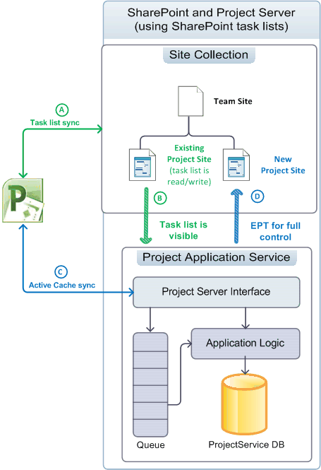
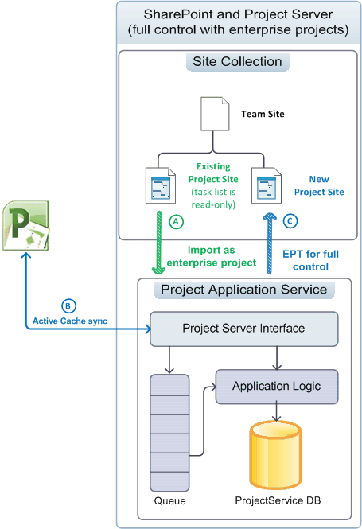
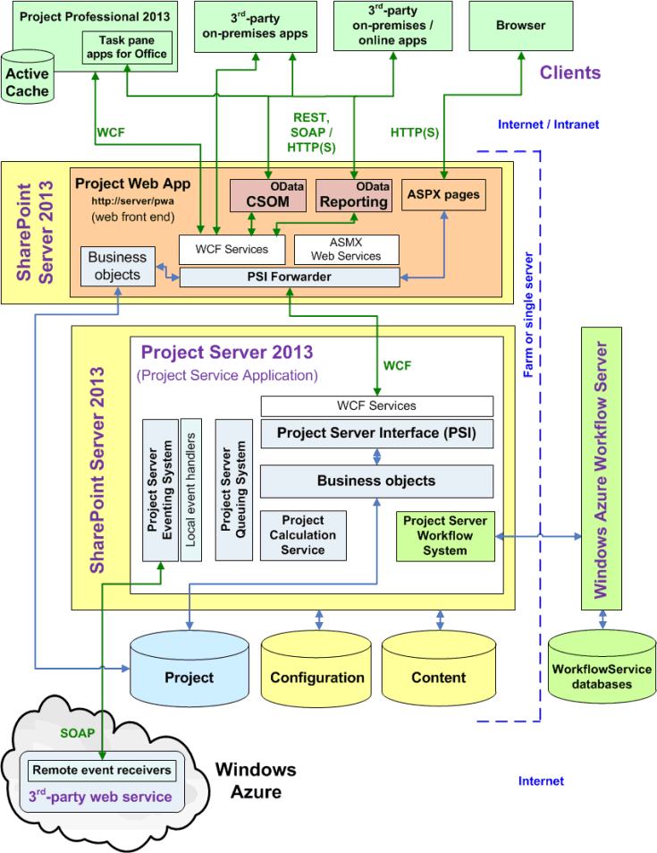
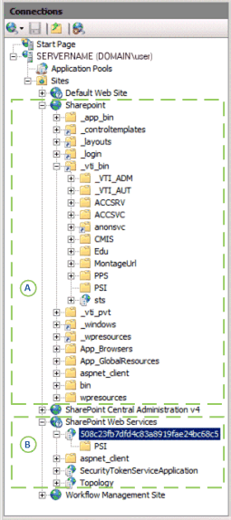

# Project Server 2013 architecture

Project Server 2013 integrates project management functionality throughout a SharePoint farm and enables the use of Project Online with a client-side object model (CSOM) and an OData interface for the Reporting data.
  
|||
|:-----|:-----|
|||
   
Project Server 2013 is a multitiered system that extends the architecture introduced in Office Project Server 2007. Architectural changes include association of the Project Application Service with SharePoint site collections, the addition of some business objects on the web front-end (WFE), the client-side object model (CSOM) for remote access, a single Project database, an OData interface for the Reporting tables and views, integration of Windows Workflow Foundation version 4 (WF4) through Workflow Manager Client 1.0 in the cloud or on a local server, and remote event receivers that are accessible by multiple Project Server installations. In addition to on-premises custom solutions, you can create apps that include remote event receivers and components that access the CSOM and OData interfaces.
  
The front-end tier includes Project Professional 2013, Project Web App, and third-party apps. Client applications communicate with the middle tier through the Project Server Interface (PSI) or through the CSOM endpoints, which in turn communicate with the PSI and the business object layer. Database access is integrated in the business objects. The Project Server Eventing System can access both local event handlers and remote event receivers. The Project Calculation Service implements the Project Professional scheduling engine within Project Server. Client applications do not (or should not) directly access the Project database; Project Server hides business objects from clients.
  
> [!NOTE]
> Project Server is built on the SharePoint architecture. For information about SharePoint Server 2013 architecture and the SharePoint app model, see the  *Getting started with SharePoint development*  section in the Office 2013 developer documentation. 
  
## Integrating with SharePoint site collections

The Project Application Service in Project Server 2013 can be associated with a SharePoint site collection for use with SharePoint tasks lists, The Project Application Service can also import a SharePoint tasks list as an enterprise project for full Project Server control. With a SharePoint tasks list, SharePoint maintains the project site in a site collection; Project Professional can synchronize with and update the tasks list. A project site can be an independent SharePoint tasks list or a tasks list that is synchronized with an .mpp file; the .mpp file can be stored locally or in a SharePoint library. 
  
Project Server maintains the projects when it has full control; Project Professional saves data directly to Project Server. Table 1 compares the behavior of a tasks list, the Schedule web part, and other functionality for SharePoint control of tasks lists and for imported projects when Project Server has full control. The Schedule web part contains the grid on the Project Web App page where you can edit a project schedule. The tied mode is where statusing data is entered once for both tasks and timesheets; in single entry mode, task statusing data is entered separately from timesheets.
  
**Table 1. Comparison of SharePoint task lists and full control**

|****Feature****|**Task list**|**Full-control**|
|:-----|:-----|:-----|
|**Task list in SharePoint**   |Read/write    |Read-only    |
|**Schedule web part**   |Read-only    |Read/write    |
|**Reporting**   |Rich reporting through Project Server    |Rich reporting through Project Server    |
|**Other Project Server functionality**   | Blocked functionality:     Server-side project edits, with Project Web App or custom client applications     Statusing     Tasks are not visible in tied mode    |Full functionality is enabled    |
   
### Managing projects as SharePoint task lists

When Project Server is associated with a SharePoint site collection where SharePoint maintains control, task lists and Project Professional 2013 (.mpp) files in document libraries are visible to the Project Application Service, but SharePoint maintains the master data for synchronization (see Figure 1). Server-side scheduling with the Schedule web part cannot be done. You can use Project Professional to synchronize with and edit the task list in a project site. By starting with SharePoint task lists, organizations can gradually evolve to use the full functionality of Project Server.
  
 Figure 1 shows the following processes when projects are maintained in SharePoint task lists: 
  
- (A) Project Professional can synchronize with task lists and create new project sites in the site collection either before or after association with the Project Application Service.
    
- (B) Project Server synchronizes with project site data for reporting purposes, but SharePoint maintains the master data; task lists remain read/write.
    
- (C) After association, Project Professional can create new projects and save or publish to Project Server. The Active Cache in Project Professional maintains data synchronization with Project Server.
    
- (D) When a new project is published in Project Professional, the user has the option of creating a project site for the project. A project can also be created in Project Web App as a SharePoint task list project type or as a full-control enterprise project type (EPT). Step (D) shows the full-control EPT.
    
**Figure 1. Using project sites as SharePoint task lists**

  
### Managing projects with full control

When Project Server is associated with a site collection and has full control, Project Server imports SharePoint task lists as enterprise projects, and can delete any related .mpp files. Project Server maintains the master data for task list synchronization; task lists in the site collection become read-only (see Figure 2). Imported projects can be edited by using Project Professional or by using Project Web App.
  
> [!NOTE]
> After Project Server imports a project, the user chooses whether to delete the project from the site or break the connection before editing the project. You can make the choice in Project Professional. 
  
Figure 2 shows the following processes when Project Server maintains enterprise projects with full control:
  
- (A) The user can choose which project sites to import. Project Server imports the project sites, and optionally deletes associated .mpp files. The SharePoint task list of an imported project becomes read-only.
    
- (B) After association, Project Professional creates new projects and saves or publishes to Project Server. The Active Cache in Project Professional maintains data synchronization with Project Server. The Schedule web part in Project Web App can do server-side scheduling.
    
- (C) When a new project is published in Project Professional, the user has the option of creating a project site for the project. A project can also be created in Project Web App with a full-control EPT and published with a read-only task list to a project site in the site collection.
    
**Figure 2. Using project sites with full control**

  
## General architecture

Figure 3 shows a generalized view of the Project Server 2013 architecture, including the Project Service Application, one Project Web App instance on a WFE, and several other client applications including Project Professional 2013.
  
There can be multiple Project Web App instances that communicate with the back-end Project Service Application. For an on-premises installation, the WFE can be on a separate server in a SharePoint farm, or it can be on the same SharePoint server with the Project Service Application. Project Online includes a WFE, the Project Service Application, and a local or remote Workflow Manager Client 1.0 server. 
  
**Figure 3. General Project Server 2013 architecture**

  
The following general comments apply to Figure 3:
  
- **Project Online:** You can create apps that use the CSOM, REST, and OData interfaces. An app package can also install remote event receivers in a custom web service on a local server, on an Azure server, or on Microsoft Azure. Project Online does not support third-party on-premises solutions, the WCF interface, the ASMX interface, or local event handlers. 
    
- **Event receivers:** Event receivers can also be called event handlers. Project Online supports registration of remote Project Server event receivers, which can be used by a Project Web App instance in the cloud or by an on-premises Project Server installation. An on-premises Project Server installation supports remote event receivers and local full-trust event handlers. 
    
- **Browsers:** There are no cross-browser limitations on viewing some Project Web App pages, as there are in Project Server 2010. The following browsers are supported for full use with Project Web App: 
    
  - Internet Explorer 8.x (on Windows 7 and earlier versions of Microsoft Windows), Internet Explorer 9.x, and Internet Explorer 10.x
    
  - Firefox 4.x (on Windows, Mac OS-X, and Linux/Unix)
    
  - Safari 5.x (on Windows and Mac OS-X)
    
  - Chrome
    
- **Programmatic interfaces:** For third-party apps, Project Online exposes the HTTP/HTTPS interface (including REST), the CSOM interface, an OData service for the CSOM, and an OData service for reporting. For third-party client applications that are on-premises (on the Intranet), you can use the WCF interface for the PSI, or you can use the CSOM, OData, and REST interfaces through HTTP. The Project Web App and Project Professional 2013 clients both use the WCF interface. In a single-server installation, the front-end ASMX web services, CSOM, and REST internally call the back-end WCF services. 
    
    > [!NOTE]
    > The SOAP-based ASMX interface for web services in the PSI is still available in Project Server 2013, but is deprecated. 
  
    The OData service for reporting is implemented by the internal OData.svc WCF service. You can get the Service Metadata Document for the reporting data by using  `http://ServerName/ProjectServerName/_api/ProjectData/$metadata`. 
    
    The OData service for the CSOM is intended for platforms such as Windows RT, iOS, and Android, where you can use the REST interface with JavaScript in HTML pages. 
    
    > [!NOTE]
    > Although the  `$metadata` option for the **ProjectData** reporting service is valid, the  `$metadata` option for the **ProjectServer** service of the CSOM is removed in the released version of Project Server 2013. For more information about REST queries for the CSOM, see [Client-side object model (CSOM) for Project Server](client-side-object-model-csom-for-project-2013.md). 
  
- **PSI Forwarder:** Programmatic access to the PSI on a separate WFE goes through the PSI Forwarder, which includes a WCF Forwarder and a Web Service Forwarder. Clients that use the ASMX interface access the PSI through the Web Service Forwarder. Clients that use the WCF interface access the PSI through the WCF Forwarder. Programmatic access through the CSOM, OData, and REST is piped through the WCF Forwarder. 
    
- **Workflows:** Declarative workflows (workflows that are defined in SharePoint Designer 2013) are offloaded to Workflow Manager Client 1.0 for processing. Workflow Manager Client 1.0 can run on a separate server in the SharePoint farm, on Microsoft Azure in the cloud, or on a single Project Server computer for testing or demonstrations. Coded workflows that are developed with Visual Studio 2012 are processed in the workflow runtime within SharePoint, as in Project Server 2010. For more information, see [Getting started developing Project Server workflows](getting-started-developing-project-server-workflows.md).
    
- **Perimeter network (DMZ):** Figure 3 does not show that an on-premises WFE server can be isolated by an additional firewall in a perimeter network (also known as a "demilitarized zone" or DMZ). A perimeter network can allow Internet clients to access SharePoint and Project Server across a firewall. 
    
- **SharePoint Web Services:** Figure 3 does not show the SharePoint infrastructure, such as the back-end SharePoint Web Services application, which is part of SharePoint Server 2013. When you install Project Server, the Project Service Application is added to the SharePoint Web Services. 
    
The front-end tier includes third-party applications, Project Professional, and Project Web App. A browser displays ASP.NET 4.0 pages (.aspx pages) in Project Web App. The Project Web App pages use Project Server Web Parts that communicate with the PSI and also use standard SharePoint Web Parts. 
  
The middle tier includes the PSI and the business object layer, which consists of logical objects that represent Project Server business entities. Business entities include Project, Task, Resource, Assignment, and so on. The PSI and the business object tier are tightly coupled and are located on the same server. A client application calls the PSI through one of the available interfaces, and the PSI invokes business objects. For improved performance, the WFE of Project Server 2013 includes some business objects for requests that do not use the Project Server Queuing System or require the Project Calculation Service. The WFE business objects communicate directly with the Project database.
  
The Project Web App components of Project Server use the SharePoint 2013 configuration database for project site setup and the content database for project site content such as task lists, custom pages, workflows, management settings, documents, and lists of issues, risks, and commitments. The SharePoint configuration and content databases support additional features for project management, such as project templates and workspaces, custom lists for team collaboration, and reports.
  
### Project Web App and the WFE

You can configure multiple Project Web App instances on a WFE and multiple WFE servers within a corporate intranet to enable load distribution for intranet clients. When a client application uses a Project Web App instance on a separate WFE server, PSI calls are routed through the PSI Forwarder. The PSI Forwarder (either the WCF Forwarder or the Web Service Forwarder) performs the following functions:
  
- Optimizes calls to the PSI from remote clients.
    
- Distinguishes between PSI calls that require the Project Server Queue Service, and those that do not. Asynchronous PSI method names begin with Queue, such as **QueueCreateProject**.
    
- Identifies PSI calls that invoke registered local event handlers.
    
- Identifies PSI calls that require the Project Calculation Service.
    
- Uses a server-based cache that works with the client-side Active Cache in Project Professional to reduce roundtrip calls to Project Server.
    
After SharePoint Server authenticates a Project Server user, the PSI Forwarder transparently sends requests that use back-end services to the PSI services on the computer running Project Server. Requests that do not require back-end services are sent to the business objects in the local Project Web App instance. The PSI Forwarder improves scalability, performance, and reliability for Project Server processing over the LAN, a WAN, and in Project Online.
  
Project Web App is developed with ASP.NET 4.0. The visual elements in .aspx files (HTML, server controls, and static text) are separate from the programming logic in code-behind classes that are in compiled assemblies (.dll files). Site pages in Project Web App, such as the top-level page, Project Center, and Report Center, can be customized by using Web Parts. Application pages that do not have an **Edit Page** option in the **Site Actions** menu cannot be edited, such as the Server Settings page and the Review Timesheet page. 
  
### The CSOM and the Project Server Interface

The PSI is factored into 22 public services, such as **Project**, **Resource**, **CustomField**, and **Statusing**. The PSI also contains seven private services for internal use. The PSI is the fundamental API of Project Server; it exposes Project Server functionality to the CSOM and to external applications. The CSOM includes classes that access the most commonly used PSI classes and members that are used for third-party applications. In Project Server 2013, some Project Server functionality is not available in the CSOM, such as the **Admin**, **Calendar**, **PortfolioAnalyses**, and **Security** services. 
  
Project Professional 2013 and Project Web App use the PSI to access Project Server data in the draft, published, and archive tables and views of the Project database. You can access a PSI service through a proxy file or a proxy assembly, for either the WCF services or the ASMX web services.
  
> [!NOTE]
> The CSOM is the preferred interface for third-party Project Server developers; it can be used for applications that access both an on-premises Project Server installation and Project Online. We recommend that you use the CSOM for developing new applications, if the CSOM includes the functionality that your application requires. 
  
Some line-of-business (LOB) applications and other third-party applications that were developed for Project Server 2010 require PSI services that are not yet represented in the CSOM. If they target only an on-premises installation of Project Server, applications can continue to use the WCF interface or the ASMX interface of the PSI.
  
Client applications call the PSI through service proxies. Clients that use the WCF interface access all PSI services through  `http://ServerName/ProjectServerName/_vti_bin/psi/ProjectServer.svc`. Clients that use an ASMX web service interface use the Project Web App URL for the specific service. For example, the **Resource** service is at  `http://ServerName/ProjectServerName/_vti_bin/psi/resource.asmx?wsdl`. If applications do not have intranet access to Project Server, they can use a Project Web App server in a perimeter network (not shown in Figure 3).
  
Figure 4 shows the **Connections** pane in **Internet Information Services (IIS) Manager** for a single-server installation of SharePoint Server 2013, Project Server 2013, and a local Workflow Management site for Workflow Manager Client 1.0. The SharePoint site collection (A) includes the front-end PSI services in the  `_vti_bin\PSI` virtual subdirectory. The SharePoint Web Services application (B) includes the Project Service Application, with the back-end PSI services in the  `508c23fb7dfd4c83a8919fae24bc68c5/PSI` virtual subdirectory. The GUID is the name of the Project Service Application instance for that Project Server installation. 
  
**Figure 4. IIS Manager showing the front-end PSI (A), and the back-end PSI (B)**

  
Client applications cannot directly access the WCF services for the PSI in the back-end Project Service Application. If they do not require access to Project Online, client applications and components of LOB applications use proxies for the PSI. A back-end URL for the WCF interface of the **Resource** service in Figure 4, for example, would be  `http://ServerName:32843/508c23fb7dfd4c83a8919fae24bc68c5/psi/resource.svc`. Port 32843 is the default HTTP port for the SharePoint Web Services application (32844 is the port for HTTPS communications). However, the web.config file for Project Web App blocks direct access to back-end PSI services.
  
> [!NOTE]
> The Project 2013 SDK download includes PSI proxy files for the WCF services and the ASMX services, and instructions for how to compile them into proxy assemblies. > To create updated PSI proxy files that use the WCF interface, you have to use the svcutil.exe utility or Visual Studio directly on the Project Server computer. 
  
Members of the PSI services typically produce or consume typed **DataSet** objects as the means to exchange information with the business objects. There are also several different models for PSI development. For example, the **Resource**, **CustomFields**, and **LookupTable** PSI services use XML filter objects for **DataSet** manipulation, and other services do not; some methods in the **Statusing** service use a  _changeXml_ parameter, while other methods and services do not. The CSOM does not use datasets. Although the CSOM has a different programming model than the PSI, and you can use either .NET assemblies or JavaScript, development with the CSOM is generally simpler and more consistent than development with the PSI. 
  
For more information about the PSI, see [Project PSI reference overview](project-psi-reference-overview.md). For more information about the CSOM, see [Client-side object model (CSOM) for Project 2013](client-side-object-model-csom-for-project-2013.md).
  
### Business objects in the WFE and the Project Service Application

The internal object model of Project Server includes the business objects, which represent logical entities such as Project and Resource. Client applications access business objects only through the CSOM or the PSI. Business objects, in turn, access the draft, published, and archive tables and views in the Project database.
  
Business objects are not exposed to third-party developers. The PSI handles mapping of the API to business objects, and the CSOM maps its API to the PSI. The logical entities of business objects can be classified into three types:
  
- **Core entities** are objects such as projects, tasks, assignments, resources, and calendars. The core entities include basic business logic such as permissions and naming rules. 
    
- **Business entities** are objects such as timesheets, project portfolios, and models. Business entities include additional business logic and usually are built from a combination of the core entities. 
    
- **Support entities** are objects such as security and validation. 
    
In Project Server 2010, all business objects are implemented in the Project Service Application. In Project Server 2013, the WFE hosts many of the business objects that process synchronous methods and do not require the Project Calculation Service. Synchronous PSI methods such as **DeleteProject** and **ReadAssignments** do not use the Project Server Queue Service. Asynchronous methods in the PSI have names that start with  `Queue`, such as **QueueCreateProject** and **QueueUpdateTimesheet**. An asynchronous method sends a message to the Project Server Queue Service, which schedules processing of the method while control is returned to the user.
  
The PSI Forwarder determines which requests are sent to the Project Service Application and which can be processed by the business objects in the WFE. The business objects in the WFE bypass the Project Service Application and have direct access to the Project database, similar to the way other SharePoint processes in a WFE directly access the Configuration and Content databases. Running many of the business objects on the WFE improves the efficiency of Project Server, reduces the load on the application tier, and enables Project Server to better scale up for increased workloads.
  
> [!NOTE]
> In Project Server 2013, local event handlers must be deployed to the WFE and to the back-end Project Server computer. 
  
### Project Server database

In Project Server 2013, the four Project Server databases of previous versions are combined into one Project database in SQL Server. The default Project database name is ProjectService. The reporting tables and views retain their previous names with the  `dbo` prefix, such as dbo.MSP_EpmProject and dbo.MSP_EpmProject_UserView. Tables and views that were previously in the Draft database have the  `draft` prefix. Tables and views from the Published database have the  `pub` prefix. Tables and views from the Archive database have the  `ver` prefix. 
  
> [!IMPORTANT]
> Direct access is not supported for the draft ( `draft` prefix), published (  `pub` prefix), and archive (  `ver` prefix) tables and views. Reports should use only the reporting tables and views, which have the  `dbo` prefix. 
  
Project Server data is partitioned in the Project database as follows:
  
- The draft tables and views contain data from unpublished projects that were created by Project Professional and other applications. Project Web App does not display project data from the draft tables and views.
    
- The published tables and views contain all of the published projects and enterprise resources, global data for enterprise project types (EPTs), and other project templates. Published projects are visible in Project Web App. The published data also includes tables that are specific to Project Web App (timesheets, models, views, and so on), and global data tables (custom fields, lookup tables, Project Server authorization permissions, and metadata).
    
- The archive data saves backup versions of projects, resources, custom fields, and other data.
    
- The reporting data can be used for read-only access in third-party applications, and for reports. Project Server OLAP cubes use the reporting views that have the  `_OlapView` suffix. OLAP cubes are available in an on-premises Project Server installation, but are not available in Project Online. 
    
    Reporting data is comprehensive and is updated nearly in real time. The reporting tables and views are optimized for read-only report generation; for example, the reporting tables are denormalized to provide redundant data and reduce the number of relational tables.
    
Logical entities such as Resource or Project can span multiple tables, and all tables for a particular entity have the same primary key. The primary key is a GUID in a single column that uniquely identifies one instance of a particular entity.
  
Project Server data for each instance of Project Web App is stored in a separate Project database with a different name. Client applications that have direct access to Project Server can directly read the reporting tables and views. For remote access, client applications can use the OData interface and the REST interface to get data for reports. Clients should use only the CSOM or the PSI to access the draft, published, and archive tables and views. The Reporting Data Service (RDS, which is not shown in Figure 3) updates the reporting data from published data in nearly real time. The Project database can be located on a separate server.
  
Schemas are documented only for the reporting tables and views. For an on-premises Project Server installation, you can add reporting tables and views for entities that are not defined in the Project database schema. You can also create separate databases for custom on-premises applications. Modification is not supported for the draft, published, and archive tables and views. Because the Project database is not directly accessible in Project Online, reporting tables and views cannot be modified. However, if you have a SQL Azure account, you can create separate databases for custom use with Project Online.
  
### Event receivers

Local event handlers and remote event receivers for Project Server enable third-party extensibility in response to Project Server events such as creating or publishing a project. In Project Server 2010, all event handlers are local and are written in full-trust code, deployed directly on the computer running Project Server and to the WFEs, and run inside the Project Server Eventing System. Because Project Online cannot use full-trust event handlers, Project Server 2013 implements remote event receivers that are similar to the remote event receivers in SharePoint Server 2013. An on-premises installation of Project Server 2013 can use traditional full-trust event handlers and remote event receivers.
  
A Project Server remote event receiver can be implemented in a custom web service with a SOAP endpoint that runs in Microsoft Azure or other environments that support SOAP web services. A Project Server app package can include remote event receivers that are installed with the app.
  
Remote event receivers can call back into Project Server by using the CSOM endpoints (not shown in Figure 3). The call to a remote event receiver includes information from the Project Server Event System and the Project Web App instance (or the Project Web App tenant in Project Online) that issues the call. Remote event receivers enable you to create and host a single web service that can be used by multiple Project Server installations. By contrast, local full-trust event handlers must be deployed to each installation of Project Server.
  
### Publishing and server-side scheduling

Project Server 2013 supports both manual and automated project schedule updates. The default process is a manual schedule update. That is, the project manager checks out and opens a project in Project Professional or Project Web App, applies the changes, and then saves and publishes the project to make the changes available to everyone. Project Professional has a scheduling engine that calculates changes and then saves the changes to Project Server. In Project Server 2010, the server-side scheduling engine is a different implementation from the scheduling engine in Project Professional.
  
In Project Server 2013, the Project Calculation Service implements the same scheduling engine that is in Project Professional 2013. The Project Calculation Service runs in a Windows service named **Microsoft Project Server Calculation Service**. Editing a project schedule in Project Web App or with third-party applications that use the CSOM results in exactly the same schedule changes that Project Professional would make.
  
> [!NOTE]
> Third-party applications that use the PSI may show some scheduling differences from a schedule that Project Web App calculates. For backward-compatibility, the public PSI methods that do server-side scheduling still use the scheduling engine that was introduced in Project Server 2010. An exception is **QueueUpdateProject2**, which is a new PSI method in Project Server 2013. For example, the older scheduling engine does not schedule subprojects or links to other projects, and does not calculate earned value fields. To avoid potential scheduling differences between third-party applications and Project Professional or Project Web App, you should develop applications with the CSOM where possible. 
  
Project Server allows the published version of a project to be updated while a project manager is using the draft version, by the following steps:
  
1. Project Server applies updates and reschedules the published version.
    
2. Project Server saves the update to apply to the draft version when either of the following events occur:
    
  - Project Professional opens the project.
    
  - Project Professional tries to publish the project.
    
3. If there is a conflict, the project manager is notified and must resolve the conflict before the draft version can be published.
    
## See also

- [Project 2013 overview for developers](http://msdn.microsoft.com/library/8da91ab0-af4f-429f-8241-490600e3f7bd%28Office.15%29.aspx)
    
- [Project Server programmability](project-server-programmability.md)
    
- [Client-side object model (CSOM) for Project 2013](client-side-object-model-csom-for-project-2013.md)
    
- [What the PSI does and does not do](what-the-psi-does-and-does-not-do.md)
    
- [Getting started developing Project Server workflows](getting-started-developing-project-server-workflows.md)
    
- [Project PSI reference overview](project-psi-reference-overview.md)
    
- [Open Data Protocol](http://www.odata.org/)
    

