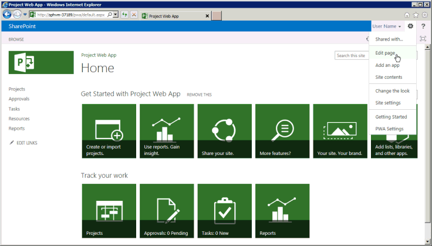
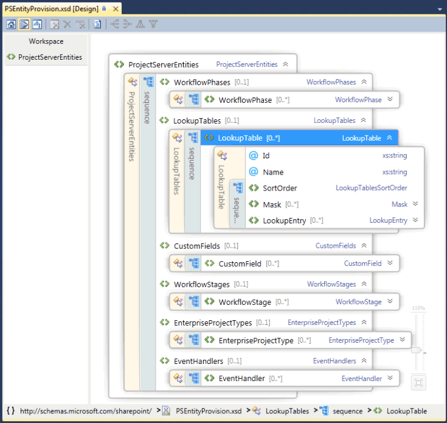

# Project Server programmability

Learn about the major programmability features in Project Server 2013. This article includes information about porting applications that were built for previous versions of Project Server.

Project Server 2013 is designed to support most applications that were developed for Project Server 2010 and new solutions for multiple platforms, where apps can access both online and on-premises Project Server installations. Applications and extensions that were developed for Project Server 2003 or earlier must be redesigned to use the client-side object model (CSOM) or the Project Server Interface (PSI). Applications that were developed for Office Project Server 2007 or Project Server 2010 may require some changes and recompiling to use the PSI; to use the CSOM, those applications require a redesign.
  
The Project Server platform enables high levels of programmer productivity by building on SharePoint Server 2013, .NET Framework 4, and the OData protocol with the CSOM. Developers can extend Project Web App with apps, app parts, and Web Parts, define workflows by using SharePoint Designer 2013, and enforce business rules by using remote event receivers for Project Server events.
  
## Project Server and SharePoint Server

Project Web App is built upon SharePoint Server 2013, and uses master pages and Web Parts to make it easier to build custom apps and Project Web App solutions. Project Server 2013 integrates deeply with SharePoint Server 2013 as the platform for project collaboration, reporting, site administration, security, and workflow management.
  
The project sites include more information and collaboration options for team members, where you can add default apps that include a project summary, specialized SharePoint lists for tasks with a timeline, tracking issues, risks, project deliverables, and the team calendar, along with the document library and team discussions. Custom apps for Project Server 2013 provide extensions and flexibility for team collaboration. You can also add app parts to customize an app, by using the same mechanism to add and edit Web Parts when you edit a page. You can locate project sites anywhere within the SharePoint farm where Project Server is installed. To use other core services of SharePoint Server 2013, such as Excel Services and Enterprise Search, an administrator can enable and configure the services. 
  
When you install Project Server 2013, you provision the Project Service Application in the SharePoint Web Services site. The Project Service Application includes the local Windows Communication Foundation (WCF) services and ASMX web services for the PSI. Other examples of service applications include SharePoint Search and SharePoint Document Management. For more information, see the SharePoint Server 2013 developer documentation.
  
The Project Service Application is a logical service provider that can manage multiple instances of Project Web App. Project Server provisioning creates a specific Project Web App site within a SharePoint web application. The Home page of Project Web App contains links to the Project Center page, Resource Center page, and the Business Intelligence Center page for reporting, plus a page that contains a list of additional standard apps. Figure 1 shows the **Edit Page** command in the **Setttings** drop-down list on the Home page of Project Web App, which allows you to add or edit Web Parts. 
  
> [!NOTE]
> Some administrative pages in Project Web App—such as the PWA Settings page—are not editable, and do not show the **Edit Page** command. Project Web App does not allow you to edit pages by using SharePoint Designer 2013. You can edit project site pages with SharePoint Designer 2013. 
  
**Figure 1. Using the Edit Page menu in Project Web App**

  
To access the Site Settings page in Project Web App, choose the **Settings** icon in the top-right corner of the page. The Site Settings page (  `http://ServerName/ProjectServerName/_layouts/15/settings.aspx`) enables changing the look and feel and the site theme, adding custom Web Parts, and modifying or creating master pages for project sites.
  
Customization of the code in ASPX pages, or customization of Project Web App master pages with SharePoint Designer 2013, is not supported. Customization of the code in Project Web App pages can cause problems with Project Server updates and service packs. 
  
### Customization of Project Web App with SharePoint packages

Because Project Web App is a SharePoint application, and project sites are SharePoint sites, you can add custom apps, Web Parts, event handlers, custom fields, and other features by using SharePoint packages (.wsp files) or SharePoint apps (.spapp files). A SharePoint package or an app package can include multiple Project Server entities, where entity definitions are specified in an elements.xml file within the package.
  
For Project Online, you can add buttons to the Project Web App ribbon, but you can't remove or rename existing product buttons, and you can't create new ribbon tabs. For more information, see [Create custom actions to deploy with apps for SharePoint](http://msdn.microsoft.com/en-us/library/office/apps/jj163954%28v=office.15%29.aspx).
  
> [!CAUTION]
> When you install a SharePoint package or an app package, the types of Project Server entities must appear in the order that the PSEntityProvision.xsd schema specifies or schema validation of the package fails and installation is not completed. 
  
The PSEntityProvision.xsd schema file is available in the Project 2013 SDK download, in the  `Documentation\Schemas\AppProvisioning` subdirectory. Figure 2 shows the XML Schema Explorer view in Visual Studio of the **PSEntityProvision** schema, where the **LookupTable** sequence is expanded. 
  
**Figure 2. Visual Studio view of the Project Server entity provisioning schema**

  
SharePoint packages that install features for Project Server can contain one or more elements.xml files that follow the **PSEntityProvision** schema. The Project Server entities in a single XML file must appear in the following order: 
  
1. Workflow phases
    
2. Lookup tables
    
3. Custom fields
    
4. Workflow stages
    
5. Enterprise project types
    
6. Event handlers
    
When you create a SharePoint package that contains Project Server entities, it is possible to put the entity definitions in multiple elements.xml files. Each XML file could pass the schema validation, but the entities in the whole package might not be in the correct order. For example, a custom field entity in the first XML file could refer to a lookup table in the second XML file. During installation, the custom field cannot be created because the lookup table has not yet been created.
  
If a package installation fails, objects that have been created remain in Project Web App, but the package does not install completely. Reinstalling the package can work, but that is not a good experience for customers. When the entity definitions span multiple elements.xml files, organize the Project Server entities in the entire SharePoint package to ensure that installation follows the correct order. With the PSEntityProvision.xsd schema in the Project 2013 SDK download, it is possible to develop a tool that checks for the prescribed order of entities in the XML files.
  
## Upgrading applications with the Project Server APIs

When you upgrade an application that was developed for a previous version of Project Server, you can choose to use either the CSOM or the PSI for a programmatic interface that includes methods to create, read, update, and delete project entities (the CRUD operations). Although the CSOM internally calls the PSI, it does not fully replace all PSI methods. For scenarios and limitations of the PSI and of the CSOM, see [What the PSI does and does not do](what-the-psi-does-and-does-not-do.md) and [What the CSOM does and does not do](what-the-csom-does-and-does-not-do.md).
  
> [!NOTE]
> If the CSOM includes the functionality you require, we recommend that you upgrade applications to use the CSOM. The CSOM enables applications to be used for both on-premises and online installations of Project Server 2013. 
  
If your application primarily reads data from Project Server, you can use the reporting tables and views in the Project Server database for an on-premises scenario. If you intend to use the application with Project Online, you can use the OData protocol for the **ProjectData** service, which provides both on-premises and online access to the reporting data. For more information, see [ProjectData - Project OData service reference](https://msdn.microsoft.com/en-us/library/office/jj163015.aspx)
  
### Using the PSI

The PSI enables full-trust client applications, including Project Professional 2013, Project Web App, and LOB applications, to access Project Server data within a SharePoint farm. The PSI is built and used with .NET Framework 4 and provides advantages such as a well-known development environment with built-in security, error handling, and garbage collection.
  
The PSI is accessed through WCF services or ASMX web services. The ASMX interface is based on WCF. Each PSI service typically contains a base class with CRUD methods for items within that class. Items are specified by related **DataSet** classes. For example, the **CustomFields** service contains the **CustomFields** class with methods such as [CreateCustomFields2](https://msdn.microsoft.com/library/WebSvcCustomFields.CustomFields.CreateCustomFields2.aspx) . Data for one or more enterprise custom fields are specified in the **CustomFieldDataSet**.
  
> [!NOTE]
> The ASMX web services interface of the PSI is deprecated in Project Server 2013. Although the ASMX interface is still available, new applications that use the PSI should use the WCF interface, or if possible, new applications should use the CSOM instead of the PSI. Future versions of Project Server will require an upgrade of existing ASMX-based applications to use the WCF interface of the PSI or to use the CSOM. 
  
There are 22 public, documented PSI services, which are duplicated in the WCF interface and the ASMX interface. The PSI also includes eight private, undocumented services. Project Web App and Project Professional use the public PSI services and the private PSI services. The PSI is generally factored to match the business objects. That is, each PSI method is associated with a business object such as **Calendar** or **Resource**. The PSI is the primary interface to the business objects. Because the business layer provides reusable business logic components, different applications that interact with Project Server data use the same business logic.
  
PSI methods that asynchronously interact with Project Server have names that begin with **Queue**. Each PSI method is implemented with a separate interface that uses strongly typed data. For example, the **QueueCreateProject** method in the **Project** service accepts the  _dataset_ parameter of type **ProjectDataSet**. The **ProjectDataSet** class is derived from the **DataSet** type. Type checking in the .NET Framework and IntelliSense completion in Visual Studio help to reduce errors in development with the PSI. For an introduction to the detailed reference for PSI namespaces, classes, methods, properties, events, and related assemblies, see [Project PSI reference overview](project-psi-reference-overview.md).
  
Project Server 2013 uses the exception handling of the .NET Framework. All errors are logged in the server, at the top of the PSI stack. Some errors send a simple report to the client, such as a **SoapException** object for the ASMX interface or a **FaultException** object for the WCF interface. Exceptions can be recorded in the application event log, and some errors also record a detailed report on the server in the Unified Logging Service (ULS) trace logs. 
  
For local full-trust applications, the PSI is also extensible. You can add a .NET assembly with a service that provides new functionality, uses the same Project Server security infrastructure, and calls other PSI methods or inherits from PSI classes. A PSI extension can also provide the business logic and database access required for new functionality.
  
### Using the CSOM

With the CSOM, you can develop apps that access Project Online or an on-premises Project Server 2013 installation. Apps can be distributed in a public Office Store or a private app catalog. The CSOM is designed to be an easy-to-use API that directly consumes or provides data by name with LINQ queries, rather than by passing datasets and constructing  _changeXml_ parameters or XML  _filter_ parameters. The CSOM implements the main functionality of the Project Server Interface (PSI) for the primary entities such as **Project**, **Task**, **EnterpriseResource**, and **Assignment**. The CSOM includes many additional entities such as **CustomField**, **LookupTable**, **WorkflowActivities**, **EventHandler**, and **QueueJob**, which support other common Project Server functionality.
  
The CSOM can be used by copying the following resources to your local development computer:
  
- For .NET Framework 4 development, copy the  `%ProgramFiles%\Common Files\Microsoft Shared\Web Server Extensions\15\ISAPI\Microsoft.ProjectServer.Client.dll` assembly. 
    
  For documentation of the CSOM classes and members, see the [Microsoft.ProjectServer.Client](https://msdn.microsoft.com/library/Microsoft.ProjectServer.Client.aspx) namespace. For an example application, see [Getting started with the CSOM and .NET](getting-started-with-the-project-server-csom-and-net.md).
    
- For Microsoft Silverlight development, copy the  `%ProgramFiles%\Common Files\Microsoft Shared\Web Server Extensions\15\TEMPLATE\LAYOUTS\ClientBin\Microsoft.ProjectServer.Client.Silverlight.dll` assembly. 
    
- To develop apps for Windows Phone 8, copy the  `%ProgramFiles%\Common Files\Microsoft Shared\Web Server Extensions\15\TEMPLATE\LAYOUTS\ClientBin\Microsoft.ProjectServer.Client.Phone.dll` assembly. 
    
- To use JavaScript for developing web apps and apps for other devices, copy the  `%ProgramFiles%\Common Files\Microsoft Shared\Web Server Extensions\15\TEMPLATE\LAYOUTS\PS.js` file and the  `PS.debug.js` file. For an example web app, see [Getting started with the Project Server 2013 JavaScript object model](getting-started-with-the-project-server-2013-javascript-object-model.md).
    
The CSOM internally calls the PSI; therefore, if the PSI cannot do a job, neither can the CSOM. For limitations of the CSOM, see [What the CSOM does and does not do](what-the-csom-does-and-does-not-do.md) and [What the PSI does and does not do](what-the-psi-does-and-does-not-do.md). For more information about developing with the CSOM, see [Updates for developers in Project 2013](updates-for-developers-in-project-2013.md) and [Client-side object model (CSOM) for Project 2013](client-side-object-model-csom-for-project-2013.md).
  
### Porting applications built for Project Server 2003

In Project Server 2003, much data and functionality is available only with Project Professional 2003 or by direct database access. The PSI, introduced in Project Server 2007, removes much of that restriction. Unlike the Project Data Service (PDS) in Project Server 2003, the PSI and the CSOM provide comprehensive interfaces to business objects in Project Server.
  
Applications developed for the PDS are not compatible with later versions of Project Server. The CSOM and the PSI provide functional parity for the PDS, but do not match PDS methods or parameters.
  
> [!NOTE]
> Because PDS applications must be completely redesigned for Project Server 2013, we recommend that you use the CSOM. 
  
For more information about PDS compatibility and guidelines for porting PDS extensions to the PSI, see [PDS Parity in PSI Web Services](http://msdn.microsoft.com/library/61a0b0c7-9b74-46d1-87ed-66ffdd8017f8%28Office.15%29.aspx).
  
### Porting applications built for Project Server 2007 and Project Server 2010

The PSI in Project Server 2013 is a superset of the PSI object model in Office Project Server 2007 and Project Server 2010. Many applications built for the two previous versions of Project Server continue to work in local full-trust, on-premises installations of Project Server 2013. However, the following kinds of applications require updates or redesign:
  
- Use the CSOM for applications that are adapted for use with Project Online.
    
- Use the CSOM for applications that are adapted for use on mobile devices and tablet computers.
    
- Use the CSOM for applications that are available as apps in the Office Store or a private app catalog.
    
- For applications that modify project scheduling, use the CSOM, or change the application to use the [QueueUpdateProject2](https://msdn.microsoft.com/library/WebSvcProject.Project.QueueUpdateProject2.aspx) PSI method. 
    
- Local or web applications that log on users to different instances of Project Web App should use programmatic settings for WCF endpoints of the CSOM or the PSI. The methods are deprecated. Apps should use OAuth authentication in place of Forms authentication and for use with Project Online. For more information, see [Authorization and authentication for apps in SharePoint 2013](http://msdn.microsoft.com/en-us/library/fp142384%28office.15%29.aspx#FileName_uniquekeyword1).
    
- Applications that rely on or modify specific Project Server security settings.
    
  > [!NOTE]
  > A default on-premises installation of Project Server 2013 uses the SharePoint permission mode, where Project Server security settings are not accessible through the PSI. To change to the Project permission mode, see the  *SharePoint Permission Mode*  section in [What's new for IT pros in Project Server 2013](http://technet.microsoft.com/en-us/library/ff631142%28office.15%29.aspx#section13). 
  
- For many custom Project Server workflows, you can use SharePoint Designer 2013 to create declarative workflows. For custom workflows that require additional programming, you should  *not*  directly use classes or members in the **Microsoft.Office.Project.Server.Workflow** namespace. Instead, use the [Microsoft.ProjectServer.Client.WorkflowActivities](https://msdn.microsoft.com/library/Microsoft.ProjectServer.Client.WorkflowActivities.aspx) class in the CSOM. 
    
- In general, applications that use impersonation should be rewritten to use the WCF interface of the PSI. Applications that do simple status updates for other users do not require impersonation. They can use the [StatusAssignment.SubmitStatusUpdates](https://msdn.microsoft.com/library/Microsoft.ProjectServer.Client.StatusAssignment.SubmitStatusUpdates.aspx) method in the CSOM or the [Statusing.SubmitStatusForResource](https://msdn.microsoft.com/library/WebSvcStatusing.Statusing.SubmitStatusForResource.aspx) method in the PSI. 
    
- Middleware components that run on the Project Server computer can be installed only for on-premises use, and must use the WCF interface of the PSI. For example, a middleware component that uses the ASMX interface to exchange data between Project Web App on-premises and an external timesheet application would have to be rewritten to use the WCF interface of the PSI. To work with Project Online, the component would have to be redesigned as an app and use the CSOM.
    
### Migration and compatibility of custom solutions

Classes and members in the public ASMX and WCF interfaces of the PSI are identical. But, the number of columns and size of datatables used or returned by PSI methods can be different between Project Server 2013 and the two previous Project Server versions. There are also differences in the reporting tables and views, compared with the Reporting database in previous versions.
  
> [!IMPORTANT]
> We strongly recommend that you thoroughly test solutions on a non-production installation of Project Server 2013 before deploying them to a production server. 
  
When you migrate a solution to Project Server 2013, or if a solution does not work as expected, you should at a minimum do the following:
  
- Update the solution by opening it in Visual Studio 2012. Some solutions can also use Visual Studio 2010.
    
- Change the target to .NET Framework 4.
    
- Change assembly references to use the Project Server 2013 assemblies, such as Microsoft.Office.Project.Server.Library.dll and Microsoft.Office.Project.Server.Events.Receivers.dll.
    
- Make a list of the ASMX web references or the WCF service references and namespace names, and then delete the Project Server references.
    
- Add the ProjectServerServices.dll proxy assembly that you can build from the WCF proxy source files in the Project 2013 SDK download, or add the proxy source files for the required WCF services. For ASMX services, add the front-end ASMX web service references again, by using the same namespace names; or add the ProjectServerServices.dll proxy assembly that you can build from the WSDL sources in the Project 2013 SDK download.
    
  > [!NOTE]
  > In the Project 2013 SDK download, the namespaces in the proxy source files all start with  *Svc*  . For example, the **Resource** service namespace in the WCF proxy file and in the ASMX proxy file is **SvcResource**. > If your application uses different namespace names, you can either recompile the proxy assembly to use your namespaces, or change the PSI namespaces in your application. For example, you can modify the CompileWCFProxyAssembly.cmd script and recompile ProjectServerServices.dll from the proxy source files in the SDK download. 
  
- If you change from using the ASMX interface of the PSI to the WCF interface, you can initialize the client classes either programmatically or by using WCF endpoints in app.config. Use programmatic initialization when you have to quickly switch to different instances of Project Web App, or when you are developing a web part that uses the PSI.
    
- There are several new methods and datasets in the PSI services in Project Server 2013 and some **DataRow** classes contain new properties. For example, the [QueueUpdateProject2](https://msdn.microsoft.com/library/WebSvcProject.Project.QueueUpdateProject2.aspx) method in the PSI uses the Project Server scheduling engine to reschedule an updated project without you having to open the project in Project Professional 2013, and also allows adding or deleting project entities in the same call. 
    
- Compile and test the solution.
    
## Project scheduling on the server

Project Server 2013 has two scheduling engines. The newer scheduling engine is the same as the scheduling engine in Project Professional 2013. When you make scheduling changes and publish the changes by using the Scheduling web part (Project Details page) in Project Web App or a project site, or by using the CSOM, the calculation of dates, costs, duration, remaining work, baselines, and other changes related to scheduling are the same as if you made the changes and published the project by using Project Professional 2013. However, except for the [QueueUpdateProject2](https://msdn.microsoft.com/library/WebSvcProject.Project.QueueUpdateProject2.aspx) method, PSI methods use the older scheduling engine that was migrated from Project Server 2010. The reason is to ensure that legacy applications behave the same in Project Server 2013 as they previously did. 
  
> [!NOTE]
> To use the updated scheduling engine in Project Server 2013, applications can use the CSOM. 
  
Both the older and the newer scheduling engines have the following limitations:
  
- **Single project scheduling only** Scheduling affects only the current project, when changes are made through task status updates with the PSI or the CSOM, or with Project Web App. If the current project has links to other projects, subprojects, or master projects, the linked projects are not changed. 
    
- **Summary tasks** Summary tasks are generally read-only on Project Server. For example, assignments for summary tasks cannot be created, and percent completion cannot be modified. However, Project Server does support editing the dates and duration of manually scheduled summary tasks. 
    
    Actuals on Project Server are not added automatically to a summary task assignment, because that would bypass the approval process in Project Server. In Project Professional, when you add actuals to a subtask, the actuals are also added for an assignment on the summary task. The difference in behavior can be confusing for a user.
    
    Project Server deletes actuals on a summary task assignment if the subtask duration shortens or the finish date is changed.
    
    > [!CAUTION]
    > Although Project Professional can do it, we recommend that you do not make assignments on summary tasks. 
  
Following are issues and limitations of PSI programming with the older Project Server scheduling engine:
  
- **Changing the active status of a task** The older Project Server scheduling engine can show inconsistent start or finish times when you use the [QueueUpdateProject](https://msdn.microsoft.com/library/WebSvcProject.Project.QueueUpdateProject.aspx) method to change the active status of a task, if there are multiple changes in the **ProjectDataSet** object for the  _dataset_ parameter. If the **TASK_IS_ACTIVE** property is the only change in the  _dataset_ parameter of **QueueUpdateProject**, you can update the project.
    
    For more information about inactive tasks and the older scheduling engine, see the blog articles [Introducing inactive tasks in Project 2010](http://blogs.msdn.com/b/project/archive/2010/06/10/introducing-inactive-tasks-in-project-2010.aspx) and [Project Server 2010: Scheduling on the web, the PSI and Project Professional](http://blogs.msdn.com/b/brismith/archive/2010/09/10/project-server-2010-scheduling-on-the-web-the-psi-and-project-professional.aspx?wa=wsignin1.0). For a comparison of scheduling in Project Professional 2010 and Project Web App in Project Server 2010, see [Web-based schedule management comparison](https://blogs.msdn.microsoft.com/brismith/2010/09/10/project-server-2010-scheduling-on-the-web-the-psi-and-project-professional/).
    
- **Earned value not calculated** The older scheduling engine does not calculate the earned value fields: ACWP, BAC, BCWP, BCWS, CPI, CV, CV%, EAC, SPI, SV, SV%, TCPI, VAC, Duration Variance, Start Variance, Finish Variance, Cost Variance, and Work Variance. If a project has values for these fields and the project is updated by using the **QueueUpdateProject** method, the field values do not change. To avoid the problem, use the **QueueUpdateProject2** method. 
    
You can handle the PSI scheduling limitations in the following ways:
  
- If the CSOM has the methods the application requires, use the CSOM instead of the PSI.
    
- Open projects in Project Professional and save them back to Project Server.
    
- In reports, do not include fields that the PSI does not update.
    
- Add a note in reports about data that may be stale.
    
There are flags in the reporting tables and the cubes that help you detect when some project data is not updated. The reporting data in the MSP_EpmProject table and in MSP_EpmProject_UserView includes the following fields: 
  
-  _ProjectWbsIsStale_ &ndash; Indicates whether the work breakdown structure (task outline hierarchy) is stale. 
    
-  _ProjectEarnedValueIsStale_ &ndash; Indicates the earned value fields are stale. 
    
-  _ProjectRollupsAreStale_ &ndash; Indicates that a subproject is updated in the draft database, but the master project is not updated. The rolled-up values from the subproject are stale. 
    
-  _ProjectHierarchyNotSynchronized_ &ndash; The master project is not synchronized with its children. This happens when the child projects are published explicitly, not as part of the master project publishing. 
    
-  _ProjectCalculationsAreStale_ &ndash; Project Professional saved a project without calculating the schedule (that is, the calculation mode is set to **Manual** on the **Schedule** tab in the **Project Options** dialog box). 
    
-  _ProjectGhostTaskAreStale_ &ndash; Similar to  _ProjectHierarchyNotSynchronized_, but warns on cross-project link data. It is possible that no master project exists, but the project data on one side of the link is newer than on the other side.
    
## About accessing the Project Server database

If you have permissions in Microsoft SQL Server to access the Project Server database, you can read the reporting tables and views. If you have the necessary Project Server permissions, you can also read data from the reporting tables by using OData queries. Developers are strongly discouraged from directly accessing the draft, published, or archive tables through SQL Server queries in the Project Server database. Making direct changes in any of the tables in the Project Server database can damage referential integrity and interfere with database access through the Project Server Queuing Service.
  
> [!IMPORTANT]
> There is nothing to actively prevent you from using direct programmatic database access to update data. You should be aware that the Project Professional cache, the published tables, and the reporting tables all rely on a cache synchronization protocol that can be disrupted by direct data editing. If you damage your Project Server database or corrupt Project Professional client-side caches by using direct access to change data, be warned that product support won't be able to help! 
  
Applications that directly access the draft, published, or archive tables and views are also dependent on the database schemas, which can change in service packs or later versions of Project Server 2013. Applications that directly access the databases also lose the built-in Project Server security, common business logic, tracking, audits, error checking, reporting, workflow, and other features. You would likely have to rewrite such an application after Project Server 2013 updates. 
  
For all of these reasons, Project Professional and Project Web App do not make direct calls to the draft, published, or archive tables; neither should any other application that integrates with Project Server.
  
The schemas for the draft, published, and archive tables are not documented. You can use the reporting tables to help generate reports, and the schema for the reporting tables and views is documented in the Project 2013 SDK download. For the OData schema of the reporting data, see [ProjectData - Project OData service reference](https://msdn.microsoft.com/en-us/library/office/jj163015.aspx).
  
## See also

- [Updates for developers in Project 2013](updates-for-developers-in-project-2013.md)    
- [Project Server 2013 architecture](project-server-2013-architecture.md)    
- [What the PSI does and does not do](what-the-psi-does-and-does-not-do.md)   
- [What the CSOM does and does not do](what-the-csom-does-and-does-not-do.md)    
- [Client-side object model (CSOM) for Project 2013](client-side-object-model-csom-for-project-2013.md)    
- [Getting started developing Project Server workflows](getting-started-developing-project-server-workflows.md)    
- [Project 2013 programming references](project-2013-programming-references.md)    
- [Project PSI reference overview](project-psi-reference-overview.md)    
- [Create custom actions to deploy with apps for SharePoint](http://msdn.microsoft.com/en-us/library/office/apps/jj163954%28v=office.15%29.aspx)    
- [Introducing Inactive Tasks in Project 2010](http://blogs.msdn.com/b/project/archive/2010/06/10/introducing-inactive-tasks-in-project-2010.aspx)    
- [Project Server 2010: Scheduling on the Web, the PSI and Project Professional](https://blogs.msdn.microsoft.com/brismith/2010/09/10/project-server-2010-scheduling-on-the-web-the-psi-and-project-professional/)

