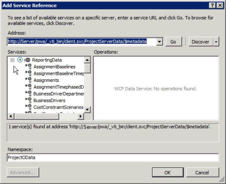

# Querying OData feeds for Project reporting data

To read reporting data in Project Server 2013, there are multiple ways to do OData queries of the **ProjectData** service. The Business Intelligence Center in Project Web App includes a Data Connections page, where you can choose the Office Data Connection (ODC) for Project Server OData reporting. Choosing the default ODC opens an Excel 2013 workbook, where you can create pivot tables, pivot charts, and PowerView reports. There are several default reports that are included with Project Server 2013. 
  
You can create custom apps that are developed by using the Microsoft .NET Framework 4, such as apps for on-premises reporting or remote reporting, or a Silverlight Web Part. For a Windows Phone app, you can use the LINQ query syntax in Visual C# statements, Visual Basic statements, or other .NET Framework languages. If you prefer, you can use Lambda syntax with LINQ methods to do the same queries. For apps that you develop for the web or for other devices, you can use REST queries or JavaScript statements.
  
The Project 2013 SDK download includes the **HelloProject_OData** sample Office Add-in, which uses a REST query with JavaScript and jQuery to summarize information from the **ProjectData** service in a task pane within Project Professional 2013. 
  
Many third-party tools and OData consumer applications are available that can help you to quickly create and test queries. You can paste a REST URL in a browser and view the data in the page source or in a web debugging tool such as [Fiddler](http://www.fiddler2.com) (  `http://www.fiddler2.com`). For links to tools such as OData Explorer and LINQPad, choose **Consumers** in the [Open Data Protocol ecosystem](http://msopentech.com/odataorg/ecosystem) (  `http://msopentech.com/odataorg/ecosystem`).
  
For more information about OData queries in SharePoint 2013, see [Use OData query operations in SharePoint REST requests](http://msdn.microsoft.com/library/d4b5c277-ed50-420c-8a9b-860342284b72%28Office.15%29.aspx).
  
## Creating REST queries
<a name="pj15_QueryingOData_REST"> </a>

The XML content of an Entity Data Model is also known as a Service Metadata Document or an OData schema. The Service Metadata Document for the **ProjectData** service specifies the entities and relationships that are available in the Project Server reporting data. Procedure 1 shows how to use the OData schema for the **ProjectData** service to help create REST queries of the Project Server reporting data. 
  
### Procedure 1. To use the OData schema and create REST queries of Project Server reporting data

1. The URL of the **ProjectData** service is  `http://ServerName/ProjectServerName/_api/ProjectData`. For example, if your Project Web App site is  `http://MyServer/pwa`, to get the Service Metadata Document, enter the following URL in a browser: http:// _MyServer_/pwa/_api/ProjectData/$metadata. 
    
2. Save the XML data in a file; for example, save as a file named ProjectData.xml. The [ReportingData Schema element](https://msdn.microsoft.com/en-us/library/office/jj163529.aspx) contains **EntityType** elements and **Association** elements. The [ReportingData EntityContainer element](https://msdn.microsoft.com/en-us/library/office/jj163018.aspx) contains **EntitySet** elements and **AssociationSet** elements. 
    
3. To format the ProjectData.xml file for easier reading, open the file in Visual Studio, choose **Advanced** on the **Edit** menu, and then choose **Format Document**. Or, choose the **Format Document** icon on the **XML Editor** toolbar. 
    
4. To directly show the XML data from REST queries in your browser, turn off the feed reading view. For example, in Internet Explorer, do the following steps:
    
1. Open the **Internet Options** dialog box. 
    
2. Choose the **Content** tab. 
    
3. In the **Feeds and Web Slices** section, choose **Settings**.
    
4. In the **Advanced** section of the **Feed and Web Slice Settings** dialog box, clear the **Turn on feed reading view** check box. 
    
5. Choose **OK**, and then restart Internet Explorer.
    
5. To get the list of **EntitySet** elements, which are the primary entity collections that are available in the **ProjectData** service, use the following URL in the browser:  `http://ServerName/ProjectServerName/_api/ProjectData`
    
    In the XML result, for example, the **collection** elements show that you can directly query for **Projects** and for **ProjectBaselines**.
    
  ```XML
  <collection href="Projects">
    <atom:title>Projects</atom:title> 
  </collection>
  <collection href="ProjectBaselines">
    <atom:title>ProjectBaselines</atom:title> 
  </collection>
  ```

    For more information about those entity sets, see [EntitySet element: Projects](entityset-projects-projectdata-service.md) and [EntitySet element: ProjectBaselines](entityset-projectbaselines-projectdata-service.md).
    
6. To get the collection of projects, and the associations and properties of each project, use  `http://ServerName/ProjectServerName/_api/ProjectData/Projects`.
    
7. To get the associations and properties of a specific project, specify the primary key of the **Project** entity type (see the **Key** element in [EntityType element: Project](https://msdn.microsoft.com/en-us/library/office/jj163049.aspx)). For example, the **ProjectId** property is the primary key of the **Project** entity. **ProjectId** is of type **Edm.Guid**. The query for a specific project can be expressed as  `http://ServerName/ProjectServerName/_api/ProjectData/Projects(guid'263fc8d7-427c-e111-92fc-00155d3ba208')`.
    
    The **link** elements in the XML results show the URL extensions for the associations of that project. For example, the **href** attributes in the following **link** elements show how to get the collection of assignments and tasks in the project. 
    
  ```XML
  <link rel="http://schemas.microsoft.com/ado/2007/08/dataservices/related/Assignments"
      type="application/atom+xml;type=feed" 
      title="Assignments" href="Projects(guid'263fc8d7-427c-e111-92fc-00155d3ba208')/Assignments" />
  . . .
  <link rel="http://schemas.microsoft.com/ado/2007/08/dataservices/related/Tasks" 
      type="application/atom+xml;type=feed" 
      title="Tasks" href="Projects(guid'263fc8d7-427c-e111-92fc-00155d3ba208')/Tasks" />
  . . .
  ```

    The [EntityType element: Project](https://msdn.microsoft.com/en-us/library/office/jj163049.aspx) reference topic lists all the associations and properties that are available for the **Project** entity type. For example, the query results include the actual start date and the number of hours of actual work completed on the project, as follows: 
    
  ```XML
  . . .
  <content type="application/xml">
    <m:properties>
      <d:ProjectId m:type="Edm.Guid">263fc8d7-427c-e111-92fc-00155d3ba208</d:ProjectId>
      . . .
      <d:ProjectActualStartDate m:type="Edm.DateTime">2012-04-02T08:00:00</d:ProjectActualStartDate>
      <d:ProjectActualWork m:type="Edm.Decimal">32.000000</d:ProjectActualWork>
      . . .
    </m:properties>
  </content>
  ```

8. To query for a single property of the project, for example the project name, use the following query:  `http://ServerName/ProjectServerName/_api/ProjectData/Projects(guid'263fc8d7-427c-e111-92fc-00155d3ba208')/ProjectName`
    
9. To query for multiple properties of the project, for example the project name, project cost, and project currency, use the following query:  `http://ServerName/ProjectServerName/_api/ProjectData/Projects(guid'263fc8d7-427c-e111-92fc-00155d3ba208')?$select=ProjectName,ProjectCost,ProjectCurrency`. The results include:
    
  ```XML
  <id>http://ServerName/ProjectServerName/_api/ProjectData
      /Projects(guid'263fc8d7-427c-e111-92fc-00155d3ba208')</id>
  <category term="ReportingData.Project" scheme="http://schemas.microsoft.com/ado/2007/08/dataservices/scheme" />
  <link rel="edit" title="Project" href="Projects(guid'263fc8d7-427c-e111-92fc-00155d3ba208')" />
  . . .
  <content type="application/xml">
    <m:properties>
      <d:ProjectCost m:type="Edm.Decimal">3600.000000</d:ProjectCost>
      <d:ProjectCurrency>USD</d:ProjectCurrency>
      <d:ProjectName>My project name</d:ProjectName>
    </m:properties>
  </content>
  ```

10. Because one of the **NavigationProperty** elements in [EntityType element: Project](https://msdn.microsoft.com/en-us/library/office/jj163049.aspx) uses the [Association element: Project_Tasks_Task_Project ](https://msdn.microsoft.com/en-us/library/office/jj163386.aspx) relationship, you can use the following query to get all of the tasks in the project:  `http://ServerName/ProjectServerName/_api/ProjectData/Projects(guid'263fc8d7-427c-e111-92fc-00155d3ba208')/Tasks`. The results include the **link** elements for the entity associations of each task, and the properties of each task. The project summary task is the first task in the results, where  `TaskIndex = 0`.
    
    In a query that starts with a project, the XML result shows both a primary key and a foreign key for each task association. For example, the XML data includes the association for a specific task and the association for the assignments in that task. In the following XML results of the query, **ProjectId** is the primary key, and **TaskId** is the foreign key. The [EntityType element: Task](entitytype-task-projectdata-service.md) topic shows both keys. 
    
  ```XML
  . . .
  <link rel="edit" title="Task" 
      href="Tasks(ProjectId=guid'263fc8d7-427c-e111-92fc-00155d3ba208', 
      TaskId=guid'3631bf8b-427c-e111-92fc-00155d3ba208')" />
  <link rel="http://schemas.microsoft.com/ado/2007/08/dataservices/related/Assignments" 
      type="application/atom+xml;type=feed" title="Assignments" 
      href="Tasks(ProjectId=guid'263fc8d7-427c-e111-92fc-00155d3ba208', 
      TaskId=guid'3631bf8b-427c-e111-92fc-00155d3ba208')/Assignments" />
  . . .
  ```

You can walk the entity data model by using REST queries. Each **EntityType** element in the [ReportingData Schema element](https://msdn.microsoft.com/en-us/library/office/jj163529.aspx) lists the properties and associations that are available for that entity. In addition to the basic queries, you can use query string options such as  _$select_,  _$skip_,  _$top_,  _$filter_, and  _$orderby_. The  _$links_ query option and the  _$expand_ query option are not implemented in the **ProjectData** service. For more information, see [Query String Options](http://www.odata.org/documentation/uri-conventions#QueryStringOptions) in the Odata.org documentation. 
> [!NOTE]
> The **ProjectData** service implements paging for the entity sets, to limit the number of entities that can be returned in one query. You can use the **Get-SPProjectOdataConfiguration** command or the Set-SPProjectOdataConfiguration command in the SharePoint 2013 Management Shell to get or set the limits for a specified entity such as **Tasks**, or for all 33 entities. For more information, see [ProjectData - OData service reference](projectdataproject-odata-service-reference.md). 
  
Following are several more examples of REST queries (the examples do not show the first part of the URL, which is  `http://ServerName/ProjectServerName/_api/ProjectData`):
- Get all of the assignments in the Project Web App instance:  `~/Assignments`
    
    > [!NOTE]
    > For queries that can return a large amount of data, you can reduce the data by using a  _$filter_ URL option. For other ways to limit the amount of data, see [ProjectData - Project OData service reference](projectdataproject-odata-service-reference.md). 
  
- To get all the assignments in a specific project, either of the following queries does the same job:
    
     `~/Assignments?$filter=ProjectId eq guid'263fc8d7-427c-e111-92fc-00155d3ba208'`
    
    **OR**
    
     `~/Assignments?$filter=ProjectName eq 'My project name'`
    
    **ProjectId** is the primary key for the **Assignment** entity, but the  `$filter` option can use any property of the **Assignment** entity. 
    
- Here is another query to get the assignments in a specific project:  `~/Projects(guid'263fc8d7-427c-e111-92fc-00155d3ba208')/Assignments`
    
- Get the resource name for a specific assignment:  `~/Projects(guid'263fc8d7-427c-e111-92fc-00155d3ba208')/Assignments(ProjectId=guid'263fc8d7-427c-e111-92fc-00155d3ba208',AssignmentId=guid'a0eafeb5-437c-e111-92fc-00155d3ba208')/ResourceName`
    
- Because the **NavigationProperty** elements relate to an **Association** element that has two endpoints, you can also navigate backward by using a REST URL. For example, to get the project for a specific assignment, either of the following queries does the same job: 
    
     `~/Assignments(ProjectId=guid'263fc8d7-427c-e111-92fc-00155d3ba208',AssignmentId=guid'a0eafeb5-437c-e111-92fc-00155d3ba208')/Project`
    
    **OR**
    
     `~/Projects(guid'263fc8d7-427c-e111-92fc-00155d3ba208')/Assignments(ProjectId=guid'263fc8d7-427c-e111-92fc-00155d3ba208',AssignmentId=guid'a0eafeb5-437c-e111-92fc-00155d3ba208')/Project`
    
> [!NOTE]
> Because some browsers use a default value of about 2,000 characters for the maximum URL length, a browser may limit REST queries of the **ProjectData** service to returning an item (a property or a collection) up to two collection steps from parent to child. For example, a two-step query of **Projects** to **Tasks** can be expressed as  `~/Projects(projectId)/Tasks(projectId, taskId)/Assignments`. That query gets the collection of assignments in a specified project and task. > But, a three-step query to get a specified assignment item may exceed the default maximum URL length. For example,  `~/Projects(projectId)/Tasks(projectId, taskId)/Assignments(assignmentId, projectId,)` may not work. For a shorter URL to get a specific assignment or an assignment property, use a one-step or two-step query such as  `~/Assignments(projectId, assignmentId)` or  `~/Tasks(projectId, taskId)/Assignments(projectId, assignmentId)/ResourceName`. > Alternately, you can increase the **maxUrlLength** attribute value in the **httpRuntime** element of the web.config file for Project Web App (in the  `[Program Files]\Microsoft Office Servers\15.0\WebServices\Shared\ProjectServer\PSI` directory). For more information, see [httpRuntime Element (ASP.NET Settings Schema)](http://msdn.microsoft.com/en-us/library/e1f13641.aspx). 
  
## Creating LINQ queries
<a name="pj15_QueryingOData_LINQ"> </a>

Procedure 2 shows how to create LINQ queries in Visual C# by using expressions in the declarative LINQ query syntax and by using method syntax with lambda expressions. You can use Visual Studio 2010 or Visual Studio 2012.
  
### Procedure 2. To create a simple application for LINQ queries of Project Server reporting data

1. Create a Visual Studio project that uses the Windows Console Application template. Select the target .NET Framework 4. For example, create a project named TestProjectData.
    
2. Add a service reference to the **ProjectData** service, which has the address  `http://ServerName/ProjectServername/_api/ProjectData/$metadata`. In the **Add Service Reference** dialog box, choose **Go** to resolve the address, select the **ReportingData** service, and then name the service reference namespace. For example, name the namespace ProjectOData. If you expand the ReportingData node, you can see all the entity sets that are defined in the **ProjectData** service (see Figure 1). 
    
   **Figure 1. Setting an OData service reference**

     
  
    Visual Studio adds the necessary **System.Data.Services.Client** reference when you create the **ProjectOData** service reference. 
    
3. Add the following code to the Program.cs file. The **context** variable is initialized with the metadata in the **ProjectData** EDM, which you established by adding the **ProjectOData** service reference. 
    
    The **projectQuery1** variable is set to a LINQ query expression for projects, where the project start date is later than January 1, 2012, and the output is ordered by project name. The **projectQuery1** variable is of type **IOrderedQueryable\<ProjectOData.Project\>**.
    
    The **projectQuery2** variable produces the same query results, by using lambda expressions. The **projectQuery2** variable is of type **IQueryable\<ProjectOData.Project\>**. The .NET Framework internally converts **projectQuery1** to use the method syntax of **projectQuery2**.
    
  ```cs
  using System;
  using System.Collections.Generic;
  using System.Linq;
  using System.Net;
  using System.Text;
  using System.Data.Services.Client;
  namespace TestProjectData
  {
      class Program
      {
          private const string PSDATA = "http://ServerName/ProjectServername/_api/ProjectData";
          
          static void Main(string[] args)
          {
              ProjectOData.ReportingData context = 
                  new ProjectOData.ReportingData(new Uri(PSDATA, UriKind.Absolute));
              context.Credentials = CredentialCache.DefaultCredentials;
              var projectQuery1 = from p in context.Projects
                                  where p.ProjectStartDate > new DateTime(2012, 1, 1)
                                  orderby p.ProjectName
                                  select p;
              Console.WriteLine("Using declarative LINQ query syntax:\n");
              foreach (ProjectOData.Project proj in projectQuery1)
              {
                  Console.WriteLine(proj.ProjectName + " :\tStart date: " + proj.ProjectStartDate.ToString());
              }
              var projectQuery2 = context.Projects
                                     .Where(p => (p.ProjectStartDate > new DateTime(2012, 1, 1)))
                                     .OrderBy(p => p.ProjectName)
                                     .Select(p => p);
              Console.WriteLine("\n\nUsing lambda expressions for a LINQ query:\n");
              foreach (ProjectOData.Project proj in projectQuery2)
              {
                  Console.WriteLine(proj.ProjectName + " :\tStart date: " + proj.ProjectStartDate.ToString());
              }
              Console.Write("\nPress any key to exit: ");
              Console.ReadKey(true);
          }
      }
  }
  ```

4. Set a breakpoint after initializing the **projectQuery1** variable, and run the application. Internally, Visual Studio converts the query first to OData method syntax with lambda expressions, and then to a REST query for the OData service. Following is the REST query for **projectQuery1** (all on one line): 
    
  ```HTML
  http://ServerName/ProjectServerName/_api/ProjectData/Projects()
      ?$filter=ProjectStartDate gt datetime'2012-01-01T00:00:00'
      &amp;$orderby=ProjectName}
  ```

When you run the **TestProjectData** application, the console shows the following output for three sample projects that are published in Project Web App: 
```
Using declarative LINQ query syntax:
Imported from SharePoint :      Start date: 4/2/2012 8:00:00 AM
Test Proj 1 :   Start date: 4/5/2012 12:00:00 AM
WinProj test 1 :     Start date: 4/1/2012 8:00:00 AM
Using lambda expressions for a LINQ query:
Imported from SharePoint :      Start date: 4/2/2012 8:00:00 AM
Test Proj 1 :   Start date: 4/5/2012 12:00:00 AM
WinProj test 1 :     Start date: 4/1/2012 8:00:00 AM
Press any key to exit:
```

Because the **ProjectData** service does not implement the  `$links` query option or the  `$expand` query option, you cannot directly query one entity type as a child of another entity type. For example, to get the tasks in a project, you cannot use the **Projects** entity set in an expression such as  `context.Projects(guid'263fc8d7-427c-e111-92fc-00155d3ba208').Tasks`. You can get the tasks in a project by using the **Tasks** entity set, for example: 

```cs
var taskQuery = context.Tasks
                        .Where(t => (t.ProjectId == 
                            new Guid("263fc8d7-427c-e111-92fc-00155d3ba208")))
                        .OrderBy(t => t.TaskIndex)
                        .Select(t => t);
```

## Querying for custom fields
<a name="pj15_QueryingOData_CustomFields"> </a>

When you set a service reference to **ProjectData**, or query  `~/ProjectData/$metadata`, the Entity Data Model (EDM, or OData schema) includes custom field properties at the time the reference is made. For example, the default custom fields in Project Web App include the **RBS** text custom field for the **Resource** entity, the **Health** custom field for the **Task** entity, and the **Project Departments** custom field for the **Project** entity. Because **RBS** and **Health** roll down to assignments, the **Assignment** entity includes the **Health_T** property and the **RBS_R** property, as follows: 
  
```XML
<EntityType Name="Assignment">
  . . .
  <Property Name="Health_T" Type="Edm.String" />
  <Property Name="RBS_R" Type="Edm.String" />
  . . .
</EntityType>
<EntityType Name="Project">
    . . .
    <Property Name="ProjectDepartments" Type="Edm.String" />
    . . .
</EntityType>
<EntityType Name="Resource">
    . . .
    <Property Name="RBS" Type="Edm.String" />
    . . .
</EntityType>
<EntityType Name="Task">
    . . .
    <Property Name="Health" Type="Edm.String" />
    . . .
</EntityType>
```

If the custom field name includes one or more spaces, such as **Project Departments**, the **ProjectDepartments** property name omits the spaces. When you create a custom field, the custom field property is added to the entity type. For example, create the custom fields shown in Table 1. 
  
**Table 1. Custom fields to create for testing**

|**Custom field name**|**Entity**|**Type**|**Roll down to          assignments**|
|:-----|:-----|:-----|:-----|
|Test Proj Text  <br/> |Project  <br/> |Text  <br/> |N/A  <br/> |
|Test Res Dur  <br/> |Resource  <br/> |Duration  <br/> |Yes  <br/> |
|Test Task Text  <br/> |Task  <br/> |Text  <br/> |Yes  <br/> |
   
If you refresh the  `~/ProjectData/$metadata` query, the EDM now includes properties for the new custom fields. 
  
```XML
<EntityType Name="Assignment">
    . . .
    <Property Name="Health_T" Type="Edm.String" />
    <Property Name="RBS_R" Type="Edm.String" />
    <Property Name="TestResDur_R" Type="Edm.Decimal" />
    <Property Name="TestTaskText_T" Type="Edm.String" />
    . . .
</EntityType>
<EntityType Name="Project">
    . . .
    <Property Name="ProjectDepartments" Type="Edm.String" />
    <Property Name="TestProjText" Type="Edm.String" />
    . . .
</EntityType>
<EntityType Name="Resource">
    . . .
    <Property Name="RBS" Type="Edm.String" />
    <Property Name="TestResDur" Type="Edm.Decimal" />
    . . .
</EntityType>
<EntityType Name="Task">
    . . .
    <Property Name="Health" Type="Edm.String" />
    <Property Name="TestTaskText" Type="Edm.String" />
    . . .
</EntityType>
```

> [!IMPORTANT]
> When you create an enterprise custom field, a service reference or EDM that you previously made from a metadata query does not contain the new custom field properties. You must refresh the service reference or the  `~/ProjectData/$metadata` query to get the new properties. 
  
Open the Resource Center in Project Web App, edit a resource, and then set the value of the **Test Res Dur** custom field to 3d. Create a query for the custom field value (replace the **ResourceId** property with the GUID for your resource), for example:  `~/ProjectData/Resources(guid'4941e174-1596-e111-b0b9-00155d144b20')/TestResDur`. The XML result shows the duration in working hours, as follows:
  
```XML
<d:TestResDur xmlns:d="http://schemas.microsoft.com/ado/2007/08/dataservices" 
    xmlns:m="http://schemas.microsoft.com/ado/2007/08/dataservices/metadata" 
    m:type="Edm.Decimal">24</d:TestResDur>
```

## Additional resources
<a name="pj15_QueryingOData_AR"> </a>

- [Use OData query operations in SharePoint REST requests](http://msdn.microsoft.com/library/d4b5c277-ed50-420c-8a9b-860342284b72%28Office.15%29.aspx)
    
- [Introducing OData](http://msdn.microsoft.com/en-us/data/hh237663)
    
- [Query String Options](http://www.odata.org/documentation/uri-conventions#QueryStringOptions)
    
- [Open Data Protocol ecosystem](http://msopentech.com/odataorg/ecosystem) (  `http://msopentech.com/odataorg/ecosystem`)
    
- [Fiddler](http://www.fiddler2.com) (  `http://www.fiddler2.com`)
    
- [LINQ Query Syntax versus Method Syntax (C#)](http://msdn.microsoft.com/library/eedd6dd9-fec2-428c-9581-5b8783810ded.aspx)
    

