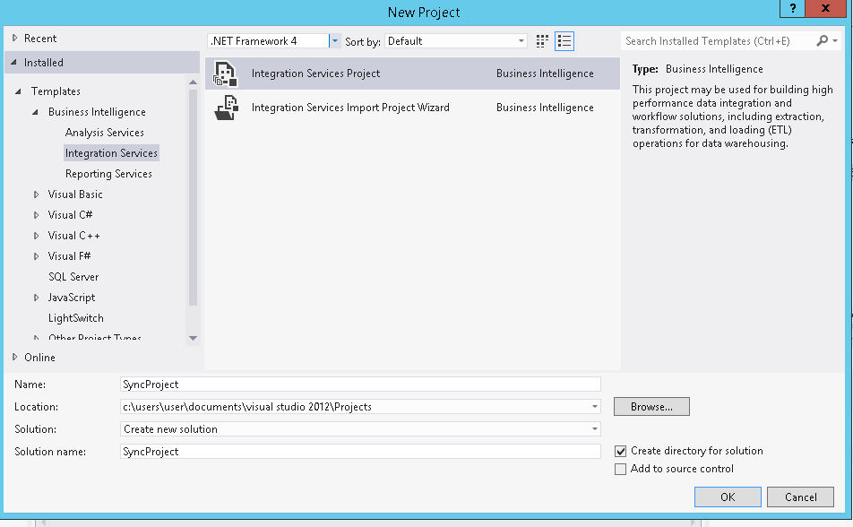
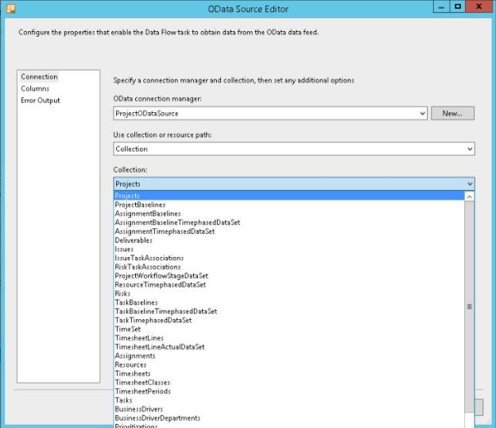
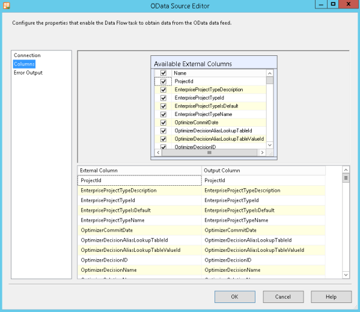
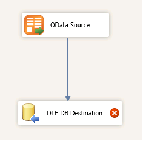
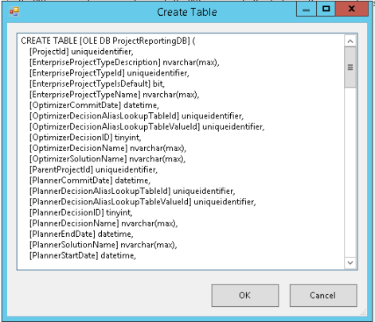
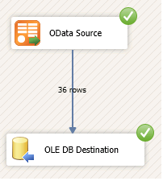
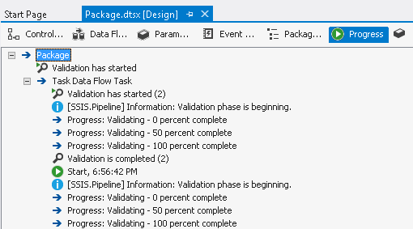
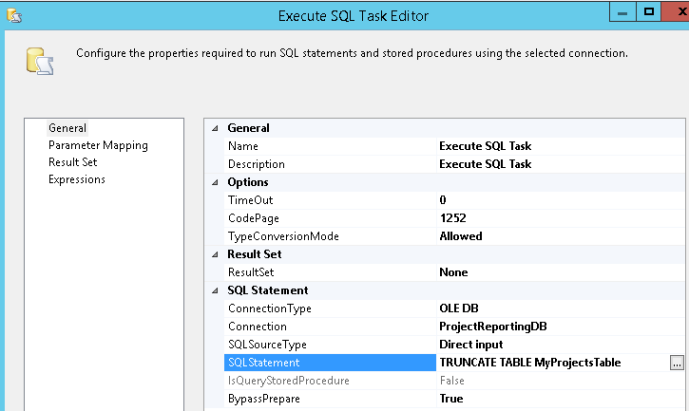

# Replicate Project Online reporting data to a SQL Server database

This topic describes how you can use SQL Server Integration Services (SSIS) to replicate your reporting data from Project Online to a separate SQL Server database by using the Open Data protocol (OData). It explains how to install the add-on, the high level details of the replication process and how to get started in Visual Studio with the Integration Services project template to create a project that automatically pulls your data based on a schedule.
  
## Creating an Integration Services Project for replicating the Project Online data
<a name="ProjODataSSISToolCreatePrj"> </a>

This walkthrough shows you how to create and configure the Integration Services project in Visual Studio to synchronize your Project Online data to a SQL Server database.
  
### Prerequisites

To complete this walkthrough, you will need access to Project Online, and credentials for a user with sufficient permissions to access the OData feed.
  
In addition, you will need a server for your SQL Server database. This server needs to run Windows Server 2008 R2 or newer, and it can be an Azure virtual machine. On this server you need to install the following:
  
- SQL Server 2012 SP1 with SQL Server Integration Services (SSIS) installed.
    
- [Microsoft® OData Source for Microsoft SQL Server® 2012](http://www.microsoft.com/en-us/download/details.aspx?id=42280)
    
- Visual Studio 2010 or Visual Studio 2012
    
- [SharePoint Server 2013 Client Components SDK](http://www.microsoft.com/en-us/download/details.aspx?id=35585)
    
- [Microsoft SQL Server Data Tools - Business Intelligence for Visual Studio 2012](http://www.microsoft.com/en-us/download/details.aspx?id=36843)
    
    > [!NOTE]
    > When you install the SQL Server Data Tools, the Visual Studio shell is included. This is sufficient for creating SQL business intelligence projects with embedded scripts. If you want to create a separate EXE project that interacts with the SSIS API, then you need a C# editor. 
  
### To create the project for replicating Project online data

1. From Visual Studio, on the **File** menu, point to **New**, and then click **Project**.
    
2. In the **New Project** dialog box, expand the **Templates** node, and then click the **Business Intelligence** node. 
    
3. Click the **Integration Services Project** template. 
    
    > [!NOTE]
    > If you don't see the **Integration Services Project** template in the available project templates, confirm that the SQL Server Data Tools are installed. 
  
4. In the **Name** box, type SyncProject, and click **OK**.
    
   **Figure 1. New SSIS project dialog**

     
  
Your project has been created and opened in the SSIS Designer, ready for you to add the data connection to your Project Online data.
  
### To create the data connection

1. Right click **Connection Managers** in **Solution Explorer**, and select **New Connection Manager**.
    
2. Select **ODATA** as **Connection manager** type, and then click **Add**.
    
3. For **Connection manager** name, specify ProjectODataSource
    
4. For **Service document location**, specify the top level URL of the OData feed, for example: 
  
 `https://<server>/sites/pwa/_api/projectdata`
    
5. For the **Authentication** section, select **Use this username and password**, and specify credentials for an account with OData permissions.
    
   > [!NOTE]
   > A best practice here is to create a system account and grant OData permissions to this account. In the default SharePoint permission mode, not all Project Web App users have access to the OData feed. Only users in the following groups have access: Portfolio Viewers, Portfolio Managers, and Administrators. Access cannot be managed for individual entities in the OData feed; so if a user with access to the OData service also has access to the reporting data published for all of the projects, resources, tasks, and other entities. For more information about the permission modes, see [Plan user access in Project Server 2013](http://technet.microsoft.com/en-us/library/fp161361%28v=office.15%29.aspx). 
  
6. Click **All** in the left pane. 
    
7. In the **Security** node, set **Microsoft Online Services Authentication** to **True**.
    
8. Click **Test Connection** to confirm that the connection is configured correctly, and that the new connection works. 
    
Once you have confirmed that the connection is configured correctly, you are ready to create the Data Flow task to move the data from the Project Online OData feed to your SQL Server database.
  
### To create the data flow

1. In the SSIS Designer, click the **Data Flow** tab, and click the link to add a new Data Flow task. 
    
2. From the **SSIS Toolbox**, drag and drop an OData Source component to the Data Flow designer.
    
3. Double-click the **OData Source** component to open the **OData Source Editor** and configure the component to extract data from the **Projects** collection in the OData feed. 
    
4. Select **ProjectODataSource** for **OData connection manager**, **Collection** for **Use collection or resource path** and **Projects** for **Collection**.
    
   **Figure 2. Connection settings in the OData Source Editor**

   
  
5. To see how the column mapping will work between the OData feed and the database you are creating with this tool, click **Columns** in the left pane of the **OData Source Editor**. From here you can change the column mappings, define custom names for the SQL columns, or remove any columns you don't want to sync.
    
   **Figure 3. Column mappings in the OData Source Editor**

   
  
6. Click **OK** to save the configuration for the OData source. 
    
7. Drag and drop an **OLE DB Destination** component from the **SSIS Toolbox** onto the Data Flow designer. 
    
8. Connect the components in the data flow by dragging the blue line from the **OData Source** component to the **OLE DB Destination** component. 
    
   **Figure 4. Data connection on the Data Flow tab**

   
  
Now you're ready to configure the settings for the SQL reporting database to be created for the destination.
  
> [!NOTE]
> This walkthrough demonstrates the basic steps you need to take for synchronizing reporting data between Project Online and a separate SQL reporting database. While this sample demonstrates the basic steps, as a best practice, you would likely include code in your project to create URL connections and queries at runtime, based on the data you need. 
  
### To configure the settings for the database

1. Double-click the **OLE DB Destination** component to open **OLE DB Destination Editor**.
    
2. On the **Connection Manager** page, for **OLE DB connection manager**, click **New**.
    
3. In the **Configure OLE DB Connection Manager,** click **New** and specify the server name and credentials used to connect to the database server. 
    
4. Once you've verified that the connection is configured properly by clicking **Test Connection**, click **OK**.
    
5. Click **OK** to close the **Configure OLE DB Connection Manager**.
    
6. You should now be back in the **OLE DB Destination Editor**. Click **New** for **Name of the table or view**. This opens an editor where you can modify the **CREATE TABLE** syntax to specify the name for the new table. Once you've finished modifying the **CREATE TABLE** statement, click **OK** to close the syntax editor. 
    
   **Figure 5. Create table statement**

   
  
7. In the **OLE DB Destination Editor**, click **Mappings** in the left navigation pane and verify that the input and destination column mappings are correct. 
    
8. Click **OK** to close the **OLE DB Destination Editor**.
    
### Testing the data synchronization

You can now test the package to see the data flowing between the source OData feed and the destination SQL Server database. In the Visual Studio*Debug** menu, click **Start Debugging**, or use the keyboard shortcut **F5** to execute the package. 
  
**Figure 6. Data Flow tab results when running the package**


  
While the package is running, you can see how the execution is progressing from the **Progress** tab. 
  
**Figure 7. Package Process tab**


  
This can help you see where you might be able to make changes to improve the performance. See also [Debugging Data Flow](http://msdn.microsoft.com/en-us/library/ms137944%28v=sql.120%29.aspx) and [Debugging Control Flow](http://msdn.microsoft.com/en-us/library/ms140274%28v=sql.120%29.aspx).
  
## Deleting old values
<a name="ProjODataSSISToolDeleteOldValues"> </a>

In this example, the data will be duplicated with every synchronization. To prevent this from happening, you will need to delete all the data in the table before every synchronization. You can do this using an Execute SQL task to delete the table using the [TRUNCATE TABLE](http://technet.microsoft.com/en-us/library/ms177570.aspx) statement before the Data flow task. 
  
### To delete the table

1. In the SSIS Designer, click on the **Control Flow** tab. 
    
2. From the **SSIS Toolbox**, drag and a drop an **Execute SQL task** component above the **Data flow task** component. 
    
3. Connect the two components by dragging the green connector from the **Execute SQL task** component to the **Data flow task** component. 
    
4. Double-click the **Execute SQL task** component to open the **Execute SQL Task Editor**.
    
5. On the **General** settings page, select the connection for the database server 
    
6. Type  `TRUNCATE TABLE MyProjectsTable` for **SQL Statement**. Replace MyProjectsTable with the actual table name you specified when creating the table. 
    
   **Figure 8. Execute SQL Task Editor**

   
  
Now when you synchronize the data, the old data will be removed before the new data is synchronized.
  
## Using your new SQL Server Reporting Services (SSRS) reports in Office 365
<a name="ProjODataSSISToolSSRSRptsO365"> </a>

There are multiple ways to show the SSRS reports in SharePoint, they all depend on your type of deployment.
  
> [!NOTE]
> It is not currently possible to render SSRS reports directly into Office 365, so the preferred implementation is to use links. 
  
The following example scenarios show how to maintain an easy single sign-on experience between your Office 365 pages and SSRS reports.
  
- For full on-premises deployments, you can follow the steps described in [Install SQL Server BI Features with SharePoint 2013 (SQL Server 2012 SP1)](http://technet.microsoft.com/en-us/library/jj218795%28v=sql.110%29.aspx) on how to deploy SSRS reports functionality in SharePoint. 
    
- For seeing on-premises SSRS reports in Office 365, it is recommended that you do the following:
    
  - Integrate your SQL Server database machine to your domain
    
  - Manage reports permission in SQL Server
    
  - Add links in Office 365 to the SSRS reports page. You can control access to these links via SharePoint permissions.
    
- For seeing Azure SSRS reports in Office 365, you need to do the following:
    
  - Integrate the database server to your domain
    
  - [Use the Azure Active Directory Sync tool](http://blogs.technet.com/b/educloud/archive/2013/06/03/new-azure-active-directory-sync-tool-with-password-sync-is-now-available.aspx) to synchronize your local Active Directory (AD) to Azure Active Directory (AD). This new feature will allow for the same sign-in with Microsoft cloud services such as Office 365 powered by Azure AD since the username and the password from the local AD will by synced up to Azure AD. 
    
  - Manage reports permission on your SQL Azure database.
    
  - Add links in Office 365 to the SSRS reports page. You can control access to these links via SharePoint permissions.
    
If you do not have an on-premises deployment, it is not currently possible to have a single sign on experience. The recommended practice is described in the steps below. In this case, the user will have to manually enter SQL Server authentication credentials in order to view the reports.
  
## Best practices
<a name="ProjODataSSISToolBestPract"> </a>

The following OData best practices apply when retrieving Project Online data is by using the OData protocol. To learn more, see [Best practices for querying OData feeds for Project reporting data](best-practices-for-querying-odata-feeds-for-project-reporting-data.md).
  
### Use JSON (JavaScript Object Notation) format

You should request responses in the JSON format for SSIS packages. You configure this for the OData source in the Query options field in the OData Source Editor.
  
### Retrieve only the data you need

You can improve performance by limiting the number of properties to be returned to only the ones you will use in your report. This diminishes the size of the data downloaded, as well as giving you faster answers when you filter out the uncommon or custom properties on a task.
  
### Not all properties are created equal

When retrieving a list of properties, note that the time it takes to fetch the properties varies when the OData query is transformed into a SQL query. Querying by using keys provides the best performance, followed by regular properties and then custom properties.
  
For example, you can see that ProjectId and TaskId are the keys for the Task entity.
  
```XML
<EntityType Name="Task">
    <Key>
        <PropertyRef Name="ProjectId" />
        <PropertyRef Name="TaskId" />
    </Key>
    <Property Name="ProjectId" Type="Edm.Guid" Nullable="false" />
 . . .
    <NavigationProperty Name="Assignments" Relationship="ReportingData.Assignment_Task_Task_Assignments" ToRole="Assignment_Task" FromRole="Task_Assignments" />
 . . .
</EntityType>
```

See the [ProjectData OData service schema reference](https://msdn.microsoft.com/en-us/library/office/jj163529.aspx) to find keys for other entity types. 
  
## See also
<a name="ProjODataSSISToolAddResources"> </a>

- [Project 2013 developer documentation](project-2013-developer-documentation.md)  
- [ProjectData - Project OData service reference](projectdataproject-odata-service-reference.md) 
- [Schema: ReportingData (ProjectData service)](https://msdn.microsoft.com/en-us/library/office/jj163529.aspx)
- [Project Online](http://technet.microsoft.com/en-us/projectserver/fp123547.aspx)
- [Microsoft SQL Server Data Tools](http://msdn.microsoft.com/en-us/data/tools.aspx)
    

