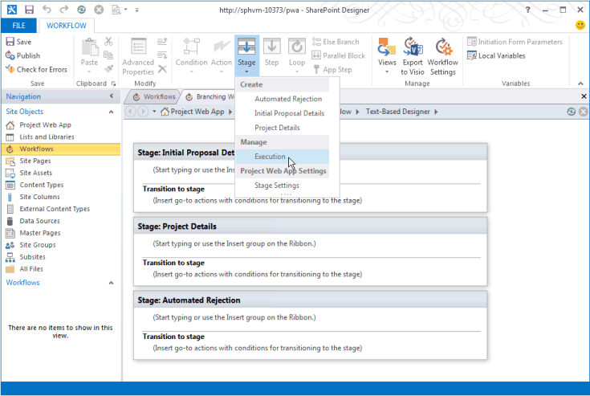
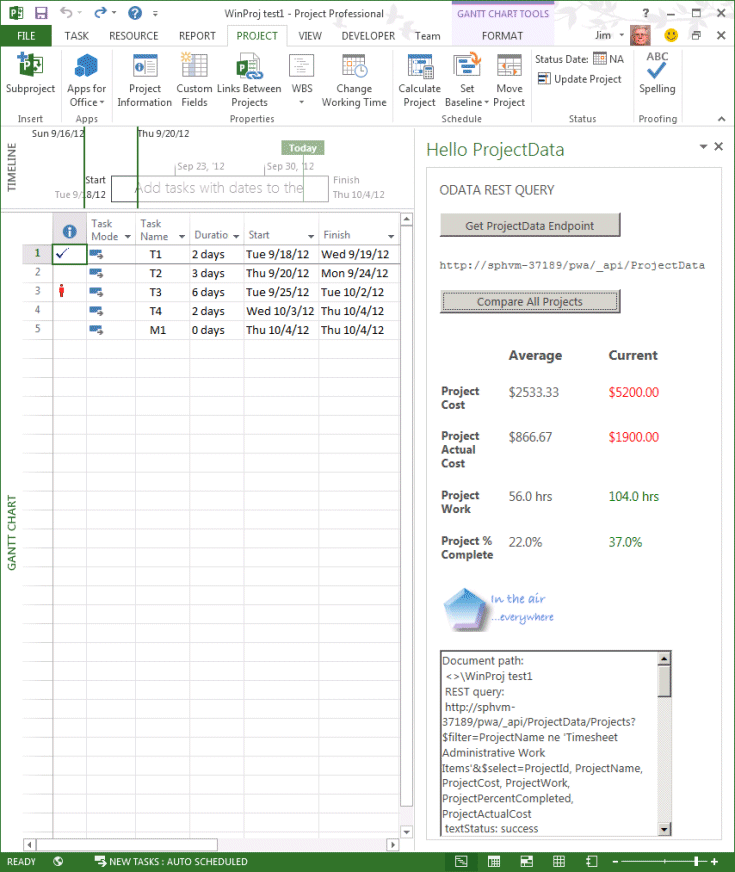
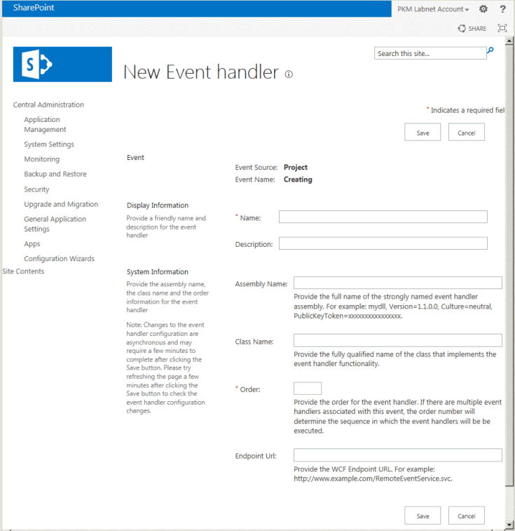

# Updates for developers in Project 2013

Extensibility features in Project Server 2013 work with add-ins for Project Online and with on-premises installations. New features include a client-side object model (CSOM), REST interfaces, an OData service for reporting, remote event receivers, declarative workflows, and task pane add-ins for Project clients. Also learn about deprecated features that should not be used for new development.
  
Project Server 2013 builds on the framework introduced with Microsoft Office Project Server 2007 and extended by Project Server 2010. Project Server 2013 adds a client-side object model (CSOM) that is refactored and simplified from the Project Server Interface (PSI), and includes a JavaScript library and .NET Framework 4 libraries for Windows apps, Windows Phone 8, and Microsoft Silverlight. The CSOM is designed for development for Project Online, and also works with an on-premises Project Server installation. The Project Server databases are combined into a single database; you can access the online reporting tables and views through an OData service. The CSOM and the OData service include a Representational State Transfer (REST) interface. Project Server workflows can be created by using SharePoint Designer 2013. Project Professional 2013 can integrate with Project Server reporting data, SharePoint task lists, and other external content by using the Office Add-ins extensibility model for task panes. Project Standard 2013 can use task pane add-ins to integrate with general external content.
  
For diagrams and more information about major changes in Project Server 2013, see [Project Server 2013 architecture](project-server-2013-architecture.md).
  
> [!NOTE]
> Project Server 2013 is built on the SharePoint Server 2013 platform, and Project 2013 includes much of the same infrastructure as the other Office 2013 applications. For documentation of the model for SharePoint Add-ins, SharePoint-based workflows, Web Parts, development with other SharePoint features, and documentation of Office Add-ins, see [Office and SharePoint Add-ins](http://msdn.microsoft.com/library/fp161507%28office.15%29.aspx) and [SharePoint 2013 development overview](http://msdn.microsoft.com/library/jj164084%28office.15%29.aspx). 
  
## Major new features in Project 2013
<a name="pj15_WhatsNew_MajorNewFeatures"> </a>

New features in Project Standard 2013 and Project Professional 2013 include an improved user interface that matches other Office 2013 applications and supports the modern style user interface in Windows 8, integration with Office Art objects for reports, burndown reports, and new programmability features for reports. Project Professional 2013 enables more extensive sharing and synchronizing projects on SharePoint Server 2013, along with the task pane add-ins that are also implemented in other Office 2013 applications such as Word, Excel, and Outlook.
  
There are many new features in Project Server 2013. Some do not have a major programmability story, such as the new timeline in Project Web App. Those features will be documented in the product help and end-user documentation on Microsoft Office Online and in topics targeted at administrators and IT professionals on Microsoft TechNet. Other new features, such as improved timesheets, make it easier for third-party developers to interact with timesheets and statusing through the Project Server Interface (PSI).
  
The addition of Project Online and the Office Store (http://office.microsoft.com/store) for Project add-ins are far-reaching changes, where Project Server is accessible through Microsoft Azure. Cloud-based access to Project Server uses a client-side object model (CSOM) for development of add-ins with the Microsoft .NET Framework, Microsoft Silverlight, Windows Phone, and web apps that use JavaScript. A requirement of Project Online is that the four Project Server databases of previous versions are merged into one database.
  
Project Server 2013 performance and scalability is improved in many areas such as task status, timesheets, and project management. Project Server workflows are redesigned with version 4 of Windows Workflow Foundation (WF4). Use of the .NET Framework 4 and Windows Communication Foundation (WCF) with the PSI improves security, performance, and scalability. For example, you can change the transport protocol of WCF-based applications by using configuration files, without changing the application code or recompiling. Project Web App caches many of the PSI calls where data does not change significantly.
  
> [!NOTE]
> For development with Project Server 2013, you can use Visual Studio with the Office and SharePoint tools extensions, which can natively create add-ins for the Office 2013 products. Project Server 2013 requires Visual Studio to fully enable development of features such as project detail pages and WCF-based applications. The SharePoint tools extensions in Visual Studio can deploy Web Parts and other SharePoint features directly to Project Web App and other SharePoint sites. > Visual Studio is no longer required to develop Project Server workflows that use custom fields, stages, phases, and enterprise project types that can be managed in Project Web App. Although you can use Visual Studio to develop workflows, they are often easier and quicker to create by using SharePoint Designer. Visual Studio can be used for workflows that require access to the CSOM or other external APIs. 
  
### Project add-ins
<a name="pj15_WhatsNew_Apps"> </a>

Distribution and marketing of software has been revolutionized with the concept of an add-in. For Project 2013, add-ins can be made available for purchase and download from the public Office Store or distributed within a private catalog on SharePoint. An add-in is typically a self-contained, interactive program that performs a small number of related tasks. A Project add-in can be a task pane add-in for the Project Standard 2013 or Project Standard 2013 clients, or an add-in for Project Server 2013 or Project Online.
  
For information about add-ins for the Project desktop clients, see [Task pane add-ins in Project](#pj15_WhatsNew_Agave). For a Project Server 2013 example, see [Create a SharePoint-hosted Project Server add-in](create-a-sharepoint-hosted-project-server-add-in.md). In addition to articles in the [Office and SharePoint Add-ins SDK](http://msdn.microsoft.com/library/fp161507.aspx), the [Office Blog](https://blogs.office.com/dev/) has many posts that are also relevant to Project 2013 and Project Online. 
  
An add-in for Project Server 2013 can work with both an on-premises installation and Project Online. Project Server add-ins can include Web Parts, remote event receivers, and business logic. Access to the Project Server object model in an add-in is through the CSOM, not the PSI. Data storage can be cloud-based such as with SQL Azure, external such as through Microsoft Business Connectivity Services (BCS), internal with a local database, or mixed.
  
 **Add-in security** In general, actions that an add-in takes are performed on behalf of the user who runs the add-in; you do not explicitly use impersonation or specify who can run the add-in. Actions cannot exceed the permission level of the user who runs the add-in. 
  
In Office Developer Tools for Visual Studio 2012, the AppManifext.xml file has a graphical editor where you can set the permission request scope. For example, to create an add-in that enables project managers to update their projects, on the **Permissions** tab of the **AppManifest.xml** designer pane, select **Multiple Projects** for the scope and **Write** for the permission. If the add-in user has project manager permissions, she can run the add-in for projects that she manages. The code in the AppManifest.xml file would include the following: 
  
```XML
  <AppPermissionRequests>
    <AppPermissionRequest Scope="http://sharepoint/projectserver/projects" Right="Write" />
  </AppPermissionRequests>
```

**Table 1. Permission request scopes for Project Server add-ins**

|**Scope**|**Permissions**|
|:-----|:-----|
|**Project Server** <br/> |**Manage** (Requires Project Server administrator permissions.)  <br/> |
|**Multiple Projects** <br/> |**Read**, **Write** (Requires project manager permissions for some operations; project team member permissions for basic read operations, such as task assignments.)  <br/> |
|**Single Project** <br/> |**Read**, **Write** (Requires at least project team member permissions; access to some data in a project depends on other permission levels.)  <br/> |
|**Enterprise Resources** <br/> |**Read**, **Write** (Requires resource manager permissions.)  <br/> |
|**Statusing** <br/> |**SubmitStatus** (Requires permission to submit status for your projects.)  <br/> |
|**Reporting** <br/> |**Read** (Requires permission to log on Project Server.)  <br/> |
|**Workflow** <br/> |**Elevate** (Requires permission to run workflows. The add-in runs with elevated permissions, to enable transitions from stage to stage in a workflow. Business logic in the add-in controls stage transitions.)  <br/> |
   
> [!NOTE]
> Project Server 2013 and Project Online do not use the app-only authentication model in SharePoint 2013 (see [Add-in authorization policy types in SharePoint 2013](http://msdn.microsoft.com/library/124879c7-a746-4c10-96a7-da76ad5327f0%28Office.15%29.aspx)). 
  
For information about developing, distributing, hosting, and managing add-ins, see [SharePoint Add-ins](http://msdn.microsoft.com/library/cd1eda9e-8e54-4223-93a9-a6ea0d18df70%28Office.15%29.aspx) and [Office Add-ins](http://msdn.microsoft.com/library/1e123201-6e70-45c1-a48c-d5b955896ddb%28Office.15%29.aspx), and related topics in the SharePoint Server 2013 and Office 2013 developer documentation. For information about permission request scope for other SharePoint add-ins, see [Add-in permissions in SharePoint 2013](http://msdn.microsoft.com/library/5f7a8440-3c09-4cf8-83ec-c236bfa2d6c4%28Office.15%29.aspx).
  
### Integrating with SharePoint Server
<a name="pj15_WhatsNew_IntegrationWSS"> </a>

Many features in Project Web App require the new infrastructure in SharePoint Server 2013 such as OAuth and claims-based authentication, Project Server authorization and permissions through SharePoint groups, synchronization of projects with SharePoint task lists, and Project Server declarative workflows. The Project Service Application can be associated with any site collection in a SharePoint farm. Project synchronization can be with a SharePoint task list, where SharePoint maintains the project. An enterprise project can also be synchronized with a SharePoint task list, where Project Server maintains full control. For architectural diagrams and an explanation of project synchronization, see [Project Server 2013 architecture](project-server-2013-architecture.md).
  
There are many new features in SharePoint Server 2013. For more information, see [SharePoint for developers](http://msdn.microsoft.com/en-US/sharepoint).
  
### Integrating with workflows
<a name="pj15_WhatsNew_Workflow"> </a>

Workflows are a core feature of project portfolio management. A project life cycle can include long-running processes that span many phases. Governance phases include project proposals, analyses of business impact, and selecting, creating, planning, managing, and tracking projects.
  
Project Server 2013 workflows are built on the SharePoint 2013 workflow platform, which uses WF4. Unlike in previous versions, declarative workflows for Project Server 2013 can be created by using SharePoint Designer 2013 and are accessible for both on-premises and online use. Project Server workflows use the SharePoint workflow security model with OAuth, and can be installed on a Project Web App site. Figure 1 shows that SharePoint Designer 2013 can add stages to a site workflow for Demand Management, where the stages are defined in Project Web App.
  
**Figure 1. Using SharePoint Designer to add a stage to a workflow for Project Web App**


  
You build a declarative workflow by adding workflow stages, actions, conditions, and other elements in a design tool, which can be either SharePoint Designer 2013 or Visual Studio 2012. The design tool then saves the workflow as XAML code, which is interpreted at runtime. Declarative workflows can run either in Project Server 2013 on-premises or in Project Online. By using Visual Studio 2012, you can also build custom actions and forms for additional control, and save workflow templates for reuse with multiple Project Web App instances. SharePoint Designer 2013 can consume custom actions that are created in Visual Studio 2012.
  
A Project Server 2013 workflow acts as an app, where an administrator—who has design permissions for Project Web App—can publish a declarative workflow and associate it with an enterprise project type (EPT). The EPT must be for an enterprise project, where Project Server maintains full control. A SharePoint task list cannot use a Project Server workflow. 
  
OAuth enables project managers who have project creation permissions to invoke the workflow without using impersonation. Workflow calls to Project Server, for example to read a custom field value to decide which branch to follow, are made on behalf of the project manager. To prevent the project manager from creating a workflow that automatically advances to the next stage, the call for moving to the next workflow stage runs as the workflow author (the administrator). In contrast, users of legacy Project Server 2010 workflows make impersonated calls through the Workflow Proxy User account to gain administrator access throughout the entire workflow.
  
Although Project Server 2013 on-premises can use compiled WF3.5-based workflows, we recommend that you upgrade legacy workflows to declarative workflows based on WF4. The newer technology is more scalable and robust. Business analysts and PMO staff can create or update workflow designs by using Visio 2013 and implement Project Server workflows without coding by using SharePoint Designer 2013.
  
For information about creating a declarative workflow for Project Web App, see [Getting started developing Project Server workflows](getting-started-developing-project-server-workflows.md). For a comparison of SharePoint Designer and Visual Studio capabilities for workflows, see [Develop SharePoint 2013 workflows using Visual Studio](http://msdn.microsoft.com/en-us/library/office/jj163199.aspx).
  
### Client-side object model
<a name="pj15_WhatsNew_CSOM"> </a>

Programmatic access to Project Online requires a CSOM that is built on the SharePoint CSOM. Project Online authentication will be with OAuth using a Windows Live ID, not Project Server Forms authentication or Windows authentication.
  
Following are the principles and features of the CSOM in Project Server 2013:
  
- The CSOM is designed for ease of use. For example, methods and properties directly use or provide data by name, rather than requiring many GUIDs,  _changeXml_ parameters, or passing around datasets. 
    
- The Project Server CSOM implements a subset of the PSI functionality, based on the most common requirements for third-party solutions.
    
- The CSOM internally calls the PSI, but is factored differently. For example, updates for all statusing changes are done through the **StatusAssignmentCollection.SubmitAllStatusUpdates** method, not by the **Statusing.SubmitStatus** PSI method for the user or the **SubmitStatusForResource** method for other resources. 
    
- The CSOM is accessible through one WCF service (Client.svc), rather than through the 22 public services of the PSI.
    
- Initialization of the Project Server CSOM is directly through the [ProjectContext](https://msdn.microsoft.com/library/Microsoft.ProjectServer.Client.ProjectContext.aspx) class with the Project Web App URL, not by using a WCF reference or proxy assembly. 
    
- The CSOM implements multiple client libraries and interfaces, which are supported by the internal SharePoint CSOM infrastructure. The client libraries and interfaces include the following:
    
  - Microsoft .NET client library in the Microsoft.ProjectServer.Client.dll assembly
    
  - Silverlight library in the Microsoft.ProjectServer.Client.Silverlight.dll assembly
    
  - Windows Phone 8 library in the Microsoft.ProjectServer.Client.Phone.dll assembly
    
  - JavaScript library for web applications in the PS.js file or PS.debug.js file
    
  - REST endpoints, for access with the OData protocol
    
  - Native support for LINQ queries with filtering, to limit the amount of data that is returned
    
- The CSOM can be used both for Project Online solutions and for on-premises solutions, independently of the PSI and other Project Server assemblies such as Microsoft.Office.Project.Server.Library.dll.
    
- Additional functionality of the Project Server 2013 CSOM may be considered for cumulative updates and service packs, based on requests by Project Server partners and the developer community.
    
> [!NOTE]
> The CSOM is the preferred interface for third-party Project Server developers. We recommend that you use the CSOM for developing new applications, if the CSOM includes the functionality that your application requires. 
  
For information about developing with the CSOM, see [Client-side object model (CSOM) for Project 2013](client-side-object-model-csom-for-project-2013.md). For information about the REST interface in SharePoint applications, see  *Programming using the SharePoint REST service*  in the SharePoint 2013 developer documentation. 
  
### Changes in the Reporting database
<a name="pj15_WhatsNew_RDBChanges"> </a>

The four databases in Project Server 2010 are combined into a single Project database in Project Server 2013. The default name of the Project database is ProjectService. Reporting tables and views retain their previous names, and tables and views from the Draft, Published, and Archive databases have the prefixes  `draft`,  `pub`, and  `ver` in the ProjectService database. For example, the published projects table is pub.MSP_PROJECTS. 
  
> [!IMPORTANT]
> Direct access is not supported for the draft ( `draft` prefix), published (  `pub`), and archive ( `ver`) tables and views. Reports should use only the reporting tables and views, which have the  `dbo` prefix. For example, the dbo.MSP_EpmProject table includes the list of projects in the Project Web App instance. > There is nothing to actively prevent you from using direct programmatic database access to update data in any of the tables and views in the Project database. You should be aware that the Project Professional cache, the tables for draft and published data, and the reporting tables all rely on a cache synchronization protocol that can be disrupted by direct data editing. If you damage your Project Server databases or corrupt Project Professional client-side caches by using direct access to change data, be warned that product support won't be able to help! 
  
Project Server 2013 introduces an OData service for online and on-premises access. The online reporting tables and views are exposed only by the OData interface; for on-premises use, you can use the OData interface or directly access the reporting tables and views in the ProjectService database in the SharePoint farm. Project Online does not support a multitenant database. That is, multiple instances of Project Web App each have their own Project database. The OData service internally runs SQL queries on the reporting tables and views, and delivers an XML or JSON payload. For an introduction to the OData service for reporting in Project Server 2013, and for the **ProjectData** schema reference, see [ProjectData - Project OData service reference](projectdataproject-odata-service-reference.md).
  
For general information about OData queries, see [OData: URI conventions](http://www.odata.org/developers/protocols/uri-conventions#FilterSystemQueryOption). For example, you can see all of the projects in an on-premises instance of Project Web App where the project name starts with "Test" by using the following query in a browser. Right-click in the browser page, and then click **View source**.
  
```HTML
http://ServerName /ProjectServerName /_api/ProjectData/Projects?$filter=startswith(ProjectName, 'Test') eq true
```

To import project data into PowerPivot in Excel 2013, on the DATA ribbon, select **From OData data feed** in the **From Other Sources** drop-down menu. In the **Data Connection Wizard** dialog box, type http://ServerName/ProjectServerName/_api/ProjectData/ in the data feed location, choose **Next**, and then select the **Projects** table in the **Select Tables** page of the wizard. Name and save the .odc file, and then choose **Finish**. In the **Import Data** dialog box, choose **PivotTable Report**. On the Excel worksheet, choose fields for the pivot table rows and columns that you want to show.
  
On-premises Project Server users, who have the correct permissions, can directly access the reporting tables and views through Microsoft SQL Server to create reports, as they do in Project Server 2010. In Project Server 2013, users can also access the on-premises reporting tables through the OData interface. You can retrieve Project Server data online or on-premises through REST endpoints for the OData service. For example, the dbo.MSP_PROJECT table and the dbo.MSP_EpmProject_UserView view can be used for reports. Any tables or views that have a  `draft`,  `pub`, or  `ver` prefix are for internal use by Project Server only, and are not for reporting use. For example, the draft.MSP_TASKS table and the pub.MSP_PROJECTS_WORKING_VIEW view are not documented and are for internal use only. 
  
> [!NOTE]
> You can extend on-premises reporting by adding tables, views, fields, and stored procedures in a separate database. You should not modify the existing reporting tables and views in the Project Server database. 
  
The reporting tables, views, and fields in the Project database will be documented in an HTML Help file in a later update of the Project 2013 SDK download. For documentation of the OData XML schema for the **ProjectData** service, see [ProjectData - Project OData service reference](projectdataproject-odata-service-reference.md). Queries of the reporting tables and views that were created for Project Server 2010 will, in most cases, work with the Project database in Project Server 2013. On-premises users can access the Project Server OLAP cubes in SQL Server Analysis Services, as they currently do. In Project Online, OLAP cubes are not available.
  
### Task pane add-ins in Project
<a name="pj15_WhatsNew_Agave"> </a>

Both Project Standard 2013 and Project Professional 2013 support task pane add-ins, which can be used to integrate with and display external content in a webpage. The task pane shows webpage content that has access through JavaScript to tasks, resources, views, and general project data. The JavaScript object model for Project can get information about a selected task or resource, and can get data in a selected cell in the grid for views such as the Gantt chart. Task pane add-ins for Project can also implement event handlers for task, resource, or view selection changed events. 
  
Figure 2 shows the **Hello ProjectData** task pane add-in that queries the **ProjectData** service, and then compares data in the current project with the averages for all projects. The Project 2013 SDK download includes the complete source code for the add-in. 
  
**Figure 2. A task pane add-in in Project Professional can access data in Project Server**


  
> [!NOTE]
> Project Standard 2013 cannot directly integrate with Project Server 2013 through task pane add-ins. 
  
Task pane add-ins in Project Professional can support Web Parts that are built for Project Server 2013, so developers can build an extension once that runs with both Project Web App and Project Professional. General task pane add-ins that are developed for other Office 2013 products can also be used with Project Standard 2013 and Project Professional 2013. For more information, see [Task pane add-ins for Project](task-pane-add-ins-for-project.md).
  
### Project Server event receivers
<a name="pj15_WhatsNew_Events"> </a>

There can be multiple Project Web App servers (also called web front end servers, or WFEs) in a SharePoint farm that includes the back-end Project Service Application. Event receivers can also be called event handlers. Local event handlers can be implemented with full-trust code and deployed on all of the WFEs for a local Project Server installation. Remote event receivers can be implemented in web services on local or remote servers and accessed by multiple WFEs and multiple Project Server installations. Project Online can use only remote event receivers.
  
Project Server event handlers are managed by SharePoint for each Project Web App instance, rather than by a specific Project Web App Settings page. In the SharePoint Central Administration application, choose **General Application Settings**, choose **Manage** under **PWA Settings**, and then choose the instance in the **Project Web App Instance** drop-down list on the PWA Settings page. To add a local event handler or a remote event receiver, choose **Server Side Event Handlers**.
  
For an on-premises installation of Project Server, you can create a remote event receiver as a SharePoint feature that uses the [Microsoft.ProjectServer.Client.EventHandlerCreationInformation](https://msdn.microsoft.com/library/Microsoft.ProjectServer.Client.EventHandlerCreationInformation.aspx) class in the CSOM, and then programmatically manage the event receiver by using methods in the [EventHandlerCollection](https://msdn.microsoft.com/library/Microsoft.ProjectServer.Client.EventHandlerCollection.aspx) class. For remote event receivers, pre-events are synchronous, post-events are asynchronous, and there is a timeout for cases where the remote event receiver does not return. 
  
> [!NOTE]
> SharePoint Central Administration is available only for on-premises installations. For Project Online and SharePoint Online, you can add or remove remote event receivers by using a CSOM-based app package. 
  
On the Server Side Event Handlers page, the process to add a local event handler for an on-premises Project Server installation is nearly the same as the process described in the [How to: Create a Project Server event handler and log an event](http://msdn.microsoft.com/en-us/library/gg615466.aspx) topic for Project Server 2010. The difference is that the New Event Handler page has additional options. For example, choose **Project Creating** in the **Events** list, and then choose **NEW EVENT HANDLER**. On the New Event handler page, the only two required fields are **Name** and **Order** (see Figure 3). If you are adding a local full-trust event handler, add the **Assembly Name** field and the **Class Name** field; leave **Endpoint Url** empty. If you are adding a remote event receiver, add **Endpoint Url**, and leave **Assembly Name** and **Class Name** empty. 
  
> [!CAUTION]
> If you specify  *both*  the assembly name/class name, and the endpoint URL, Project Server calls only the local (on-premises) event handler. The remote event receiver is ignored. > If you create two event handlers for the same event, where one event handler is local and one is a remote event receiver, and the **Order** value is the same for both, Project Server ignores the remote event receiver. 
  
**Figure 3. Adding a local event handler or a remote event receiver**


  
If you require access to PSI datasets for a local event handler, you can copy the Microsoft.Office.Project.Schema.dll assembly from the  `[Windows]\Microsoft.NET\assembly\GAC_MSIL\Microsoft.Office.Project.Schema\v4.0_15.0.0.0__71e9bce111e9429c` directory. Instead of the PSI, we recommend that you use the event classes in the **Microsoft.ProjectServer.Client** namespace; development with the CSOM does not require manipulation of datasets. To develop remote event receivers for Project Online, you must use the [Event](https://msdn.microsoft.com/library/Microsoft.ProjectServer.Client.Event.aspx) class and the [EventHandlerCreationInformation](https://msdn.microsoft.com/library/Microsoft.ProjectServer.Client.EventHandlerCreationInformation.aspx) class in the CSOM. 
  
Before you deploy a Project Server event handler, install and test the event handler thoroughly on a test installation of Project Server. For an on-premises Project Server installation, if the local event handler that you add becomes inoperative, the Project Server 2013 Events Service fails to load the other valid custom event handlers. In that case, you must remove the problem event handler and restart the Events service.
  
> [!NOTE]
> For an on-premises Project Server installation, we recommend that you migrate to remote event receivers by using the CSOM to develop event receivers. Because remote event receivers do not have third-party code running within the Project Server Events Service, remote event receivers are more stable. Local administrators are relieved of the responsibility for maintaining the Project Server Events Service. 
  
For general information about events, see [Handling events in apps for SharePoint](http://msdn.microsoft.com/en-us/library/jj220048%28office.15%29.aspx). 
  
## Deprecated features
<a name="pj15_WhatsNew_Deprecated"> </a>

> [!NOTE]
> For information about features and APIs that are deprecated or removed in Project Server 2016 Preview, see [What's deprecated or removed in Project Server 2016 Preview](https://technet.microsoft.com/library/mt422816%28v=office.16%29.aspx). 
  
Deprecated features are still available in Project 2013 for some solutions, but should not be used for new development. Most of the following features and practices do not work with Project Online, or with the default on-premises installation of Project Server 2013 in SharePoint permission mode. Existing solutions that use these features may not work for an upgrade of Project Server 2010 to Project Server 2013. Although solutions that use deprecated features may continue to work in some cases, they are not fully supported for all Project 2013 installations.
  
If your solutions use deprecated features, they should be tested thoroughly before deployment, and you should modify them to use supported features as soon as is practical. For information about configuring on-premises Project Server 2013 security for Project permission mode, see the  *SharePoint Permission Mode*  section in [What's new for IT pros in Project Server 2013](http://technet.microsoft.com/en-us/library/ff631142%28office.15%29.aspx).
  
 **Extensions**[PSI extension scenarios](https://msdn.microsoft.com/library/office/ff843378%28v=office.14%29.aspx) are deprecated, and will not be supported in future releases. These on-premises Project Server 2013 scenarios enabled integration by using custom Windows Communication Foundation (WCF) services. 
  
 **Project PSI** The [Project class](https://msdn.microsoft.com/library/office/websvcproject.project_di_pj14mref.aspx%28Office.15%29.aspx) of the PSI is deprecated. For all new development, use the [Project CSOM](https://msdn.microsoft.com/library/office/microsoft.projectserver.client_di_pj14mref.aspx%28Office.15%29.aspx). Project Server 2013 apps that use the Project PSI will continue to work, but Project Online apps will need to replace any Project-class PSI methods with their equivalent CSOM methods.
  
 **Resource Plan PSI** The [Resource Plan PSI](https://msdn.microsoft.com/library/office/websvcresourceplan_di_pj14mref.aspx) is deprecated. It will continue to be supported for Project 2013 development, but will not be supported in future releases. 
  
 **ASMX interface for the PSI** The PSI includes duplicate interfaces for developing on-premises Project Server extensions. The ASMX web services interface was introduced with the first implementation of the PSI in Office Project Server 2007. Project Server 2010 added the WCF services interface, where the object model essentially duplicates the ASMX web services. Although Project Server 2013 continues to support both ASMX and WCF, new solutions that require the PSI should use the WCF services. If possible, new solutions should be written using the CSOM. 
  
The ASMX web services of the PSI are deprecated in Project Server 2013. To work in future Project Server versions, solutions that use the ASMX web services must be rewritten to use either the WCF services or the CSOM. For more information, see the  *Upgrading applications with the Project Server APIs*  section in [Project Server programmability](project-server-programmability.md).
  
 **Object Link Provider (OLP)** In previous versions of Project Server, the **ObjectLinkProvider** service in the PSI (see [WebSvcObjectLinkProvider](https://msdn.microsoft.com/library/WebSvcObjectLinkProvider.aspx) ) provides a way to manage web object links between enterprise project tasks and specialized SharePoint lists in the project site for issues, risks, deliverables, and documents. In Project Server 2013, the OLP is deprecated. 
  
You can use the **[RelatedItemManager](http://msdn.microsoft.com/en-us/library/microsoft.sharepoint.client.relateditemmanager.aspx)** class in the SharePoint CSOM to create, read, and delete web object links between items in the tasks list and the other lists in a project site. For example, to add a link from a task item to an issue, you can use the **[AddSingleLink](http://msdn.microsoft.com/en-us/library/office/microsoft.sharepoint.client.relateditemmanager.addsinglelink.aspx)** method or either of two similar methods, **AddSingleLinkFromUrl** or **AddSingleLinkToUrl**. The **RelatedItemManager** class also includes methods for deleting a web object link and reading related items. For the equivalent class in the JSOM (the JavaScript object model), see [SP.RelatedItemManager object (sp.js)](http://msdn.microsoft.com/en-us/library/jj838582.aspx).
  
We recommend that you use the SharePoint CSOM to create OLP-type apps for an on-premises installation of Project Server 2013 and for Project Online. The [Microsoft.SharePoint](http://msdn.microsoft.com/en-us/library/microsoft.sharepoint.aspx) namespace does not include a **RelatedItemManager** **** class. 
  
 **Custom permissions** Custom security permissions to access specific Project Server features or extensions were supported in Office Project Server 2007, where an SDK article explained how to create them by directly modifying the Published database. In Project Server 2010, custom permissions still work but are deprecated. In Project Server 2013, custom permissions do not work with the default SharePoint permission mode for on-premises installations. For the Project permission mode, custom permissions are supported. With Project Online, direct database access is not possible. 
  
 **Impersonation** Impersonation in PSI-based apps, where the user of an app can assume the security permissions of a different Project Server user, is deprecated in Project Server 2013. As previously indicated, a default on-premises Project Server 2013 installation uses SharePoint permission mode, which does not allow impersonation in the Project Server security groups. For more information, see [Authentication, authorization, and security in SharePoint 2013](http://msdn.microsoft.com/en-us/library/ms457529%28office.15%29.aspx).
  
Statusing applications are typical extensions that might have used impersonation in previous versions of Project Server. Project Server 2010 introduced the **ReadStatusForResource** method and the **SubmitStatusForResource** method in the PSI, along with the **StatusBrokerPermission** global permission, which eliminated the need for impersonation to read and update status on behalf of another user. The CSOM in Project Server 2013 uses the underlying PSI to transparently enable statusing extensions, and can be used for either Project Online or on-premises installations. 
  
 **Reporting database extensions** Adding custom tables and views to the Reporting database is a common practice with previous versions of Project Server. Because Project Server 2013 combines the four databases of previous versions into one database, upgrades do not transfer custom tables, views, or SPROCs to the reporting tables in the Project Server 2013 database. 
  
We recommend that you use either SQL Azure or a separate SQL Server database for custom reporting tables and views, where you can manage database backups and updates. For Project Online, this is required.
  
 **Reporting** The local reporting tables and views in the Project Server database, and the OLAP cubes, are  *not*  deprecated, and remain fully supported. However, the reporting tables and views (the Reporting database in previous Project Server versions) are not accessible in Project Online. Similarly, OLAP cubes are available only with on-premises installations of Project Server 2013. For reporting applications with Project Online, you can use the **ProjectData** service, through REST queries with the OData protocol. 
  
 **Project Guide** The Project Guide is a standard feature in the Office Project 2007 desktop applications, where HTML and JavaScript content in a task pane provides interactive guidance for creating and managing projects. In Project 2010, the Project Guide is not available in a default installation, but can be enabled through VBA or a VSTO add-in. The Project 2010 SDK download includes the modified Project Guide files. 
  
The VBA object model and the **Microsoft.Office.Interop.MSProject** object model in Project 2013 still include the 22 members of the **Application** class and the **Project** class that can manage the Project Guide. However, Project 2013 task pane apps may conflict with actions in a Project Guide task pane and Project Guide contents cannot be easily distributed or sold in the Office Store. We strongly recommend that you develop Project task pane solutions with Office Add-ins, not custom Project Guide content. For more information about the Project Guide, see the [Project 2010 SDK Documentation](http://msdn.microsoft.com/en-us/library/ms512767.aspx).
  
## Comparing Project Server on-premises with Project Online
<a name="pj15_WhatsNew_Comparing"> </a>

To help you decide whether to use Project Server on-premises or Project Online, and what kinds of extensions you can develop in either case, Table 2 compares the extensible features of an on-premises installation of Project Server 2013 with Project Online. Table 2 does not include differences in deployment, administration, or usage. For more information about Project Online and Project Server 2013, see [Project 2013 for developers](http://msdn.microsoft.com/en-US/office/fp161502) and [Project Online](http://www.microsoft.com/project/).
  
**Table 2. Extensibility of Project Server on-premises and Project Online**

|**Feature**|**Project Server on-premises**|**Project Online**|
|:-----|:-----|:-----|
|**Programmability** <br/> | CSOM-based apps; consistent programming model  <br/>  .NET, Silverlight, Windows Phone client libraries  <br/>  JavaScript library for custom pages, Web Parts, and ribbon extensions  <br/>  OData and REST protocols  <br/>  PSI-based apps; complex programming model, can also create apps for administration, portfolio analysis, notifications, Project mode security, queue system, and other areas  <br/>  PSI extensions  <br/>  Custom permissions with Project mode security (deprecated)  <br/>  Impersonation with the PSI (deprecated)  <br/>  Full-trust code; install extensions in SharePoint farm  <br/> | CSOM-based apps; consistent programming model  <br/>  .NET, Silverlight, Windows Phone client libraries  <br/>  JavaScript library for custom pages, Web Parts, and ribbon extensions  <br/>  OData and REST protocols  <br/>  Can use the PSI, but not supported: no OAuth and no service-to-service connections  <br/>  No extensions of the CSOM API  <br/>  No custom permissions  <br/>  No impersonation  <br/>  No full-trust code  <br/> |
|**Custom databases** <br/> | SQL Azure  <br/>  SQL Server (modification of reporting tables and views in the Project Server database is not supported)  <br/> | SQL Azure  <br/>  SQL Server (modification of reporting tables and views in the Project Server database is not supported)  <br/> |
|**Reporting** <br/> |**ProjectData** service; OData and REST protocols  <br/>  Reporting tables and views in the Project Server database  <br/>  OLAP database  <br/> |**ProjectData** service; OData and REST protocols  <br/> |
|**Event handlers** <br/> | Remote event receivers, accessible through WCF endpoints  <br/>  Full-trust event handlers, installed in SharePoint farm  <br/> | Remote event receivers, accessible through WCF endpoints  <br/> |
|**Workflows** <br/> | Declarative workflows, created with SharePoint Designer 2013  <br/>  Use only on a specific Project Web App instance  <br/>  Can import a workflow design from Visio 2013  <br/>  Can import and use custom actions  <br/>  Declarative workflows, created with Visual Studio 2012  <br/>  Create an app that can include workflows  <br/>  Create a SharePoint solution package (.wsp) that can include workflows  <br/>  Create workflow templates for reuse  <br/>  Create and use custom actions  <br/>  Can use legacy compiled workflows, created with WF3.5 (recommend upgrade to declarative WF4 workflow)  <br/> | Declarative workflows, created with SharePoint Designer 2013  <br/>  Use only on a specific Project Web App instance  <br/>  Can import a workflow design from Visio 2013  <br/>  Can import and use custom actions  <br/>  Declarative workflows, created with Visual Studio 2012  <br/>  Create an app that can include workflows  <br/>  Create a SharePoint solution package (.wsp) that can include workflows  <br/>  Create workflow templates for reuse  <br/>  Create and use custom actions  <br/> |
|**Distribution** <br/> | Office Store (for CSOM-based apps)  <br/>  Private app catalog on SharePoint  <br/>  Intranet file share  <br/> | Office Store  <br/>  Private app catalog on SharePoint  <br/> |
||||
   
## Conclusion
<a name="pj15_WhatsNew_Conclusion"> </a>

Project Server 2013 provides a wealth of new development capabilities and scenarios that partners and customers can use to adapt and extend the capabilities and usefulness of Project Server in large enterprises and in small organizations. You can use the infrastructure for Office 2013 and SharePoint 2013 to help create and distribute apps for Project 2013 that can greatly extend the marketability and use of custom applications. Some extensibility features and practices of previous versions are deprecated in Project 2013, particularly the ASMX web services of the PSI and features that involve impersonation or direct database changes, which cannot be used with Project Online.
  
The introduction of the CSOM enables programmatic access to Project Online for a wide variety of devices and by using JavaScript in web applications. The CSOM provides a more consistent programming model compared to the PSI. Project Server data can be accessed in many more ways than in previous versions, including through the online OData service and through REST endpoints for reporting data in the Project database. Existing reports still work in the same way for on-premises use; new reports have more flexibility.
  
Office Add-ins provide a new avenue for selling solutions and integrating Project Standard 2013 with web content and other Office 2013 products. You can also create new ways to integrate Project Professional 2013 with Project Server data and SharePoint lists through task pane Office Add-ins.
  
For more information about developing apps, and using the programmability features and the CSOM of SharePoint Server 2013, see [SharePoint for developers](http://msdn.microsoft.com/en-US/sharepoint) and [Office for developers](http://msdn.microsoft.com/en-US/office).
  
## Additional resources
<a name="pj15_WhatsNew_AR"> </a>

- [Project Server 2013 architecture](project-server-2013-architecture.md)
    
- [Project programming tasks](project-programming-tasks.md)
    
- [Client-side object model (CSOM) for Project 2013](client-side-object-model-csom-for-project-2013.md)
    
- [ProjectData - Project OData service reference](projectdataproject-odata-service-reference.md)
    
- [Task pane add-ins for Project](task-pane-add-ins-for-project.md)
    
- [OData: URI conventions](http://www.odata.org/documentation/uri-conventions#FilterSystemQueryOption)
    
- [SharePoint for developers](http://msdn.microsoft.com/en-US/sharepoint)
    
- [Office for developers](http://msdn.microsoft.com/en-US/office)
    
- [Handling events in apps for SharePoint](http://msdn.microsoft.com/en-us/library/jj220048%28office.15%29.aspx)
    
- [Office Store](http://office.microsoft.com/en-us/store/)
    
- [Project Online](http://www.microsoft.com/project/)
    

