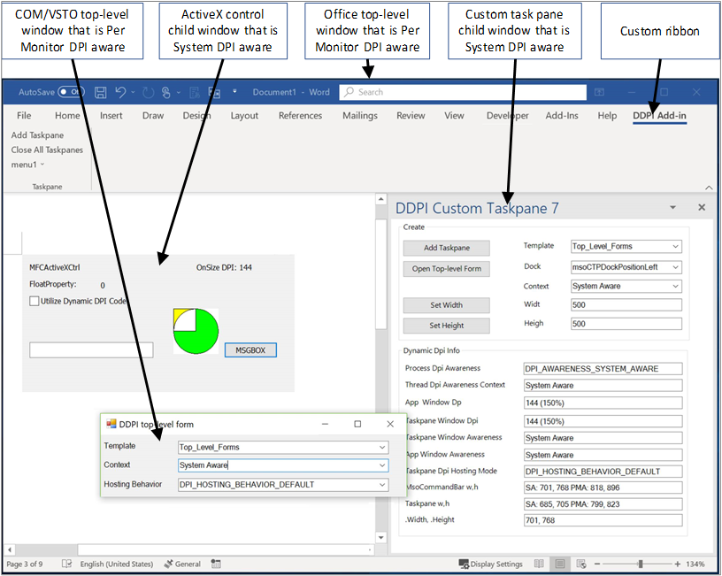
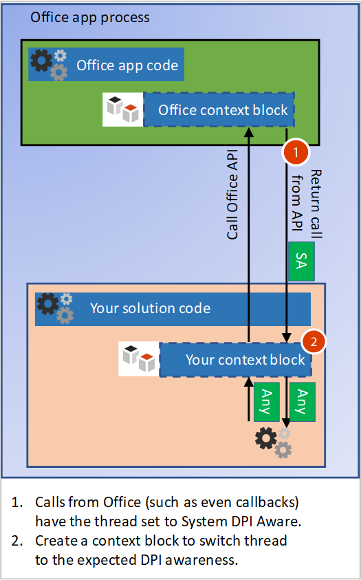
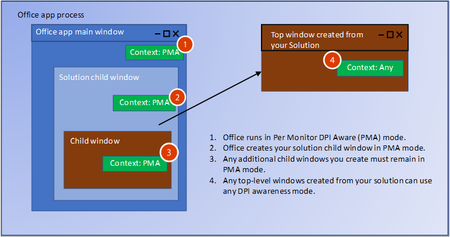
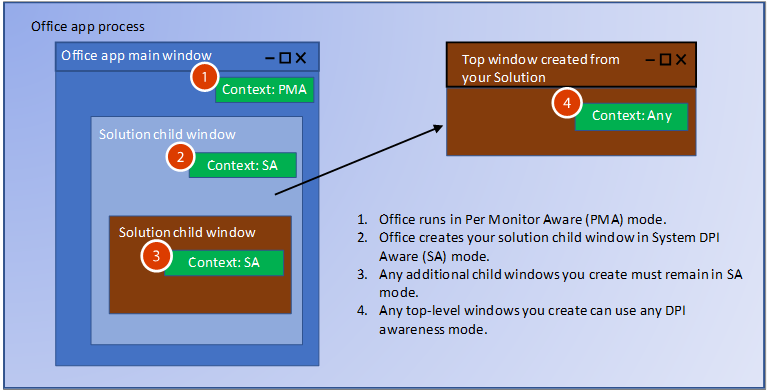

# Handle high DPI and DPI scaling in your Office solution

Many computer and display configurations now support high DPI (dots-per-inch) resolutions, and can connect multiple monitors with different sizes and pixel densities. This requires applications to adjust when the user moves the app to a monitor with a different DPI, or changes the zoom level. Applications that don’t support DPI scaling might look fine on low DPI monitors, but will look stretched and blurry when shown on a high DPI monitor. 

Office 2016 applications, such as Word and Excel, have been updated to respond to changes in scale factor. However, your Office solution must also respond to changes to draw correctly when the DPI changes. This article describes how Office supports dynamic DPI, and what steps you can take to ensure the best viewing experience for your Office extensibility solution to handle DPI scaling. 

## DPI scaling symptoms in your solution

Windows applies DPI scaling when an application is moved from one display to another display with a different DPI. This happens in scenarios such as dragging an application to a different monitor or docking your laptop. If your Office solution is adversely affected by DPI scaling, you will see one or more of the following symptoms:

- The windows draw in the wrong location or have incorrect sizing.
- Elements such as buttons and labels appear in the wrong location in your solution’s window.
- Fonts and images appear too small, too large or in the wrong location.

The following types of Office solutions can be affected by DPI scaling:

- VSTO Add-ins
- Custom task panes
- COM Add-ins
- ActiveX controls
- Ribbon extensions
- Ole servers
- Office web add-ins

## Windows DPI awareness modes

Throughout this article we’ll refer to the DPI awareness modes that Windows supports. Each DPI awareness mode supports different capabilities, as described in the following table. This is a simplified description of the modes to explain how Office solutions support them. For more information about the DPI awareness modes, see [High DPI Desktop Application Development on Windows](https://docs.microsoft.com/en-us/windows/desktop/hidpi/high-dpi-desktop-application-development-on-windows).

|Mode  |Description  |When DPI changes  |
|---------|---------|---------|
|DPI unaware     |    Application always renders as if it is on a display with a DPI value of 96.     |    Application is bitmap stretched to expected size on primary and secondary displays.    |
|System DPI aware     |   Application detects the DPI of the primary connected monitor at Windows login but cannot respond to DPI changes. For more information, see Configure Windows to fix blurry apps section in this article.      |     Application is bitmap stretched when moved to a new display with a different DPI.    |
|Per Monitor DPI aware     |    Application is capable of redrawing itself correctly when the DPI changes.     |    Windows will send DPI notifications to top-level windows in the application so that it can redraw when the DPI changes.     |
|Per Monitor v2     |   Application is capable of redrawing itself correctly when the DPI changes.      |        Windows will send DPI notifications to both top-level and child windows so that the application can redraw when the DPI changes. |

## How Office supports DPI scaling

The most significant factor in determining how your Office solution can handle DPI scaling is whether your solution is a top-level window, or a child window. The following picture shows a few examples of Office solutions running as top-level or child windows, and which DPI awareness mode they will use on Windows April 2018 Update (1803) and later.



In this image:
- The COM/VSTO top-level window is Per Monitor DPI aware.
- The ActiveX control child window is System DPI aware.
- The Office top-level window is Per Monitor DPI aware.
- The custom task pane child window is System DPI aware.

## Managing thread DPI context

When the host Office app starts, its main thread runs in Per Monitor DPI aware context. When your solution code creates threads, or receives calls from Office, you need to manage the thread DPI context.

### Creating new threads with the correct DPI context

If your solution creates additional threads, Office will force the threads into Per Monitor DPI aware context. If your code expects a different context, you need to use the SetThreadDpiAwarenessContext function to set the expected thread DPI awareness. 

### Build a context block for incoming thread calls



Your solution will interact with its host Office app, so you will have incoming calls to your solution from Office such as event callbacks. When Office calls your solution, it has a context block that forces the thread context to be in System DPI Aware context. You must change the thread context to match the DPI awareness of your window. You can implement a similar context block to switch the thread context on incoming calls. Use the SetThreadDpiAwarenessContext function to change the context to match your window context. 

> [!NOTE]
> Your context block should restore the original DPI thread context before calling other components outside of your solution code.

#### Managed code context block

The following example code shows how to construct your own context block.

``` c#
public struct DPI_AWARENESS_CONTEXT
        {
            private IntPtr value;

            private DPI_AWARENESS_CONTEXT(IntPtr value)
            {
                this.value = value;
            }
            public static implicit operator DPI_AWARENESS_CONTEXT(IntPtr value)
            {
                return new DPI_AWARENESS_CONTEXT(value);
            }

            public static implicit operator IntPtr(DPI_AWARENESS_CONTEXT context)
            {
                return context.value;
            }

            public static DPI_AWARENESS_CONTEXT operator -(DPI_AWARENESS_CONTEXT context, long value)
            {
                return (IntPtr)(context.value.ToInt64() - value);
            }
            public static DPI_AWARENESS_CONTEXT operator -(DPI_AWARENESS_CONTEXT context, int value)
            {
                return (IntPtr)(context.value.ToInt32() - value);
            }

            public static bool operator ==(DPI_AWARENESS_CONTEXT context1, DPI_AWARENESS_CONTEXT context2)
            {
                return context1.value == context2;
            }
            public static bool operator !=(DPI_AWARENESS_CONTEXT context1, DPI_AWARENESS_CONTEXT context2)
            {
                return context1.value != context2;
            }

            public static bool operator ==(IntPtr context1, DPI_AWARENESS_CONTEXT context2)
            {
                return AreDpiAwarenessContextsEqual(context1, context2);
            }
            public static bool operator !=(IntPtr context1, DPI_AWARENESS_CONTEXT context2)
            {
                return !AreDpiAwarenessContextsEqual(context1, context2);
            }

            public override bool Equals(object obj)
            {
                return base.Equals(obj);
            }

            public override int GetHashCode()
            {
                return base.GetHashCode();
            }

            public override string ToString()
            {
                if (this.value == DPI_AWARENESS_CONTEXT_UNAWARE)
                {
                    return "Unaware";
                }
                if (this.value == DPI_AWARENESS_CONTEXT_SYSTEM_AWARE)
                {
                    return "System Aware";
                }
                if (this.value == DPI_AWARENESS_CONTEXT_PER_MONITOR_AWARE)
                {
                    return "Per Monitor Aware";
                }
                if (this.value == DPI_AWARENESS_CONTEXT_PER_MONITOR_AWARE_V2)
                {
                    return "Per Monitor Aware V2";
                }
                return "Unknown";
            }
        }

        private static DPI_AWARENESS_CONTEXT DPI_AWARENESS_CONTEXT_HANDLE = IntPtr.Zero;

        public static readonly DPI_AWARENESS_CONTEXT DPI_AWARENESS_CONTEXT_INVALID = IntPtr.Zero;
        public static readonly DPI_AWARENESS_CONTEXT DPI_AWARENESS_CONTEXT_UNAWARE = DPI_AWARENESS_CONTEXT_HANDLE - 1;
        public static readonly DPI_AWARENESS_CONTEXT DPI_AWARENESS_CONTEXT_SYSTEM_AWARE = DPI_AWARENESS_CONTEXT_HANDLE - 2;
        public static readonly DPI_AWARENESS_CONTEXT DPI_AWARENESS_CONTEXT_PER_MONITOR_AWARE = DPI_AWARENESS_CONTEXT_HANDLE - 3;
        public static readonly DPI_AWARENESS_CONTEXT DPI_AWARENESS_CONTEXT_PER_MONITOR_AWARE_V2 = DPI_AWARENESS_CONTEXT_HANDLE - 4;

        public static DPI_AWARENESS_CONTEXT[] DpiAwarenessContexts =
        {
            DPI_AWARENESS_CONTEXT_UNAWARE,
            DPI_AWARENESS_CONTEXT_SYSTEM_AWARE,
            DPI_AWARENESS_CONTEXT_PER_MONITOR_AWARE,
            DPI_AWARENESS_CONTEXT_PER_MONITOR_AWARE_V2
        };

class DPIContextBlock : IDisposable
    {
        private DPI_AWARENESS_CONTEXT resetContext;
        private bool disposed = false;

        public DPIContextBlock(DPI_AWARENESS_CONTEXT contextSwitchTo)
        {
            resetContext = SetThreadDpiAwarenessContext(contextSwitchTo);
         }

        public void Dispose()
        {
            Dispose(true);
            GC.SuppressFinalize(this);
        }

        protected virtual void Dispose(bool disposing)
        {
            if (!disposed)
            {
                if (disposing)
                {
                    SetThreadDpiAwarenessContext(resetContext);
                }
            }
            disposed = true;
        }
    }
```

#### Native code context block

``` c++
#include <winuser.h>
/* DpiAwarenessContextBlock can be used to simplify setting and resetting the DPI_AWARENESS_CONTEXT of
the current thread.  When the object is constructed, the DPI_AWARENESS_CONTEXT is set, and when the object is
destructed, the DPI awareness context is reverted to the previous awareness context at construct time.

This object allows us to write code such as:

// Thread state is currently DPI_AWARENESS_SYSTEM_AWARE
if (condition)
{
DpiAwarenessContextBlock perMonitorAware(DPI_AWARENESS_PER_MONITOR_AWARE);
... // Create a top-level hwnd with the current thread state, DPI_AWARENESS_PER_MONITOR_AWARE
}
// Thread state automatically returns to DPI_AWARENESS_SYSTEM_AWARE

*/
class DpiAwarenessContextBlock
{
public:
      DpiAwarenessContextBlock(DPI_AWARENESS_CONTEXT dpiContext) noexcept;
      ~DpiAwarenessContextBlock();

      // Copy and move are not to be used with these context objects
      DpiAwarenessContextBlock(const DpiAwarenessContextBlock&) = delete;
      DpiAwarenessContextBlock(DpiAwarenessContextBlock&&) = delete;

private:
      DPI_AWARENESS_CONTEXT m_contextReversalType;
      bool m_doContextSwitch;
};

inline DpiAwarenessContextBlock::DpiAwarenessContextBlock(DPI_AWARENESS_CONTEXT dpiContext) noexcept
{
      m_contextReversalType = SetThreadDpiAwarenessContext(dpiContext);
}

inline DpiAwarenessContextBlock::~DpiAwarenessContextBlock()
{
      SetThreadDpiAwarenessContext(m_contextReversalType);
}
```

## Top-level window management

When Office applications start, a call is made to SetThreadDpiAwarenessContext as DPI_AWARENESS_CONTEXT_PER_MONITOR_AWARE. In this context, DPI changes are sent to the HWND of any top-level windows in the process that are running as Per Monitor DPI aware. Top-level windows are the Office application window, and any additional top-level windows created by your solution. When an Office application is moved to a new display, it gets notified so that it can dynamically scale and draw correctly in the DPI of the new display. Your Office solution can create top-level windows that are in any DPI awareness mode. Your top-level windows can also respond to DPI changes by listening to Windows messages for the changes.

If you create child windows that are parented to your top-level window, you can also set them to any DPI awareness mode. However, if you use Per Monitor DPI aware mode, your child windows will not receive DPI change notifications.  For more information about Windows DPI awareness modes, see High DPI Desktop Application Development on Windows.

## Child window management

When working with ActiveX controls and custom task panes, Office creates the child window for your solution. You can create additional child windows, but you have to be aware of the parent window DPI awareness. Office runs in Per Monitor DPI awareness mode, which means any child windows in your solution will not get DPI change notifications. Only Per Monitor v2 mode supports sending DPI changes to child windows (Office does not support Per Monitor v2). However, for ActiveX controls, there is a workaround. For more information, see the ActiveX controls section later in this article.

> [!NOTE]
> If your child window creates a top-level window, you can use any DPI awareness mode for the new top-level window. For more information about managing top-level windows, see the Top-level window management section in this article.

You will see two different DPI modes applied to your child window, depending on which version of Windows 10 Office is running on.

### Office DPI behavior on Windows Fall Creators Update (1709)

Because Office apps use Per Monitor awareness mode, your solution’s child windows will also be created in Per Monitor DPI awareness mode. This means Windows expects your solution to update when drawing in a new DPI.  Because your window cannot get DPI change notifications, your solution’s UI might be incorrect. 



### Office DPI behavior on Windows April 2018 Update (1803)

With Windows April 2018 (1803) update and later, The Office DPI hosting behavior uses mixed-mode DPI scaling for some scenarios. This allows System DPI Aware windows to be parented to Office windows set to Per Monitor DPI aware. This helps to ensure improved compatibility when the DPI changes when the windows are bitmap stretched. The windows might still be blurry from the bitmap stretching.



When you create new child windows, be sure they match the DPI awareness of their parent window. You can use the GetWindowdpiAwarenessContext function to get the DPI awareness of the parent window. For more information about DPI awareness consistency, see the “Forced reset of process-wide DPI awareness” section in High DPI Desktop Application Development on Windows.

> [!NOTE]
> You can’t rely on the Process DPI Awareness as it might return PROCESS_SYSTEM_DPI_AWARE even when the application main thread DPI awareness context is DPI_AWARENESS_CONTEXT_PER_MONITOR_AWARE. Use the GetThreadDpiAwarenessContext function to get the thread DPI awareness context.

## Office and Windows DPI compatibility settings

When users encounter add-ins or solutions that are not rendering correctly, some compatibility settings can help correct the problem.

### Configure Office to optimize for compatibility

Office has a setting to optimize for compatibility when moving to different DPI scales on different screens. The compatibility mode disables DPI scaling so that everything in Office is bitmap stretched when moved to a display using different DPI scaling. 

The compatibility mode forces Office to run in System DPI aware mode. This causes application windows to bitmap stretch and can have a side effect of a blurry appearance. Your Office solution cannot control this setting because the user chooses it. Using the display compatibility mode solves most drawing problems. For more information, see Office support for high definition displays. 

### Configure Windows to fix blurry apps

Windows 10 (Version 1803) and later has a setting to fix apps so they’re not blurry. This is another setting to try if your solution is not rendering correctly. Your Office solution cannot control this setting because the user chooses it. For more information, see Fix apps that appear blurry in Windows 10.

## How to support DPI scaling in your solution

Some solutions can receive and respond to DPI changes. Some have a workaround if they cannot receive notifications. The following table lists the details for each solution type.

<table>
	<thead>
        <tr>
		    <th>Solution Type</th>
		    <th>Window type</th>
		    <th>Can respond to DPI scaling</th>
		    <th>More details</th>
        </tr>
	</thead>
<tbody>
	<tr>
		<td rowspan="2">VSTO Add-in</td>
		<td>Top and its descendants</td>
		<td>Yes</td>
		<td>See TBD</td>
	</tr>
<tr>
		<td>Child parented to Office window</td>
		<td>No</td>
		<td>See Office compatibility guidance.</td>
</tr>
	<tr>
		<td rowspan="2">Cust task pane</td>
		<td>Child parented to Office window</td>
		<td>No</td>
		<td>See Office compatibility guidance.</td>
	</tr>
<tr>
		<td>Top and its descendants</td>
		<td>Yes</td>
		<td>See top-level window guidance.</td>
</tr>
	<tr>
		<td rowspan="2">COM Add-in</td>
		<td>Top and its descendants</td>
		<td>Yes</td>
		<td>See COM Add-in guidance.</td>
	</tr>
<tr>
		<td>Child parented to Office window</td>
		<td>No</td>
		<td>See Office compatibility guidance.</td>
</tr>
	<tr>
		<td rowspan="2">ActiveX control</td>
		<td>Top and its descendants</td>
		<td>Yes</td>
		<td>See ActiveX control guidance.</td>
	</tr>
	<tr>
		<td>Child parented to Office window</td>
		<td>Yes</td>
	</tr>
	<tr>
		<td>Web Add-in</td>
		<td>NA</td>
		<td>Yes</td>
		<td>See Office web add-in guidance</td>
	</tr>
	<tr>
		<td>Ribbon extension</td>
		<td>NA</td>
		<td>NA</td>
		<td>See Ribbon extension guidance</td>
	</tr>
	<tr>
		<td>OLE server or client</td>
		<td>NA</td>
		<td>NA</td>
		<td>See OLE server/client guidance.</td>
	</tr>
</tbody>
</table>
