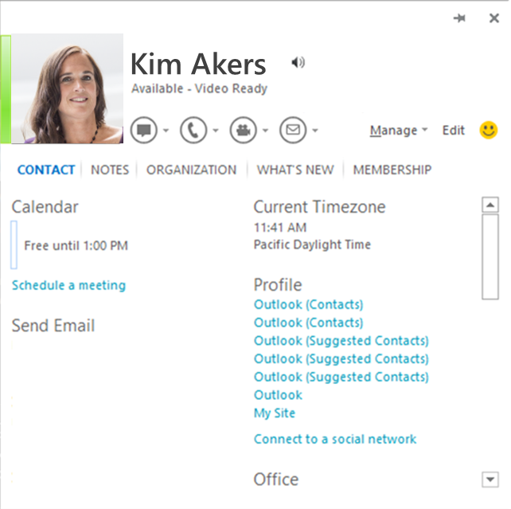

# Integrating IM applications with Office

This article describes how to configure an instant message (IM) client application so that it integrates with the social features in Office 2013, Office 2016, Office 2019, and Office 365, including displaying presence and sending instant messages from the contact card.
  
## Introduction

<a name="off15_IMIntegration_Intro"> </a>

Office 2013 (and later versions) provides rich integration with IM client applications, including Lync 2013 and Teams. This integration provides users with IM capabilities from within Word, Excel, PowerPoint, Outlook, Visio, Project, and OneNote as well as providing presence integration on SharePoint pages. Users can see the photo, name, presence status, and contact data for people in their contacts list. They can start an IM session, video call, or phone call directly from the contact card (the UI element in Office that surfaces contact information and communication options). Office makes it easy to stay connected to your contacts without taking you outside of your email or documents.
  
> [!NOTE]
> This article uses the term IM client application to refer specifically to the application installed on a user's computer that communicates to the IM service. For example, Lync 2013 and Teams are considered an IM client applications. This article does not provide details about how the IM client application communicates to the IM service or about the IM service itself.
  
You can customize an IM client application so that it communicates with Office. Specifically, you can modify your IM application so that it displays the following information within the Office UI:
  
- Contact photo.

- Contact name.

- Contact personal status note.

- Contact presence status.

- Contact availability string (for example, "Available" or "Out of Office").

- Contact capability string (for example, "Video Ready").

- One-click IM launch.

- One-click video call launch.

- One-click phone call launch (including SIP, phone number, voice mail, and call new number).

- Contact management (add to IM group).

- Contact location and time zone.

- Contact data, phone number, email address, title, and company name.

**Figure 1. Contact card in Office 2013**


  
To enable this integration with Office, an IM client application must implement a set of interfaces that Office provides to connect to it. The APIs for this integration are included in the [UCCollborationLib](/previous-versions/office/communications/ff398475(v=ocs.14)) namespace that is contained in the Microsoft.Office.UC.dll file, which is installed with versions of Office 2013 that include Lync / Skype for Business. The **UCCollaborationLib** namespace includes the interfaces that you must implement to integrate with Office.
  
> [!IMPORTANT]
> The type library for the required interfaces is embedded in Lync 2013/Skype for Business. For third-party integrators, this works only when both Lync 2013 and Skype for Business are installed on the target machine. If you are integrating using Office Standard, you need to extract the type library and install it on the target machine. The [Lync 2013 SDK](https://www.microsoft.com/download/details.aspx?id=36824) includes the Microsoft.Office.UC.dll file.
  
> [!NOTE]
> A handful of Office 2010 applications can integrate similarly with a third-party IM provider application: Outlook 2010, Word 2010, Excel 2010, PowerPoint 2010, and SharePoint Server 2010 (using an ActiveX control). Many of the steps required for integration with Office 2013 apply to Office 2010 as well.
> There are several key differences in how Office 2010 integrates with an IM provider application:
>
> - Office 2010 does not display the contact's photo.
> - You must download the Microsoft.Office.Uc.dll file separately from Office 2010. The [Lync 2010 SDK](/previous-versions/office/developer/lync-2010/gg421054(v=office.14)) includes the Microsoft.Office.UC.dll file for Office 2010.
> - When the Office application calls the [IUCOfficeIntegration.GetAuthenticationInfo](integrating-im-applications-with-office.md#off15_IMIntegration_ImplementRequired_IUCOfficeIntegration) method on the IM client application, it passes in the string "14.0.0.0".
> - Office 2010 enumerates all groups and contacts as soon as it connects to an IM client application.
  
## How Office integrates with an IM client application

<a name="off15_IMIntegration_How"> </a>

When an Office 2013 (or higher) application starts, it goes through the following process to integrate with the default IM client application:
  
1. It checks the registry to discover the default IM client application and then connects to it.

2. It authenticates with the IM client application.

3. It connects to specific interfaces that are exposed by the IM client application.

4. It determines the capabilities of the currently signed-in user (local user), including getting the user's contacts, determining the user's presence, and determining the user's IM capabilities (instant messaging, video chat, VOIP, and so on).

5. It gets presence information for the local user's contacts.

6. When the IM client application shuts down, the Office application silently disconnects.

### Discovering the IM application

The Office application looks for several specific keys and entries in the registry to discover the default IM client application. If it discovers a default IM client application, it then attempts to connect to it.
  
The process that the Office application goes through to discover the default IM client application is as follows:
  
1. The Office application looks to see if the HKEY_CURRENT_USER\Software\IM Providers\DefaultIMApp subkey in the registry is set and reads the application name listed there.

2. The Office application then reads the HKEY_CURRENT_USER\Software\IM Providers\ _Application name_\UpAndRunning key and monitors the value for changes.

3. The Office application next reads the HKEY_LOCAL_MACHINE\Software\IM Providers\ _Application name_ registry key and gets the ProcessName and class ID (CLSID) values stored there.

4. Once the IM client application has completed its start sequence successfully and registered all of the classes correctly for the presence integration, it sets the HKEY_CURRENT_USER\Software\IM Providers\ _Application name_\UpAndRunning key to "2", indicating that the client application is running.

5. When the Office application discovers that the HKEY_CURRENT_USER\Software\IM Providers\ _Application name_\UpAndRunning key has been set to "2", it checks the list of running processes on the computer for the process name of the IM client application.

6. Once the Office application finds the process that the IM client application uses, the Office application calls **CoCreateInstance** using the CLSID to establish a connection to the IM client application as an out-of-process COM server.

### Authenticating the connection to the IM application

After the Office application establishes a connection to the IM client application, it then does the following:
  
1. The Office application calls [IUnknown::QueryInterface](https://msdn.microsoft.com/library/ms682521%28v=VS.85%29.aspx) method to check for the [IUCOfficeIntegration](integrating-im-applications-with-office.md#off15_IMIntegration_ImplementRequired_IUCOfficeIntegration) interface.

2. The Office application then calls the **IUCOfficeIntegration.GetAuthenticationInfo** method, passing in the highest supported integration version (for example, "15.0.0.0").

3. If the IM client application supports the version of Office passed in as a parameter, the application returns the following hard-coded XML string to the calling code:

    `<authenticationinfo>`

   > [!NOTE]
   > For legacy reasons, the IM client application must return the exact value `<authenticationinfo>` to the call to **GetAuthenticationInfo** if it supports the version of Office passed in as a parameter.
  
4. If the IM client application fails to return a value, the Office application calls the **GetAuthenticationInfo** method again with the next highest supported version of Office (for example, "14.0.0.0").

5. Once Office determines that the IM client application supports IM and presence integration, it connects to a required set of interfaces to finish initializing. (For more information, see [Connecting to required interfaces](#off15_IMIntegration_HowConnect).)

If the Office application encounters an error on any of the steps above, it backs out and presence integration is not established again during the session of the Office application.
  
### Connecting to required interfaces

<a name="off15_IMIntegration_HowConnect"> </a>

After authenticating the connection to the IM client application, the Office application attempts to connect to a set of required interfaces that the IM client application must expose. The Office application accomplishes this by doing the following:
  
- The Office application gets an [ILyncClient](integrating-im-applications-with-office.md#off15_IMIntegration_ImplementRequired_ILyncClient) object by calling the **IUCOfficeIntegration.GetInterface** method, passing in the **oiInterfaceLyncClient** constant from the [UCCollaborationLib.OIInterface](https://msdn.microsoft.com/library/UCCollaborationLib.OIInterface) enumeration.
- The Office application gets an [IAutomation](integrating-im-applications-with-office.md#off15_IMIntegration_ImplementRequired_IAutomation) object by calling the **IUCOfficeIntegration.GetInterface** method, passing in the **oiInterfaceAutomation** constant from the **OIInterface** enumeration.
- The Office application sets up the [_ILyncClientEvents](integrating-im-applications-with-office.md#off15_IMIntegration_ImplementRequired_ILyncClient) event listener.
- The Office application sets up the [_IUCOfficeIntegrationEvents](integrating-im-applications-with-office.md#off15_IMIntegration_ImplementRequired_IUCOfficeIntegration) event listener.
- The Office application gets the sign-in state from the IM client application by accessing the **ILyncClient.State** property.
- The Office application gets the capabilities of the IM client application by calling the **IUCOfficeIntegration.GetSupportedFeatures** method, which returns a flag from the [UCCollaborationLib.OIFeature](https://msdn.microsoft.com/library/UCCollaborationLib.OIFeature) enumeration.

- The Office application accesses the **ILyncClient.Self** property to get a reference to an [ISelf](integrating-im-applications-with-office.md#off15_IMIntegration_ImplementRequired_ISelf) object.

### Retrieving the capabilities of the local user

<a name="off15_IMIntegration_HowConnect"> </a>

The Office application gets the capabilities of the local user by doing the following:
  
1. If the IM client application supports the **IClient2** interface, Office tries to get an [IContactManager](integrating-im-applications-with-office.md#off15_IMIntegration_ImplementRequired_IContactManager) object by accessing the **IClient2.PrivateContactManager** property.

2. If the IM application does not support the **IClient2** interface, Office application gets an **IContactManager** object by accessing the **ILyncClient.ContactManager** property. The IM client application must successfully return an **IContactManager** object before any other IM capabilities can be established.

3. The Office application accesses the **ILyncClient.Uri** property and then calls **IContactManager.GetContactByUri** to get the [IContact](integrating-im-applications-with-office.md#off15_IMIntegration_ImplementRequired_IContact) object associated with the local user.

4. The Office application then makes several calls to **IContact.CanStart** to establish the capabilities of the local user, passing in the values for **ModalityTypes.ucModalityInstantMessage** and **ModalityTypes.ucModalityAudioVideo** successively.

### Retrieving contact presence

<a name="off15_IMIntegration_HowConnect"> </a>

The Office application gets contact presence, including the local user, by doing the following:
  
1. The Office application calls **IContact.GetContactInformation** to get a presence item from the contact.

2. The Office application then subscribes to presence status changes from the contact. It calls **IContactManager.CreateSubscription** to get an [IContactSubscription](integrating-im-applications-with-office.md#off15_IMIntegration_ImplementRequired_IContactSubscription) object. It then calls **IContactSubscription.AddContact** to add the contact to the subscription and then calls **IContactSubscription.Subscribe** to get changes in the contact's status.

3. If the IM application supports **IContact2**, Office attempts to get presence information by calling **IContact2.BatchGetContactInformation2**.

4. The Office application then retrieves the presence properties for the contact by calling **IContact.BatchGetContactInformation**. The Office application can get a second set of presence properties by accessing the **IContact.Settings** property.

5. Finally, the Office application gets the contact's group membership by accessing the **IContact.CustomGroups** property. This returns an [IGroupCollection](integrating-im-applications-with-office.md#off15_IMIntegration_ImplementRequired_IGroup) collection that includes all of the [IGroup](integrating-im-applications-with-office.md#off15_IMIntegration_ImplementRequired_IGroup) objects that the contact belongs to.

### Disconnecting from the IM application

<a name="off15_IMIntegration_HowConnect"> </a>

When the Office application detects the **OnShuttingDown** event from the IM application, it disconnects silently. However, if the Office application shuts down before the IM application, the Office application does not guarantee that the connection is cleaned up. The IM application must handle client connection leaks.
  
## Setting registry keys and entries

<a name="off15_IMIntegration_SetRegistry"> </a>

As mentioned previously, the IM-capable Office applications look for specific keys, entries, and values in the registry to discover the IM client application to connect to. These registry values provide the Office application with the process name and CLSID of the class that acts as the entry point to the IM client application's object model (that is, the class that implements the **IUCOfficeIntegration** interface). The Office application co-creates that class and connects as a client to the out-of-process COM server in the IM client application.
  
Use Table 1 to identify the keys, entries, and values that must be written in the registry to integrate an IM client application with Office.
  
**Table 1. Registry keys for setting the default IM client application**

|**Key**|**Entry**|**Type**|**Value**|**Example**|
|:-----|:-----|:-----|:-----|:-----|
|HKEY_LOCAL_MACHINE\Software\IM Providers\\<Application name\>  <br/> |FriendlyName  <br/> |REG_SZ  <br/> |The name of the third-party IM client application. |Litware IM 2012  <br/> |
||ProcessName  <br/> |REG_SZ  <br/> |The process name of the third-party IM client application. |litware.exe  <br/> |
||GUID  <br/> |REG_SZ  <br/> |A class ID (CLSID) for the root, cocreatable class in the IM application (the class that implements the **IUCOfficeIntegration** interface). |(A GUID)  <br/> |
|HKEY_CURRENT_USER\Software\IM Providers  <br/> |DefaultIMApp  <br/> |REG_SZ  <br/> |The name of the IM client application. This must be the same as the name at the top-level registry key (hive) in the HKEY_LOCAL_MACHINE. |Litware  <br/> |
|HKEY_CURRENT_USER\Software\IM Providers\\<Application name\>  <br/> |UpAndRunning  <br/> |REG_DWORD  <br/> | An integer value between 0 and 2:  <br/>  0—Not running  <br/>  1—Starting  <br/>  2—Running  <br/> <br/>**NOTE**:  The application name registry key must be the same as the value of the DefaultIMApp entry.           ||

## Implementing the required interfaces for integration with Office

<a name="off15_IMIntegration_ImplementRequired"> </a>

There are three interfaces from the **UCCollaborationLib** namespace that the executable (or COM server) of an IM client application must implement so that it can integrate with Office. If these interfaces are not implemented, the Office application backs out during the initialization process and the connection with the IM client application is not established.
  
The required interfaces are as follows:
  
- [IUCOfficeIntegration](integrating-im-applications-with-office.md#off15_IMIntegration_ImplementRequired_IUCOfficeIntegration)—Although not required, the **_IUCOfficeIntegrationEvents** interface should also be implemented in the same derived class.

- [ILyncClient](integrating-im-applications-with-office.md#off15_IMIntegration_ImplementRequired_ILyncClient)—Although not required, the **_ILyncClientEvents** interface should also be implemented in the same derived class.

- [IAutomation](integrating-im-applications-with-office.md#off15_IMIntegration_ImplementRequired_IAutomation)

### IUCOfficeIntegration interface

<a name="off15_IMIntegration_ImplementRequired_IUCOfficeIntegration"> </a>

The **IUCOfficeIntegration** interface provides the entry-point for an Office application to connect to the IM client application. The interface defines three methods that an Office application calls as part of the process of initiating a connection with the IM client application. The class that implements the **IUCOfficeIntegration** interface must be co-creatable so that Office can co-create an instance of it. In addition, it must expose the CLSID that is entered as the value for the GUID entry in the HKEY_LOCAL_MACHINE\Software\IM Providers\ _Application name_ registry key.
  
The class that inherits from **IUCOfficeIntegration** should also implement the **_IUCOfficeIntegrationEvents** interface. The **_IUCOfficeIntegrationEvents** interface contains the members that expose the event handlers of the **IUCOfficeIntegration** interface.
  
Table 2 shows the members that must be implemented in the class that inherits from **IUCOfficeIntegration** and **_IUCOfficeIntegration**.
  
> [!NOTE]
> For more information about the **IUCOfficeIntegration** and **_IUCOfficeIntegrationEvents** interfaces and their members, see [UCCollaborationLib.IUCOfficeIntegration](https://msdn.microsoft.com/library/UCCollaborationLib.IUCOfficeIntegration) and [UCCollaborationLib._IUCOfficeIntegrationEvents](https://msdn.microsoft.com/library/UCCollaborationLib._IUCOfficeIntegrationEvents).
  
**Table 2. Implementation of the IUCOfficeIntegration and _IUCOfficeIntegrationEvents interfaces**

|**Interface**|**Member**|**Description**|
|:-----|:-----|:-----|
|**IUCOfficeIntegration** <br/> |**GetAuthenticationInfo** method  <br/> |Gets the authentication info string. |
||**GetInterface** method  <br/> |Gets the interface of a particular version. |
||**GetSupportedFeatures** method  <br/> |Gets the supported Office integration features. |
|**_IUCOfficeIntegrationEvents** <br/> |**OnShuttingDown** event  <br/> |The event raised when the IM client application is trying to shut down. |

Use the following code to define a class that inherits from the **IUCOfficeIntegration** and **_IUCOfficeIntegration** interfaces within an IM client application.
  
```cs
// An example of a class that can be co-created and can integrate
// with Office as an IM provider.
[ClassInterface(ClassInterfaceType.None)]
[ComSourceInterfaces(typeof(_IUCOfficeIntegrationEvents))]
[Guid("{CLSID value}"), ComVisible(true)]
public class LitwareClientAppObject : IUCOfficeIntegration
{
    // Implementation details omitted.
}

```

The **GetAuthenticationInfo** method takes a string as an argument for the _version_ parameter. When the Office application calls this method, it passes in one of two strings for the argument, depending on the version of Office. When the Office application supplies the method with the version of Office that the IM client application supports (that is, supports the functionality), the **GetAuthenticationInfo** method returns a hard-coded XML string `<authenticationinfo>`.
  
Use the following code to implement the **GetAuthentication** method within the IM client application code.
  
```cs
public string GetAuthenticationInfo(string _version)
{
    // Define the version of Office that the IM client application supports.
    string supportedOfficeVersion = "15.0.0.0";
    // Do a simple check for equivalency.
    if (supportedOfficeVersion == _version)
    {
        // If the version of Office is supported, this method must 
        // return the string literal "<authenticationinfo>" exactly.
        return "<authenticationinfo>";
    }
    else
    {
        return null;
    }
}

```

The **GetInterface** method shuttles references to classes to the calling code, depending on what is passed in as an argument for the _interface_ parameter. When an Office application calls the **GetInterface** method, it passes in one of two values for the interface parameter: either the **oiInterfaceILyncClient** constant (1) or the **oiInterfaceIAutomation** constant (2) of the [UCCollaborationLib.OIInterface](https://msdn.microsoft.com/library/UCCollaborationLib.OIInterface) enumeration. If the Office application passes in the **oiInterfaceILyncClient** constant, the **GetInterface** method returns a reference to a class that implements the **ILyncClient** interface. If the Office application passes in the **oiInterfaceIAutomation** constant, the **GetInterface** method returns a class that implements the **IAutomation** interface.
  
Use the following code example to implement the **GetInterface** method within the IM client application code.
  
```cs
public object GetInterface(string _version, OIInterface _interface)
{
    // These objects implement the ILyncClient or IAutomation 
    // interfaces respectively. There is no restriction on what these
    // classes are named.
    IMClient imClient = new IMClient();
    IMClientAutomation imAutomation = new IMClientAutomation();
    // Return different object references depending on the value passed in
    // for the _interface parameter.
    switch (_interface)
    {
        // The calling code is asking for an object that inherits
        // from ILyncClient, so it returns such an object.
        case OIInterface.oiInterfaceILyncClient:
        {
            return imClient;
        }
        // The calling code is asking for an object that inherits
        // from IAutomation, so it returns such an object.
        case OIInterface.oiInterfaceIAutomation:
        {
            return imAutomation;
        }
        default:
        {
            throw new NotImplementedException();
        }
    }
}

```

The **GetSupportedFeatures** method returns information about the IM features that the IM client application supports. It takes a string for its only parameter, _version_. When the Office application calls the **GetSupportedFeatures** method, the method returns a value from the [UCCollaborationLib.OIFeature](https://msdn.microsoft.com/library/UCCollaborationLib.OIFeature) enumeration. The returned value specifies the capabilities of the IM client, where each capability of the IM client application is indicated to the Office application by adding a flag to the value.
  
> [!NOTE]
> Office 2013 (and higher) applications ignore the following constants in the **OIFeature** enumeration:
>
> - **oiFeaturePictures** (2)
> - **oiFeatureFreeBusyIntegration**
> - **oiFeaturePhoneNormalization**
>
> Office 365 version 2011 (and higher) applications ignore following constants in the **OIFeature** enumeration:
>
> - **oiFeaturePictures** (2)
> - **oiFeaturePhoneNormalization**
  
Use the following code example to implement the **GetSupportFeatures** method within the IM client application code.
  
```cs
public OIFeature GetSupportedFeatures(string _version)
{
    OIFeature supportedFeature1 = OIFeature.oiFeatureQuickContacts;
    OIFeature supportedFeature2 = OIFeature.oiFeatureFastSearch;
    return (supportedFeature1 | supportedFeature2);
}

```

### ILyncClient interface

<a name="off15_IMIntegration_ImplementRequired_ILyncClient"> </a>

The **ILyncClient** interface maps to the capabilities of the IM client application itself. It exposes properties that refer to the person who is signed into the application (the local user, represented by the [UCCollaborationLib.ISelf](https://msdn.microsoft.com/library/UCCollaborationLib.ISelf) interface), the state of the application, the list of contacts for the local user, and several other settings. When it's trying to connect to the IM client application, the Office application gets a reference to an object that implements the **ILyncClient** interface. From that reference, Office can access much of the functionality of the IM client application.
  
In addition, the class that implements the **ILyncClient** interface should also implement the **_ILyncClientEvents** interface. The **_ILyncClientEvents** interface exposes several of the events that are required for monitoring the state of the IM client application.
  
Table 3 shows the members that must be implemented in the class that inherits from **ILyncClient** and **_ILyncClientEvents**.
  
> [!NOTE]
> Any member of the **ILyncClient** or **\_ILyncClientEvents** interface not listed in the table must be present but does not need to be implemented. Members that are present but not implemented can throw a **NotImplementedException** or **E\_NOTIMPL** error.
>
> For more information about the **ILyncClient** and **_ILyncClientEvents** interfaces and their members, see [UCCollaborationLib.ILyncClient](https://msdn.microsoft.com/library/UCCollaborationLib.ILyncClient) and [UCCollaborationLib._ILyncClientEvents](https://msdn.microsoft.com/library/UCCollaborationLib._ILyncClientEvents).
  
**Table 3. Implementation of ILyncClient and ILyncClientEvents interfaces**

|**Interface**|**Member**|**Description**|
|:-----|:-----|:-----|
|**ILyncClient** <br/> |**ContactManager** property  <br/> |Gets the contact group manager. |
||**ConversationManager** property  <br/> |Gets the conversations manager. |
||**Self** property  <br/> |Gets the **Self** object. |
||**SignIn** method  <br/> |Starts the IM client application sign-in process with a specific availability. |
||**State** property  <br/> |Gets the current platform state. |
||**Uri** property  <br/> |Gets the URI of the IM client application. |
|**_ILyncClientEvents** <br/> |**OnStateChanged** event  <br/> |Raised when the IM client application state changes. You should handle this event and get the **eventData.NewState** property. The event is raised for all processes bound to an instance of an IM client application when any subsystem in the application causes the state change. |

During the initialization process, Office accesses the **ILyncClient.State** property. This property needs to return a value from the [UCCollaborationLib.ClientState](https://msdn.microsoft.com/library/UCCollaborationLib.ClientState) enumeration.
  
```cs
private ClientState _clientState;
public ClientState State
{
    get
    {
        return this._clientState;
    }
}

```

The **State** property stores the current status of the IM client application. It must be set and updated throughout the IM client application session. When the IM client application signs in, signs out, or shuts down, it should set the **State** property. It is best to set this property within the **ILyncClient.SignIn** and **ILyncClient.SignOut** methods, as the following example demonstrates.
  
```cs
// This field is of a type that implements the 
// IAsynchronousOperation interface.
private IMClientAsyncOperation _asyncOperation = new IMClientAsyncOperation();
// This field is of a type that implements the ISelf interface.
private IMClientSelf _self;
public IMClientAsyncOperation SignIn(string _userUri, string _domainAndUser, 
    string _password, object _IMClientCallback, object _state)
{
    ClientState _previousClientState = this._clientState;
    this._clientState = ClientState.ucClientStateSignedIn;
    // The IMClientStateChangedEventData class implements the 
    // IClientStateChangedEventData interface.
    IMClientStateChangedEventData eventData = 
        new IMClientStateChangedEventData(_previousClientState, 
        this._clientState);
    if (_userUri != null)
    {
        // During the sign-in process, create a new contact with
        // the contact information of the currently signed-in user.
        this._self = new IMClientSelf(IMContact.BuildContact(_userUri));
    }
    // Raise the _ILyncClientEvents.OnStateChanged event.
    OnStateChanged(this, eventData as UC.ClientStateChangedEventData);
    
    return this._asyncOperation;
    }
}

```

The following code example demonstrates how to set up the event listener using the _**ILyncClientEvents** and_ **IUCOfficeIntegrationEvents** interfaces.
  
```cs
using Microsoft.Office.Uc;
using System;
using System.Runtime.CompilerServices;
using System.Runtime.InteropServices;
namespace SampleImplementation
{
    // Note: UCOfficeIntegration inherits from both IUCOfficeIntegration and _IUCOfficeIntegrationEvents_Event
    [ClassInterface(ClassInterfaceType.None), Guid("13c41ef9-eb90-4e94-8a7c-1e9d686bc019"), ComVisible(true)]
    [ComSourceInterfaces(typeof(_IUCOfficeIntegrationEvents))]
    public class MyInstantMessengerOfficeIntegration : UCOfficeIntegration
    {
        #region IUCOfficeIntegration implementation
        public string GetAuthenticationInfo(string _version)
        {
            return "";
        }
        public object GetInterface(string _version, OIInterface _interface)
        {
            return null;
        }
        public OIFeature GetSupportedFeatures(string _version)
        {
            return OIFeature.oiFeatureAddOneNoteToConversation;
        }
        #endregion
        #region _IUCOfficeIntegrationEvents support
        // This event implements void _IUCOfficeIntegrationEvents.OnShuttingDown();
        public event _IUCOfficeIntegrationEvents_OnShuttingDownEventHandler OnShuttingDown;
        // This method is called by the IM application when it is beginning to shut down.
        // The method will raise the OnShuttingDown event which is translated by .NET COM interop layer
        // into a call to _IUCOfficeIntegrationEvents.OnShuttingDown.
        // This notifies Office applications that the IM application is going away.
        internal void RaiseOnShuttingDownEvent()
        {
            if (this.OnShuttingDown != null)
            {
                this.OnShuttingDown();
            }
        }
        #endregion
    }
    // Note: LyncClient inherits from both ILyncClient and _ILyncClientEvents_Event
    // You must implement LyncClient because the event handlers in _ILyncClientEvents expect you to pass a LyncClient interface.
    [ComVisible(true)]
    [ComSourceInterfaces(typeof(_ILyncClientEvents))]
    public class MyInstantMessengerOfficeIntegration2 :
        Client,
        Client2,
        LyncClient
    {
        #region Interfaces
        public LyncClientCapabilityTypes Capabilities
        {
            get
            {
                throw new NotImplementedException();
            }
        }
        public ConferenceScheduler ConferenceScheduler
        {
            get
            {
                throw new NotImplementedException();
            }
        }
        public ContactManager ContactManager
        {
            get
            {
                throw new NotImplementedException();
            }
        }
        public ConversationManager ConversationManager
        {
            get
            {
                throw new NotImplementedException();
            }
        }
        public DelegatorClient[] DelegatorClients
        {
            get
            {
                throw new NotImplementedException();
            }
        }
        public DeviceManager DeviceManager
        {
            get
            {
                throw new NotImplementedException();
            }
        }
        public bool InSuppressedMode
        {
            get
            {
                throw new NotImplementedException();
            }
        }
        public ContactManager PrivateContactManager
        {
            get
            {
                throw new NotImplementedException();
            }
        }
        public RoomManager RoomManager
        {
            get
            {
                throw new NotImplementedException();
            }
        }
        public Self Self
        {
            get
            {
                throw new NotImplementedException();
            }
        }
        public ClientSettings Settings
        {
            get
            {
                throw new NotImplementedException();
            }
        }
        public SignInConfiguration SignInConfiguration
        {
            get
            {
                throw new NotImplementedException();
            }
        }
        public ClientState State
        {
            get
            {
                throw new NotImplementedException();
            }
        }
        public ClientType Type
        {
            get
            {
                throw new NotImplementedException();
            }
        }
        public string Uri
        {
            get
            {
                throw new NotImplementedException();
            }
        }
        public Utilities Utilities
        {
            get
            {
                throw new NotImplementedException();
            }
        }
        public ApplicationRegistration CreateApplicationRegistration(string _appGuid, string _appName)
        {
            throw new NotImplementedException();
        }
        public AsynchronousOperation Initialize(string _clientName, string _version = "0", string _clientShortName = "0", string _clientNameAbbreviation = "0", string _clientLongName = "0", SupportedFeatures _supportedFeatures = SupportedFeatures.ucAllFeatures, [IUnknownConstant] object _CommunicatorClientCallback = null, object _state = null)
        {
            throw new NotImplementedException();
        }
        public AsynchronousOperation Shutdown([IUnknownConstant] object _CommunicatorClientCallback, object _state)
        {
            throw new NotImplementedException();
        }
        public AsynchronousOperation SignIn(string _userUri = "0", string _domainAndUsername = "0", string _password = "0", [IUnknownConstant] object _CommunicatorClientCallback = null, object _state = null)
        {
            throw new NotImplementedException();
        }
        public AsynchronousOperation SignOut([IUnknownConstant] object _CommunicatorClientCallback, object _state)
        {
            throw new NotImplementedException();
        }
        #endregion
        #region _ILyncClientEvents support
        public event _ILyncClientEvents_OnStateChangedEventHandler OnStateChanged;
        public event _ILyncClientEvents_OnNotificationReceivedEventHandler OnNotificationReceived;
        public event _ILyncClientEvents_OnCredentialRequestedEventHandler OnCredentialRequested;
        public event _ILyncClientEvents_OnSignInDelayedEventHandler OnSignInDelayed;
        public event _ILyncClientEvents_OnCapabilitiesChangedEventHandler OnCapabilitiesChanged;
        public event _ILyncClientEvents_OnDelegatorClientAddedEventHandler OnDelegatorClientAdded;
        public event _ILyncClientEvents_OnDelegatorClientRemovedEventHandler OnDelegatorClientRemoved;
        // Notifies Office apps that the IM client state (signed out, signing in, singed in, signing out, etc) has changed.
        internal void RaiseOnStateChangedEvent(ClientStateChangedEventData eventData)
        {
            if (this.OnStateChanged != null)
            {
                this.OnStateChanged(this, eventData);
            }
        }
        // Notifies Office apps that the IM client has received a notification event from MAPI (e.g. autodiscover has finished)
        internal void RaiseOnNotificationReceivedEvent(LyncClientNotificationReceivedEventData eventData)
        {
            if (this.OnNotificationReceived != null)
            {
                this.OnNotificationReceived(this, eventData);
            }
        }
        // Notifies Office apps that the IM client has received a request for credentials for some operation (e.g. sign in, web search)
        internal void RaiseOnCredentialRequestedEvent(CredentialRequestedEventData eventData)
        {
            if (this.OnCredentialRequested != null)
            {
                this.OnCredentialRequested(this, eventData);
            }
        }
        // Notifies Office apps that the IM client has been delayed from signing in and gives an estimated delay time.
        internal void RaiseOnSignInDelayedEvent(SignInDelayedEventData eventData)
        {
            if (this.OnSignInDelayed != null)
            {
                this.OnSignInDelayed(this, eventData);
            }
        }
        // Notifies Office apps that the capabilities of this IM client have changed.
        internal void RaiseOnCapabilitiesChangedEvent(PreferredCapabilitiesChangedEventData eventData)
        {
            if (this.OnCapabilitiesChanged != null)
            {
                this.OnCapabilitiesChanged(this, eventData);
            }
        }
        // Notifies Office apps that a DelegatorClient object has been added to the IM client object.
        internal void RaiseOnDelegatorClientAdded(DelegatorClientCollectionEventData eventData)
        {
            if (this.OnDelegatorClientAdded != null)
            {
                this.OnDelegatorClientAdded(this, eventData);
            }
        }
        // Notifies Office apps that a DelegatorClient object has been removed from the IM client object.
        internal void RaiseOnDelegatorClientRemoved(DelegatorClientCollectionEventData eventData)
        {
            if (this.OnDelegatorClientRemoved != null)
            {
                this.OnDelegatorClientRemoved(this, eventData);
            }
        }
        #endregion
    }
}
```

### IAutomation interface

<a name="off15_IMIntegration_ImplementRequired_IAutomation"> </a>

The **IAutomation** interface automates features of the IM client application. It can be used to start conversations, join conferences, and provide extensibility window context.
  
Table 4 shows the members that must be implemented in the class that inherits from **IAutomation**.
  
> [!NOTE]
> Any member of the **IAutomation** interface not listed in the table must be present but does not need to be implemented. Members that are present but not implemented can throw a **NotImplementedException** or **E_NOTIMPL** error.
>
> For more information about the **IAutomation** interface and its members, see [UCCollaborationLib.IAutomation](https://msdn.microsoft.com/library/UCCollaborationLib.IAutomation).
  
**Table 4. Implementation of IAutomation interface**

|**Member**|**Description**|
|:-----|:-----|
|**StartConversation** method  <br/> |Starts a conversation using the specified conversation modality. An instance of **IConversationWindow** is returned. |

## Implementing contact presence integration

<a name="off15_IMIntegration_ImplementIMFeatures"> </a>

In addition to the three required interfaces discussed previously, there are several other interfaces that are important for enabling contact presence functionality in Office. These include the following:
  
- The [IContact](integrating-im-applications-with-office.md#off15_IMIntegration_ImplementRequired_IContact) or **IContact2** interface.

- The [ISelf](integrating-im-applications-with-office.md#off15_IMIntegration_ImplementRequired_ISelf) interface.

- The [IContactManager](integrating-im-applications-with-office.md#off15_IMIntegration_ImplementRequired_IContactManager) and [_IContactManagerEvents](integrating-im-applications-with-office.md#off15_IMIntegration_ImplementRequired_IContactManager) interfaces.

- The [IGroup](integrating-im-applications-with-office.md#off15_IMIntegration_ImplementRequired_IGroup) and [IGroupCollection](integrating-im-applications-with-office.md#off15_IMIntegration_ImplementRequired_IGroup) interfaces.

- The [IContactSubscription](integrating-im-applications-with-office.md#off15_IMIntegration_ImplementRequired_IContactSubscription) interface.

- The [IContactEndPoint](integrating-im-applications-with-office.md#off15_IMIntegration_ImplementRequired_IContactEndPoint) interface.

- The [ILocaleString](integrating-im-applications-with-office.md#off15_IMIntegration_ImplementRequired_ILocaleString) interface

### IContact interface

<a name="off15_IMIntegration_ImplementRequired_IContact"> </a>

The **IContact** interface represents an IM client application user. The interface exposes presence, available modalities, group membership, and contact type properties for a user. To start a conversation with another user, you must provide that user instance of **IContact**.
  
Table 5 shows the members that must be implemented in the class that inherits from **IContact**.
  
> [!NOTE]
> Any member of the **IContact** interface not listed in the table must be present but does not need to be implemented. Members that are present but not implemented can throw a **NotImplementedException** or **E_NOTIMPL** error.
>
> For more information about the **IContact** interface and its members, see [UCCollaborationLib.IContact](https://msdn.microsoft.com/library/UCCollaborationLib.IContact).
  
**Table 5. Implementation of the IContact interface**

|**Member**|**Description**|
|:-----|:-----|
|**CanStart** method  <br/> |Returns **true** if a given type of modality can be started on the contact. |
|**GetContactInformation** method  <br/> |Gets one presence item from a publishing contact. |
|**BatchGetContactInformation** method  <br/> |Gets multiple presence items from a publishing contact. |
|**Settings** property  <br/> |Gets a collection of contact properties. |
|**CustomGroups** property  <br/> |Gets a collection of groups that the contact is a member of. |

During the initialization process, the Office application calls the **IContact.CanStart** method to determine the IM capabilities for the local user. The **CanStart** method takes a flag from the [UCCollaborationLib.ModalityTypes](https://msdn.microsoft.com/library/UCCollaborationLib.ModalityTypes) enumeration as an argument for the __modalityTypes_ parameter. If the current user can engage in the requested modality (that is, the user is capable of instant messaging, audio and video messaging, or application sharing), the **CanStart** method returns **true**.
  
```cs
public bool CanStart(ModalityTypes _modalityTypes)
{
    // Define the capabilities of the current IM client application
    // user by using flags from the ModalityTypes enumeration.
    ModalityTypes userCapabilities = 
        ModalityTypes.ucModalityInstantMessage | 
        ModalityTypes.ucModalityAudioVideo | 
        ModalityTypes.ucModalityAppSharing;
    // Perform a simple test for equivalency.
    if (_modalityType == userCapabilities) 
    {
        return true;
    }
    else 
    {
        return false;
    }
}

```

The **GetContactInformation** method retrieves information about the contact from the **IContact** object. The calling code needs to pass in a value from the [UCCollaborationLib.ContactInformationType](https://msdn.microsoft.com/library/UCCollaborationLib.ContactInformationType) enumeration for the __contactInformationType_ parameter, which indicates the data to be retrieved.
  
```cs
public object GetContactInformation(
    ContactInformationType _contactInformationType)
{
    // Determine the information to return from the contact's data based
    // on the value passed in for the _contactInformationType parameter.
    switch (_contactInformationType)
    {
        case ContactInformationType.ucPresenceEmailAddresses:
        {
            // Return the URI associated with the contact.
            string returnValue = this.Uri.ToLower().Replace("sip:", String.Empty);
            return returnValue;
        }
        case ContactInformationType.ucPresenceDisplayName:
        {
            // Return the display name associated with the contact.
            string returnValue = this._DisplayName;
            return returnValue;
        }
        default:
        {
            throw new NotImplementedException;
        }
        // Additional implementation details omitted.
    }
}
```

Similar to the **GetContactInformation**, the **BatchGetContactInformation** method retrieves multiple presence items about the contact from the **IContact** object. The calling code needs to pass in an array of values from the **ContactInformationType** enumeration for the __contactInformationTypes_ parameter. The method returns an [UCCollaborationLib.IContactInformationDictionary](https://msdn.microsoft.com/library/UCCollaborationLib.IContactInformationDictionary) object that contains the requested data.
  
```cs
public IMClientContactInformationDictionary BatchGetContactInformation(
    ContactInformationType[] _contactInformationTypes)
{
    // The IMClientContactInformationDictionary class implements the
    // IContactInformationDictionary interface.
    IMClientContactInformationDictionary contactDictionary = 
        new IMClientContactInformationDictionary();
    foreach (ContactInformationType type in _contactInformationTypes)
    {
        // Call GetContactInformation for each type of contact 
        // information to retrieve. This code adds a new entry to
        // a Dictionary object exposed by the
        // ContactInformationDictionary property.
        contactDictionary.ContactInformationDictionary.Add(
            type, this.GetContactInformation(type));
    }
    return contactDictionary;
}
```

The **IContact.Settings** property returns an **IContactSettingDictionary** object that contains custom properties about the contact.
  
```cs
public IMClientContactSettingDictionary Settings
{
    get
    {
       // The IMClientContactSettingDictionary class implements
       // the IContactSettingDictionary interface.
       return new IMClientContactSettingDictionary();
    }
}
```

The **IContact.CustomGroups** property returns an **IGroupCollection** object that includes all of the groups of which the contact is a member.
  
```cs
public IMClientGroupCollection CustomGroups
{
    get {
       // The IMClientGroupCollection class implements
       // the IGroupCollection interface.
        return new IMClientGroupCollection();
    }
}
```

### ISelf interface

<a name="off15_IMIntegration_ImplementRequired_ISelf"> </a>

During the initialization process, the Office application gets the data for the current user by accessing the **ILyncClient.Self** property, which must return an **ISelf** object. The **ISelf** interface represents the local, signed-in IM client application user.
  
Table 6 shows the members that must be implemented in the class that inherits from **ISelf**.
  
> [!NOTE]
> Any member of the **ISelf** interface not listed in the table must be present but does not need to be implemented. Members that are present but not implemented can throw a **NotImplementedException** or **E_NOTIMPL** error.
  
**Table 6. Implementation of the ISelf interface**

|**Member**|**Description**|
|:-----|:-----|
|**Contact** property  <br/> |Gets the **IContact** object associated with the local user. |

Presence, available modalities, group membership, and contact type properties for the local user are exposed through the **ISelf.Contact** property (which returns an **IContact** object). During the initialization process, the Office application accesses the **ISelf.Contact** property to get a reference to the contact information for the local user.
  
Use the following code to define a class that inherits from the **ISelf** interface that implements the **Contact** property.
  
```cs
[ComVisible(true)]
public class IMClientSelf : ISelf
{
    // Declare a private field to store contact data for local user.
    private IMClientContact _contactData;
    // In the constructor for the ISelf object, the calling code 
    // must supply contact data.
    public IMClientSelf (IMClientContact _selfContactData)
    {
        this._contactData = _selfContactData;
    }
    // When accessed, the Contact property returns a reference
    // to the IContact object that represents the local user.
    public IMClientContact Contact
    {
        get
        {
            return this._contactData as IMClientContact;
        }
    }
    // Additional implementation details omitted.
}
```

### IContactManager and _IContactManagerEvents interfaces

<a name="off15_IMIntegration_ImplementRequired_IContactManager"> </a>

The **IContactManager** object manages the contacts for the local user, including the local user's own contact information. The Office application uses an **IContactManager** object to access **IContact** objects that correspond to the local user's contacts.
  
Table 7 shows the members that must be implemented in the class that inherits from **IContactManager** and **_IContactManagerEvents**.
  
> [!NOTE]
> Any member of the **IContactManager** interface not listed in the table must be present but does not need to be implemented. Members that are present but not implemented can throw a **NotImplementedException** or **E\_NOTIMPL** error.
>
> For more information about the **IContactManager** and **_IContactManagerEvents** interfaces and their members, see [UCCollaborationLib.IContactManager](https://msdn.microsoft.com/library/UCCollaborationLib.IContactManager) and [UCCollaborationLib._IContactManagerEvents](https://msdn.microsoft.com/library/UCCollaborationLib._IContactManagerEvents).
  
**Table 7. Implementation of the IContactManager and _IContactManagerEvents interfaces**

|**Interface**|**Member**|**Description**|
|:-----|:-----|:-----|
|**IContactManager** <br/> |**GetContactByUri** method  <br/> |Finds or creates a new contact instance by using the contact URI. |
||**CreateSubscription** method  <br/> |Creates an **ISubscription** object that can be used for batching subscriptions or queries. |
||**Lookup** method  <br/> |Looks up a contact or distribution group. |
|**_IContactManagerEvents** <br/> |**OnGroupAdded** event  <br/> |Raised when a group is added to a group collection. The updated group collection can be obtained from the **IContactManager.Groups** property. |
||**OnGroupRemoved** event  <br/> |Raised when a group is removed from a group collection. The updated group collection can be obtained from the **IContactManager.Groups** property. |
||**OnSearchProviderStateChanged** event  <br/> |Raised when a search provider's status changes. |

Office calls **IContactManager.GetContactByUri** to get a contact's presence information, by using the SIP address of the contact. When a contact is configured for an SIP address in the Active Directory, Office determines this address for a contact and calls **GetContactByUri**, passing the SIP address of the contact in for the __contactUri_ parameter.
  
When Office cannot determine the SIP address for the contact, it calls the **IContactManager.Lookup** method to find the SIP by using the IM service. Here Office passes in the best data that it can find for the contact (for example, just the email address for the contact). The **Lookup** method asynchronously returns an **AsynchronousOperation** object. When it invokes the callback, the **Lookup** method should return the success or failure of the operation in addition to the URI of the contact.
  
```cs
public IMClientContact GetContactByUri(string _contactUri)
{
    // Declare a Contact variable to contain information about the contact.
    IMClientContact tempContact = null;
    // The _groupCollections field is an IGroupCollection object. Iterate 
    // over each group in collection to see if the 
    // contact is a part of the group.
    foreach (IMClientGroup group in this._groupCollections)
    {
       if (group.TryGetContact(_contactUri, out tempContact))
       {
           break;
       }
    }
    // Check to see that the URI returned a valid contact. If it
    // did not, create a new contact.
    if (tempContact == null)
    {
        tempContact = IMClientContact.BuildContact(_contactUri);
    }
    // Return the contact to the calling code.
    return tempContact;
}
```

The Office application needs to subscribe to presence changes for an individual contact. Thus, when a contact's presence status changes, the IM server alerts the IM client application—thereby alerting the Office application. To do this, the Office application calls the **IContactManager.CreateSubscription** method to create a new **IContactSubscription** object for this request.
  
```cs
// Declare a private field to contain an IContactSubscription object.
private IMClientContactSubscription _contactSubscription;
// Return the IContactSubscription object associated 
// with the IContactManager object.
public IMClientContactSubscription CreateSubscription()
{
    return this._contactSubscription;
}
```

### IGroup and IGroupCollection interfaces

<a name="off15_IMIntegration_ImplementRequired_IGroup"> </a>

The **IGroup** object represents a collection of contacts with additional properties for identifying the contact collection by a collective group name. An **IGroupCollection** object represents a collection of **IGroup** objects defined by a local user and the IM client application. The Office application uses the **IGroupCollection** and **IGroup** objects to access the local user's contacts.
  
Table 9 shows the members that must be implemented in the classes that inherit from **IGroup** and **IGroupCollection** in the following table.
  
> [!NOTE]
> Any member of the **IGroup** interface not listed in the table must be present but does not need to be implemented. Members that are present but not implemented can throw a **NotImplementedException** or **E_NOTIMPL** error.
>
> For more information about the **IGroup** and **IGroupCollection** interfaces and their members, see [UCCollaborationLib.IGroup](https://msdn.microsoft.com/library/UCCollaborationLib.IGroup) and [UCCollaborationLib.IGroupCollection](https://msdn.microsoft.com/library/UCCollaborationLib.IGroupCollection).
  
**Table 9. Implementation of the IGroup and IGroupCollection interfaces**

|**Interface**|**Member**|**Description**|
|:-----|:-----|:-----|
|**IGroupCollection** <br/> |**Count** property  <br/> |Returns the count of **IGroup** objects in the collection  <br/> |
||**Item** property  <br/> |Returns the **IGroup** object at the specified index in the collection. |
|**IGroup** <br/> |**Id** property  <br/> |Returns the ID of the group. |

When the Office application gets the information for the local user, it accesses the group memberships of the contact (local user) by calling the **IContact.CustomGroups** property, which returns an **IGroupCollection** object. The **IGroupCollection** must contain an array (or **List**) of **IGroup** objects. The class that derives from **IGroupCollection** must expose a **Count** property, which returns the number of items in the collection, and an indexer method, **this(int)**, which returns an **IGroup** object from the collection.
  
### IContactSubscription interface

<a name="off15_IMIntegration_ImplementRequired_IContactSubscription"> </a>

The **IContactSubscription** interface allows you to specify the contacts to receive presence information updates for and the types of presence information that trigger a notification. Office applications use an **IContactSubscription** object to register changes to contact's presence status.
  
Table 10 shows the members that must be implemented in the classes that inherit from **IContactSubscription**.
  
> [!NOTE]
> Any member of the **IContactSubscription** interface not listed in the table must be present but does not need to be implemented. Members that are present but not implemented can throw a **NotImplementedException** or **E_NOTIMPL** error.
>
> For more information about the **IContactSubscription** interface and its members, see [UCCollaborationLib.IContactSubscription](https://msdn.microsoft.com/library/UCCollaborationLib.IContactSubscription).
  
**Table 10. Implementation of the IContactSubscription interface**

|**Member**|**Description**|
|:-----|:-----|
|**AddContact** method  <br/> |Adds a contact to the subscription object. |
|**Subscribe** method  <br/> |Helps the IM client application to monitor presence for a contact. |

The **IContactSubscription** interface must contain a reference to all the **IContact** objects that it monitors, using an array or a **List**. The **IContactSubscription.AddContact** method adds an **IContact** object for the to the underlying data structure of the **IContactSubscription** object, thereby adding a new contact to monitor for presence changes.
  
```cs
// Store references to all of the IContact objects to subscribe to.
private List<IMClientContact> _subscribedContacts;
// Add a new IContact object to the collection of contacts.
public void AddContact(IMClientContact _contact)
{
    this._subscribedContacts.Add(_contact);
}
```

The **IContactSubscription.Subscribe** method allows an IM client application to access presence observers for the contact. It can use a polling strategy to get the presence from the server for the contacts for that the IM client application has subscribed to. The **Subscribe** method is helpful in situations where presence is requested for someone outside of a user's contact list (for example, from a larger public network).
  
### IContactEndPoint interface

<a name="off15_IMIntegration_ImplementRequired_IContactEndPoint"> </a>

The **IContactEndPoint** represents a telephone number from a contact's collection of telephone numbers.
  
Table 11 shows the members that must be implemented in the classes that inherit from **IContactEndPoint**.
  
> [!NOTE]
> Any member of the **IContactEndPoint** interface not listed in the table must be present but does not need to be implemented. Members that are present but not implemented can throw a **NotImplementedException** or **E_NOTIMPL** error.
>
> For more information about the **IContactEndPoint** interface and its members, see [UCCollaborationLib.IContactEndpoint](https://msdn.microsoft.com/library/UCCollaborationLib.IContactEndpoint).
  
**Table 11. Implementation of the IContactEndPoint interface**

|**Member**|**Description**|
|:-----|:-----|
|**DisplayName** property  <br/> |Gets the display string. |
|**Type** property  <br/> |Gets the contact endpoint type  <br/> |
|**Uri** property  <br/> |Gets the contact URI. |

### ILocaleString interface

<a name="off15_IMIntegration_ImplementRequired_ILocaleString"> </a>

The **ILocaleString** is a localized string structure that contains both a localized string and the locale ID of the localization. The **ILocaleString** interface is used to format the custom status string on the contact card.
  
Table 12 shows the members that must be implemented in the classes that inherit from **ILocaleString**.
  
> [!NOTE]
> Any member of the **ILocaleString** interface not listed in the table must be present but does not need to be implemented. Members that are present but not implemented can throw a **NotImplementedException** or **E_NOTIMPL** error.
>
> For more information about the **ILocalString** interface and its members, see [UCCollaborationLib.ILocaleString](https://msdn.microsoft.com/library/UCCollaborationLib.ILocaleString).
  
**Table 12. Implementation of the ILocaleString interface**

|**Member**|**Description**|
|:-----|:-----|
|**LocaleId** property  <br/> |Gets the locale ID. |
|**Value** property  <br/> |Gets the string. |

## See also

- [UCCollaborationLib](https://msdn.microsoft.com/library/UCCollaborationLib) namespace
