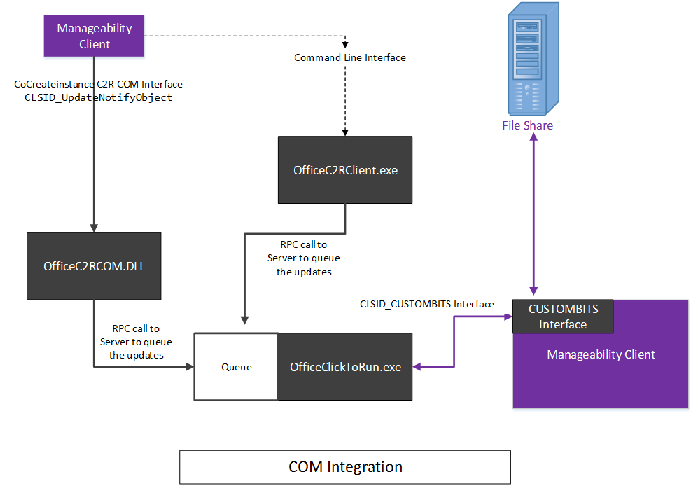
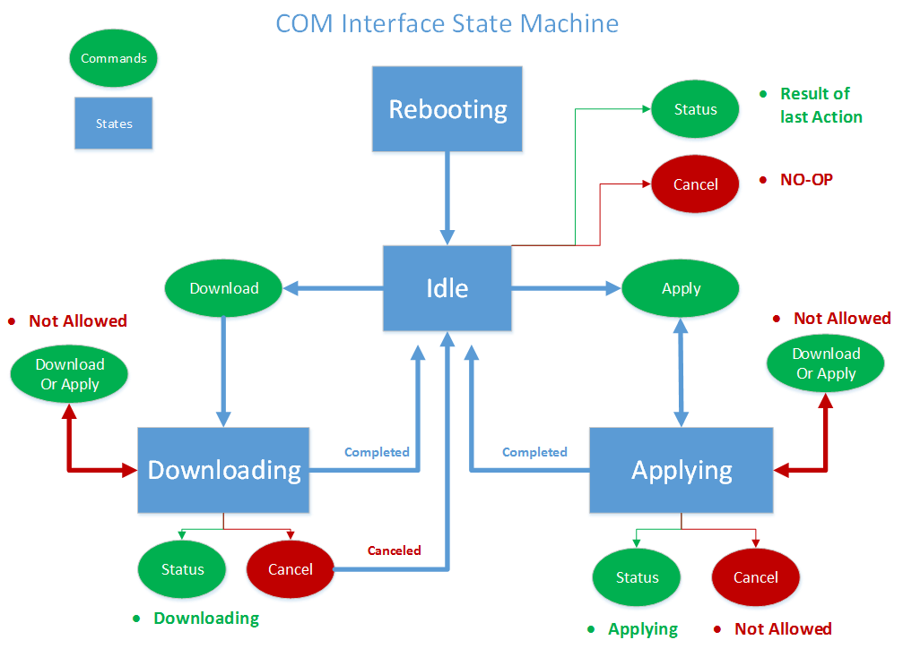
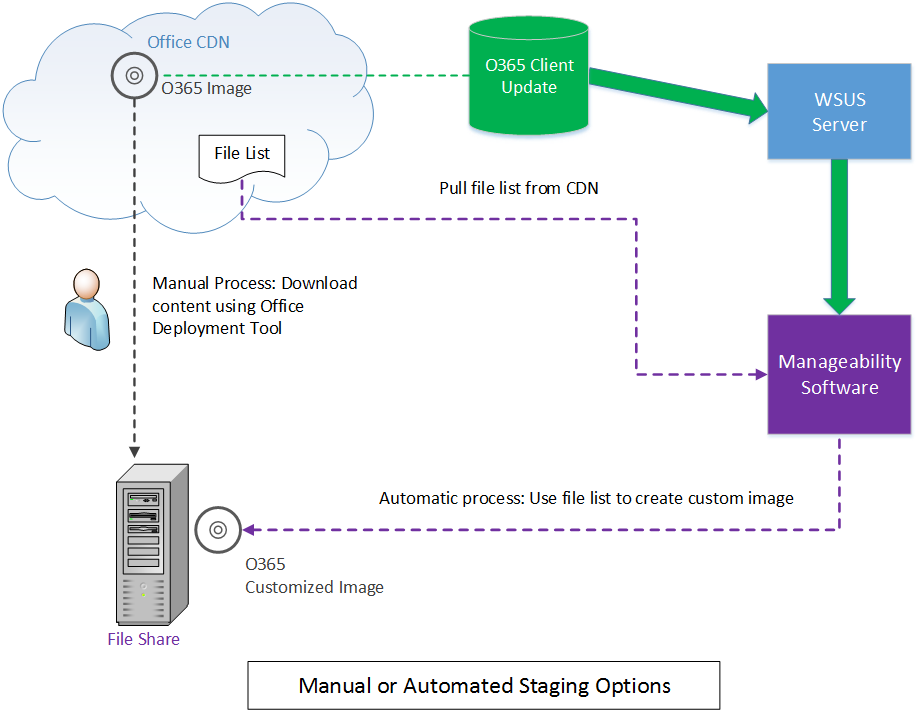
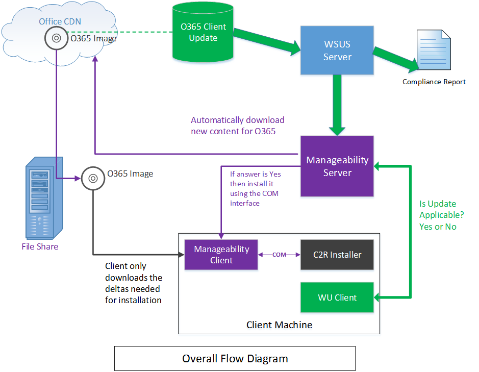

# Integrating manageability applications with Office 365 click-to-run installer

Learn how to integrate the Office 365 Click-to-Run installer with a software management solution.
  
The Office 365 Click-to-Run installer provides a COM interface that allows IT Professionals and software management solutions programmatic control over update management. This interface provides additional management capabilities beyond what is provided by the Office Deployment Tool.
  
> [!NOTE]
> This article applies to Office 2016 and later, Office 365. 
  
## Integrating with the Click-to-Run

To use this interface, a manageability application invokes the COM interface and calls exposed APIs that communicate directly with the Click-to-Run installation service. 
  
> [!NOTE]
> The Office Click-to-Run installer can be run from the command-line with parameters that can control the behavior, as documented in [Office Deployment Tool for Click-to-Run](https://www.microsoft.com/en-us/download/details.aspx?id=49117). 
  
**Following is a conceptual diagram of the COM interface**


  
The Office 365 Click-to-Run installer implements a COM-based interface, **IUpdateNotify** registered to CLSID **CLSID_UpdateNotifyObject**.
  
This interface can be invoked as follows:
  
```cpp
hr = CoCreateInstance(CLSID_UpdateNotifyObject, NULL, CLSCTX_ALL,
       IID_IUpdateNotify, 
      (void **)&p); 
```

The call will only succeed if the caller is running under elevated privileges, as the Click-to-Run installation program must be run with elevated privileges.
  
The **IUpdateNotify** COM interface exposes three asynchronous functions responsible for validating the commands and parameters and scheduling execution with the Click-to-Run installation service. 
  
```cpp
HRESULT Download([in] LPWSTR pcwszParameters) // Download update content.
HRESULT Apply([in] LPWSTR pcwszParameters) // Apply update content.
HRESULT Cancel() // Cancel the download action.

```

A forth method, **Status**, can be used to get information about the status of the last executed command or the status of the currently executing command (i.e. success, failure, detailed error codes).
  
```cpp
HRESULT status([out] _UPDATE_STATUS_REPORT* pUpdateStatusReport) // Get status of current action. 
typedef struct _UPDATE_STATUS_REPORT  
{  
UPDATE_STATUS status;  
UINT error; 
BSTR contentid;  
} UPDATE_STATUS_REPORT;

```

There are four states that the Click-to-Run installation service may be in during its lifecycle, during which **IUpdateNotify** methods may be called; Rebooting, Idle, Downloading and Applying. 
  
**Following is the COM Interface State Machine diagram**


  
> [!NOTE]
> **Rebooting**: When the machine is booting there is a period of time when the Click-to-Run installer service is not available. A successful call to the Status method after a reboot will return eUPDATE_UNKNOWN. 
  
**Idle:** When the Click-to-Run installer is in the idle state, you can call: 
  
- **Apply**: Install previously downloaded content.
    
- **Cancel**: Returns  `0x800000e`, "A method was called at an unexpected time."
    
- **Download**: Downloads new content to the client for later installation.
    
- **Status**: Returns the result of the last completed action, or an error message if the action ended in failure. If there is no previous action, **Status** returns  `eUPDATE_UNKNOWN`.
    
**Downloading:** When the Click-to-Run installer is in the downloading state, you can call: 
  
- **Apply**: Returns an **HRESULT** with the value  `0x800000e`, "A method was called at an unexpected time."
    
- **Cancel**: Stops the download and removes the partially downloaded content.
    
- **Download**: Returns an **HRESULT** with the value  `0x800000e`, "A method was called at an unexpected time." 
    
- **Status**: Returns **DOWNLOAD_WIP** to indicate that download work is in progress. 
    
**Applying:** When the Click-to-Run installer is in the process of installing previously download content: 
  
- **Apply**: Returns an **HRESULT** with the value  `0x800000e`, "A method was called at an unexpected time."
    
- **Cancel**: Returns  `0x800000e`, the Apply action cannot be canceled.
    
- **Download**: Returns an **HRESULT** with the value  `0x800000e`, "A method was called at an unexpected time." 
    
- **Status**: Returns **APPLY_WIP** to indicate that apply work is in progress. 
    
> [!NOTE]
> Since OfficeC2RCOM is a COM+ service and is dynamically loaded, you need to call **CoCreateInstance** every time you call a method on this class to ensure that you get the expected result. The COM+ service will handle creating a new instance if necessary. When one of the methods is called for the first time, COM+ will load the **IUpdateNotify** object and run it within one of the dllhost.exe instances. The new object will stay active for about 3 minutes in idle. If a subsequent call is made within three minutes of the last call, the **IUpdateNotify** object will remain loaded and a new instance is not created. If no call is made within three minutes, the IUpdateNotify object will be unloaded and a new **IUpdateNotify** object will be created when the next call is made. 
  
## Click-to-Run installer COM API reference guide

In the following API reference documentation:
  
- Parameters are in a key/value pair format separated by a space.
    
- The parameters are not case-sensitive.
    
- There is a [list of parameters](https://blogs.technet.microsoft.com/odsupport/2014/03/03/the-new-update-now-feature-for-office-2013-click-to-run-for-office365-and-its-associated-command-line-and-switches/) with documentation available. 
    
- Summary of IUpdateNotify2 interface is now included.
    
### Apply

```cpp
HRESULT Apply([in] LPWSTR pcwszParameters) // Apply update content.
```

#### Parameters

-  _displaylevel_: **true** to show the installation status, including errors, during the update process; **false** to hide the installation status, including errors, during the update process. The default is **false**.
    
-  _forceappshutdown_: **true** to force Office applications to shut down immediately when the **Apply** action is triggered; **false** to fail if any Office applications are running. The default is **false**. See [Remarks](#bk_ApplyRemark) for more information. 
    
  If any Office application is running when the **Apply** action is triggered, the **Apply** action will usually fail. Passing  `forceappshutdown=true` to the **Apply** method will cause the **OfficeClickToRun** service to immediately shut down the applications and apply the update. The user may experience data loss in this case. 
    
#### Return results

|||
|:-----|:-----|
|**S_OK** <br/> |Action was successfully submitted to the Click-To-Run service for execution.  <br/> |
|**E_ACCESSDENIED** <br/> |The caller is not running with elevated privileges.  <br/> |
|**E_INVALIDARG** <br/> |Invalid parameters were passed.  <br/> |
|**E_ILLEGAL_METHOD_CALL** <br/> |Action is not allowed at this time. See [Remarks](#bk_ApplyRemark) for more information.  <br/> |

<a name="bk_ApplyRemark"></a>

#### Remarks

- If any Office application is running when the **Apply** action is triggered, the **Apply** action will fail. Passing  `forceappshutdown=true` to the **Apply** method will cause the **OfficeClickToRun** service to immediately shut down any Office applications that are running and apply the update. The user may experience data as they are not prompted to save changes to open documents.. 
    
- This action can only be triggered when the COM status is one of the following: 
    
  - **eUPDATE_UNKNOWN**
    
  - **eDOWNLOAD_CANCELLED**
    
  - **eDOWNLOAD_FAILED**
    
  - **eDOWNLOAD_SUCCEEDED**
    
  - **eAPPLY_SUCCEEDED**
    
  - **eAPPLY_FAILED**
    
- If you call the **Apply** method without previously downloading content, the **Apply** method will report **Succeeded** as it detected nothing to apply and completed the **Apply** process successfully. 
    
### Cancel

```cpp
HRESULT Cancel() // Cancel the download action.
```

#### Return results

|||
|:-----|:-----|
|S_OK  <br/> |Action was successfully submitted to the Click-to-Run service for execution.  <br/> |
|E_ILLEGAL_METHOD_CALL  <br/> |Action is not allowed at this time. See the [Remarks](#bk_CancelRemarks) section for more information  <br/> |

<a name="bk_CancelRemarks"></a>

#### Remarks

- This method can only be triggered when the COM status id **eDOWNLOAD_WIP**. It will attempt to cancel the current download action. The COM status will change to **eDOWNLOAD_CANCELLING** and eventually change to **eDOWNLOAD_CANCELED**. The COM status will return **E_ILLEGAL_METHOD_CALL** if triggered at any other time. 
    
### Download

```cpp
HRESULT Download([in] LPWSTR pcwszParameters) // Download update content.
```

#### Parameters

-  _displaylevel_: **true** to show the installation status, including errors, during the update process; **false** to hide the installation status, including errors, during the update process. The default is **false**.
    
-  _updatebaseurl_: URL to the alternate download source.
    
-  _updatetoversion_: The version to update Office to. Define this parameter if you want to update to an older version than the version that is currently installed.
    
-  _downloadsource_: CLSID of the customized **IBackgroundCopyManager** implementation (BITS manager). 
    
-  _contentid_: Identifies the content to download from the content server through the customized BITS manager. This value is passed through the BITS interface for interpretation.
    
#### Return results

|||
|:-----|:-----|
|**S_OK** <br/> |Action was successfully submitted to the Click-To-Run service for execution.  <br/> |
|**E_ACCESSDENIED** <br/> |The caller is not running with elevated privileges.  <br/> |
|**E_INVALIDARG** <br/> |Invalid parameters were passed.  <br/> |
|**E_ILLEGAL_METHOD_CALL** <br/> |Action is not allowed at this time. See [Remarks](#bk_DownloadRemark) for more information.  <br/> |

<a name="bk_DownloadRemark"></a>

#### Remarks

- You must specify  _downloadsource_ and  _contentid_ as a pair. If not, the **Download** method will return an **E_INVALIDARG** error. 
    
- If  _downloadsource_,  _contentid_, and  _updatebaseurl_ are provided,  _updatebaseurl_ will be ignored. 
    
- This action can only be triggered when the COM status is one of the following: 
    
  - **eUPDATE_UNKNOWN**
    
  - **eDOWNLOAD_CANCELLED**
    
  - **eDOWNLOAD_FAILED**
    
  - **eDOWNLOAD_SUCCEEDED**
    
  - **eAPPLY_SUCCEEDED**
    
  - **eAPPLY_FAILED**
    
- If you call the **Apply** method without previously downloaded content, the **Apply** method will report **Succeeded** as it detected nothing to apply and completed the **Apply** process successfully. 
    
#### Examples

- To download the content from the customized BITS manager: Call the **download()** function passing the following parameters: 
    
  ```cpp
  "downloadsource=CLSIDofBITSInterface contentid=BITSServerContentIdentifier"
  ```

- To download the content from the Microsoft CDN: Call the **download()** function without specifying the  _downloadsource_,  _contentid_, or  _updatebaseurl_ parameters. 
    
- To download the content from a customized location: Call the **download()** function passing the following parameter: 
    
  ```cpp
  "updatebaseurl=yourcontentserverurl"
  ```

### Status

```cpp
typdef struct _UPDATE_STATUS_REPORT
{
    UPDATE_STATUS status;
    UINT error;
    LPCWSTR contentid;
}UPDATE_STATUS_REPORT;
HRESULT status([out] _UPDATE_STATUS_REPORT& pUpdateStatusReport) // Get status of current action
```

#### Parameters

|||
|:-----|:-----|
| _pUpdateStatusReport_ <br/> |Pointer to an UPDATE_STATUS_REPORT structure.  <br/> |
   
#### Return results

|||
|:-----|:-----|
|**S_OK** <br/> |The **Status** method always returns this result. Inspect the  `UPDATE_STATUS_RESULT` structure for the status of the current action.  <br/> |
   
#### Remarks

- The status field of the  `UPDATE_STATUS_REPORT` contains the status of the current action. One of the following status values is returned: 
    
  ```cpp
  typedef enum _UPDATE_STATUS
  {
  eUPDATE_UNKNOWN = 0,
  eDOWNLOAD_PENDING,
  eDOWNLOAD_WIP,
  eDOWNLOAD_CANCELLING,
  eDOWNLOAD_CANCELLED,
  eDOWNLOAD_FAILED,
  eDOWNLOAD_SUCCEEDED,
  eAPPLY_PENDING,
  eAPPLY_WIP,
  eAPPLY_SUCCEEDED,
  eAPPLY_FAILED,
  } UPDATE_STATUS;
  
  ```

- If the last command resulted in an error, the error field of the  `UPDATE_STATUS_REPORT` contains detailed information about the error. Two types of error codes are returned from the **Status** method. 
    
- If the error less than  `UDPATE_ERROR_CODE::eUNKNOWN`, the error is one of the following pre-defined error codes:
    
  ```cpp
  typedef enum _UPDATE_ERROR_CODE
  {
  eOK = 0,
  eFAILED_UNEXPECTED,
  eTRIGGER_DISABLED,
  ePIPELINE_IN_USE,
  eFAILED_STOP_C2RSERVICE,
  eFAILED_GET_CLIENTUPDATEFOLDER,
  eFAILED_LOCK_PACKAGE_TO_UPDATE,
  eFAILED_CREATE_STREAM_SESSION,
  eFAILED_PUBLISH_WORKING_CONFIGURATION,
  eFAILED_DOWNLOAD_UPGRADE_PACKAGE,
  eFAILED_APPLY_UPGRADE_PACKAGE,
  eFAILED_INITIALIZE_RSOD,
  eFAILED_PUBLISH_RSOD,
  // Keep this one as the last
  eUNKNOWN
  } UPDATE_ERROR_CODE;
  
  ```

  If the return error code is larger than  `UDPATE_ERROR_CODE::eUNKNOWN` it is the **HRESULT** of a failed function call. To extract the HRESULT subtract  `UDPATE_ERROR_CODE::eUNKNOWN` from the value returned in the error field of the  `UPDATE_STATUS_REPORT`.
    
  The complete list of status and error values can be viewed by inspecting the **IUpdateNotify** type library embedded in OfficeC2RCom.dll. 
    
- The contentid field is used for calls to **Status** after **Download** has initiated and returns the contentid that was passed in to the **Download** call. It is a best practice to initialize this field to **null** before you call the **Status** method and then check the value after **Status** has been returned. If the value is still **null**, that means there is no contentid to return. If the value is not **null**, you need to free it with a call to **SysFreeString()**. Here is a code snippet of how to call **Status** after **Download**.
    
  ```cpp
  std::wstring contentID;
  UPDATE_STATUS_REPORT statusReport;
  statusReport.status = eUPDATE_UNKNOWN;
  statusReport.error = eOK;
  statusReport.contentid = NULL;
  hr = p->Status(&statusReport);
  if (statusReport.contentid != NULL)
  {
  contentID = statusReport.contentid;
  SysFreeString(statusReport.contentid);
  }
  wprintf(L"ContentID: %s, Status: %d, LastError: %d", contentID.c_str(), statusReport.status, statusReport.error);
  
  ```

### Summary of IUpdateNotify2 interface

> [!NOTE]
> This summary is provided as a compliment info to [Integrating manageability applications with the Office 365 click-to-run installer](https://msdn.microsoft.com/EN-US/library/office/mt608768.aspx). Once the public doc is updated, this doc can be considered as obsolete. 
  
From C2RTenant [16.0.8208.6352](http://oloop/BuildGroup/Details/tenantc2rclient#3519/1255278) (First publicly available build should be June fork build -- 8326.*) we have added a new **IUpdateNotify2** interface. Here is some basic info about this interface: 
  
- CLSID_UpdateNotifyObject2, {52C2F9C2-F1AC-4021-BF50-756A5FA8DDFE}
    
- This interface also hosted the original IUpdateNotify interface to provide backward compatibility. Which means if you use this interface, you have access to all the methods provided in **UpdateNotifyObject** interface. 
    
- New methods added to IUpdateNotify2:
    
  - **HRESULT** GetBlockingApps([out] BSTR \* AppsList). Get updates blocking apps list. This call will return running Office apps which will block the update process from proceeding. 
    
  - **HRESULT** GetOfficeDeploymentData([in] int dataType, [in] **LPCWSTR** pcwszName, [out] BSTR * OfficeData). Get Office deployment Data. 
    
- If you want to use the new methods, you need to make sure:
    
  - Your C2R version is newer than the above build (\>= June fork build).
    
  - Use UpdateNotifyObject2, instead of **UpdateNotifyObject** to call **CoCreateInstance**.
    
If you don't use any of the new methods, you don't need to change anything. All the existing methods will work as exact the same way as before.
  
## Implementing the BITS interface

The [Background Intelligent Transfer Service](https://msdn.microsoft.com/en-us/library/bb968799(v=vs.85).aspx) (BITS) is a service provided by Microsoft to transfer files between a client and server. BITS is one of the channels that Office Click-To-Run installer can use to download content. By default, the Office Click-To-Run installer uses the Windows' built in implementation of BITS to download the content from the CDN. 
  
By providing a customized BITS implementation to the **download()** method of the **IUpdateNotify** interface, your manageability software can control where and how the client downloads the content. A customized BITS interface is useful when providing a custom content distribution channel other than the Click-to-Run built-in channels, such as the Office CDN, IIS servers, or file shares. 
  
The minimum requirement for a customized BITS interface to work with Office C2R service is:
  
- For **IBackgroundCopyManager**:
    
  ```cpp
  HRESULT _stdcall CreateJob(
                      [in] LPWSTR DisplayName, 
                      [in] BG_JOB_TYPE Type, 
                      [out] GUID* pJobId, 
                      [out] IBackgroundCopyJob** ppJob)
  HRESULT _stdcall GetJob(
                      [in] GUID* jobID, 
                      [out] IBackgroundCopyJob** ppJob)
  HRESULT _stdcall EnumJobs(
                      [in] unsigned long dwFlags, 
                      [out] IEnumBackgroundCopyJobs** ppenum)
  
  ```

- For **IBackgroundCopyJob**:
    
  ```cpp
  HRESULT _stdcall AddFile(
                      [in] LPWSTR RemoteUrl, 
                      [in] LPWSTR LocalName)
  HRESULT _stdcall Resume()
  HRESULT _stdcall Complete()
  HRESULT _stdcall Cancel();
  HRESULT _stdcall GetState([out] BG_JOB_STATE* pVal);
  HRESULT GetProgress( [out] BG_JOB_PROGRESS *pProgress);
  
  ```

- For **IBackgroundCopyJob3**:
    
  ```cpp
  HRESULT _stdcall AddFileWithRanges(
                      [in] LPWSTR RemoteUrl, 
                      [in] LPWSTR LocalName,
                      [in] DWORD RangeCount,
                      [in] BG_FILE_RANGE Ranges[])
  
  ```

- For the  `Addfile` and  `AddFileWithRanges` functions, the remote URL is in the following format: 
    
  ```cpp
  cmbits://<contentid>/<relative path to target file>
  ```

  - cmbits is hard coded, and stands for customized BITS.
    
  -  _\<contentid\>_ is the  _contentid_ parameter for the **Download()** method. 
    
  -  _\<relative path to target file\>_ provides the location and file name of the file to download. 
    
    For example, if you have provided a  _contentid_ of  `f732af58-5d86-4299-abe9-7595c35136ef` to the **Download()** method, and Office C2R wants to download the version cab file, such as  `v32.cab` file, it will call **AddFile()** with the following  `RemoteUrl`:
    
  ```cpp
  cmbits://f732af58-5d86-4299-abe9-7595c35136ef/Office/Data/V32.cab
  ```

- For **IBackgroundCopyError**:
    
  ```cpp
  HRESULT _stdcall GetErrorDescription(
        [in]  DWORD  LanguageId,
        [out] LPWSTR *ppErrorDescription);
  
  ```

- For **IBackgroundCopyFile**:
    
  ```cpp
  HRESULT _stdcall GetLocalName([out] LPWSTR *ppName); 
  HRESULT _stdcall GetRemoteName([out] LPWSTR *ppName);
  
  ```

<!--## Automating content staging

IT administrators can choose to have desktop clients enabled to automatically receive updates when they are available directly from the Microsoft Content Delivery Network (CDN) or they can choose to control the deployment of updates available from the [update channels](https://support.office.com/en-us/article/Overview-of-update-channels-for-Office-365-ProPlus-9ccf0f13-28ff-4975-9bd2-7e4ea2fefef4?ui=en-US&rs=en-US&ad=US) using the [Office 2016 Deployment Tool](https://www.microsoft.com/en-us/download/details.aspx?id=49117) or [System Center Configuration Manager](https://support.office.com/en-us/article/Manage-updates-to-Office-365-ProPlus-with-System-Center-Configuration-Manager-b4a17328-fcfe-40bf-9202-58d7cbf1cede).
  
The service supports the ability for management tools to recognize and automate the download of the content when updates are made available.
  
**Following is a diagram showing the overview of downloading a custom image**


  
In the above diagram you see that a new Office 365 ProPlus image is available on the Office Content Distribution Network (CDN). Along with the Office 365 ProPlus image, an XML-formatted file list is also available which has the information needed to enable manageability software to directly create customized images replacing the need for using the Office Deployment Tool.
  
An enterprise configures their WSUS to sync the Office 365 Client Updates. These updates do not contain the actual image payload but does allow the manageability software to recognize when new content is available. The manageability software can then read the Client Update metadata to understand what version of Office the update applies to.
  
If the update is applicable, the manageability software can use the CDN content and the file list to create the custom image and store it onto the file share location that it is configured to use.
  
### Format of the XML file list

There are two file lists available in a cab file on the CDN. One lists the files for the 32-bit version of Office and one for the 64-bit version of Office. The URL of the location of the Office File List (OFL.CAB) file is [http://officecdn.microsoft.com/pr/wsus/ofl.cab](http://officecdn.microsoft.com/pr/wsus/ofl.cab). The two file lists are called:
  
- O365Client_32bit.xml
    
- O365Client_64bit.xml
    
Within the XML for each of the file lists is an  `UpdateFiles` node which contains a version attribute.  `UpdateFiles version="1.4"`.
  
This version is incremented if changes are made to the file lists.
  
There are two parameters that need to be combined with the XML to make a custom image: 
  
- Replace  _%version%_ with the build version of Office. This can be derived from the Client Update metadata  `MoreInfoURL` field, see below. 
    
- Define  _baseURL_ by using the URL value associated with the branch the image is being created for. This can be derived from the Client Update metadata, see below. 
    
The steps for creating an image are:
  
1. Open the XML file list.
    
2. Replace occurrences of  _%version%_ with the applicable Office build version. The build version can be acquired from releasehistory.xml as described later in this article. 
    
3. Read the URL attribute for the target branch.
    
4. Remove language nodes for any languages not required in the custom image.
    
   > [!NOTE]
   > Nodes with language='0' are language neutral and must be included in the image. 
  
5. Construct a local image of the CDN by iterating through the XML file list and copying the CDN files, while creating the folder structure as needed. 
    
   - If the  _rename_ attribute is provided, then rename the copied file to the value provided in the  _rename_ attribute. This used to create the top-level default v64.cab and v32.cab files. These are the renamed versions of the top-level build cab file and are used as the default installation version if the version is not specified. 
    
   - Use URL + relativePath + filename to construct the CDN location.
    
The following examples use the Monthly channel (as defined by the  `baseURL` node) and build version 16.0.4229.1004 from releasehistory.xml. 
  
```cpp
baseURL branch="Monthly" URL="http://officecdn.microsoft.com/pr/492350f6-3a01-4f97-b9c0-c7c6ddf67d60" /
```

- The following is a language neutral file needed for all languages. The name of the file is v64_16.0.4229.1004.cab and it should be copied from http://officecdn.microsoft.com/pr/492350f6-3a01-4f97-b9c0-c7c6ddf67d60/office/data/v64_16.0.4229.1004.cab and renamed to …/office/data/v64.cab.
    
  ```cpp
  baseURL branch="Business" URL="http://officecdn.microsoft.com/pr/7ffbc6bf-bc32-4f92-8982-f9dd17fd3114" /
  File name="v64_%version%.cab" rename="v64.cab" relativePath="/office/data/" language="0"/
  
  ```

- The following is a file to be included in the en-US image as designated by the language LCID=1033. The name of the file is s641033.cab and it should be copied from http://officecdn.microsoft.com/pr/492350f6-3a01-4f97-b9c0-c7c6ddf67d60/office/data/16.0.4229.1004/s641033.cab and not renamed.
    
  ```cpp
  File name="s641033.cab" relativePath="/office/data/%version%/" language="1033" /
  ```

### Hash verification of data files

Image creation tools may verify the integrity of the downloaded .dat files by comparing a computed HASH value with the supplied HASH value associated with each of the .dat files. Below is an example of a .dat file from the Monthly channel with build version 16.0.4229.1004 and language set to Bulgarian.
  
```cpp
File name="stream.x64.bg-bg.dat" hashLocation="s641026.cab/stream.x64.bg-bg.hash" hashAlgo="Sha256" relativePath="/office/data/%version%/" language="1026"
```

- The  _hashLocation_ attribute specifies the relative path location of the stream.x64.bg-bg.hash for the stream.x64.bg-bg.dat file. Construct the hash file location by concatenating URL + relativePath + hashLocation. In this example the stream.x64.bg-bg.hash location would be http://officecdn.microsoft.com/pr/492350f6-3a01-4f97-b9c0-c7c6ddf67d60/office/data/16.0.4229.1004/s641026.cab/stream.x64.bg-bg.hash 
    
- The  _hashAlgo_ attribute specifies what hashing algorithm was used. In this case the Sha256 algorithm was used. 
    
To validate the integrity of the stream.x64.bg-bg.dat file, open the stream.x64.bg-bg.hash and read the hash value from the first line of text in the hash file. Compare this to the has value that you computed using the specified hashing algorithm to verify that the values match. Use the following C# code to read the hash.
  
```cs
string[] readHashes = System.IO.File.ReadAllLines(tmpFile, Encoding.Unicode);
string readHash = readHashes.First();

```

### Office 365 Client Updates

Office 365 Client Updates enable manageability software to treat the Office 365 Client Updates in a manner very similar to any other WU update with one exception; the client updates do not contain an actual payload. The Office 365 Client Updates should not be installed on any clients but rather used to trigger the workflows with the manageability software replacing the installation command with the COM based installation mechanism shown above.
  
**Office 365 Client Update workflow**


  
Each Office 365 Client Update that is published includes metadata about the update. This metadata includes a parameter called  _MoreInfoUrl_ which can be used to derive the following information: 
  
-  _Ver_: Identifies the Office version associated with this update. For example 16.0.4229.1004.
    
-  _Branch_: Identifies the Update Channel for this update. Values include InsiderFast, Insiders, Monthly, Targeted, Broad. Additional values may be added in the future.
    
-  _Arch_: Identifies the processor architecture associated with this update.
    
-  _xmlVer_: Identifies the version of the XML file lists to use to construct the base image for this update.
    
-  _xmlPath_: Path to the OFL.CAB file that contains the XML file lists.
    
-  _xmlFile_: The name of the file list that should be used for this update. The value will be  `O365Client_32bit` or  `O365Client_64bit` and will match the value in  _Arch_.
    
The following is an example of the  _MoreInfoURL_ parameter which refers to the Office 365 Client Update for the 32-bit version of Office with build version of 16.0.2342.2343 on the Current channel. 
  
```http
http://officecdn.microsoft.com/pr/wsus/ofl.cab is the location of the XML file lists for this update, specifically the O365Client_32bit.xml from within the OFL.CAB.
http://go.microsoft.com/fwlink/?LinkId=626090&Ver=16.0.8326.2096&Branch=Current&Arch=64&XMLVer=1.4&xmlPath=http://officecdn.microsoft.com/pr/wsus/ofl.cab&xmlFile=O365Client_64bit.xml 

```
THE ABOVE SECTION APPEARS TO BE A DUPLICATE OF THE FOLLOWING SECTION; TEMPORARILY COMMENTING IT OUT.-->

## Automating content staging

IT administrators can choose to have desktop clients enabled to automatically receive updates when they are available directly from the Microsoft Content Delivery Network (CDN) or they can choose to control the deployment of updates available from the update channels using the Office Deployment Tool or System Center Configuration Manager.
  
The service supports the ability for management tools to recognize and automate the download of the content when updates are made available.
  
**The following image is an overview of downloading a custom image**


  
### Overview of downloading a custom image
  
In the previous diagram, you see that a new Office 365 ProPlus image is available on the Office Content Distribution Network (CDN). Along with the Office 365 ProPlus image, an XML-formatted file list is also available which has the information needed to enable manageability software to directly create customized images replacing the need for using the Office Deployment Tool.
  
An enterprise configures their WSUS to sync the Office 365 Client Updates. These updates do not contain the actual image payload but does allow the manageability software to recognize when new content is available. The manageability software can then read the Client Update metadata to understand what version of Office the update applies to.
  
If the update is applicable, the manageability software can use the CDN content and the file list to create the custom image and store it onto the file share location that it is configured to use.
  
### Format of the XML file list

There are two file lists available in a cab file on the CDN. One lists the files for the 32-bit version of Office and one for the 64-bit version of Office. The URL of the location of the Office File List (OFL.CAB) file is [http://officecdn.microsoft.com/pr/wsus/ofl.cab](http://officecdn.microsoft.com/pr/wsus/ofl.cab). The two file lists are called:
  
- O365Client_32bit.xml
    
- O365Client_64bit.xml
    
Within the XML for each of the file lists is an <UpdateFiles> node which contains a version attribute.  `<UpdateFiles version="1.4">`. This version is incremented if changes are made to the file lists.
  
There are two parameters that need to be combined with the XML to make a custom image: 
  
- Replace  *%version%*  with the build version of Office. This can be derived from the Client Update metadata (explained in the next section). 
    
- Define  *baseURL*  by using the URL value associated with the branch the image is being created for. This is derived from the Client Update metadata, explained in the following section. 
    
The steps for creating an image are:
  
1. Open the XML file list.
    
2. Replace occurrences of  *%version%*  with the applicable Office build version. The build version can be acquired from releasehistory.xml as described later in this article. 
    
3. Read the URL attribute for the target branch.
    
4. Remove language nodes for any languages not required in the custom image.
    
   > [!NOTE]
   > Nodes with language='0' are language neutral and must be included in the image. 
  
5. Construct a local image of the CDN by iterating through the XML file list and copying the CDN files, while creating the folder structure as needed. 
    
   - If the  *rename*  attribute is provided, then  *rename*  the copied file to the value provided in the rename attribute. This is used to create the top-level default v64.cab and v32.cab files. These are the renamed versions of the top-level build cab file and are used as the default installation version if the version is not specified. 
    
   - Use URL + relativePath + filename to construct the CDN location.
    
The following are examples that use the Monthly channel (as defined by the  `<baseURL>` node) and build version 16.0.4229.1004 from releasehistory.xml. 
  
```xml
<baseURL branch="Monthly" URL="http://officecdn.microsoft.com/pr/492350f6-3a01-4f97-b9c0-c7c6ddf67d60" />
```

- The following is a language neutral file needed for all languages. The name of the file is v64_16.0.4229.1004.cab and it should be copied from `http://officecdn.microsoft.com/pr/492350f6-3a01-4f97-b9c0-c7c6ddf67d60/office/data/v64_16.0.4229.1004.cab` and renamed to `…/office/data/v64.cab`. 
    
  ```xml
  <File name="v64_%version%.cab" rename="v64.cab" relativePath="/office/data/" language="0"/>
  
  ```

- The following is a file to be included in the en-US image as designated by the language LCID=1033. The name of the file is s641033.cab and it should be copied from `http://officecdn.microsoft.com/pr/492350f6-3a01-4f97-b9c0-c7c6ddf67d60/office/data/16.0.4229.1004/s641033.cab` and not renamed.
    
  ```xml
  <File name="s641033.cab" relativePath="/office/data/%version%/" language="1033" />
  ```

### Hash verification of .dat files

Image creation tools may verify the integrity of the downloaded .dat files by comparing a computed HASH value with the supplied HASH value associated with each of the .dat files. Following is an example of a .dat file from the Monthly channel with build version 16.0.4229.1004 and language set to Bulgarian:
  
```xml
<File name="stream.x64.bg-bg.dat" hashLocation="s641026.cab/stream.x64.bg-bg.hash" hashAlgo="Sha256" relativePath="/office/data/%version%/" language="1026"/>
```

- The **hashLocation** attribute specifies the relative path location of the stream.x64.bg-bg.hash for the stream.x64.bg-bg.dat file. Construct the hash file location by concatenating URL + relativePath + hashLocation. In the following example, the stream.x64.bg-bg.hash location would be: 
    
  ```http
  http://officecdn.microsoft.com/pr/492350f6-3a01-4f97-b9c0-c7c6ddf67d60/office/data/16.0.4229.1004/s641026.cab/stream.x64.bg-bg.hash 
  ```

- The **hashAlgo** attribute specifies what hashing algorithm was used. In this case Sha256 was used. 
    
  To validate the integrity of the stream.x64.bg-bg.dat file, open the stream.x64.bg-bg.hash and read the HASH value which is the first line of text in the hash file. Compare this to the computed hash value (using the specified hashing algorithm) to verify the integrity of the downloaded .dat file.
    
  The following example shows the C# code to read the hash.
    
  ```cs
    string[] readHashes = System.IO.File.ReadAllLines(tmpFile, Encoding.Unicode);
    string readHash = readHashes.First();
  ```

### Office 365 Client Updates

All Office 365 Client Updates are published to the [Microsoft Update Catalog](http://www.catalog.update.microsoft.com/Search.aspx?q=office+365+client).
  
Office 365 Client Updates enable manageability software to treat the Office 365 Client Updates in a manner very similar to any other WU update with one exception; the client updates do not contain an actual payload. The Office 365 Client Updates should not be installed on any clients but rather used to trigger the workflows with the manageability software replacing the installation command with the COM based installation mechanism shown above. 
  
**The following figure shows a diagram of the Office 365 Client Update workflow.**


  
Each Office 365 Client Update that is published includes metadata about the update. This metadata includes a parameter called  *MoreInfoUrl*  which can be used to derive the following information: 
  
-  *Ver*: Identifies the Office version associated with this update. 
    
-  *Branch*: Identifies the Update Channel for this update. Values include InsiderFast, Insiders, Monthly, Targeted, Broad. Additional values may be added in the future. 
    
-  *Arch*: Identifies the processor architecture associated with this update. 
    
-  *xmlVer*: The version of the XML file lists that should be used to construct the base image for this update. 
    
-  *xmlPath*: Path to the OFL.CAB file which contains the XML file lists. 
    
-  *mlFile*: The name of the file list that should be used for this update. The value will be O365Client_32bit or O365Client_64bit and will match the Arch. 
    
The following URL is an example of the  *MoreInfoURL*  parameter which refers to the Office 365 client update releases for the 32-bit version of Office with build version of 16.0.2342.2343 on the Current channel. 
  
http://officecdn.microsoft.com/pr/wsus/ofl.cab is the location of the XML file lists for this update, specifically the O365Client_32bit.xml from within the OFL.CAB.
  
[Office 365 client update channel releases](http://go.microsoft.com/fwlink/?LinkId=626090&Ver=16.0.8326.2096&Branch=Current&Arch=64&XMLVer=1.4&xmlPath=http://officecdn.microsoft.com/pr/wsus/ofl.cab&xmlFile=O365Client_64bit.xml)
  
### Additional metadata for automating content staging

In addition to the metadata that is published which defines there are also additional XML files published to the CDN that can help provide additional information about the Office 365 clients that are available from the Office CDN.
  
**SKUS.XML**
  
This XML file is contained within a signed CAB and published to the Office CDN at the following URL: [http://officecdn.microsoft.com/pr/wsus/skus.cab](http://officecdn.microsoft.com/pr/wsus/skus.cab).
  
The metadata published in this XML file is useful for determining which products are available for deployment and servicing from the Office CDN along with various options for each. 
  
```XML
<?xml version="1.0" encoding="utf-8"?>
<ReleaseInfo PublishedDate="08/07/2017 16:34">
  <!-- Suite / App catalog -->
  <Suite>
    <SKU Name="Office 365 ProPlus" ProductID="O365ProPlusRetail" Default="True">
      <Apps>
        <App Name="Access" AppID="Access" />
        <App Name="Excel" AppID="Excel" />
        <App Name="OneDrive for Business (Groove)" AppID="Groove" />
        <App Name="OneDrive for Business (Next Gen Sync Client)" AppID="OneDrive" />
        <App Name="OneNote" AppID="OneNote" />
        <App Name="Outlook" AppID="Outlook" />
        <App Name="PowerPoint" AppID="PowerPoint" />
        <App Name="Publisher" AppID="Publisher" />
        <App Name="Skype for Business" AppID="Lync" />
        <App Name="Word" AppID="Word" />
      </Apps>
      <Channels>
        <Channel ID="Monthly"/>
        <Channel ID="Insiders"/>
        <Channel ID="Targeted"/>
        <Channel ID="Broad"/>
      </Channels>
    </SKU>
```

**\<ReleaseInfo\>** root node contains the PublishedDate attribute which identifies the date which this file was published. 
  
**\<SKU\>** node identifies an individual SKU. 
  
- The  *ProductID*  attribute identifies the ID that is passed as the ID attribute in the configuration.xml if using the ODT. For example, `<Product ID="O365ProPlusRetail">`. 
    
- The  *Default*  attribute, if set to True, identifies the recommended SKU. 
    
**\<App\>** nodes are used to define the individual Office apps that each SKU supports. 
  
- The  *Name*  attribute is the displayed application name. 
    
- The  *AppID*  attribute is the ID attribute passed in the configuration.xml for the **\<ExcludeApp\>** node if using the ODT. For example, `<ExcludeApp ID="Publisher" />`. 
    
**RELEASEHISTORY.XML**
  
This XML file is contained within a signed CAB and published to the Office CDN at the following location: [http://officecdn.microsoft.com/pr/wsus/releasehistory.cab](http://officecdn.microsoft.com/pr/wsus/releasehistory.cab). 
  
The metadata published in this XML file is useful for determining which channels are supported for servicing updates from the Office CDN along with information about the build history for each of the supported channels.
  
```XML
<?xml version="1.0" encoding="utf-8"?>
<ReleaseHistory PublishedDate="10/22/2017 00:48">
  <UpdateChannel Name="Current" ID="Monthly" DisplayName="Monthly Channel">
    <Update Latest="True" Version="1709" LegacyVersion="16.0.8528.2139" Build="8528.2139" PubTime="2017-10-16T19:45:50.743Z" />
    <Update Latest="False" Version="1708" LegacyVersion="16.0.8431.2107" Build="8431.2107" PubTime="2017-10-11T01:52:33.793Z" />
    <Update Latest="False" Version="1708" LegacyVersion="16.0.8431.2079" Build="8431.2079" PubTime="2017-09-18T22:26:13.673Z" />
    <Update Latest="False" Version="1707" LegacyVersion="16.0.8326.2107" Build="8326.2107" PubTime="2017-09-12T18:56:53.657Z" />
    <Update Latest="False" Version="1707" LegacyVersion="16.0.8326.2096" Build="8326.2096" PubTime="2017-08-30T00:10:25.253Z" />
    <Update Latest="False" Version="1707" LegacyVersion="16.0.8326.2076" Build="8326.2076" PubTime="2017-08-19T00:13:01.787Z" />
    <Update Latest="False" Version="1707" LegacyVersion="16.0.8326.2073" Build="8326.2073" PubTime="2017-08-11T19:35:42.173Z" />
  </UpdateChannel>
```

The **\<ReleaseHistory\>** root node contains the PublishedDate attribute which identifies the date which this file was published. 
  
The **\<UpdateChannel\>** node defines a supported channel. 
  
- The  *Name*  attribute defines the channel ID which is used to pass to the ODT in the configuration.xml as the Channel attribute. 
    
  Example: `<Add SourcePath="\\Server\Share" OfficeClientEdition="32" Channel="Current">` 
    
  > [!NOTE] 
  > This attribute has been deprecated and is used for backward compatibility only. Use the ID attribute in place of the Name attribute. 
    
- The  *ID*  attribute defines the channel ID which is used to pass to the ODT in the configuration.xml as the Channel attribute. 
    
  Example: `<Add SourcePath="\\Server\Share" OfficeClientEdition="32" Channel="Deferred">` 
    
- The **DisplayName**  attribute is used as the display name. 
    
The **\<Update\>** node is used to define each update that has been published for that particular channel. 
  
- The **Latest**  attribute, if set to True, defines the release that is the latest release for that channel. 
    
- The **Version** attribute defines the version number for this particular update. 
    
- The **LegacyVersion** attribute defines the full version number for this particular update. 
    
- The **Build** attribute defines the build number for this particular update. 
    
- The **PubTime** attribute defines the date and time at which this update was published to the Office CDN. 
    

