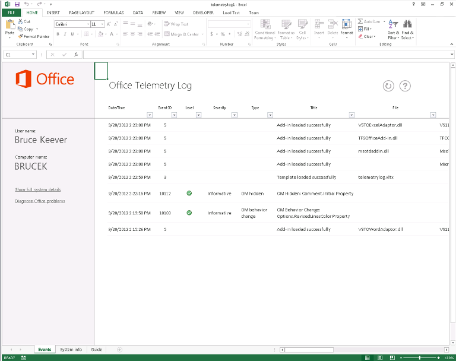

# Troubleshooting Office files and custom solutions with the telemetry log

Use the Telemetry Log for Office 2013 to determine compatibility issues with Office 2013 and solutions built for previous versions of Office.
  
The following article describes the Telemetry Log and how to use it. For more information about specific results displayed in the Telemetry Log, see [Compatibility issues in Office](compatibility-issues-in-office.md).
  
## Introduction

Over the course of many releases, Microsoft has provided tools and frameworks for customizing, automating, and extending Office. This has enabled businesses and users to build solutions or add-ins for Office applications to improve their productivity and efficiency. These solutions can range in complexity from simple Visual Basic for Applications (VBA) macros to robust .NET Framework customizations. Many users who have these solutions rely on them to complete business-critical tasks and may not even know that they are using a customization that is added to their Office applications.
  
With such a proliferation of Office solutions, upgrading versions of Office can be complex. Enterprises and users do not know whether their important and valuable solutions are completely compatible with the new version. Their solutions might use features and computer code that are available in previous versions of Office that have been deprecated in later versions. If a solution that uses a deprecated feature is loaded into the "host" application, the solution might behave differently, cause an error, fail to load, or cause the host application to fail.
  
The Telemetry Log for Office 2013, a tool built upon Excel 2013, helps developers and experienced users diagnose compatibility issues by displaying events that occur within select Office 2013 applications. Using this tool, users can determine potential issues with add-ins that they use in their work environment, giving enterprise decision-makers the information that they need to decide whether to upgrade to Office 2013. The Telemetry Log also gives detailed feedback about specific changes or deprecations in the object models for the Office 2013 applications, which helps developers quickly identify and refactor problematic code or controls. IT professionals can view trends in solution health across multiple clients by using the Telemetry Dashboard for Office 2013, a companion tool to the Telemetry Log.
  
For more information, see [Deploy Office Telemetry Dashboard](http://technet.microsoft.com/library/f69cde72-689d-421f-99b8-c51676c77717).
  
## How the Telemetry Log works

When an Office file or solution is loaded, used, closed, or raises an error in one of the selected Office 2013 applications, the application adds a record in a local data store (a database on the same computer) that includes information about the event. The record includes a title for the event, the application that logged the event, the time, the name of the file or solution, the severity, and a short description of any errors that may have occurred. When refreshed, the Telemetry Log workbook displays a list of the records contained in the local data store.
  
> [!NOTE]
> The default location for the local data store is %Users%\[Current user]\AppData\Local\Microsoft\Office\15.0\Telemetry. The default maximum size for the data store is 5 MB (5,120 KB). 
  
Selected Office 2013 applications have a run-time logging API that creates a record in the local data store every time that a file or solution raises one of the following events:
  
- **OnLoad**: A record is logged in the local data store when a file or solution is loaded into specific Office 2013 applications. The run-time error logging records the file name, location, and other information in the local data store when an **OnLoad** event is raised. 
    
- **OnClose**: A record is logged when a file or solution is closed within the application. The record includes the name of the solution or file, its location, and the application that logged the event.
    
- **OnError**: A record is logged when an error is found in a solution for certain Office 2013 applications. The record includes the name of the solution or file and the run-time failure or compatibility issue that the user encountered. When possible, errors are mapped to known compatibility issues and are displayed as such in the Telemetry Log.
    
The Telemetry Log displays information about a large list of files and solution types for a selection of Office 2013 applications. The type of files and solutions that are monitored by the run-time logging APIs vary by application. See the Table 1 for more information about what kinds of solutions are monitored.
  
### Table 1. Types of Office files and solutions tracked in Telemetry Log

|**Solution type**|**Applications**|**Description**|
|:-----|:-----|:-----|
|Task pane apps    |Excel 2013, Word 2013, Project 2013    |These are Office Add-ins that are hosted in a task pane within the client application.    |
|Content apps    |Excel 2013    |These are Office Add-ins that are integrated into the content of the Office file.    |
|Mail apps    |Outlook 2013    |These are apps that appear inOutlook 2013 when certain conditions are met (the e-mail body or subject includes particular words or phrases).    |
|Active documents    |Word 2013    PowerPoint 2013    Excel 2013    | Active documents are any Office document files other than the other solution types listed in this table. This can include the following:     Office binary format files (.doc, .ppt, .pps, .xls).     Office OpenXML format files (.docx, .pptx, .ppsx, .xlsx).     Macro-enabled files that contain VBA code (.docm, .dotm, .pptm, .potm, .xlsm, .xltm).     Files that contain ActiveX controls.     Files that have External Data Connections.    |
|COM add-ins    |Word 2013    PowerPoint 2013    Excel 2013    Outlook 2013    |COM add-ins include Office development tools in Visual Studio 2010 application-level add-ins.    |
|Excel Automation add-ins    |Excel 2013    |This solution type includes previous versions of Excel-supported Automation Add-ins, which are built upon COM add-ins. Functions in Automation add-ins can be called from formulas in Excel worksheets.    |
|Excel XLL add-ins    |Excel 2013    |XLL add-ins (.xll) are specific to Excel and built with any compiler that supports building DLLs (dynamic-link libraries). They do not have to be installed or registered. XLL add-ins also include DLLs that contain user-defined commands and functions.    |
|Excel XLS RTD add-ins    |Excel 2013    |XLS real-time data (RTD) add-ins are Excel worksheets that use the **RealTimeData** worksheet function to call an Automation server to retrieve data in real-time.    |
|Word WLL add-ins    |Word 2013    |WLL (.wll) add-ins are specific to Word and built with any compiler that supports building DLLs.    |
|Application add-ins    |Word 2013    PowerPoint 2013    Excel 2013    |Application add-ins are application-specific files that contain VBA code. These include macro-enabled Word templates (.dotm), Excel add-ins (.xla, .xlam), and PowerPoint add-ins (.ppa, .ppam).    |
|Templates    |Word 2013    PowerPoint 2013    Excel 2013    |Templates include document (.dot, .dotx), worksheet (.xlt, .xltx), or presentation (.pot, .potx) templates that are attached to an Office file.    |
   
## Using the Office Telemetry Log

When you install Office 2013, the Telemetry Log is installed, the local data store is created on the same computer, and the run-time logging APIs are enabled in the Office 2013 applications previously listed. However, a solution or file must be loaded or opened in the application before the Telemetry Log can start to monitor it.
  
Use the following procedure to display the recorded Office issues in the Telemetry Log. 
  
### To use the Telemetry Log

1. To open the Telemetry Log, do one of the following:
    
  - **On Windows 7:** On the **Start** menu, choose **All Programs**. Then, in the list of programs, expand **Microsoft Office 2013**, expand **Office 2013 Tools**, and then click **Office 2013 Telemetry Log**.
    
    A new workbook in Excel 2013 opens. The workbook has three worksheets titled **Events** **System info**, and **Guide**.
    
  - **On Windows 8:** Swipe up to display the AppBar, choose **All Apps**, and then choose **Office 2013 Telemetry Log**.
    
    A new workbook in Excel 2013 opens. The workbook has three worksheets titled **Events** **System info**, and **Guide**.
    
2. To view an up-to-date list of events, on the **Events** worksheet, at the top of the worksheet, choose **Refresh**.
    
3. To view the event data that is collected from Office 2013 applications, review the table displayed on the **Events** worksheet. 
    
4. To review information about the computer on which Office 2013 and Telemetry Log are installed, review the information displayed on the **System Info** worksheet. 
    
> [!NOTE]
> It is not necessary to save the Telemetry Log workbook in Excel 2013 to keep a record of the results, because the information is stored in the local data store (which is separate from the Telemetry Log). However, saving the workbook does not damage the Telemetry Log. 
  
The Telemetry Log displays some simple information about the recorded events. Each record displayed in the Telemetry Log contains a title and lists the severity of the event displayed. For errors, the records also include a description of the error together with steps to address the issue. Keep in mind that not all of the records displayed represent errors caused by Office solutions; the Telemetry Log also shows when solutions and files are loaded or closed successfully. 
  
For example, the issue titled "OM Hidden: Comment.Initial Property" appears if a solution or macro-enabled file opened in Word 2013 attempts to get the initials of a commenter who is associated with a comment. Word 2013 features an improved commenting experience that does not display commenter initials by default. The APIs associated with the older commenting model have been hidden in the Word 2013 object model but remain available for backwards-compatibility. The "OM Hidden: Comment.Initial" issue in the indicates the file that attempted to use the API, the application that raised the event (Word 2013), the time and date of the event, and short description about the error and how to fix it.
  
 **Figure 1. Office Telemetry Log**
  

  
> [!NOTE]
>  The **System Info** worksheet in the Telemetry Log contains information about the computer on which Office 2013 is installed. The worksheet displays the following information: >  User name. >  Full computer name. >  Architecture of the operating system (x64/64-bit or x86/32-bit). >  Version of Windows that is installed on the computer. >  Time zone for the computer's internal clock. >  Version of the Telemetry Log. >  Version of Office that is installed on the computer. >  This information can be useful when you are interpreting the issues and events listed on the **Events** worksheet. 
  
In the Telemetry Log, a level of severity is displayed together with the known issues. From the previous example, an issue in which a part of the object model has been hidden most often has an "Informative" level of severity. On the other hand, other known issues might be more serious and require more immediate action. The severity of the issues displayed in the Telemetry Log can be one of the following:
  
- **Information** The issue may not have an immediate effect on application compatibility, but the user may have to take an action later. Many issues of the "OM hidden" type have this severity level. 
    
- **Warning** The issue could cause data loss or result in reduced visual fidelity. 
    
- **Critical** The issue could cause significant loss of functionality or lead the application to crash. 
    
### Table 2. Types of events displayed in the Telemetry Log

Use the following table (Table 2) to interpret the records that are displayed in the Telemetry Log.
  
|**Event ID**|**Title**|**Severity**|**Description**|
|:-----|:-----|:-----|:-----|
|1    |Document loaded successfully    ||The file listed in the **File** column was opened in the Office application without any issues.    |
|2    |Document failed to load    |Warning    | The application was unable to load the file. There may be some underlying compatibility issue.     For more information about how to repair a corrupted workbook in Excel 2013, see [Repairing a corrupted workbook](http://office.microsoft.com/en-us/excel-help/repairing-a-corrupted-workbook-HA102749554.aspx).     For more information about how to repair a corrupted document in Word 2013, see [Save and recover a backup copy of a document](http://office.microsoft.com/en-us/word-help/save-and-recover-a-backup-copy-of-a-document-HA010121250.aspx)   |
|3    |Template loaded successfully    ||The template file listed in the **File** column was opened in the Office application without any issues.    |
|4    |Template failed to load    |Warning    | The application was unable to load the template file. There may be some underlying compatibility issue or the template availability may have changed.     For more information about how to repair a corrupted workbook in Excel 2013, see [Repairing a corrupted workbook](http://office.microsoft.com/en-us/excel-help/repairing-a-corrupted-workbook-HA102749554.aspx).     For more information about how to repair a corrupted document in Word 2013, see [Save and recover a backup copy of a document](http://office.microsoft.com/en-us/word-help/save-and-recover-a-backup-copy-of-a-document-HA010121250.aspx)   |
|5    |Add-in loaded successfully    ||The add-in listed in the **File** column loaded within the Office application successfully. No compatibility issues were detected.    |
|6    |Add-in failed to load    |Critical    | The application was unable to load the add-in listed in the **File** column.     For more information about how to repair a corrupted workbook in Excel 2013, see [Repairing a corrupted workbook](http://office.microsoft.com/en-us/excel-help/repairing-a-corrupted-workbook-HA102749554.aspx).     For more information about how to repair a corrupted document in Word 2013, see [Save and recover a backup copy of a document](http://office.microsoft.com/en-us/word-help/save-and-recover-a-backup-copy-of-a-document-HA010121250.aspx)   |
|7    |Add-in manifest downloaded successfully    ||The host application loaded the manifest for the Office Add-in successfully.    |
|8    |Add-in manifest did not download    |Critical    |The host application was unable to load the manifest file for the Office Add-in from the SharePoint catalog, corporate catalog, or the Office Store.    |
|9    |Add-in manifest could not be parsed    |Critical    |The host application loaded the Office Add-in manifest for the add-in, but could not read the XML.    |
|10    |Add-in used too much CPU    |Critical    |The Office Add-in used more than 90% of the CPU resources over a finite period of time.    |
|11    |Application crashed on load    |Critical    |The Office application tried to load a document or solution when it launched, but problems with the document or solution prevented the application from launching.    |
|12    |Application closed due to a problem    |Critical    |Something caused a critical error in the application and it needed to close.    |
|13    |Document closed successfully    ||The file listed in the **File** column closed successfully.    |
|14    |Application session extended    ||Application sessions with a particular document or solution open should only last 24 hours. If a session goes over 24 hours, the host application creates a new session.    |
|15    |Add-in disabled due to string search time-out    ||Mail add-in search the subject line and message of an email to determine whether they should be displayed by using a regular expression. The mail app listed in the **File** column was disabled by Outlook 2013 because it timed out repeatedly while trying to match a regular expression.    |
|16    |Document open when application crashed    |Critical    |The file listed in the **File** column was open when the application (listed in the application column) crashed. The file may or may not have been responsible for the **Application** crash.    |
|17    |Add-in closed successfully    |Informative    |The application was able to shut down the add-in successfully.    |
|18    |App closed successfully    ||The host application was able to close the Office Add-in successfully.    |
|19    |Add-in encountered runtime error    |Critical    |The Office Add-in had a problem that caused it to fail. For more details, look at the Microsoft Office Alerts log using the Windows Event Viewer on the computer that encountered the error.    |
|20    |Add-in failed to verify licensing    |Critical    |The licensing information for the Office Add-in could not be verified and may have expired. For more details, look at the Microsoft Office Alerts log using the Windows Event Viewer on the computer that encountered the error.    |
|Various    |"OM Behavior Change: ..."    |Informative    |The add-in or macro-enabled document code uses an object, member, collection, enumeration, or constant that behaves differently from previous versions of Office.    For more information, see [Compatibility issues in Office](compatibility-issues-in-office.md).    |
|Various    |"OM Removed: …"    |Critical    |The add-in or macro-enabled document code uses an object, member, collection, enumeration, or constant that has been removed from the object model.    For more information, see [Compatibility issues in Office](compatibility-issues-in-office.md).    |
|Various    |"OM Hidden: …"    |Informative    |The add-in or macro-enabled document code uses an object, member, collection, enumeration, or constant that has been hidden in the object model.    For more information, see [Compatibility issues in Office](compatibility-issues-in-office.md).    |
|Various    |"Control: …"    ||The file contains a control that may not be supported in Office 2013 or on the computer's operating system.    For more information, see [Compatibility issues in Office](compatibility-issues-in-office.md).    |
   
## Conclusion

The Telemetry Log provides large enterprises, individual users, and developers with a simple tool for monitoring their critical Office solutions. By identifying problematic Office solutions before a large-scale upgrade, businesses can more reasonably predict the cost of adopting Office 2013.
  
## Additional Resources

- [Office Developer Center](http://msdn.microsoft.com/en-us/office/aa905340.aspx)
    
- [Compatibility issues in Office](compatibility-issues-in-office.md)
    
- [Deploy Office Telemetry Dashboard](http://technet.microsoft.com/library/f69cde72-689d-421f-99b8-c51676c77717)
    
- [Office Developer Center](http://msdn.microsoft.com/en-us/office/aa905340)
    

