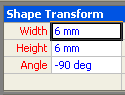
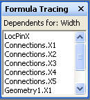
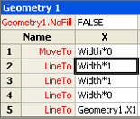

# About the Formula Tracing Window

The **Formula Tracing** window is designed to provide shape developers with information about cell interdependencies—both dependent cells (cells that have a dependency on a given cell), and precedent cells (cells that a given cell depends on). 
  
The cells in a Microsoft Visio ShapeSheet contain values and formulas. Formulas can, in turn, have references to other cells, giving you the power to calculate a value in one cell based on another cell's value. When creating or maintaining complex shapes, however, it can be difficult to identify all these interdependencies because a formula can reference any cell in the drawing, whether it's a cell in the same ShapeSheet, or a cell belonging to another object in the drawing, for example, a page, style, master, or another shape. 
  
The **Formula Tracing** window provides information to help you understand the implications of changes you make to cells. 
  
## Displaying the Formula Tracing Window

To view the **Formula Tracing** window, with the ShapeSheet window active, under **ShapeSheet Tools** on the ** Design ** tab, in the **Formula Tracing** group, click **Show Window**. The **Formula Tracing** window appears docked in the ShapeSheet window by default, but is an anchored window that can be docked, floated or merged with other available anchored ShapeSheet windows, for example, the **Style Explorer** window. 
  
## Tracing dependent cells

To see a list of cells that are dependent on a particular cell, select that cell in the ShapeSheet window. In this example, the Width cell is selected. 
  

  
To view its dependent cells, in the **Formula Tracing**group, click **Trace Dependents**.
  
A list of all the cells with a dependency on the Width cell appears in the **Formula Tracing** window. You can navigate to any cell in the list by double-clicking its entry in the **Formula Tracing** window. 
  

  
## Tracing precendent cells

To see a list of cells that a particular cell is dependent upon, first select the cell in the ShapeSheet window. In this example, the Geometry1.X2 cell is selected. 
  

  
To view its precedent cells, in the **Formula Tracing**group, click **Trace Precedents**.
  
A list of all the cells that the Geometry1.X2 cell is dependent upon appears in the **Formula Tracing** window. You can navigate to any cell in the list by double-clicking its entry in the **Formula Tracing** window. 
  

  

