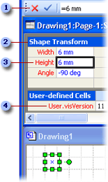
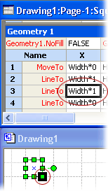

# About the ShapeSheet Spreadsheet

Everything in Microsoft Visio, every document, page, style, shape, group, shape or object within a group, master, object from another program, guide, and guide point, has a ShapeSheet spreadsheet where information about that object is stored. This spreadsheet contains information such as height, width, angle, color, and other attributes that determine the shape's appearance and behavior.
  
As a shape developer, you need precise control over the appearance and behavior of the shapes you create. You can change a shape's default behavior and enhance what it can do by editing it in its ShapeSheet, which you can access in a ShapeSheet window or programmatically.
  
## Viewing an object in a ShapeSheet window

The Visio drawing window and ShapeSheet window are simply different views of the same shape.
  
- When you view a shape in a drawing window, you see it rendered graphically and behaving according to the formulas in its ShapeSheet.

- When you view a shape in a ShapeSheet window, you see the underlying formulas that determine how it looks and behaves on the drawing page.

You can view a ShapeSheet window and a drawing window simultaneously and see the shape change in the drawing window as you manipulate cells in its ShapeSheet window or vice versa. For example, when you move the shape with the pointer, the shape's PinX and PinY formulas in the Shape Transform section change to reflect its new position on the drawing page.
  
## Structure of the ShapeSheet window

A ShapeSheet is divided into *sections* that control a particular aspect of a shape's behavior or appearance, for example, its geometry or its formatting. Each section contains one or more *rows* that contain *cells*. Each cell can contain a formula, its result (commonly called the cell value), and optional error information. A formula may be required or optional, depending on the particular cell. A cell's data (for example, its formula or value) may be locally defined or, more often, inherited from the equivalent cell in the shape's master or style.
  
The following example shows the formula bar , a section , a cell , and a row  in the ShapeSheet window.
  

  
When you draw a shape, Visio records the shape as a collection of horizontal and vertical locations connected with line segments. These locations (called vertices) are recorded in the X and Y cells of the shape's **Geometry** section. As shown in the following example, when you click the X and Y cells in the **Geometry** section of a shape's ShapeSheet window, you will see a black-bordered box highlighting the vertex on the shape in the drawing window.
  

  
## Editing an object in the ShapeSheet window

When a ShapeSheet window is active, the ribbon changes to display options specific to working in this window. When you select a ShapeSheet cell, a formula bar appears, which you can use to enter and edit an object's formulas. Or, you can work directly in the cell.
  
In a ShapeSheet window, you can add sections to a shape's sheet to add new characteristics to the shape on the drawing page. For example, you can add a **Connection Points** section to create a connection. When you no longer need a section, you can delete it.
  
You also can add rows to sections to hold additional formulas or to change a shape's appearance. For example, you can add a row to a **Geometry** section to add a segment to a shape. Similarly, you can delete rows you no longer need.
  
You can display either formulas or values in cells. Display formulas when you are entering new formulas, editing existing formulas, or to see how formulas in cells relate to each other. A value is the result you get when Visio evaluates a cell's formula. You can display values in cells to see the result of an evaluation.
  
## Additional ShapeSheet references

For details on a particular section, row, or cell in the ShapeSheet, view the corresponding article in this [ShapeSheet Reference](reference-visio-shapesheet.md).
  
For details on programmatically accessing the ShapeSheet spreadsheet, see the Microsoft Visio Automation Reference.
  