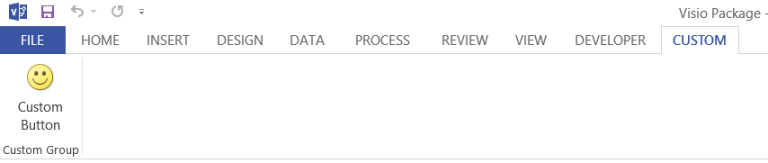

# Manipulate the Visio file format programmatically


  
Learn how to create a solution in Visual Studio 2012 to read the new file format package in Visio 2013, select parts in the package, change the data in a part, and add new parts to the package.
   
## Visio file format manipulation essentials
<a name="vis15_ManipulateFF_Essentials"> </a>

Previous versions of Visio saved files in a proprietary binary file format (.vsd) or a single-document Visio XML Drawing file format (.vdx). Visio 2013 introduces a new file format (.vsdx), which is based on XML and ZIP archive technologies. Just as in previous versions of Visio, files are saved in a single container. Unlike legacy files, however, the new file format can be opened, read, updated, changed, and constructed without automating the Visio 2013 application. Developers who are familiar with manipulating XML or working with the [System.IO.Packaging](https://msdn.microsoft.com/library/System.IO.Packaging.aspx) namespace can quickly get started working with the new file format programmatically. Developers who have worked with the Visio XML Drawing format from previous versions can find that many of the structures from that format have been retained in the new file format. 
  
In this article, we examine how to work with the Visio 2013 file format programmatically, using the Microsoft .NET Framework 4.5, C# or Visual Basic, and Visual Studio 2012. You can see how to open a Visio 2013 file, select document parts within the file, change data in parts, and create a new document part.
  
> [!NOTE]
> The code samples in this article assume that you have a rudimentary understanding of the classes in the [System.Xml.Linq](https://msdn.microsoft.com/library/System.Xml.Linq.aspx) and [System.IO.Packaging](https://msdn.microsoft.com/library/System.IO.Packaging.aspx) namespaces. > This article also assumes that you understand the concepts and terminology of the Open Packaging Conventions. You should have some familiarity with the concepts of packages, document parts or package parts, and relationships. For more information, see [OPC: A New Standard for Packaging Your Data](https://msdn.microsoft.com/magazine/cc163372.aspx). > The code demonstrates how to create LINQ (Language-Integrated Query) queries to select XML. Most of the code samples use the query syntax for building LINQ queries. You can rewrite any of the LINQ queries provided in the code by using the LINQ method syntax, if necessary. For more information about LINQ query syntax and method syntax, see [LINQ Query Syntax versus Method Syntax (C#)](https://msdn.microsoft.com/library/bb397947.aspx)> Table 1 shows the essential topics that you should be familiar with before you work through this article. 
  
**Table 1. Core concepts for manipulating the Visio 2013 file format**

|**Article title**|**Description**|
|:-----|:-----|
|[Introduction to the Visio file format (.vsdx)](introduction-to-the-visio-file-formatvsdx.md) <br/> |This high-level overview describes some of the major features of the Visio 2013 file format. It discusses the Open Packaging Conventions (OPC) as they have been applied to the Visio 2013 file format. It also lists some differences between the Visio 2013 file format and the previous Visio XML Drawing file format (.vdx).  <br/> |
|[OPC: A New Standard for Packaging Your Data](https://msdn.microsoft.com/magazine/cc163372.aspx) <br/> |This MSDN Magazine article describes the Open Packaging Conventions as a concept.  <br/> |
|[Essentials of the Open Packaging Conventions](https://msdn.microsoft.com/library/ee361919.aspx) <br/> [Introducing the Office (2007) Open XML File Formats](https://msdn.microsoft.com/library/aa338205.aspx) <br/> |These two articles discuss how the Open Packaging Conventions have been applied to Microsoft Office files. They contain descriptions of how relationships work in a package and also include some code examples.  <br/> |
   
## Create a .vsdx file and a new Visual Studio solution
<a name="vis15_ManipulateFF_CreateFile"> </a>

Before you can begin working through the procedures in this article, you need to create a Visio 2013 file to open and manipulate. The drawing used in the code examples in this article contains a single page with two connected shapes on it, one of the shapes being a "Start/End" shape from the "Basic Flowchart" template.
  
Use the following procedure to create a new Visio 2013 file to use in the remaining procedures in this article.
  
### To create new file in Visio 2013

1. Open Visio 2013.
    
2. Create a new document based on the Basic Flowchart template by choosing **CATEGORIES**, **Flowchart**, **Basic Flowchart**, **Create**.
    
3. From the **Shapes** window, drag a **Start/End** shape onto the canvas. 
    
4. Select the new Start/End shape on the drawing canvas and type 'Begin Process'.
    
5. From the **Shapes** window, drag a **Process** shape onto the canvas. 
    
6. Select the new Process shape on the drawing canvas and type 'Perform some task'.
    
7. On the shortcut menu for the Start/End shape, select **Add One Connector to the Page**, and then draw a connector between the Start/End and Process shapes on the canvas, as shown in Figure 1.
    
    **Figure 1. Simple Visio 2013 drawing**
    
     
  
8. Save the file to your Desktop as a .vsdx file by choosing **File**, **Save As**, **Computer**, **Desktop**.
    
    In the **Save As** dialog box, enter Visio Package in the **File name** box"", select **Visio Drawing (\*.vsdx)** in the **Save as type** list, and then choose the **Save** button. 
    
9. Close the file and then close Visio 2013.
    
> [!TIP]
> Sometimes Visio opens a file successfully even if there are issues with the file. To ensure that Visio notifies you of any file issues, you should enable file open warnings when testing solutions that manipulate Visio files at the file package level. > To enable file open warnings, in Visio 2013, choose **File**, **Options**, **Advanced**. Under **Save/Open**, select **Show file open warnings**. 
  
These procedures use a Windows console application to manipulate the "Visio Package.vsdx" file. Use the following procedure to create and set up a new Windows console application in Visual Studio 2012.
  
### To create a new solution in Visual Studio 2012

1. On the **File** menu, choose **New**, **Project**.
    
2. In the **New Project** dialog box, expand either **Visual C#** or **Visual Basic**, and then choose **Windows**, **Console Application**.
    
    In the **Name** box, enter ' VisioFileAccessor', select a location for the project, and then choose the **OK** button. 
    
3. On the **Project** menu, choose **Add Reference**. 
    
    In the **Reference Manager** dialog box, under **Assemblies**, choose **Framework**, and then add a reference to the **System.Xml** and **WindowsBase** components. 
    
4. In the Program.cs or Module1.vb file for the project, add the following **using** directives (**Imports** statements in Visual Basic): 
    
    ```cs
    using System.Xml;
    using System.Xml.Linq;
    using System.IO;
    using System.IO.Packaging;
    using System.Text;
    
    ```

    ```vb
    Imports System.Xml
    Imports System.Xml.Linq
    Imports System.IO
    Imports System.IO.Packaging
    Imports System.Text
    
    ```

5. Also in the Program.cs or Module1.vb file, before the end of the **Main** method of the **Program** class (**Module1** in Visual Basic), add the following code that stops execution of the console application until the user presses a key. 
    
    ```cs
    // This code stops the execution of the console application
    // so you can read the output.
    Console.WriteLine("Press any key to continue ...");
    Console.ReadKey();
    
    ```

    ```vb
    ' This code stops the execution of the console application
    ' so you can read the output.
    Console.WriteLine("Press any key to continue ...")
    Console.ReadKey()
    ```

## Open a Visio 2013 file as a package
<a name="vis15_ManipulateFF_OpenPackage"> </a>

Before you can manipulate any of the data within the file, you need to first open the file within a [Package](https://msdn.microsoft.com/library/System.IO.Packaging.Package.aspx) object, which is contained within the [System.IO.Packaging](https://msdn.microsoft.com/library/System.IO.Packaging.aspx) namespace. The **Package** object represents the Visio file as a whole. It exposes members that allow you to select individual document parts within the file package. In particular, the **Package** class exposes the static [Open(String, FileMode, FileAccess)](https://msdn.microsoft.com/library/System.IO.Packaging.Package.Open.aspx) method that you use to open a file as a package. It also exposes a [Close()](https://msdn.microsoft.com/library/System.IO.Packaging.Package.Close.aspx) method for closing the package once you've finished with it. 
  
> [!TIP]
> As a best practice, use a **using** block to open the Visio file in the **Package** object so that you don't have to explicitly close the file package when you're done with it. You can also explicitly call the **Package.Close** method in the **finally** block of a **try/catch/finally** construction. 
  
Use the following code to get the full path for the "Visio Package.vsdx" file by using a [FileInfo](https://msdn.microsoft.com/library/System.IO.FileInfo.aspx) object, pass the path as an argument to the **Package.Open** method, and then return a **Package** object to the calling code. 
  
### To open a .vsdx file as a package

1. After the **Main** method in the **Program** class (or **Module1** in Visual Basic), add the following code. 
    
    ```cs
    private static Package OpenPackage(string fileName, 
        Environment.SpecialFolder folder)
    {
        Package visioPackage = null;
        // Get a reference to the location 
        // where the Visio file is stored.
        string directoryPath = System.Environment.GetFolderPath(
            folder);
        DirectoryInfo dirInfo = new DirectoryInfo(directoryPath);
        // Get the Visio file from the location.
        FileInfo[] fileInfos = dirInfo.GetFiles(fileName);
        if (fileInfos.Count() > 0)
        {
            FileInfo fileInfo = fileInfos[0];
            string filePathName = fileInfo.FullName;
            // Open the Visio file as a package with
            // read/write file access.
            visioPackage = Package.Open(
                filePathName,
                FileMode.Open,
                FileAccess.ReadWrite);
            }
            // Return the Visio file as a package.
            return visioPackage;
    }
    ```

    ```vb
    Private Function OpenPackage(fileName As String, _
        folder As Environment.SpecialFolder) As Package
        Dim visioPackage As Package = Nothing
        ' Get a reference to the location
        ' where the Visio file is stored.
        Dim directoryPath As String = System.Environment.GetFolderPath( _
            folder)
        Dim dirInfo As DirectoryInfo = New DirectoryInfo(directoryPath)
        ' Get the Visio file from the location.
        Dim fileInfos As FileInfo() = dirInfo.GetFiles(fileName)
        If (fileInfos.Count() > 0) Then
            Dim fileInfo As FileInfo = fileInfos(0)
            Dim filePathName As String = fileInfo.FullName
            ' Open the Visio file as a package 
            ' with read/write access.
            visioPackage = Package.Open( _
                filePathName,
                FileMode.Open,
                FileAccess.ReadWrite)
            End If
        ' Return the Visio file as a package.
        Return visioPackage
    End Function
    
    ```

2. In the **Main** method of the **Program** class (or **Module1** in Visual Basic), add the following code. 
    
    ```cs
    // Open the Visio file in a Package object.
    using (Package visioPackage = OpenPackage("Visio Package.vsdx", 
        Environment.SpecialFolder.Desktop))
    {
    }
    
    ```

    ```vb
    ' Open the Visio file in a Package object.
    Using visioPackage As Package = OpenPackage("Visio Package.vsdx", _
        Environment.SpecialFolder.Desktop)
    End Using
    
    ```

## Select and read package parts from a package
<a name="vis15_ManipulateFF_SelectPart"> </a>

Once you have the Visio 2013 file open as a package, you can access the document parts within it using the [PackagePart](https://msdn.microsoft.com/library/System.IO.Packaging.PackagePart.aspx) class included in the **System.IO.Packaging** namespace. **PackagePart** objects can be instantiated individually or as a collection. The **Package** class exposes a [GetParts()](https://msdn.microsoft.com/library/System.IO.Packaging.Package.GetParts.aspx) method and a [GetPart(Uri)](https://msdn.microsoft.com/library/System.IO.Packaging.Package.GetPart.aspx) method for getting **PackagePart** objects out of the **Package**. The **Package.GetParts** method returns an instance of the [PackagePartCollection](https://msdn.microsoft.com/library/System.IO.Packaging.PackagePartCollection.aspx) class, which you can then interact with like any other collection that implements the [IEnumerator\<T\>](https://docs.microsoft.com/dotnet/api/system.collections.generic.ienumerator-1?redirectedfrom=MSDN&view=netframework-4.7.2) interface. 
  
Use the code in the following procedure to get a **PackagePartCollection** object from the **Package** as a collection, iterate through the **PackagePart** objects in the collection, and write the URI and content type of each **PackagePart** to the console. 
  
### To iterate through the package parts in a package

1. After the  `OpenPackage` method in the **Program** class (or **Module1** in Visual Basic), add the following code. 
    
    ```cs
    private static void IteratePackageParts(Package filePackage)
    {
        
        // Get all of the package parts contained in the package
        // and then write the URI and content type of each one to the console.
        PackagePartCollection packageParts = filePackage.GetParts();
        foreach (PackagePart part in packageParts)
        {
            Console.WriteLine("Package part URI: {0}", part.Uri);
            Console.WriteLine("Content type: {0}", part.ContentType.ToString());
        }
    }
    
    ```

    ```vb
    Private Sub IteratePackageParts(filePackage As Package)
        ' Get all of the package parts contained in the package
        ' and then write the URI and content type of each one to the console.
        Dim packageParts As PackagePartCollection = filePackage.GetParts()
        For Each part In packageParts
            Console.WriteLine("Package part: {0}", part.Uri)
            Console.WriteLine("Content type: {0}", part.ContentType.ToString())
        Next
    End Sub 
    
    ```

2. Add the following code inside the **using** block in the **Main** method of the **Program** class (the **Using** block of the **Main** method in **Module1** in Visual Basic): 
    
    ```cs
    // Write the URI and content type of each package part to the console.
    IteratePackageParts(visioPackage);
    
    ```

    ```vb
    ' Write the URI and content type of each package part to the console.
    IteratePackageParts(visioPackage)
    
    ```

3. Choose the F5 key to debug the solution. When the program has completed running, choose any key to exit.
    
The console application produces output similar to the following (some of the output has been omitted for brevity):
  
 `Package part URI: /docProps/app.xml`
  
 `Content type: application/vnd.openxmlformats-officedocument.extended-properties+xml`
  
 `Package part URI: /docProps/core.xml`
  
 `Content type: application/vnd.openxmlformats-officedocument.core-properties+xml`
  
 `Package part URI: /docProps/custom.xml`
  
 `Content type: application/vnd.openxmlformats-officedocument.custom-properties+xml`
  
 `Package part URI: /docProps/thumbnail.emv`
  
 `Content type: image/x-emf`
  
 `Package part URI: /visio/document.xml`
  
 `Content type: application/vnd.ms-visio.drawing.main+xml`
  
 `Package part URI: /visio/_rels/document.xml.rels`
  
 `Content type: application/vnd.openxmlformats-package.relationships+xml`
  
 `Package part URI: /_rels/.rels`
  
 `Content type: application/vnd.openxmlformats-package.relationships+xml`
  
 `Press any key to continue …`
  
More often than not, you need to select one **PackagePart** without having to iterate over all of them. You can get a **PackagePart** object from a **Package** by using its relationship to the **Package** or another **PackagePart**. A relationship in the Visio 2013 file format is a discrete entity that describes how a document part relates to the file package or how two document parts relate to each other. For example, the Visio 2013 file package itself has a relationship to its Visio Document part, and the Visio Document part has a relationship to the Windows part. These relationships are represented as instances of the [PackageRelationship](https://msdn.microsoft.com/library/System.IO.Packaging.PackageRelationship.aspx) or [PackageRelationshipCollection](https://msdn.microsoft.com/library/System.IO.Packaging.PackageRelationshipCollection.aspx) classes. 
  
The **Package** class exposes several methods for getting the relationships that it contains as **PackageRelationship** or **PackageRelationshipCollection** objects. You can use the [GetRelationshipsByType(String)](https://msdn.microsoft.com/library/System.IO.Packaging.Package.GetRelationshipsByType.aspx) method to instantiate a **PackageRelationshipCollection** object that contains **PackageRelationship** objects of a single specific type. Of course, using the **Package.GetRelationshipsByType** method requires that you already know the relationship type that you need. Relationship types are strings in XML namespace format. For example, the relationship type of the Visio Document part is https://schemas.microsoft.com/visio/2010/relationships/document. 
  
Once you know the relationship of a **PackagePart** to the **Package** or to another **PackagePart** (that is, you have a **PackageRelationship** object that references the **PackagePart** that you want), you can use that relationship to get the URI of that **PackagePart**. You then pass the URI to the **Package.GetPart** method to return the **PackagePart**.
  
> [!NOTE]
> You can also get a reference to a specific **PackagePart** by using just the **Package.GetPart** method and the URI of the **PackagePart**, bypassing the step where you get the package part's relationships. However, some package parts in the Visio file package can be saved to locations other than their default locations in a package. You cannot assume that a package part is always located at the same URI for every file. > Instead, it is a best practice to use relationships to access individual **PackagePart** objects. 
  
Use the following procedure to get a **PackagePart** (the Visio Document part) by using the **PackageRelationship** from the **Package** that references the part. 
  
### To select a specific package part in the package by relationship

1. After the  `IteratePackageParts` method in the **Program** class (or **Module1** in Visual Basic), add the following method. 
    
    ```cs
    private static PackagePart GetPackagePart(Package filePackage, 
        string relationship)
    {
        
        // Use the namespace that describes the relationship 
        // to get the relationship.
        PackageRelationship packageRel = 
            filePackage.GetRelationshipsByType(relationship).FirstOrDefault();
        PackagePart part = null;
        // If the Visio file package contains this type of relationship with 
        // one of its parts, return that part.
        if (packageRel != null)
        {
            // Clean up the URI using a helper class and then get the part.
            Uri docUri = PackUriHelper.ResolvePartUri(
                new Uri("/", UriKind.Relative), packageRel.TargetUri);
            part = filePackage.GetPart(docUri);
        }
        return part;
    }
    
    ```

    ```vb
    Private Function GetPackagePart(filePackage As Package, relationship As String) _
        As PackagePart
        ' Use the namespace that describes the relationship 
        ' to get the relationship.
        Dim packageRel As PackageRelationship = 
            filePackage.GetRelationshipsByType(relationship).FirstOrDefault()
        Dim part As PackagePart = Nothing
        ' If the Visio file package contains this type of relationship with 
        ' one of its parts, return that part.
        If Not IsNothing(packageRel) Then
            ' Clean up the URI using a helper class and then get the part.
            Dim docUri = PackUriHelper.ResolvePartUri( _
                New Uri("/", UriKind.Relative), packageRel.TargetUri)
            part = filePackage.GetPart(docUri)
        End If
        Return part
    End Function
    
    ```

2. Replace the code in the **using** block in the **Main** method of the **Program** class (the **Using** block of the **Main** method in **Module1** in Visual Basic) with the following code. 
    
    ```cs
    // Get a reference to the Visio Document part contained in the file package.
    PackagePart documentPart = GetPackagePart(visioPackage, 
        "https://schemas.microsoft.com/visio/2010/relationships/document");
    
    ```

    ```vb
    ' Get a reference to the Visio Document part contained in the file package.
    Dim documentPart As PackagePart = GetPackagePart(visioPackage, _
        "https://schemas.microsoft.com/visio/2010/relationships/document")
    
    ```

As mentioned previously, you can also get **PackagePart** objects by using their relationship to other **PackagePart** objects. This is important because, for a Visio document of any complexity, most of the **PackagePart** objects don't have a relationship to the **Package**. For example, an individual Page Content part in the file package (that is, /visio/pages/page1.xml) has a relationship to the Page Index part (that is, /visio/pages/pages.xml) but not to the file package itself. If you don't have the exact URI of the individual page in the package, you can use its relationship to the Page Index part to get a reference to it.
  
The **PackagePart** class exposes a [GetRelationshipsByType(String)](https://msdn.microsoft.com/library/System.IO.Packaging.PackagePart.GetRelationshipsByType.aspx) method that you can use to return a **PackageRelationshipCollection** object that contains only one type of **PackageRelationship** object. Once you have the **PackageRelationshipCollection**, you can select the **PackageRelationship** that you need from the collection and then reference the **PackagePart** object. 
  
Use the following code to get a **PackagePart** from the **Package** by using its relationship to (getting a **PackageRelationship** object from) another **PackagePart**.
  
### To select a specific package part through its relationship to another package part

1. After the  `GetPackagePart` method in the **Program** class (or **Module1** in Visual Basic), add the following overload method. 
    
    ```cs
    private static PackagePart GetPackagePart(Package filePackage, 
        PackagePart sourcePart, string relationship)
    {
        // This gets only the first PackagePart that shares the relationship
        // with the PackagePart passed in as an argument. You can modify the code
        // here to return a different PackageRelationship from the collection.
        PackageRelationship packageRel = 
            sourcePart.GetRelationshipsByType(relationship).FirstOrDefault();
        PackagePart relatedPart = null;
        if (packageRel != null)
        {
            // Use the PackUriHelper class to determine the URI of PackagePart
            // that has the specified relationship to the PackagePart passed in
            // as an argument.
            Uri partUri = PackUriHelper.ResolvePartUri(
                sourcePart.Uri, packageRel.TargetUri);
            relatedPart = filePackage.GetPart(partUri);
        }
        return relatedPart;
    }
    
    ```

    ```vb
    Private Function GetPackagePart(filePackage As Package, 
        sourcePart As PackagePart, relationship As String) As PackagePart
        ' This gets only the first PackagePart that shares the relationship
        ' with the PackagePart passed in as an argument. You can modify the
        ' code to return a different PackageRelationship from the collection.
        Dim packageRel As PackageRelationship = sourcePart. _
            GetRelationshipsByType(relationship).FirstOrDefault()
        Dim relatedPart As PackagePart = Nothing
        If Not IsNothing(packageRel) Then
            ' Use the PackUriHelper class to determine the URI of the 
            ' PackagePart that has the specified relationship to the 
            ' PackagePart passed in as an argument.
            Dim partUri As Uri = PackUriHelper.ResolvePartUri( _
                sourcePart.Uri, packageRel.TargetUri)
            relatedPart = filePackage.GetPart(partUri)
        End If
        Return relatedPart
    End Function
    ```

2. Add the following code to the **using** block in the **Main** method of the **Program** class (the **Using** block of the **Main** method in **Module1** in Visual Basic), beneath the code from the previous procedure. (Do not delete the code that you added in the previous procedure.) 
    
    ```cs
    // Get a reference to the collection of pages in the document, 
    // and then to the first page in the document.
    PackagePart pagesPart = GetPackagePart(visioPackage, documentPart, 
        "https://schemas.microsoft.com/visio/2010/relationships/pages");
    PackagePart pagePart = GetPackagePart(visioPackage, pagesPart, 
        "https://schemas.microsoft.com/visio/2010/relationships/page");
    
    ```

    ```vb
    ' Get a reference to the collection of pages in the document,
    ' and then to the first page in the document.
    Dim pagesPart As PackagePart = GetPackagePart(visioPackage, documentPart, _
        "https://schemas.microsoft.com/visio/2010/relationships/pages") 
    Dim pagePart As PackagePart = GetPackagePart(visioPackage, pagesPart, _
        "https://schemas.microsoft.com/visio/2010/relationships/page") 
    ```

Before you can make changes to the XML included in a document part, you need to first load the XML document into an object that allows you to read the XML, using the [XDocument](https://msdn.microsoft.com/library/System.Xml.Linq.XDocument.aspx) class or [XmlDocument](https://msdn.microsoft.com/library/System.Xml.XmlDocument.aspx) class. Both classes expose methods for tasks such as selecting XML elements contained within the XML documents; creating, reading, and writing attributes; and inserting new XML elements into a document. 
  
Of the two, the **XDocument** class allows you to query the XML using LINQ. With LINQ, you can easily select individual elements from an XML document by creating queries, rather than iterating over all of the elements in a collection and testing for the elements that you need. For these reasons, the following procedures in this article use the **XDocument** class and other classes of the **System.Xml.Linq** namespace for working with XML. 
  
Use the following procedure to open a **PackagePart** as an XML document in an **XDocument** object. 
  
### To read the XML in a package part

1. After the last overload for the  `GetPackagePart` method in the **Program** class (or **Module1** in Visual Basic), add the following method. 
    
    ```cs
    private static XDocument GetXMLFromPart(PackagePart packagePart)
    {
        XDocument partXml = null;
        // Open the packagePart as a stream and then 
        // open the stream in an XDocument object.
        Stream partStream = packagePart.GetStream();
        partXml = XDocument.Load(partStream);
        return partXml;
    }
    ```

    ```vb
    Private Function GetXMLFromPart(packagePart As PackagePart) As XDocument
        Dim partXml As XDocument = Nothing
        ' Open the packagePart as a stream and then
        ' open the stream in an an XDocument object.
        Dim partStream As Stream = packagePart.GetStream()
        partXml = XDocument.Load(partStream)
        Return partXml
    End Function
    ```

2. Add the following code to the **using** block in the **Main** method of the **Program** class (the **Using** block of the **Main** method in **Module1** in Visual Basic), beneath the code from the previous procedure. 
    
    ```cs
    // Open the XML from the Page Contents part.
    XDocument pageXML = GetXMLFromPart(pagePart);
    ```

    ```vb
    ' Open the XML from the Page Contents part.
    Dim pageXML As XDocument = GetXMLFromPart(pagePart)
    ```

## Select and change XML data in a package part
<a name="vis15_ManipulateFF_ChangeXML"> </a>

Once you have loaded a document part into an **XDocument** object, you can use LINQ to select XML elements and make changes to the XML document. You can change XML data, add or remove data, and then save the XML document back to the document part. 
  
The most common task for manipulating the Visio file format is selecting specific XML elements or collections of elements in the document. The **System.Xml.Linq** namespace includes the [XElement](https://msdn.microsoft.com/library/System.Xml.Linq.XElement.aspx) class, which represents an XML element. The **XElement** class gives you access to the data contained in the Visio file at a granular level, from individual **Shape** elements to **ValidationRule** elements (as examples). 
  
Use the following code to select the **Shape** elements from an **XDocument** (containing a Page Contents part) and to then select a specific **Shape** element. 
  
### To select a specific element in a package part

1. After the  `GetXMLFromPart` method in the **Program** class (or **Module1** in Visual Basic), add the following method. 
        
    ```cs
    private static IEnumerable<XElement> GetXElementsByName(
        XDocument packagePart, string elementType)
    {
        // Construct a LINQ query that selects elements by their element type.
        IEnumerable<XElement> elements = 
            from element in packagePart.Descendants() 
            where element.Name.LocalName == elementType 
            select element;
        // Return the selected elements to the calling code.
        return elements.DefaultIfEmpty(null);
    }
    
    ```

    ```vb
    Private Function GetXElementsByName(partXML As XDocument, _
        elementType As String) As IEnumerable(Of XElement)
        ' Construct a LINQ query that selects elements by their element type.
        Dim elements As IEnumerable(Of XElement) =
            From element In partXML.Descendants()
            Where element.Name.LocalName = elementType
            Select element
        ' If there aren't any elements of the specified type
        ' in the document, return Nothing to the calling code.
        Return elements.DefaultIfEmpty(Nothing)
    End Function
    ```

2. After the  `GetXElementsByName` method in the **Program** class (or **Module1** in Visual Basic) from the previous step, add the following method. 
    
    ```cs
    private static XElement GetXElementByAttribute(IEnumerable<XElement> elements,
        string attributeName, string attributeValue) 
    {
        // Construct a LINQ query that selects elements from a group
        // of elements by the value of a specific attribute.
        IEnumerable<XElement> selectedElements = 
            from el in elements
            where el.Attribute(attributeName).Value == attributeValue
            select el;
        // If there aren't any elements of the specified type
        // with the specified attribute value in the document,
        // return null to the calling code.
        return selectedElements.DefaultIfEmpty(null).FirstOrDefault();
    }
    ```

    ```vb
    Private Function GetXElementByAttribute(elements As IEnumerable(Of XElement), _
        attributeName As String, attributeValue As String) As XElement
        ' Construct a LINQ query that selects elements from a group
        ' of elements by the value of a specific attribute.
        Dim selectedElements As IEnumerable(Of XElement) =
            From el In elements
            Where el.Attribute(attributeName).Value = attributeValue
            Select el
        ' If there aren't any elements of the specified type 
        ' with the specified attribute value in the document,
        ' return Nothing to the calling code.
        Return selectedElements.DefaultIfEmpty(Nothing).FirstOrDefault()
    End Function
    
    ```

3. Add the following code to the **using** block in the **Main** method of the **Program** class (the **Using** block of the **Main** method in **Module1** in Visual Basic), beneath the code from the previous procedure. 
    
    ```cs
    // Get all of the shapes from the page by getting
    // all of the Shape elements from the pageXML document.
    IEnumerable<XElement> shapesXML = GetXElementsByName(pageXML, "Shape");
    // Select a Shape element from the shapes on the page by 
    // its name. You can modify this code to select elements
    // by other attributes and their values.
    XElement startEndShapeXML = 
        GetXElementByAttribute(shapesXML, "NameU", "Start/End");
    
    ```

    ```vb
    ' Get all of the shapes from the page by getting
    ' all of the Shape elements from the pageXML document.
    Dim shapesXML As IEnumerable(Of XElement) = GetXElementsByName( _
        pageXML, "Shape")
    ' Select a Shape element from the shapes on the page by
    ' its name. You can modify this code to select elements
    ' by other attributes and their values.
    Dim startEndShapeXML As XElement = GetXElementByAttribute( _
        shapesXML, "NameU", "Start/End")
    ```

Once you have gotten a reference to a **XElement** object contained within an **XDocument** object, you can manipulate it like any other XML data and, thereby, change the data contained in the Visio file. For example, if a shape has text when it is opened in Visio, the corresponding **Shape** element will contain at least one **Text** element. If you change the value of that **Text** element, the shape's text is changed when the file is viewed in Visio. 
  
Add the following code to the **using** block in the **Main** method of the **Program** class (the **Using** block of the **Main** method in **Module1** in Visual Basic) to change the text in the Start/End shape from "Begin process" to "Start process". 
  
```cs
// Query the XML for the shape to get the Text element, and
// return the first Text element node.
IEnumerable<XElement> textElements = from element in startEndShapeXML.Elements()
                               where element.Name.LocalName == "Text"
                               select element;
XElement textElement = textElements.ElementAt(0);
// Change the shape text, leaving the <cp> element alone.
textElement.LastNode.ReplaceWith("Start process");

```

```vb
' Query the XML for the shape to get the Text element, and
' return the first Text element node.
Dim textElements As IEnumerable(Of XElement) =
    From element In startEndShapeXML.Elements()
    Where element.Name.LocalName == "Text"
    Select element
Dim textElement As XElement = textElements.ElementAt(0)
' Change the shape text, leaving the <cp> element alone.
textElement.LastNode.ReplaceWith("Start process")

```

> [!CAUTION]
> In the previous code example, the existing shape text and the string used to replace it have the same number of characters. Also note that the LINQ query changes the value of the last child node of the returned element (which, in this case, is a text node). This is done to avoid changing the settings of the **cp** element that is a child of the **Text** element. > It is possible to cause file instability if you alter shape text programmatically by overwriting all children of the **Text** element. As in the example above, the text formatting is represented by **cp** elements under the **Text** element in the file. The definition of the formatting is stored in the parent **Section** element. If these two pieces of information become inconsistent, then the file may not behave as expected. Visio heals many inconsistencies, but it is better to ensure that any programmatic changes are consistent so that you are controlling the ultimate behavior of the file. 
  
When you make changes to the XML of a document part, those changes exist in memory only. To persist the changes in the file, you must save the XML back to the document part.
  
The following code uses the [XmlWriter](https://msdn.microsoft.com/library/System.Xml.XmlWriter.aspx) class and [XmlWriterSettings](https://msdn.microsoft.com/library/System.Xml.XmlWriterSettings.aspx) class to write the XML back to the package part. Although you can use the [Save()](https://msdn.microsoft.com/library/System.Xml.Linq.XDocument.Save.aspx) method to save the XML back to the part, the **XmlWriter** and **XmlWriterSettings** classes allow you finer control over the output, including specifying the type of encoding. The **XDocument** class exposes a [WriteTo(XmlWriter)](https://msdn.microsoft.com/library/System.Xml.Linq.XDocument.WriteTo.aspx) method that takes an **XmlWriter** object and writes XML back to a stream. 
  
Use the following procedure to save the XML from the Visio page back to the Page Contents part.
  
### To save the changed XML back to the package

1. After the  `GetXElementByAttribute` method in the **Program** class (or **Module1** in Visual Basic) from the previous step, add the following method. 
    
    ```cs
    private static void SaveXDocumentToPart(PackagePart packagePart, 
        XDocument partXML)
    {
        
        // Create a new XmlWriterSettings object to 
        // define the characteristics for the XmlWriter
        XmlWriterSettings partWriterSettings = new XmlWriterSettings();
        partWriterSettings.Encoding = Encoding.UTF8;
        // Create a new XmlWriter and then write the XML
        // back to the document part.
        XmlWriter partWriter = XmlWriter.Create(packagePart.GetStream(),
            partWriterSettings);
        partXML.WriteTo(partWriter);
        // Flush and close the XmlWriter.
        partWriter.Flush();
        partWriter.Close();
    }
    ```

    ```vb
    Private Sub SaveXDocumentToPart(packagePart As PackagePart, _
        partXML As XDocument)
        ' Create a new XmlWriterSettings object to 
        ' define the characteristics for the XmlWriter.
        Dim partWriterSettings As XmlWriterSettings = New XmlWriterSettings()
        partWriterSettings.Encoding = Encoding.UTF8
        ' Create a new XmlWriter and then write the XML
        ' back to the document part.
        Dim partWriter As XmlWriter = XmlWriter.Create(packagePart.GetStream())
        partXML.WriteTo(partWriter)
        ' Flush and close the XmlWriter.
        partWriter.Flush()
        partWriter.Close()
    End Sub
    ```

2. Add the following code to the **using** block in the **Main** method of the **Program** class (the **Using** block of the **Main** method in **Module1** in Visual Basic), beneath the code from the previous procedure. 
    
    ```cs
    // Save the XML back to the Page Contents part.
    SaveXDocumentToPart(pagePart, pageXML);
    
    ```

    ```vb
    ' Save the XML back to the Page Contents part.
    SaveXDocumentToPart(pagePart, pageXML)
    
    ```

3. Choose the F5 key to debug the solution. When the program has completed running, choose any key to exit.
    
4. Open the Visio Package.vsdx file in Visio 2013. 
    
The Start/End shape should now contain the text "Start process".
  
## Recalculate data in the file
<a name="vis15_ManipulateFF_Recalculate"> </a>

Some changes to the data in a file may require Visio to recalculate the document when it opens the file. Visio provides a lot of logic for a diagram, particularly for shape relationships (that is, when one shape depends on another) and connecting shapes. If any of the data that the custom logic relies upon is changed, Visio needs to propagate the changes to all of the affected calculated data in the file. 
  
The Visio 2013 file format includes a couple of techniques that you can use to recalculate data in the file. There are three types of scenarios that you must consider when you decide whether you need to recalculate the Visio file and how to do it:
  
- The changes to the data do not affect any other values in the file format. You don't need to add any additional instructions to Visio to recalculate the document. As demonstrated previously, you can often change a shape's text without needing to recalculate the document.
    
- The changes to the data are limited to changing the values of ShapeSheet cells in the XML, and there are other ShapeSheet values that depend on this data. In this case, you must add an XML processing instruction (using the [XProcessingInstruction](https://msdn.microsoft.com/library/System.Xml.Linq.XProcessingInstruction.aspx) class) to the **Cell** element that has been changed. For example, the **ThemeIndex** cell for a shape affects the values of several other ShapeSheet cells contained in the shape. If you change the **ThemeIndex** cell within the file itself (for example, the **Cell** element with an **N** value of "ThemeIndex"), you will need to add a processing instruction to the **Cell** element so that the dependent values are updated. 
    
- The changes to the data affect the location of a connector or connection points. Another situation is when there are many changes to the ShapeSheet data and you want to recalculate the whole document with one instruction (rather than adding individual processing instructions for each change). In this case you can instruct Visio to recalculate the entire document when it is opened. You do this by adding a **RecalcDocument** property to the Custom File Properties part (/docProps/custom.xml) of the Visio package. Adjusting the position or size of shapes in a connected diagram is an example of this type of scenario. 
    
    Keep in mind that this is the most costly option from a performance standpoint.
    
Use the following procedure to insert a **Cell** element into a **Shape** element, where other **Cell** elements in the same **Shape** need to be recalculated because of the new value. The new **Cell** element includes a processing instruction as a child element, to inform Visio that it needs to perform some local recalculation. 
  
### To recalculate values for a single shape

1. Replace the code from the previous two examples (changing the shape's text and the call to  `SaveXDocumentToPart`) in the **using** block in the **Main** method of the **Program** class (the **Using** block of the **Main** method in **Module1** in Visual Basic) with the following code. 
    
    ```cs
    // Insert a new Cell element in the Start/End shape that adds an arbitrary
    // local ThemeIndex value. This code assumes that the shape does not 
    // already have a local ThemeIndex cell.
    startEndShapeXML.Add(new XElement("Cell",
        new XAttribute("N", "ThemeIndex"),
        new XAttribute("V", "25"),
        new XProcessingInstruction("NewValue", "V")));
    // Save the XML back to the Page Contents part.
    SaveXDocumentToPart(pagePart, pageXML);
    
    ```

    ```vb
    ' Insert a new Cell element in the shape that adds an arbitrary local
    ' ThemeIndex value. This code assumes that the shape does not
    ' already have a local ThemeIndex cell.
    startEndShapeXML.Add(New XElement("Cell", _
        New XAttribute("N", "ThemeIndex"),
        New XAttribute("V", "25"),
        New XProcessingInstruction("NewValue", "V")))
    ' Save the XML back to the Page Contents part.
    SaveXDocumentToPart(pagePart, pageXML)
    
    ```

2. Choose the F5 key to debug the solution. When the program has completed running, choose any key to exit.
    
3. Open the Visio Package.vsdx file in Visio 2013. The Start/End shape should now have a different fill color.
    
The shape's color relies on the value of the **ThemeIndex** cell—it determines which of the active themes the shape inherits from. In the previous example, the shape is set to inherit from a different theme (the **ThemeIndex** cell is set to a value of "25"). If you don't use a processing instruction, the shape's text color—which is also affected by the **ThemeIndex** cell—isn't recalculated. The shape's fill color would change to white, but its text would remain white—leaving the text unreadable. Also, without the processing instruction, it is possible that Visio may update the shape at a later date, leaving the file in an unstable state where the formatting values of the shape could be updated unpredictably. 
  
If you change data in the file that requires Visio to recalculate the document (for example, changing a connected shape's position and, therefore, forcing the connectors to reroute), you must add a recalculation instruction to the Visio file. The instruction is created by adding a **property** element with a **name** attribute value of "RecalcDocument" to the XML of the Custom File Properties part of the Visio file package. As a best practice, you should check the Custom File Properties part to be sure that a "RecalcDocument" instruction hasn't already been registered in the file. 
  
Use the following code to change the value of the **PinY** cell of the Start/End shape from the previous examples. The code selects the **Cell** element that contains the **PinY** cell data as an **XElement** object by using the value of its **N** attribute. The code then adds a recalculation instruction to the Custom File Properties part of the Visio file. 
  
> [!NOTE]
> This code relies on the  `GetPackagePart` and  `SaveXDocumentToPart` methods created previously. 
  
### To recalculate the entire document when it is opened

1. After the  `SaveXDocumentToPart` method in the **Program** class (or **Module1** in Visual Basic) from the previous step, add the following method. 
    
    ```cs
    private static void RecalcDocument(Package filePackage)
    {
        // Get the Custom File Properties part from the package and
        // and then extract the XML from it.
        PackagePart customPart = GetPackagePart(filePackage, 
            "https://schemas.openxmlformats.org/officeDocument/2006/relationships/" + 
            "custom-properties");
        XDocument customPartXML = GetXMLFromPart(customPart);
        // Check to see whether document recalculation has already been 
        // set for this document. If it hasn't, use the integer
        // value returned by CheckForRecalc as the property ID.
        int pidValue = CheckForRecalc(customPartXML);
        if (pidValue > -1)
        {
            XElement customPartRoot = customPartXML.Elements().ElementAt(0);
            // Two XML namespaces are needed to add XML data to this 
            // document. Here, we're using the GetNamespaceOfPrefix and 
            // GetDefaultNamespace methods to get the namespaces that 
            // we need. You can specify the exact strings for the 
            // namespaces, but that is not recommended.
            XNamespace customVTypesNS = customPartRoot.GetNamespaceOfPrefix("vt");
            XNamespace customPropsSchemaNS = customPartRoot.GetDefaultNamespace();
            // Construct the XML for the new property in the XDocument.Add method.
            // This ensures that the XNamespace objects will resolve properly, 
            // apply the correct prefix, and will not default to an empty namespace.
            customPartRoot.Add(
                new XElement(customPropsSchemaNS + "property",
                    new XAttribute("pid", pidValue.ToString()),
                    new XAttribute("name", "RecalcDocument"),
                    new XAttribute("fmtid", 
                        "{D5CDD505-2E9C-101B-9397-08002B2CF9AE}"),
                    new XElement(customVTypesNS + "bool", "true")
                ));
        }
        // Save the Custom Properties package part back to the package.
        SaveXDocumentToPart(customPart, customPartXML);
    }
    ```

    ```vb
    Private Sub RecalcDocument(filePackage As Package)
            ' Get the Custom File Properties part from the package and
            ' then extract the XML from it.
            Dim customPart As PackagePart = GetPackagePart(filePackage, _
                "https://schemas.openxmlformats.org/officeDocument/2006/" + _
                "relationships/custom-properties")
            Dim customPartXML As XDocument = GetXMLFromPart(customPart)
            ' Check to see whether document recalculation has already been
            ' set for this document. If it hasn't, use the integer
            ' value returned by CheckForRecalc as the property ID.
            Dim pidValue As Integer = CheckForRecalc(customPartXML)
            If (pidValue > 1) Then
                Dim customPartRoot As XElement = _
                    customPartXML.Elements().ElementAt(0)
                ' Two XML namespaces are needed to add XML data to this 
                ' document. Here, we're using the GetNamespaceOfPrefix and
                ' GetDefaultNamespace methods to get the namespaces that
                ' we need. You can specify the exact strings for the 
                ' namespaces, but that is not recommended.
                Dim customVTypesNS As XNamespace = _
                    customPartRoot.GetNamespaceOfPrefix("vt")
                Dim customPropsSchemaNS As XNamespace = _
                    customPartRoot.GetDefaultNamespace()
                ' Contruct the XML for the new property in the XDocument.Add
                ' method. This ensures that the XML namespaces resolve 
                ' properly, apply the correct prefix, and do not default to 
                ' an empty namespace.
                customPartRoot.Add( _
                    New XElement(customPropsSchemaNS + "property", _
                        New XAttribute("pid", pidValue.ToString()), _
                        New XAttribute("name", "RecalcDocument"), _
                        New XAttribute("fmtid", _
                            "{D5CDD505-2E9C-101B-9397-08002B2CF9AE}"), _
                        New XElement(customVTypesNS + "bool", "true") _
                ))
            ' Save the Custom Properties package part back to the package.
            SaveXDocumentToPart(customPart, customPartXML)
            End If
        End Sub
    ```

2. After the  `RecalcDocument` method in the **Program** class (or **Module1** in Visual Basic) from the previous step, add the following method. 
    
    ```cs
    private static int CheckForRecalc(XDocument customPropsXDoc) 
    {
        
        // Set the inital pidValue to -1, which is not an allowed value.
        // The calling code tests to see whether the pidValue is 
        // greater than -1.
        int pidValue = -1;
        // Get all of the property elements from the document. 
        IEnumerable<XElement> props = GetXElementsByName(
            customPropsXDoc, "property");
        // Get the RecalcDocument property from the document if it exists already.
        XElement recalcProp = GetXElementByAttribute(props, 
            "name", "RecalcDocument");
        // If there is already a RecalcDocument instruction in the 
        // Custom File Properties part, then we don't need to add another one. 
        // Otherwise, we need to create a unique pid value.
        if (recalcProp != null)
        {
            return pidValue;
        }
        else
        {
            // Get all of the pid values of the property elements and then
            // convert the IEnumerable object into an array.
            IEnumerable<string> propIDs = 
                from prop in props
                where prop.Name.LocalName == "property"
                select prop.Attribute("pid").Value;
            string[] propIDArray = propIDs.ToArray();
            // Increment this id value until a unique value is found.
            // This starts at 2, because 0 and 1 are not valid pid values.
            int id = 2;
            while (pidValue == -1)
            {
                if (propIDArray.Contains(id.ToString()))
                {
                    id++;
                }
                else
                {
                    pidValue = id;
                }
            }
        }
        return pidValue;
    }
    
    ```

    ```vb
    Private Function CheckForRecalc(customPropsXDoc As XDocument) As Integer
        ' Set the initial pidValue to -1, which is not an allowed value. 
        ' The calling code test to see whether the pidValue is
        ' greater than -1.
        Dim pidValue As Integer = -1
        ' Get all of the property elements from the document.
        Dim props As IEnumerable(Of XElement) = GetXElementsByName( _
            customPropsXDoc, "property")
        ' Get the RecalcDocument property from the document if 
        ' it exists already.
        Dim recalcProp As XElement = GetXElementByAttribute(props, _
            "name", "RecalcDocument")
        ' If there is already a RecalcDocument instruction in the 
        ' Custom File Properties part, then we don't need another one.
        ' Otherwise, we need to create a unique pid value.
        If Not IsNothing(recalcProp) Then
            Return pidValue
        Else
            ' Get all of the pid values of the proeprty elements and then
            ' convert the IEnumerable object into an array.
            Dim propIDs As IEnumerable(Of String) = _
            From prop In props
            Where prop.Name.LocalName = "property"
            Select prop.Attribute("pid").Value
            Dim propIDArray As String() = propIDs.ToArray()
            ' Increment this id value until a unique value is found.
            ' This starts at 2, because 0 and 1 are not valid pid values.
            Dim id As Integer = 2
            While (pidValue = -1)
                If (propIDArray.Contains(id.ToString())) Then
                    id = id + 1
                Else
                    pidValue = id
                End If
            End While
        End If
        Return pidValue
    End Function
    ```

3. Replace the code from the previous example in the **using** block in the **Main** method of the **Program** class (the **Using** block of the **Main** method in **Module1** in Visual Basic), with the following code. 
    
    ```cs
    // Change the shape's horizontal position on the page 
    // by getting a reference to the Cell element for the PinY 
    // ShapeSheet cell and changing the value of its V attribute.
    XElement pinYCellXML = GetXElementByAttribute(
        startEndShapeXML.Elements(), "N", "PinY");
    pinYCellXML.SetAttributeValue("V", "2");
    // Add instructions to Visio to recalculate the entire document
    // when it is next opened.
    RecalcDocument(visioPackage);
    // Save the XML back to the Page Contents part.
    SaveXDocumentToPart(pagePart, pageXML);
    
    ```

    ```vb
    ' Change the shape's horizontal position on the page
    ' by getting a reference to the Cell element for the PinY
    ' ShapeSheet cell and changing the value of its V attribute.
    Dim pinYCellXML As XElement = GetXElementByAttribute(
        startEndShapeXML.Elements(), "N", "PinY")
    pinYCellXML.SetAttributeValue("V", "2")
    ' Add instructions to Visio to recalculate the entire document
    ' when it is next opened.
    RecalcDocument(visioPackage)
    ' Save the XML back to the Page Contents part.
    SaveXDocumentToPart(pagePart, pageXML)
    
    ```

4. Choose the F5 key to debug the solution. When the program has completed running, choose any key to exit.
    
5. Open the Visio Package.vsdx file in Visio 2013. 
    
The Start/End shape should now be 2 inches from the bottom edge of the drawing. The connector between the Start/End shape and the Process shape should have rerouted to accommodate the change in layout. If the **RecalcDocument** property had not been added to the file, the shape position would have been changed, but the connector would not have rerouted to the new location of the shape. 
  
## Add a new package part to a package
<a name="vis15_ManipulateFF_AddNewPart"> </a>

One of the most common scenarios for modifying a file package is adding a new document part to the package. For example, if you want to add a page to the Visio drawing by adding content to the package, you need to add a Page Contents part to the package. 
  
The process for adding a new part to the package is straightforward: 
  
1. You create the XML document with the data for the **PackagePart**. You need to pay special attention to the XML namespaces that govern the schema for the specific type of XML document that you create.
    
2. You create a new file to contain the XML and save the file to a location in the **Package**.
    
3. You create the necessary relationships between the new **PackagePart** and the **Package** or other **PackagePart** objects. 
    
4. You update any existing parts that need to reference the new part. For example, if you add a new Page Contents part (a new page) to the file, you also need to update the Page Index part (/visio/pages/pages.xml file) to include the correct information about the new page.
    
Use the following procedure to create a new Ribbon Extensibility part in the Visio file. The new Ribbon Extensibility part adds to the ribbon a new tab with a single group that contains a single button.
  
### To create a new package part

1. After the  `CheckForRecalc` method in the **Program** class (or **Module1** in Visual Basic) from the previous procedure, add the following method. 
    
    ```cs
    private static XDocument CreateCustomUI()
    {
        // Add a new Custom User Interface document part to the package.
        // This code adds a new CUSTOM tab to the ribbon for this
        // document. The tab has one group that contains one button.
        XNamespace customUINS = 
            "https://schemas.microsoft.com/office/2006/01/customui";
        XDocument customUIXDoc = new XDocument(
            new XDeclaration("1.0", "utf-8", "true"),
            new XElement(customUINS + "customUI",
                new XElement(customUINS + "ribbon",
                    new XElement(customUINS + "tabs",
                        new XElement(customUINS + "tab",
                            new XAttribute("id", "customTab"),
                            new XAttribute("label", "CUSTOM"),
                            new XElement(customUINS + "group",
                                new XAttribute("id", "customGroup"),
                                new XAttribute("label", "Custom Group"),
                                new XElement(customUINS + "button",
                                    new XAttribute("id", "customButton"),
                                    new XAttribute("label", "Custom Button"),
                                    new XAttribute("size", "large"),
                                    new XAttribute("imageMso", "HappyFace")
                                )
                            )
                        )
                    )
                )
            )
        );
        return customUIXDoc;
    }
    ```

    ```vb
    Private Function CreateCustomUI() As XDocument
        ' Add a new Custom User Interface document part to the package.
        ' This code adds a new CUSTOM tab to the ribbon for this
        ' document. The tab has one group that contains one button.
        Dim customUINS As XNamespace = _
            "https://schemas.microsoft.com/office/2006/01/customui"
        Dim customUIXML = New XDocument( _
            New XDeclaration("1.0", "utf-8", "true"), _
            New XElement(customUINS + "customUI", _
                New XElement(customUINS + "ribbon",
                    New XElement(customUINS + "tabs",
                        New XElement(customUINS + "tab",
                            New XAttribute("id", "customTab"),
                            New XAttribute("label", "CUSTOM"),
                            New XElement(customUINS + "group",
                                New XAttribute("id", "customGroup"),
                                New XAttribute("label", "Custom Group"),
                                New XElement(customUINS + "button",
                                    New XAttribute("id", "customButton"),
                                    New XAttribute("label", "Custom Button"),
                                    New XAttribute("size", "large"),
                                    New XAttribute("imageMso", "HappyFace")
                                )
                            )
                        )
                    )
                )
            )
        )
        Return customUIXML
    End Function
    ```

2. After the  `CreateCustomUI` method in the **Program** class (or **Module1** in Visual Basic) from the previous step, add the following method. 
    
    ```cs
    private static void CreateNewPackagePart(Package filePackage, 
        XDocument partXML, Uri packageLocation, string contentType, 
        string relationship)
    {
        // Need to check first to see whether the part exists already.
        if (!filePackage.PartExists(packageLocation))
        {
            // Create a new blank package part at the specified URI 
            // of the specified content type.
            PackagePart newPackagePart = filePackage.CreatePart(packageLocation,
                contentType);
            // Create a stream from the package part and save the 
            // XML document to the package part.
            using (Stream partStream = newPackagePart.GetStream(FileMode.Create,
                FileAccess.ReadWrite))
            {
                partXML.Save(partStream);
            }
        }
        // Add a relationship from the file package to this
        // package part. You can also create relationships
        // between an existing package part and a new part.
        filePackage.CreateRelationship(packageLocation,
            TargetMode.Internal,
            relationship);
    }
    ```

    ```vb
    Private Sub CreateNewPackagePart(filePackage As Package, _
        partXML As XDocument, packageLocation As Uri, contentType As String, _
        relationship As String)
        ' Need to check first to see whether the part exists already.
        If Not (filePackage.PartExists(packageLocation)) Then
            ' Create a new blank package part at the specified URI
            ' of the specified content type.
            Dim newPart As PackagePart = filePackage.CreatePart(packageLocation, _
                contentType)
            ' Create a stream from the package part and save the
            ' XML document to the package part.
            Using partStream As Stream = newPart.GetStream(FileMode.Create, _
                FileAccess.ReadWrite)
                partXML.Save(partStream)
            End Using
            ' Add a relationship from the file package to this
            ' package part. You can also create relationships
            ' between an existing package part and a new part.
            filePackage.CreateRelationship(packageLocation, _
                TargetMode.Internal, relationship)
        End If
    End Sub
    ```

3. Replace all the code in the **using** block in the **Main** method of the **Program** class (the **Using** block of the **Main** method in **Module1** in Visual Basic), with the following code. 
    
    ```cs
    // Create a new Ribbon Extensibility part and add it to the file.
    XDocument customUIXML = CreateCustomUI();
    CreateNewPackagePart(visioPackage, customUIXML, 
        new Uri("/customUI/customUI1.xml", UriKind.Relative),
        "application/xml",
        "https://schemas.microsoft.com/office/2006/relationships/ui/extensibility");
    ```

    ```vb
    ' Create a new Ribbon Extensibility part and add it to the file.
    Dim customUIXML As XDocument = CreateCustomUI()
    CreateNewPackagePart(visioPackage, customUIXML, _
        New Uri("/customUI/customUI1.xml", UriKind.Relative), _
        "application/xml", _
        "https://schemas.microsoft.com/office/2006/relationships/ui/extensibility")
    ```

4. Choose the F5 key to debug the solution. When the program has completed running, choose any key to exit.
    
5. Open the Visio Package.vsdx file in Visio 2013, and then choose the **CUSTOM** tab. 
    
The custom ribbon looks like Figure 2 when the file is opened in Visio 2013.
  
 **Figure 2. Custom tab in the Visio 2013 ribbon**
  

  
The XML created by the  `CreateCustomUI` method looks like the following. 
  
```XML
<?xml version="1.0" encoding="utf-8"?>
<customUI xmlns="https://schemas.microsoft.com/office/2006/01/customui">
  <ribbon>
    <tabs>
      <tab id="customTab" label="CUSTOM">
        <group id="customGroup" label="Custom Group">
          <button id="customButton" label="Custom Button" size="large"
              imageMso="HappyFace" />
        </group>
      </tab>
    </tabs>
  </ribbon>
</customUI>
```

## Acknowledgements
<a name="vis15_ManipulateFF_Ackn"> </a>

We would like to recognize the contribution and input of Visio MVP **Al Edlund** in creating the code examples contained in this technical article. Al is a recognized expert in manipulating the Visio file format, including both the Visio XML Drawing format (.vdx) and the new Visio file format (.vsdx). Al has created projects that explore the Visio file formats programmatically and exposes the structures inside. 
  
For more information about Al's work with the Visio file format, see the links in the Additional Resources section that follows.
  
## See also
<a name="vis15_ManipulateFF_Additional"> </a>

- By Al Edlund:
    
  - [pkgVisio - Visio 2013 XML manipulation](https://pkgvisio.codeplex.com/documentation) project on CodePlex. 
    
  - [pkgVisio_pt1 ](https://www.youtube.com/watch?v=7LvDKJuP9oQ&amp;feature=youtu.be) video on YouTube. 
    
  - [pkgVisio_pt2 ](https://www.youtube.com/watch?v=ZIWSXhNSkG8&amp;feature=youtu.be) video on YouTube. 
    
- [Visio Developer Center](https://msdn.microsoft.com/office/aa905478.aspx)
    
- [Manipulate Office Open XML Formats Documents](https://msdn.microsoft.com/library/aa982683%28v=office.12%29.aspx)
    
- [Create a Document with Namespaces (C#) (LINQ to XML)](https://msdn.microsoft.com/library/bb387075.aspx)
    
- [Add Custom XML Parts to Documents Without Starting Microsoft Office](https://msdn.microsoft.com/library/bb608597%28VS.90%29.aspx)
    

