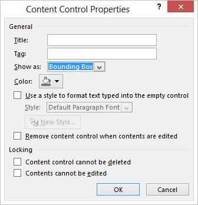
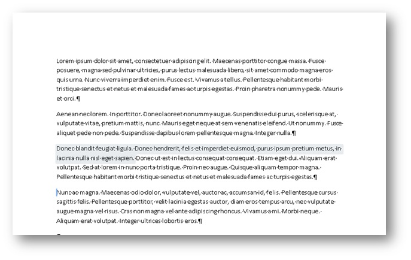
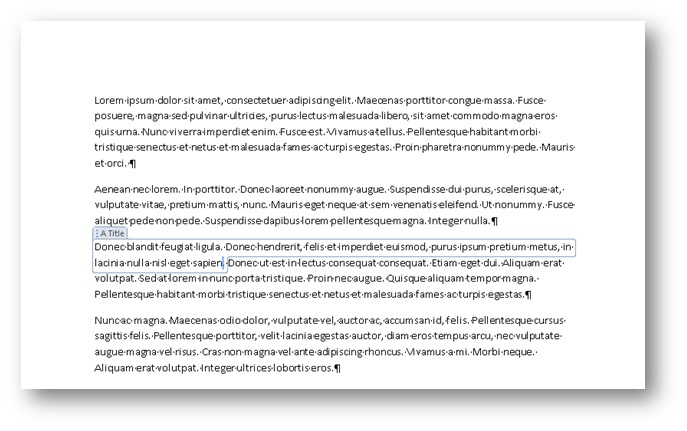
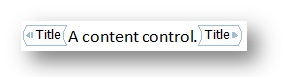
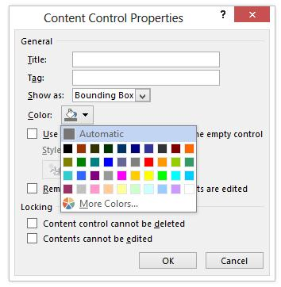
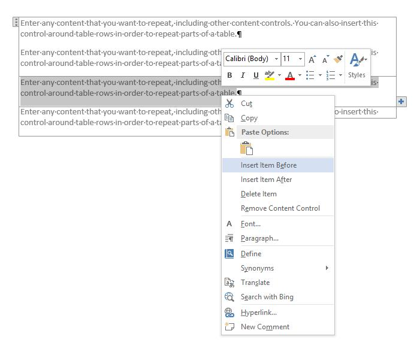
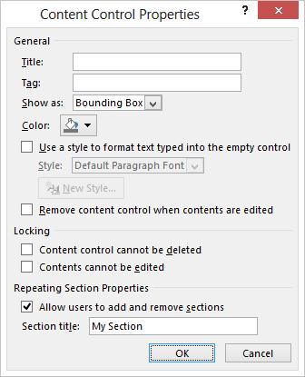
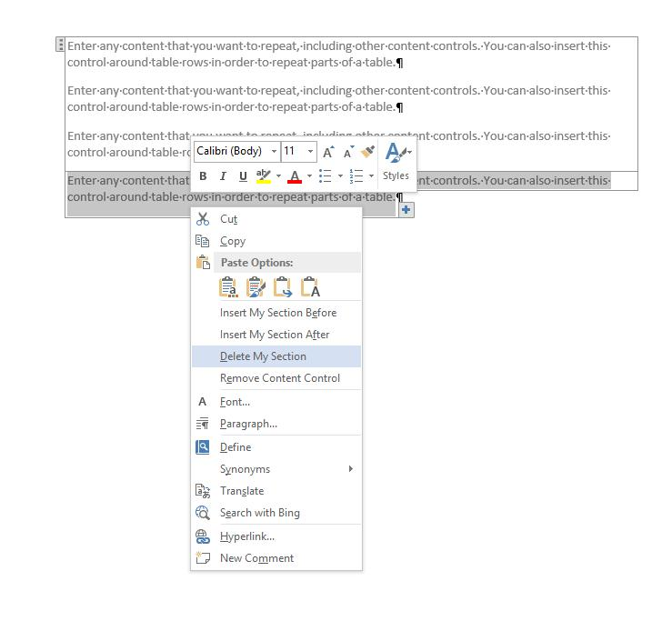
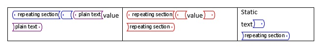
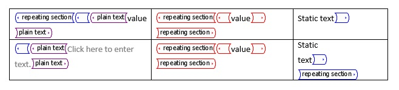

# Content controls in Word

Learn how Microsoft Word 2013 content controls enable a larger range of structured document scenarios.

This topic provides information about changes to content controls in Microsoft Word 2013 and the document scenarios that those changes enable.
  
### Structured documents

<a name="WordCC_StructuredDocs"> </a>

Structured documents are documents that control where content can appear on a document, what kind of content can appear in the document, and whether that content can be edited.
  
Here are some common scenarios for structured content in Microsoft Word:
  
- A legal firm needs to create documents that contain legal language that should not be changed by the user.

- A business needs to create a proposal cover page where only the title, author, and date are entered by the user.

- A business needs to create invoices where the customer data is included in the invoice at predefined regions.

### Using content controls to structure a document

<a name="WordCC_StructuredDocs"> </a>

Content controls are Microsoft Word entities that act as containers for specific content in a document. Individual content controls can contain content such as dates, lists, or paragraphs of formatted text. Content controls help you to create rich, structured blocks of content and are designed for use in templates that insert well-defined blocks into your documents, creating structured documents.
  
Content controls are ideal for creating structured documents because content controls help you fix the position of content, specify the kind of content (for example, a date, a picture, or text), restrict or enable editing, and add semantic meaning to content.
  
### Content controls in Word 2010

<a name="WordCC_StructuredDocs"> </a>

The following content controls are available in Word 2010:
  
- Rich Text

- Plain Text

- Picture

- Building Block Gallery

- Combo Box

- Drop-Down List

- Date

- Checkbox

- Group

Word 2010 content controls enable various potential structured document solutions, but in Word 2013 content controls enable a greater range of scenarios.
  
## Content control improvements in Word 2013

<a name="WordCC_WhatsNew"> </a>

In Word 2013, content controls provide three key improvements: improved visualization, support for XML Mapping for Rich Text content controls, and a new content control for repeating content.
  
### Improved visualization

Word 2013 allows an individual content control to appear in one of three possible states:
  
- Bounding box

- Start/End tags

- None

> [!NOTE]
> If not stated otherwise, this section discusses the visualization of content controls when the document is not viewed in **Design Mode**.You set the display mode for a content control by using the **Show as** drop-down list control in the **Content Control Properties** dialog box.
  
**Figure 1. Content Control Properties dialog box**


  
You can also set the display mode for a content control by using the Word 2013 object model (discussed later in [New Word 2013 content control object model members](#WordCC_NewOM)).
  
### Bounding box

<a name="WordCC_DefaultRendering"> </a>

The default rendering for content controls in Word 2013 is to preserve the look of content controls as they appear in Word 2007 and Word 2010; that is, as a bounding box. When a content control is set to show as **Bounding Box**, the display changes depending upon the following user interaction:
  
- When the content control does not have the focus, no visualization occurs

- On mouse-over, the content control appears as a shaded rectangle

**Figure 2. Content control on mouse-over**


  
- When the content control has the focus (when the user chooses the content control), the control appears as a "bounding box" (with a line around the content and the title showing, if a title has been set)

**Figure 3. Content control with focus**


  
### Start/End tags

<a name="WordCC_StartEndTags"> </a>

When the content control is set to show as **Start/End tag**, the tags are displayed regardless of user interaction, and the title never appears; but buttons, such as the **Drop-Down List** button, appear on mouse over.
  
**Figure 4. Content control set to show as start/end tags**


  
### None

<a name="WordCC_Invisible"> </a>

When the content control is set to show as **None**, the content control is not displayed.
  
### Content control colorization

<a name="WordCC_CCColorization"> </a>

In addition to enabling a different kind of display for a content control, Word 2013 also helps you to set the color for an individual content control. You set the color of a content control by using the **Color** button in the **Content Control Properties** dialog box.
  
You can also set the color of a content control by using the Word 2013 object model (discussed later in [New Word 2013 content control object model members](#WordCC_NewOM)).
  
**Figure 5. Content Control Properties dialog box**


  
### Support for XML mapping for rich text content controls

<a name="WordCC_XMLMapping"> </a>

Word 2013 helps you to map the content of rich text content controls and document building block content controls to the XML data store. To do this, you set the  *XML mapping*  for the content control. You can set this property by using the existing **XMLMapping.SetMapping** method in the object model. Within the custom XML part, the custom XML is stored as flat Open XML markup converted into a string (by using standard XML encoding), so that it can be stored as a text node in the custom XML part. However, the mapping continues to have the limitation that it can only successfully map to leaf nodes or attributes.
  
> [!NOTE]
> Rich text content controls cannot contain other rich text content controls. If one exists inside of another (for example, because of file format manipulation, copy and paste, and so on), it is unlinked until it is no longer contained inside a mapped rich text control.
  
For more information about how to set up XML mapping, see the section [New Word 2013 content control object model members](#WordCC_NewOM) later in this topic.
  
### Supporting repeating content

<a name="WordCC_SupportingRepeating"> </a>

In addition to visualization enhancements and support for XML mapping to rich text content controls, Word 2013 also adds a new content control that enables you to repeat content. The repeating section content control repeats the content contained within it, including other content controls.
  
You insert the repeating section content control around entire paragraphs or table rows. Once the control surrounds a section, you can insert copies of the section above or below the contained section.
  
**Figure 6. Repeating section content control context menu**


  
You can repeat the inserted section by using either the control on the end of the content control (displayed as a button with a plus sign ()) or by choosing a command on the context menu, as shown in Figure 6. The repeated content becomes a separate section of the control that you can assign a title by using the **Content Control Properties** dialog box.
  
**Figure 7. Assign a section title in the Content Control Properties dialog box**


  
Once you have given the section a title, if you select **Allow users to add and remove sections** in the **Content Control Properties** dialog box, users can add or delete the section by name.
  
**Figure 8. Use the repeating section content control context menu to delete a section**


  
When a repeating section content control surrounds other content controls, the enclosed content controls are repeated in each new item; but any such content controls have their contents reset to placeholder text. There are two exceptions where child control contents are preserved:
  
- When a child control is a repeating section control.

- When a child control is XML-mapped to a node outside the repeating section content control.

**Figure 9. Repeating section content control containing child controls before repeat**


  
**Figure 10. Repeating section content control containing child controls after repeat**


  
### Repeating section content controls around XML-mapped controls

<a name="WordCC_RepeatingSectionCCs"> </a>

For XML mappings that are contained in a repeating section, Word 2013 maps them as follows.
  
If the mapping does not intersect with an item in the node set as part of its parent chain, the binding is an "absolute binding" and shows the same content in all repeating section items.
  
If the mapping does intersect with an item in the node set as part of its parent chain, the binding is a "relative binding", and is remapped as follows:
  
- The absolute binding for the node is determined (flattening out any query expressions)─this should happen on initial mapping

- The axis of the binding that intersects with the node set is removed

- The remainder of the XPath is evaluated relative to the XPath of the repeating section content item

For example, the following mappings might occur:
  
- The repeating section is mapped to \root\next\path

- The control in the sample item is mapped to \root\next\path[2]\baz

- Word matches \root\next\path[2] to an item in the node set

The binding is therefore evaluated as .\baz, where the base is the node of the repeating content item.
  
The following suggestions for working with repeating content controls can help you prevent data loss and avoid frustration.
  
### Working with repeating section content controls that are mapped to XML data

<a name="WordCC_RepeatingSectionCCs"> </a>

If you insert a repeating section content control that is mapped to XML data, every time your user reopens the document, Word recreates the repeating section items, based on the information in the data store. Even if you save the document, any changes that the user makes in the repeating section items in the document that aren't also mapped into the data store are lost.
  
To help prevent this from happening, lock the repeating section content control and allow the user to edit only in unlocked child content controls that are mapped to the XML as well.
  
### Binding a repeating section content control to a table

<a name="WordCC_RepeatingSectionCCs"> </a>

If you want to bind a repeating section content control to a table, insert the table and *then* the insert repeating section content control, and not the other way around. (Otherwise, you won't be able to select only the table).
  
### Nesting repeating section content controls within a table

<a name="WordCC_RepeatingSectionCCs"> </a>

Nesting repeating section content controls tightly within a table (for example, when the end of the parent and child repeating section content control is in the same cell) causes the outer repeating section to be deleted when the inner section has an item added or removed.
  
You can prevent this from happening by adding a paragraph marker between the end of one repeating section content control and the next. To hide the paragraph marker, deselect the **Show/Hide** option on the **Home** tab of the ribbon.
  
### Open XML File Format schema additions

<a name="WordCC"> </a>

The following elements were added to the WordprocessingML Open XML File Format schema.
  
**Table 1. New elements in the WordprocessingML Open XML File Format schema for content controls**

|**Element**|**Description**|
|:-----|:-----|
|\<w:appearance\>  <br/> |\<w:appearance\> is a child element of \<w:sdtPr\>. The following values are valid for the val attribute:  <br/> \<w:appearance val= boundingBox|tags|hidden. The default value is boundingBox. |
|\<w:color\>  <br/> |\<w:color\> is a child element of \<w:sdtPr\>. The content model matches the existing CT_Color complex type. The default value is the color used in Word 2010. |

## New Word 2013 content control object model members

<a name="WordCC_NewOM"> </a>

With the new enhancements and additions to content controls in Word 2013, the object model for Word has been updated to allow for programmatic manipulation of the new feature set. In addition, changes have also been made to the underlying Open XML File Format for word processing documents.
  
The following sections provide more information about the specific object model changes related to each content control enhancement.
  
### Visualization enhancements

<a name="WordCC_VisEnhancements"> </a>

Several object model additions are included in Word 2013 for content control visualization enhancements. The following table list new members of the **ContentControl** object for visualization.
  
**Table 2. New ContentControl object members**

|**Member**|**Description**|
|:-----|:-----|
|. **Appearance** as **WdContentControlAppearance** <br/> |Gets or sets the visualization of the content control. |
|. **Color** as **WdColor** <br/> |Gets or sets the color of the content control. |

The following table lists constants in the new **WdContentControlAppearance** enumeration.
  
**Table 3. New WdContentControlAppearance enumeration constants**

|**Constant**|**Description**|
|:-----|:-----|
|**wdContentControlBoundingBox** <br/> |Represents a content control shown as a shaded rectangle/bounding box (with optional title). |
|**wdContentControlTags** <br/> |Represents a content control shown as start/end markers. |
|**wdContentControlHidden** <br/> |Represents a content control that is not shown. |

### Code sample

<a name="WordCC_VisEnhancements"> </a>

The following code sample shows how to create rich text content controls and set visualization programmatically.
  
```vb
Sub testVisualization()
   Dim objcc As ContentControl
   Dim objRange As Range
   
   ' Get the first paragraph as a range object.
   Set objRange = ActiveDocument.Paragraphs(1).Range
   ' Create a rich text content control around the first paragraph.
   Set objcc = ActiveDocument.ContentControls.Add(wdContentControlRichText, objRange)
   objcc.Title = "Default Bounding Box"
   ' Set visualization to the default.
   objcc.Appearance = wdContentControlBoundingBox
   
   ' Create a new paragraph.
   objRange.InsertParagraphAfter
   Set objRange = ActiveDocument.Paragraphs(2).Range
   ' Create a rich text content control around the second paragraph.
   Set objcc = ActiveDocument.ContentControls.Add(wdContentControlRichText, objRange)
   objcc.Title = "Non Bounding"
   ' Set visualization to invisible.
   objcc.Appearance = wdContentControlHidden
   
   ' Create a new paragraph.
   objRange.InsertParagraphAfter
   Set objRange = ActiveDocument.Paragraphs(3).Range
   ' Create a rich text content control around the third paragraph.
   Set objcc = ActiveDocument.ContentControls.Add(wdContentControlRichText, objRange)
   objcc.Title = "Tags Only with Pink color"
   ' Set visualization to Start/End tags with pink color.
   objcc.Appearance = wdContentControlTags
   objcc.Color = wdColorPink
End Sub
```

### XML mapping

<a name="WordCC_XMLMappingOM"> </a>

No additions were made to the Word 2013 object model to accommodate rich text mapping to XML nodes in the document data store. Instead, use the existing object model to map a rich text content control to an XML node in the document data store. Additionally, no changes were made to the underlying Open XML File Format WordprocessingML schema as part of the newly included rich text content control support specifically for XML mapping.
  
#### Code sample

The following code sample shows how to map a rich text content control to an XML node programmatically.
  
```vb
Sub testRichBinding()
   Dim objRange As Range
   Dim objcc As ContentControl
   Dim objCustomPart As CustomXMLPart
   Dim blnMap As Boolean
   
   ' Add a custom XML part to the data store.
   Set objCustomPart = ActiveDocument.CustomXMLParts.Add
   ' Load XML fragment into the custom XML part.
   objCustomPart.LoadXML ("<x>Rich Text Databinding</x>")
   ' Get the first paragraph as a range object.
   Set objRange = ActiveDocument.Paragraphs(1).Range
   ' Create a rich text content control around the first paragraph.
   Set objcc = ActiveDocument.ContentControls.Add(wdContentControlRichText, objRange)
   ' Bind the XML node to the rich text content control.
   blnMap = objcc.XMLMapping.SetMapping("/x")
   ' Return whether mapping worked.
   MsgBox objcc.XMLMapping.IsMapped
End Sub
```

### Repeating section content controls represented in the object model

<a name="WordCC_RepeatingSection"> </a>

The repeating section content control is available in the object model by using the following additions to the **ContentControl** object and the new **RepeatingSectionItem** and **RepeatingSectionItemColl** objects. Table 4 lists the most important new members of the **ContentControl** object for repeating section content controls.
  
**Table 4. ContentControl object members**

|**Member**|**Description**|
|:-----|:-----|
|**AllowInsertDeleteSection** as **Boolean** <br/> |Gets or sets whether users can add or remove sections from the content control by using the UI. If this property is called for a content control that is not of type repeating section, the call fails with the following error message: "This property can only be used with repeating section content controls."  <br/> |
|**RepeatingSectionItemTitle** as **String** <br/> |Gets or sets the name of repeating section items used in the context menu. If this property is called for a content control that is not of type repeating section, the call fails with: "This property can only be used with repeating section content controls."  <br/> |
|**InsertRepeatingSectionItemBefore** as **ContentControl** <br/> |Adds a repeating section item before the current item and returns the new repeating section item. If this method is called for a content control that is not of type repeating section item, the call fails with: "This property can only be used with repeating section item content controls."  <br/> |
|**InsertRepeatingSectionItemAfter** as **ContentControl** <br/> |Adds a repeating section item after the current item and returns the new repeating section item. If this method is called for a content control that is not of type repeating section item, the call fails with: "This property can only be used with repeating section item content controls."  <br/> |

Table 5 lists the most important members of the **RepeatingSectionItem** object.
  
**Table 5. RepeatingSectionItem object members**

|**Member**|**Description**|
|:-----|:-----|
|**Range** as **Range** <br/> |Returns the range of the specified repeating section item, excluding the start and end tags. |
|**Delete** <br/> |Deletes the specified repeating section item. |
|**InsertItemAfter** as **RepeatingSectionItem** <br/> |Adds a repeating section item after the specified item and returns the new item. |
|**InsertItemBefore** as **RepeatingSectionItem** <br/> |Adds a repeating section item before the specified item and returns the new item. |

Table 6 lists the most important members of the **RepeatingSectionItemColl** object.
  
**Table 6. RepeatingSectionItemColl object members**

|**Member**|**Description**|
|:-----|:-----|
|**Item** as **RepeatingSectionItem** <br/> |Returns an individual repeating section item. |

Table 7 shows the new member of the **WdContentControlType** enumeration for repeating section content controls.
  
**Table 7. WdContentControlType enumeration addition**

|**Constant**|**Description**|
|:-----|:-----|
|**wdContentControlRepeatingSection** <br/> |Represents a content control that contains a single item in a repeating section. |

### Code sample

<a name="WordCC_RepeatingSection"> </a>

The following code sample shows how to use repeating section content controls programmatically.
  
```vb
Sub testRepeatingSectionControl()
   Dim objRange As Range
   Dim objTable As Table
   Dim objCustomPart As CustomXMLPart
   Dim objCC As ContentControl
   Dim objCustomNode As CustomXMLNode
   
   Set objCustomPart = ActiveDocument.CustomXMLParts.Add
   objCustomPart.LoadXML ("<books>" & _
       "<book><title>Everyday Italian</title>" & _
       "<author>Giada De Laurentiis</author></book>" & _
       "<book><title>Harry Potter</title>" & _
       "<author>J K. Rowling</author></book>" & _
       "<book><title>Learning XML</title>" & _
       "<author>Erik T. Ray</author></book></books>")
   
   Set objRange = ActiveDocument.Paragraphs(1).Range
   Set objTable = ActiveDocument.Tables.Add(objRange, 2, 2)
   With objTable.Borders
       .InsideLineStyle = wdLineStyleSingle
       .OutsideLineStyle = wdLineStyleDouble
   End With
   Set objRange = objTable.Cell(1, 1).Range
   Set objCustomNode = objCustomPart.SelectSingleNode("/books[1]/book[1]/title[1]")
   Set objCC = ActiveDocument.ContentControls.Add(wdContentControlText, objRange)
   objCC.XMLMapping.SetMappingByNode objCustomNode
   Set objRange = objTable.Cell(1, 2).Range
   Set objCustomNode = objCustomPart.SelectSingleNode("/books[1]/book[1]/author[1]")
   Set objCC = ActiveDocument.ContentControls.Add(wdContentControlText, objRange)
   objCC.XMLMapping.SetMappingByNode objCustomNode
   Set objRange = objTable.Rows(1).Range
   Set objCC = ActiveDocument.ContentControls.Add(wdContentControlRepeatingSection, objRange)
   objCC.XMLMapping.SetMapping ("/books[1]/book")
End Sub
```

### Open XML File Format changes for repeating section content controls

<a name="WordCC_RepeatingSection"> </a>

The file format representation of a repeating section content control generally uses the same element names, values, and so on as the existing XML markup; however, the \<sdt\> element representing the outer repeating section container exists in the Word 2013 namespace, to ensure compatibility with earlier versions of Word.
  
The individual repeating items within the repeating section content control (that surround each individual item) are saved as rich text content controls using the existing WordprocessingML representation. Table 8 lists new elements in the WordprocessingML schema for repeating section content controls.
  
**Table 8. New elements in the WordprocessingML schema for repeating section content controls**

|**Element**|**Description**|
|:-----|:-----|
|\<w15:repeatingSection\>  <br/> |Specifies a repeating section content control. This element is mutually exclusive with all other control types and has no child elements or attributes. |
|\<w15:repeatingSectionItem\>  <br/> |Specifies a repeating section item content control. This element is mutually exclusive with all other control types, and has no child elements or attributes. |
|\<w15:doNotAllowInsertDeleteSection\>  <br/> |Specifies that the user cannot add or delete sections by using the user interface in Word 2013. |
|\<w15:sectionTitle\>  <br/> |Specifies the name of repeating section items (and is used in the context menu when the control is chosen). |
