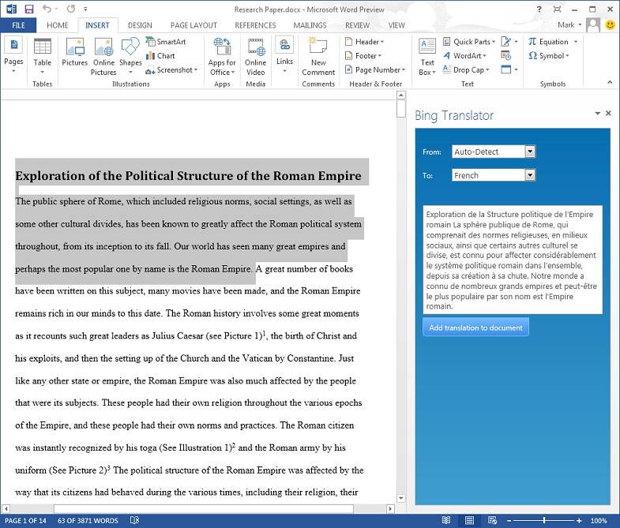
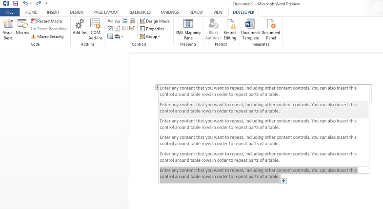

# New in Word for developers

This document provides a top-level view of the enhancements and additions for developers in Microsoft Word 2013. It also provides links to other articles and references that will enable you to get started programming Word 2013.
  
## Introduction
<a name="wd15WhatsNew_Introduction"> </a>

Microsoft Word 2013 helps you produce professional looking documents by providing a comprehensive set of tools for creating and formatting your document. Rich review, commenting, and comparison capabilities help you quickly gather and manage feedback from colleagues. Advanced data integration ensures that documents stay connected to important sources of business information.
  
If you develop custom document solutions, you can use the following programmability and feature improvements in Word 2013.
  
## Apps for Office in Word
<a name="wd15WhatsNew_appsForOffice"> </a>

Microsoft Word 2013 brings the web to the Word 2013. New Office Add-ins offer a wealth of interesting, new scenarios and solutions in an easy-to-use environment for dynamic web application development. This means that you now can use popular dynamic languages (such as Python, PHP, Perl, and JavaScript) and web development tool features (such as Microsoft Visual Studio 2012) for application development. Web development also enables you to use the strong global developer communities and the availability of various code samples, frameworks, and libraries, which broaden application applicability for different scenarios.
  
Task pane apps for Office in Word 2013 work side-by-side with a Word document and let developers supply contextual information and functionality to enhance the document viewing and authoring experience. For example, a task pane app for Word 2013 can look up and retrieve product information from a web service based on the product name or part number the users selects in the document. Figure 1 shows one implementation of a task pane app in Word 2013.
  
**Figure 1. Implementation of a task pane app in Word 2013**


  
## Enhancements to content controls
<a name="wd15WhatsNew_ContentControls"> </a>

You can programmatically use the redesigned content control features in content controls in Word 2013. New features include repeating content controls, color coding, and control over the appearance of the content control in the document. Content controls are bounded and potentially labeled regions in a document that serve as containers for specific types of content, as shown in Figure 2. Individual content controls can contain content such as dates, lists, or paragraphs of formatted text. They enable you to create rich, structured blocks of content. Content controls enable you to create templates that have well-defined blocks so that you can work with documents in a structured way.
  
**Figure 2. Repeating content controls**


  
The following code sample shows how to use repeating content controls programmatically. It sets up a table row that has three XML mappings and uses a repeating content control to repeat that row for each \<book\> element in a custom XML part in the document.
  
```
Sub testRepeatingControl()
Dim objRange As Range
Dim objTable As Table
Dim objCustomPart As CustomXMLPart
Dim objCC As ContentControl
Dim objCustomNode As CustomXMLNode
Set objCustomPart = ActiveDocument.CustomXMLParts.Add
objCustomPart.LoadXML ("<books>" &amp; _
    "<book><title>Code</title>" &amp; _
    "<author>Charles Petzold</author></book>" &amp; _
    "<book><title>JavaScript Step by Step</title>" &amp; _
    "<author>Steve Suehring</author></book>" &amp; _
    "<book><title>Understanding IPv6</title>" &amp; _
    "<author>Joseph Davies</author></book></books>")
Set objRange = ActiveDocument.Paragraphs(1).Range
Set objTable = ActiveDocument.Tables.Add(objRange, 2, 2)
Set objRange = objTable.Cell(1, 1).Range
Set objCustomNode = objCustomPart.SelectSingleNode("/books[1]/book[1]/title[1]")
Set objCC = ActiveDocument.ContentControls.Add(wdContentControlText, objRange)
objCC.XMLMapping.SetMappingByNode objCustomNode
Set objRange = objTable.Cell(1, 2).Range
Set objCustomNode = objCustomPart.SelectSingleNode("/books[1]/book[1]/author[1]")
Set objCC = ActiveDocument.ContentControls.Add(wdContentControlText, objRange)
objCC.XMLMapping.SetMappingByNode objCustomNode
Set objRange = objTable.Rows(1).Range
Set objCC = ActiveDocument.ContentControls.Add(wdContentControlRepeatingSection, objRange)
objCC.XMLMapping.SetMapping ("/books[1]/book")
End Sub

```

## Specify settings for Reading Mode
<a name="wd15WhatsNew_ReadingMode"> </a>

Settings for Reading Mode can now be set programmatically in Word 2013. These settings include text scaling, layout, and line length.
  
## UI for XML mappings
<a name="wd15WhatsNew_UIforXML"> </a>

You can now create XML mappings to content controls natively by means of a task pane available from the ribbon UI, as opposed to the VBA or file format manipulation required in Microsoft Word 2010 and Microsoft Office Word 2007. The task pane enables you to visually set up XML mappings to content controls within the document.
  
## Conclusion
<a name="wd15WhatsNew_Conclusion"> </a>

Word 2013 provides a wealth of new features for developers. Apps for Office provide an exciting opportunity for developers to integrate web-based features into Word 2013, side-by-side with the worksheet. Other new features that extend the existing Word 2013 VBA object model include enhancements to content controls NS the ability to specify settings for Reading Mode. In addition, Word 2013 offers new UI for creating XML mappings.
  
## Additional resources
<a name="wd15WhatsNew_AdditionalRescources"> </a>

- [Word 2013 Developer Reference](http://msdn.microsoft.com/library/3080c270-5198-4b4f-922d-cb13e4b71bb3%28Office.15%29.aspx)
    
- [Office Add-ins](http://msdn.microsoft.com/library/1e123201-6e70-45c1-a48c-d5b955896ddb%28Office.15%29.aspx)
    
- [What's new for Office 2013 developers](http://msdn.microsoft.com/library/d76ae308-555e-4147-8900-956d3eb8ba23%28Office.15%29.aspx)
    

